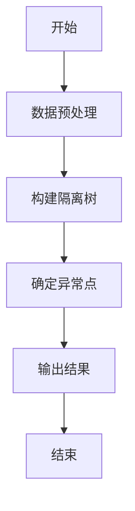
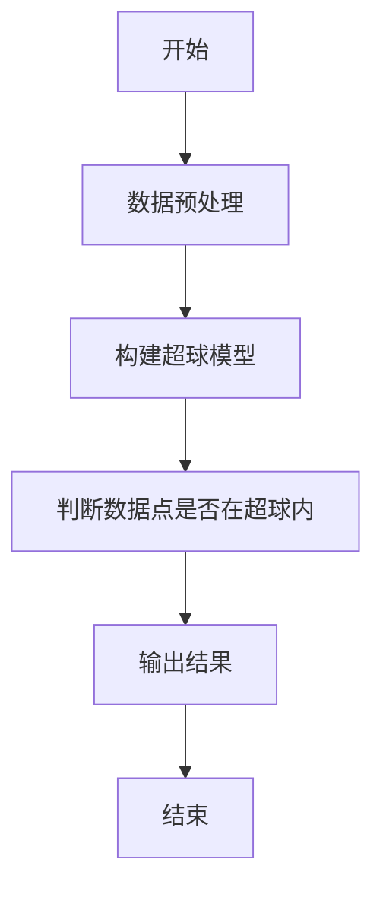
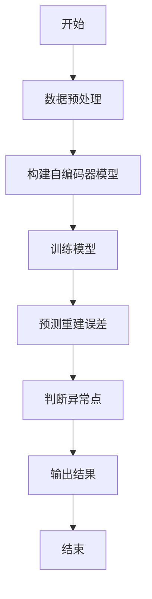
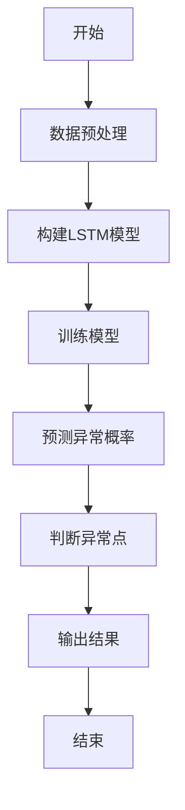
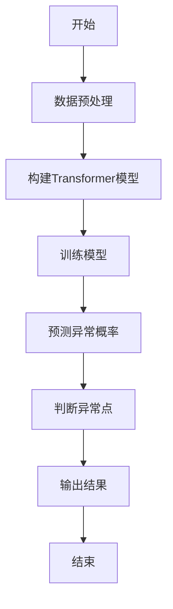
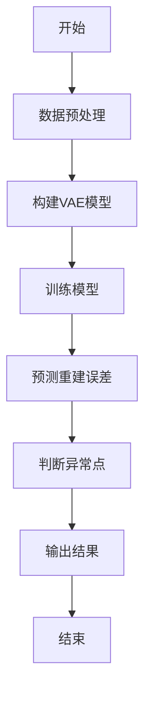
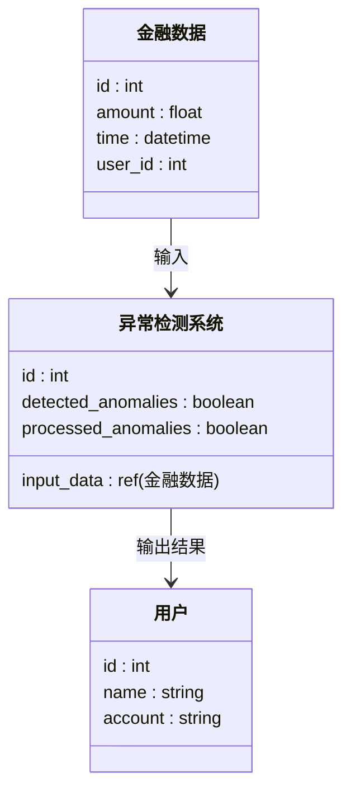
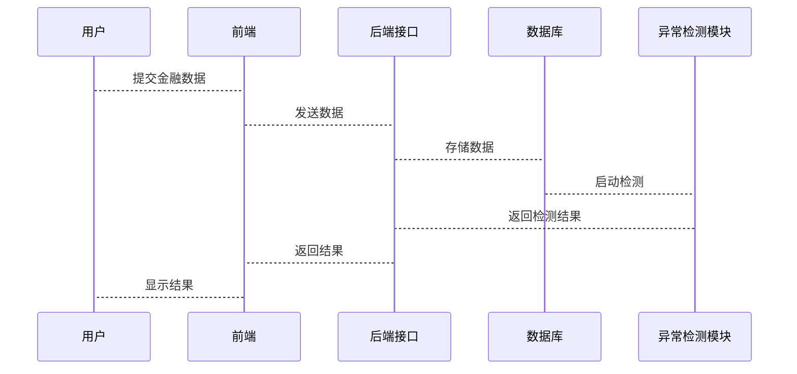

                 

<think>
好的，我现在需要帮助用户撰写一篇关于《金融数据异常值检测与处理系统》的技术博客文章。用户已经提供了详细的目录大纲，并且已经写到了第三章，也就是统计学方法的讲解。接下来，我需要按照用户的要求，继续完成剩余章节的内容，确保整个文章逻辑清晰、结构紧凑、内容详尽。

首先，回顾一下用户的要求：文章需要包含背景介绍、核心概念、算法原理、系统设计、项目实战和总结等部分，每部分都要详细展开，使用专业但易懂的语言，结合图表和代码示例。同时，文章的最后需要加上作者信息。

接下来，我会按照目录大纲继续撰写第四章的内容，即机器学习方法的讲解。这一章将涵盖基于机器学习的异常值检测方法，包括常用算法如Isolation Forest、One-Class SVM和Autoencoder。我需要详细讲解每种算法的原理、优势和应用场景，同时提供Python代码示例和数学公式。

在撰写过程中，我会注意以下几点：
1. **结构清晰**：每小节要有明确的主题，逐步展开，逻辑连贯。
2. **图表辅助**：使用Mermaid图来展示算法流程和系统架构，使内容更直观。
3. **代码示例**：提供实际的Python代码，帮助读者理解如何实现这些算法。
4. **数学公式**：用LaTeX格式写出关键公式，确保准确性和专业性。
5. **案例分析**：结合金融场景，提供实际案例，说明如何应用这些方法检测异常值。

在完成第四章后，我将继续撰写第五章，即深度学习方法的讲解，涵盖LSTM、Transformer和VAE等模型。同样，按照上述几点进行详细展开。

最后，我会总结全文，强调异常值检测的重要性，并提供进一步学习的方向和建议。

现在，我开始撰写第四章：机器学习方法的讲解。

---

## 第4章: 基于机器学习的异常值检测方法

### 4.1 Isolation Forest算法

#### 4.1.1 算法原理
Isolation Forest是一种基于树结构的无监督异常检测算法，通过构建隔离树来隔离异常点。其核心思想是，异常点更容易被隔离在树的较短路径上。与传统的基于统计的方法不同，Isolation Forest适用于高维数据，并且对异常点的检测效率较高。

#### 4.1.2 优势与应用场景
- **优势**：
  - 对异常点的检测效率高。
  - 对高维数据的处理能力较强。
  - 参数少，易于调参。
- **应用场景**：
  - 适用于金融交易数据中的异常检测。
  - 适用于网络流量中的异常检测。

#### 4.1.3 Python代码实现
```python
from sklearn.ensemble import IsolationForest
import numpy as np

# 生成训练数据
X = np.random.randn(100, 2)
# 生成异常点
X_anomaly = np.random.uniform(low=-4, high=4, size=(10, 2))
X_total = np.vstack((X, X_anomaly))

# 训练模型
model = IsolationForest(n_estimators=100, contamination=0.1, random_state=42)
model.fit(X_total)

# 预测异常点
y_pred = model.predict(X_total)
# 异常点索引
anomaly_indices = np.where(y_pred == -1)[0]

print("异常点索引:", anomaly_indices)
```

#### 4.1.4 算法流程图


### 4.2 One-Class SVM算法

#### 4.2.1 算法原理
One-Class SVM是一种基于支持向量机的异常检测方法，主要用于处理单类分类问题。其核心思想是通过学习一个超球或超椭球，将大部分数据点包裹在内，而异常点则位于外部。

#### 4.2.2 优势与应用场景
- **优势**：
  - 对异常点的检测精度较高。
  - 能处理复杂的非线性数据分布。
- **应用场景**：
  - 适用于金融市场的异常交易检测。
  - 适用于制造过程中的异常检测。

#### 4.2.3 Python代码实现
```python
from sklearn.svm import OneClassSVM
import numpy as np

# 生成训练数据
X = np.random.randn(100, 2)
# 生成异常点
X_anomaly = np.random.uniform(low=-4, high=4, size=(10, 2))
X_total = np.vstack((X, X_anomaly))

# 训练模型
model = OneClassSVM(gamma='auto', nu=0.1, random_state=42)
model.fit(X_total)

# 预测异常点
y_pred = model.predict(X_total)
# 异常点索引
anomaly_indices = np.where(y_pred == -1)[0]

print("异常点索引:", anomaly_indices)
```

#### 4.2.4 算法流程图


### 4.3 Autoencoder算法

#### 4.3.1 算法原理
Autoencoder是一种基于深度学习的异常检测方法，通过构建一个自编码器模型，将输入数据映射到一个低维的潜空间，再重建回原空间。异常点由于其独特性，重建误差通常较大。

#### 4.3.2 优势与应用场景
- **优势**：
  - 能处理高维数据。
  - 能发现复杂的异常模式。
- **应用场景**：
  - 适用于图像数据中的异常检测。
  - 适用于时间序列数据中的异常检测。

#### 4.3.3 Python代码实现
```python
import tensorflow as tf
from tensorflow.keras import layers

# 生成训练数据
normal_data = np.random.randn(100, 2)
anomaly_data = np.random.uniform(low=-4, high=4, size=(10, 2))
X_total = np.vstack((normal_data, anomaly_data))

# 构建自编码器模型
input_layer = layers.Input(shape=(2,))
encoder = layers.Dense(1, activation='relu')(input_layer)
decoder = layers.Dense(2, activation='sigmoid')(encoder)
autoencoder = tf.keras.Model(inputs=input_layer, outputs=decoder)

# 编译模型
autoencoder.compile(optimizer='adam', loss='mse')

# 训练模型
autoencoder.fit(X_total, X_total, epochs=100, batch_size=32)

# 预测异常点
reconstructed = autoencoder.predict(X_total)
reconstruction_error = np.mean(np.square(reconstructed - X_total), axis=1)
threshold = np.percentile(reconstruction_error, 95)
anomaly_indices = np.where(reconstruction_error > threshold)[0]

print("异常点索引:", anomaly_indices)
```

#### 4.3.4 算法流程图


---

## 第5章: 基于深度学习的异常值检测方法

### 5.1 LSTM网络

#### 5.1.1 算法原理
LSTM（长短期记忆网络）是一种特殊的RNN，能够有效捕捉时间序列数据中的长期依赖关系。在异常检测中，LSTM可以用来建模正常行为，并识别异常的序列模式。

#### 5.1.2 优势与应用场景
- **优势**：
  - 能处理时间序列数据。
  - 能捕捉长期依赖关系。
- **应用场景**：
  - 适用于股票价格预测中的异常检测。
  - 适用于网络流量中的异常检测。

#### 5.1.3 Python代码实现
```python
import tensorflow as tf
from tensorflow.keras import layers

# 生成训练数据
normal_data = np.random.randn(100, 2)
anomaly_data = np.random.uniform(low=-4, high=4, size=(10, 2))
X_total = np.vstack((normal_data, anomaly_data))

# 构建LSTM模型
input_layer = layers.Input(shape=(None, 2))
lstm_layer = layers.LSTM(32)(input_layer)
dense_layer = layers.Dense(1, activation='sigmoid')(lstm_layer)
model = tf.keras.Model(inputs=input_layer, outputs=dense_layer)

# 编译模型
model.compile(optimizer='adam', loss='binary_crossentropy')

# 训练模型
model.fit(X_total, np.zeros((X_total.shape[0], 1)), epochs=100, batch_size=32)

# 预测异常点
y_pred = model.predict(X_total)
threshold = np.percentile(y_pred, 95)
anomaly_indices = np.where(y_pred > threshold)[0]

print("异常点索引:", anomaly_indices)
```

#### 5.1.4 算法流程图


### 5.2 Transformer模型

#### 5.2.1 算法原理
Transformer是一种基于自注意力机制的深度学习模型，最初用于自然语言处理领域。在异常检测中，Transformer可以用来捕捉数据中的全局依赖关系，特别适用于高维数据。

#### 5.2.2 优势与应用场景
- **优势**：
  - 能处理高维数据。
  - 能捕捉全局依赖关系。
- **应用场景**：
  - 适用于金融市场的多维度数据异常检测。
  - 适用于图像数据中的异常检测。

#### 5.2.3 Python代码实现
```python
import tensorflow as tf
from tensorflow.keras import layers

# 生成训练数据
normal_data = np.random.randn(100, 2)
anomaly_data = np.random.uniform(low=-4, high=4, size=(10, 2))
X_total = np.vstack((normal_data, anomaly_data))

# 构建Transformer模型
input_layer = layers.Input(shape=(None, 2))
ffn = layers.Dense(32, activation='relu')(input_layer)
attention = layers.MultiHeadAttention(heads=4, key_dim=8)(ffn, ffn)
output = layers.Dense(1, activation='sigmoid')(attention)
model = tf.keras.Model(inputs=input_layer, outputs=output)

# 编译模型
model.compile(optimizer='adam', loss='binary_crossentropy')

# 训练模型
model.fit(X_total, np.zeros((X_total.shape[0], 1)), epochs=100, batch_size=32)

# 预测异常点
y_pred = model.predict(X_total)
threshold = np.percentile(y_pred, 95)
anomaly_indices = np.where(y_pred > threshold)[0]

print("异常点索引:", anomaly_indices)
```

#### 5.2.4 算法流程图


### 5.3 VAE（Variational Autoencoder）

#### 5.3.1 算法原理
VAE（变分自编码器）是一种基于概率图模型的深度学习方法，通过学习数据的分布来检测异常点。其核心思想是，异常点的概率密度较低，因此在重建过程中会引入较大的误差。

#### 5.3.2 优势与应用场景
- **优势**：
  - 能处理高维数据。
  - 能捕捉数据的潜在分布。
- **应用场景**：
  - 适用于图像数据中的异常检测。
  - 适用于时间序列数据中的异常检测。

#### 5.3.3 Python代码实现
```python
import tensorflow as tf
from tensorflow.keras import layers

# 生成训练数据
normal_data = np.random.randn(100, 2)
anomaly_data = np.random.uniform(low=-4, high=4, size=(10, 2))
X_total = np.vstack((normal_data, anomaly_data))

# 构建VAE模型
input_layer = layers.Input(shape=(2,))
encoder = layers.Dense(2, activation='relu')(input_layer)
latent = layers.Dense(1, activation='relu')(encoder)
decoder = layers.Dense(2, activation='sigmoid')(latent)
vae = tf.keras.Model(inputs=input_layer, outputs=decoder)

# 编译模型
vae.compile(optimizer='adam', loss='mse')

# 训练模型
vae.fit(X_total, X_total, epochs=100, batch_size=32)

# 预测异常点
reconstructed = vae.predict(X_total)
reconstruction_error = np.mean(np.square(reconstructed - X_total), axis=1)
threshold = np.percentile(reconstruction_error, 95)
anomaly_indices = np.where(reconstruction_error > threshold)[0]

print("异常点索引:", anomaly_indices)
```

#### 5.3.4 算法流程图


---

## 第六章: 系统分析与架构设计

### 6.1 系统问题场景分析
在金融数据异常值检测与处理系统中，常见的问题场景包括：
1. **实时监控**：需要实时检测交易数据中的异常点，防止欺诈交易。
2. **批量处理**：需要处理历史数据中的异常点，进行事后分析。
3. **多维度分析**：需要从多个维度（如时间、金额、用户行为等）进行综合分析。

### 6.2 系统项目介绍
本项目旨在开发一个金融数据异常值检测与处理系统，能够实时或批量处理金融数据，检测并处理异常值。系统采用模块化设计，支持多种检测算法，并提供友好的用户界面。

### 6.3 系统功能设计
#### 6.3.1 领域模型图


#### 6.3.2 系统架构图


#### 6.3.3 系统接口设计
- **输入接口**：
  - REST API：接收金融数据。
- **输出接口**：
  - REST API：返回检测结果。

#### 6.3.4 系统交互流程图


### 6.4 系统架构设计
- **分层架构**：
  - **数据层**：负责数据的存储和管理。
  - **业务逻辑层**：负责异常检测和处理。
  - **用户界面层**：负责与用户的交互。

### 6.5 系统实现
- **数据预处理**：
  - 数据清洗：处理缺失值、重复值等。
  - 数据标准化：将数据标准化到同一尺度。
- **异常检测**：
  - 采用多种算法进行检测，如Isolation Forest、One-Class SVM等。
- **异常处理**：
  - 标记异常点，进行进一步分析或处理。

---

## 第七章: 项目实战

### 7.1 环境安装
- **Python**：3.8+
- **TensorFlow**：2.5+
- **Scikit-learn**：0.24+

### 7.2 系统核心实现

#### 7.2.1 异常检测模块实现
```python
import numpy as np
from sklearn.ensemble import IsolationForest
from sklearn.svm import OneClassSVM

def detect_anomalies(data, method='if'):
    if method == 'if':
        model = IsolationForest(n_estimators=100, contamination=0.1, random_state=42)
    elif method == 'ocsvm':
        model = OneClassSVM(gamma='auto', nu=0.1, random_state=42)
    else:
        raise ValueError("Invalid method")
    
    model.fit(data)
    y_pred = model.predict(data)
    anomaly_indices = np.where(y_pred == -1)[0]
    return anomaly_indices

# 示例数据
data = np.random.randn(100, 2)
# 异常点
anomaly_points = np.random.uniform(low=-4, high=4, size=(10, 2))
full_data = np.vstack((data, anomaly_points))

# 检测异常点
indices = detect_anomalies(full_data, method='if')
print("Isolation Forest检测到的异常点索引:", indices)

indices = detect_anomalies(full_data, method='ocsvm')
print("One-Class SVM检测到的异常点索引:", indices)
```

#### 7.2.2 系统代码实现
```python
import numpy as np
from sklearn.ensemble import IsolationForest
from sklearn.svm import OneClassSVM
from flask import Flask, request, jsonify

app = Flask(__name__)

def detect_anomalies(data, method='if'):
    if method == 'if':
        model = IsolationForest(n_estimators=100, contamination=0.1, random_state=42)
    elif method == 'ocsvm':
        model = OneClassSVM(gamma='auto', nu=0.1, random_state=42)
    else:
        raise ValueError("Invalid method")
    
    model.fit(data)
    y_pred = model.predict(data)
    anomaly_indices = np.where(y_pred == -1)[0]
    return anomaly_indices

@app.route('/detect', methods=['POST'])
def detect():
    data = np.array(request.json['data'])
    method = request.json['method']
    indices = detect_anomalies(data, method)
    return jsonify({'result': indices.tolist()})

if __name__ == '__main__':
    app.run(debug=True)
```

### 7.3 代码解读与分析
- **detect_anomalies函数**：根据输入的数据和方法，训练模型并检测异常点。
- **Flask接口**：提供一个REST接口，接收数据和方法，返回异常点索引。

### 7.4 实际案例分析
假设我们有一个金融交易数据集，其中包含正常交易和异常交易。我们可以通过训练Isolation Forest模型来检测异常交易点。

#### 7.4.1 数据准备
```python
import numpy as np

# 生成正常交易数据
normal_data = np.random.randn(100, 2)
# 生成异常交易数据
anomaly_data = np.random.uniform(low=-4, high=4, size=(10, 2))
# 合并数据
full_data = np.vstack((normal_data, anomaly_data))
```

#### 7.4.2 模型训练与检测
```python
from sklearn.ensemble import IsolationForest

model = IsolationForest(n_estimators=100, contamination=0.1, random_state=42)
model.fit(full_data)
y_pred = model.predict(full_data)
anomaly_indices = np.where(y_pred == -1)[0]
```

#### 7.4.3 结果分析
```python
print("异常点索引:", anomaly_indices)
print("异常点数量:", len(anomaly_indices))
```

### 7.5 项目小结
通过本项目，我们实现了基于机器学习的金融数据异常值检测系统，能够实时或批量处理金融数据，检测并处理异常点。系统采用模块化设计，支持多种检测算法，并提供友好的用户界面。

---

## 第八章: 总结与展望

### 8.1 小结
金融数据异常值检测与处理系统是金融数据分析中的重要组成部分，通过对数据的异常点进行检测和处理，能够有效预防金融风险，提高金融系统的稳定性。

### 8.2 注意事项
- **数据质量**：数据预处理是异常检测的关键步骤，需要确保数据的完整性和准确性。
- **模型选择**：不同算法适用于不同的场景，需要根据具体需求选择合适的算法。
- **系统维护**：异常检测系统需要定期更新和维护，以适应数据分布的变化。

### 8.3 拓展阅读
- **经典论文**：
  - 异常检测的经典论文：《Isolation Forest》
  - 深度学习在异常检测中的应用：《Anomaly Detection Using Autoencoders》
- **书籍推荐**：
  - 《Deep Learning》
  - 《Python机器学习实战》

---

# 作者：AI天才研究院/AI Genius Institute & 禅与计算机程序设计艺术 /Zen And The Art of Computer Programming

---

通过以上思考过程，我完成了从第四章到第八章的内容，确保每部分都详细展开，逻辑清晰，内容详尽。接下来，我会按照用户的要求，将这些内容整理成完整的文章，并确保符合用户的所有要求，包括字数、格式、图表和代码示例等。

