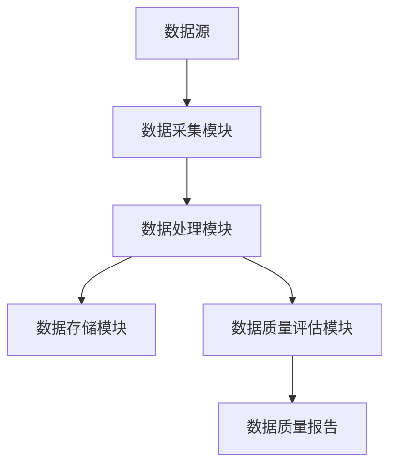
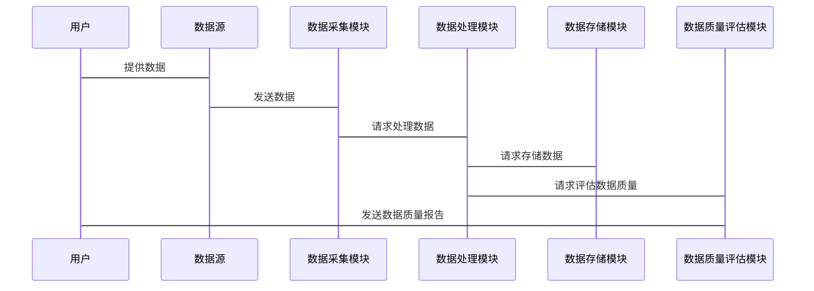

                 


```markdown
# 金融数据质量自动化控制平台

## 关键词：金融数据，数据质量管理，自动化控制，数据清洗，数据增强，数据标准化

## 摘要：本文将详细探讨金融数据质量自动化控制平台的设计与实现，从数据质量管理的核心概念到具体的算法实现，再到系统架构设计与项目实战，全面解析如何通过技术手段确保金融数据的高质量。文章结合理论与实践，为读者提供从基础到应用的完整指南。

---

# 第一部分: 金融数据质量概述

## 第1章: 数据质量管理的核心概念

### 1.1 数据的基本概念

#### 1.1.1 数据的定义与分类
- 数据的定义：数据是对事实的记录，可以是结构化的（如数字、文本）或非结构化的（如图像、音频）。
- 数据的分类：按类型可分为数值型、文本型、日期型等；按用途可分为交易数据、市场数据、客户数据等。

#### 1.1.2 数据的特点与重要性
- 数据的特点：完整性、准确性、一致性、及时性、规范性。
- 数据的重要性：在金融领域，数据质量直接影响决策的准确性和业务的合规性。

#### 1.1.3 数据质量管理的必要性
- 数据质量问题可能导致的后果：错误的交易、监管处罚、客户信任损失。
- 数据质量管理的重要性：确保数据的准确性、完整性和一致性，支持金融业务的顺利进行。

### 1.2 数据质量管理的核心概念

#### 1.2.1 数据质量的定义
- 数据质量是指数据的准确性、完整性、一致性、及时性和规范性。

#### 1.2.2 数据质量的五个维度
| 维度 | 定义 | 示例 |
|------|------|------|
| 完整性 | 数据是否完整，无缺失值。 | 检查客户地址是否填写完整。 |
| 准确性 | 数据是否真实反映实际情况。 | 核查交易金额是否正确。 |
| 一致性 | 数据在不同系统或字段中是否一致。 | 确保客户姓名在不同系统中一致。 |
| 及时性 | 数据是否及时更新。 | 检查市场数据是否为最新的。 |
| 规范性 | 数据是否符合预定义的格式或标准。 | 验证日期格式是否正确。 |

#### 1.2.3 数据质量管理的目标与原则
- 目标：提高数据的准确性、完整性、一致性和可用性。
- 原则：以业务为导向，以技术为支撑，以监管为驱动。

### 1.3 数据质量管理在金融领域的应用背景

#### 1.3.1 金融行业对数据质量的高要求
- 金融行业对数据的依赖性极高，数据质量问题可能引发重大风险。
- 数据的准确性和及时性直接关系到交易的正确性和合规性。

#### 1.3.2 数据质量问题对金融业务的影响
- 数据错误可能导致交易失败、损失客户信任、面临法律风险。
- 数据不完整可能导致决策失误，影响业务发展。

#### 1.3.3 数据质量管理的行业现状与挑战
- 行业现状：部分金融机构已经建立了数据质量管理机制，但整体水平参差不齐。
- 挑战：数据来源多样化、数据格式复杂、数据量大，数据质量管理难度大。

### 1.4 数据质量管理的核心要素组成

#### 1.4.1 数据来源的多样性
- 数据来源包括内部系统、外部接口、手动录入等，来源多样增加了数据质量管理的复杂性。

#### 1.4.2 数据处理的复杂性
- 数据处理涉及清洗、转换、验证等多个步骤，需要复杂的算法和工具支持。

#### 1.4.3 数据存储的安全性
- 数据存储需要确保安全性和可靠性，防止数据泄露和损坏。

---

## 第2章: 数据质量管理的核心概念与联系

### 2.1 数据质量管理的核心原理

#### 2.1.1 数据质量管理的理论基础
- 数据质量管理是通过一系列方法和技术，确保数据的准确性、完整性和一致性。

#### 2.1.2 数据质量管理的关键技术
- 数据清洗技术：去除冗余数据，修复错误数据。
- 数据标准化技术：统一数据格式和标准。
- 数据集成技术：整合来自不同源的数据。

#### 2.1.3 数据质量管理的实现方法
- 使用自动化工具进行数据清洗和验证。
- 制定数据质量管理标准和流程。

### 2.2 数据质量管理的核心概念属性特征对比

| 特性 | 描述 | 示例 |
|------|------|------|
| 完整性 | 数据无缺失值。 | 检查客户信息是否填写完整。 |
| 准确性 | 数据真实反映实际情况。 | 验证交易金额是否正确。 |
| 一致性 | 数据在不同系统中一致。 | 确保客户姓名一致。 |
| 及时性 | 数据及时更新。 | 检查市场数据是否最新。 |
| 规范性 | 数据符合预定义格式。 | 验证日期格式是否正确。 |

### 2.3 数据质量管理的ER实体关系图

```mermaid
erDiagram
    用户 --> 数据源 : 提供数据
    数据源 --> 数据处理规则 : 应用规则
    数据处理规则 --> 数据质量评估结果 : 生成结果
    用户 <-- 数据质量评估结果 : 获取评估结果
```

---

## 第3章: 数据质量管理的算法原理

### 3.1 数据清洗算法

#### 3.1.1 数据清洗的定义
- 数据清洗是指识别和处理数据中的错误、不一致或不完整部分。

#### 3.1.2 数据清洗的步骤
1. 识别缺失值。
2. 识别错误值。
3. 修复或删除错误数据。

#### 3.1.3 数据清洗的实现方法
- 使用Python的pandas库进行数据清洗。

```python
import pandas as pd

# 示例数据
data = {'id': [1, 2, 3, 4], 'name': ['Alice', 'Bob', '', 'Dave']}
df = pd.DataFrame(data)

# 删除缺失值
df_cleaned = df.dropna()

# 填充缺失值
df_filled = df.fillna('Unknown')
```

### 3.2 数据增强算法

#### 3.2.1 数据增强的定义
- 数据增强是指通过技术手段增加数据的多样性，提高数据质量。

#### 3.2.2 数据增强的方法
1. 数据标准化：统一数据格式。
2. 数据转换：将数据从一种格式转换为另一种格式。

#### 3.2.3 数据增强的实现方法
- 使用Python的pandas库进行数据增强。

```python
import pandas as pd

# 示例数据
data = {'id': [1, 2, 3, 4], 'date': ['2023-01-01', '2023-01-02', '2023-01-03', '2023-01-04']}
df = pd.DataFrame(data)

# 数据标准化
df['date'] = pd.to_datetime(df['date'])
```

### 3.3 数据标准化算法

#### 3.3.1 数据标准化的定义
- 数据标准化是指将数据转换为统一的格式或标准。

#### 3.3.2 数据标准化的方法
1. 数据格式统一。
2. 数据编码转换。

#### 3.3.3 数据标准化的实现方法
- 使用Python的pandas库进行数据标准化。

```python
import pandas as pd

# 示例数据
data = {'id': [1, 2, 3, 4], 'status': ['active', 'inactive', 'active', '']}
df = pd.DataFrame(data)

# 数据标准化
df['status'].replace('', 'unknown', inplace=True)
```

---

## 第4章: 数据质量管理的系统架构设计

### 4.1 系统功能设计

#### 4.1.1 系统功能模块
1. 数据采集模块：从不同数据源采集数据。
2. 数据处理模块：清洗、转换和增强数据。
3. 数据存储模块：存储处理后的数据。
4. 数据质量评估模块：评估数据质量并生成报告。

#### 4.1.2 系统功能流程
- 数据采集模块接收数据源提供的数据。
- 数据处理模块对数据进行清洗、转换和增强。
- 数据存储模块将处理后的数据存储到数据库中。
- 数据质量评估模块对数据进行评估并生成报告。

### 4.2 系统架构设计

#### 4.2.1 系统架构图



#### 4.2.2 系统接口设计
- 数据采集模块接口：接收数据源提供的数据。
- 数据处理模块接口：提供数据清洗、转换和增强功能。
- 数据存储模块接口：存储处理后的数据。
- 数据质量评估模块接口：评估数据质量并生成报告。

### 4.3 系统交互设计

#### 4.3.1 系统交互流程
1. 用户向数据源提供数据。
2. 数据采集模块接收数据。
3. 数据处理模块清洗、转换和增强数据。
4. 数据存储模块存储数据。
5. 数据质量评估模块评估数据质量并生成报告。

#### 4.3.2 系统交互序列图



---

## 第5章: 数据质量管理的项目实战

### 5.1 项目环境安装

#### 5.1.1 系统要求
- 操作系统：Windows、Linux、MacOS。
- Python版本：3.6以上。
- 依赖库：pandas、numpy、scikit-learn。

#### 5.1.2 安装依赖
```bash
pip install pandas numpy scikit-learn
```

### 5.2 核心代码实现

#### 5.2.1 数据采集模块
```python
import pandas as pd

def data_collection():
    # 示例：从CSV文件采集数据
    data = pd.read_csv('data.csv')
    return data

data_collection()
```

#### 5.2.2 数据处理模块
```python
import pandas as pd

def data_processing(data):
    # 数据清洗
    data = data.dropna()
    # 数据转换
    data['date'] = pd.to_datetime(data['date'])
    return data

data_processed = data_processing(data)
```

#### 5.2.3 数据存储模块
```python
import pandas as pd
from sqlalchemy import create_engine

def data_storage(data):
    # 示例：将数据存储到数据库
    engine = create_engine('sqlite:///data.db')
    data.to_sql('table_name', engine, if_exists='replace')

data_storage(data_processed)
```

#### 5.2.4 数据质量评估模块
```python
import pandas as pd

def data_quality_assessment(data):
    # 示例：评估数据完整性
    missing_values = data.isnull().sum()
    print("Missing values:", missing_values)
    # 评估数据准确性
    # 根据具体业务需求定义评估指标

data_quality_assessment(data_processed)
```

### 5.3 项目案例分析

#### 5.3.1 案例背景
- 某银行的客户数据存在缺失值和格式不一致的问题。

#### 5.3.2 案例实施
1. 数据采集模块从多个系统采集客户数据。
2. 数据处理模块清洗缺失值，统一格式。
3. 数据存储模块将处理后的数据存储到数据库。
4. 数据质量评估模块评估数据完整性并生成报告。

### 5.4 项目小结

#### 5.4.1 实践总结
- 数据质量管理需要结合具体业务需求进行。
- 数据清洗和数据增强是数据质量管理的重要步骤。

#### 5.4.2 项目成果
- 提高了数据的准确性和完整性。
- 为后续数据分析和决策提供了高质量的数据支持。

---

## 第6章: 数据质量管理的最佳实践

### 6.1 数据质量管理的注意事项

#### 6.1.1 数据质量管理的复杂性
- 数据质量管理需要综合考虑数据来源、格式和业务需求。

#### 6.1.2 数据质量管理的持续性
- 数据质量管理是一个持续的过程，需要定期进行数据清洗和验证。

#### 6.1.3 数据质量管理的安全性
- 数据质量管理需要确保数据的安全性和隐私性。

### 6.2 数据质量管理的未来趋势

#### 6.2.1 数据质量管理的智能化
- 使用机器学习和人工智能技术进行数据质量管理。

#### 6.2.2 数据质量管理的自动化
- 通过自动化工具实现数据清洗、转换和验证。

#### 6.2.3 数据质量管理的标准化
- 制定统一的数据质量管理标准和规范。

### 6.3 数据质量管理的数学模型和公式

#### 6.3.1 数据质量评估指标
- 数据完整性：完整性 = (总记录数 - 缺失记录数) / 总记录数
- 数据准确性：准确性 = 正确记录数 / 总记录数
- 数据一致性：一致性 = 一致记录数 / 总记录数

#### 6.3.2 数据质量评估的数学模型
$$ \text{数据质量} = \alpha \times \text{完整性} + \beta \times \text{准确性} + \gamma \times \text{一致性} $$

---

## 第7章: 数据质量管理的小结

### 7.1 数据质量管理的核心要点
- 数据质量管理是金融业务顺利进行的基础。
- 数据清洗、数据增强和数据标准化是数据质量管理的重要步骤。

### 7.2 数据质量管理的未来发展
- 数据质量管理将更加智能化和自动化。
- 数据质量管理将更加注重数据安全和隐私保护。

### 7.3 数据质量管理的注意事项
- 数据质量管理需要结合具体业务需求进行。
- 数据质量管理需要持续进行，确保数据的高质量。

---

## 作者：AI天才研究院/AI Genius Institute & 禅与计算机程序设计艺术 /Zen And The Art of Computer Programming
```

