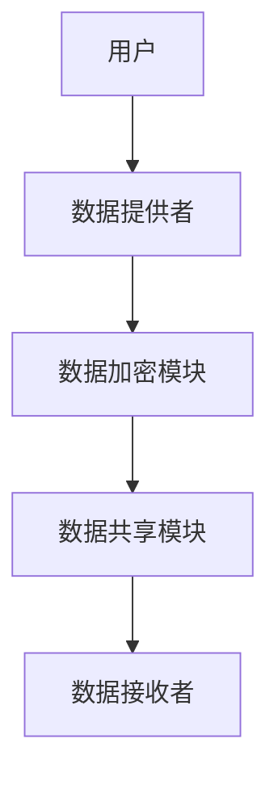
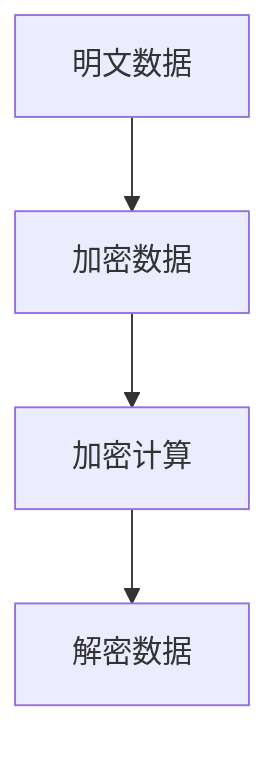
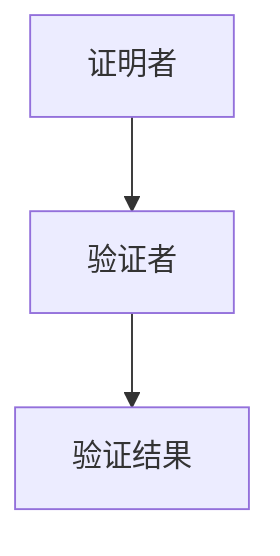
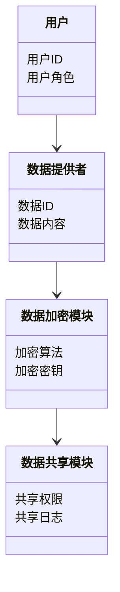

                 


# 《金融数据隐私保护与共享平台设计》

---

## 关键词：金融数据隐私保护、共享平台设计、数据加密、匿名化处理、区块链、多方计算、数据安全

---

## 摘要：  
随着金融行业的数字化转型加速，数据隐私保护与共享的需求日益迫切。本文旨在探讨金融数据隐私保护的核心技术与共享平台的设计思路，从问题背景、核心概念、算法原理到系统架构，再到项目实战，全面解析金融数据隐私保护与共享平台的设计与实现。通过本文，读者将深入了解如何在保护数据隐私的前提下实现数据的有效共享，为金融行业提供一种安全、合规的解决方案。

---

## 第1章: 金融数据隐私保护与共享平台概述

### 1.1 问题背景与重要性

#### 1.1.1 金融数据隐私保护的必要性  
金融数据是金融机构的核心资产，涉及用户的敏感信息，如账户余额、交易记录等。随着数字化转型的推进，金融数据的泄露风险也在增加。如何在保护数据隐私的前提下实现数据共享，成为金融行业亟待解决的问题。

#### 1.1.2 数据共享的挑战与机遇  
数据共享是金融机构合作的重要手段，但传统的共享方式往往涉及数据的直接传输，存在数据泄露的风险。如何在不暴露原始数据的情况下实现数据共享，是金融行业面临的技术挑战。通过数据加密、匿名化处理等技术，可以实现数据的安全共享。

#### 1.1.3 平台设计的核心目标  
金融数据隐私保护与共享平台的核心目标是在保护数据隐私的前提下，实现数据的安全共享。平台需要具备数据加密、匿名化处理、访问控制等功能，确保数据在共享过程中的安全性。

---

### 1.2 问题描述与目标

#### 1.2.1 金融数据隐私保护的关键问题  
- 数据泄露风险：如何防止数据在传输和存储过程中被未经授权的第三方窃取。  
- 数据滥用风险：如何防止数据在共享过程中被滥用，确保数据仅用于约定的用途。  

#### 1.2.2 数据共享的痛点与需求  
- 数据孤岛问题：金融机构之间的数据隔离，导致数据无法有效共享。  
- 数据安全问题：数据在共享过程中可能被篡改或泄露。  

#### 1.2.3 平台设计的目标与边界  
平台设计的目标是实现金融数据的安全共享，同时保护数据隐私。平台的边界包括数据加密、匿名化处理、访问控制等功能，确保数据在共享过程中的安全性。

---

### 1.3 核心概念与联系

#### 1.3.1 数据隐私保护的核心要素  
- 数据加密：对数据进行加密处理，确保数据在传输和存储过程中的安全性。  
- 数据匿名化：通过技术手段将数据中的敏感信息去标识化，确保数据无法被关联到具体个人。  

#### 1.3.2 数据共享平台的功能模块  
- 数据加密模块：对数据进行加密处理，确保数据的安全性。  
- 数据共享模块：实现数据的共享功能，确保数据仅被授权的用户访问。  

#### 1.3.3 平台与数据隐私保护的关系  
平台是实现数据隐私保护的载体，通过平台的设计，可以实现数据的安全共享，同时保护数据隐私。

---

## 第2章: 数据隐私保护与共享平台的核心原理

### 2.1 数据隐私保护的核心原理

#### 2.1.1 数据加密与匿名化处理  
- 数据加密：使用加密算法对数据进行加密处理，确保数据在传输和存储过程中的安全性。  
- 数据匿名化：通过技术手段将数据中的敏感信息去标识化，确保数据无法被关联到具体个人。  

#### 2.1.2 数据访问控制机制  
- 权限管理：通过权限管理模块，确保只有授权的用户才能访问数据。  
- 访问日志：记录数据访问日志，便于后续审计和追溯。  

#### 2.1.3 数据生命周期管理  
- 数据生成：对数据进行加密处理，确保数据在生成阶段的安全性。  
- 数据存储：对数据进行加密存储，确保数据在存储阶段的安全性。  
- 数据销毁：对数据进行安全销毁，确保数据在销毁阶段的安全性。  

---

### 2.2 数据共享平台的功能架构

#### 2.2.1 数据加密与解密流程  
- 数据加密：对数据进行加密处理，确保数据的安全性。  
- 数据解密：对加密后的数据进行解密处理，恢复原始数据。  

#### 2.2.2 数据共享的权限管理  
- 权限分配：根据用户角色分配数据访问权限。  
- 权限验证：对用户的访问权限进行验证，确保只有授权用户才能访问数据。  

#### 2.2.3 数据安全传输协议  
- 数据加密传输：使用安全协议对数据进行加密传输，确保数据在传输过程中的安全性。  
- 数据完整性验证：通过校验机制确保数据在传输过程中未被篡改。  

---

### 2.3 核心概念对比分析

#### 2.3.1 数据隐私保护与数据共享的关系  
- 数据隐私保护是数据共享的前提条件，只有在数据隐私得到保护的前提下，才能实现数据的安全共享。  

#### 2.3.2 平台功能与数据隐私保护的对比  
| 平台功能                  | 数据隐私保护                  |
|---------------------------|-------------------------------|
| 数据加密                  | 数据加密                      |
| 数据共享                  | 数据匿名化                    |
| 数据访问控制              | 数据访问控制                  |

#### 2.3.3 数据隐私保护的法律合规性要求  
- 数据隐私保护需要符合相关法律法规，如GDPR（通用数据保护条例）。  

---

### 2.4 ER实体关系图



---

## 第3章: 数据隐私保护的关键算法

### 3.1 同态加密

#### 3.1.1 同态加密的原理  
- 同态加密是一种特殊的加密技术，允许在加密数据上进行计算，而不必解密数据。  
- 加密数据的计算结果与明文数据的计算结果相同。  

#### 3.1.2 同态加密的实现流程  


#### 3.1.3 同态加密的数学模型  
- 加密函数：$E: P \rightarrow C$，其中$P$是明文空间，$C$是密文空间。  
- 解密函数：$D: C \rightarrow P$，其中$D(E(P)) = P$。  

#### 3.1.4 同态加密的Python实现示例  
```python
def encrypt(plaintext, key):
    # 加密过程
    return ciphertext

def decrypt(ciphertext, key):
    # 解密过程
    return plaintext
```

---

### 3.2 零知识证明

#### 3.2.1 零知识证明的原理  
- 零知识证明是一种加密技术，允许一方证明自己拥有某些信息，而无需泄露这些信息。  

#### 3.2.2 零知识证明的实现流程  


#### 3.2.3 零知识证明的数学模型  
- 证明者通过计算生成证明，验证者通过验证证明的正确性来确认证明者是否拥有相关知识。  

---

## 第4章: 数据共享平台的系统架构设计

### 4.1 问题场景介绍

#### 4.1.1 金融数据共享的场景  
- 金融机构之间的数据共享，如信用评估、反欺诈等场景。  

#### 4.1.2 数据共享的典型问题  
- 数据泄露风险：如何防止数据在共享过程中被未经授权的第三方窃取。  
- 数据滥用风险：如何防止数据在共享过程中被滥用，确保数据仅用于约定的用途。  

---

### 4.2 系统功能设计

#### 4.2.1 领域模型设计  


---

### 4.3 系统架构设计

#### 4.3.1 系统架构图  


---

## 第5章: 项目实战

### 5.1 环境安装

#### 5.1.1 Python环境安装  
- 安装Python：https://www.python.org/downloads/  
- 安装必要的库：`pip install cryptography`  

---

### 5.2 系统核心实现

#### 5.2.1 数据加密模块实现  
```python
from cryptography.fernet import Fernet

def generate_key():
    key = Fernet.generate_key()
    return key

def encrypt_data(data, key):
    fernet = Fernet(key)
    encrypted_data = fernet.encrypt(data.encode())
    return encrypted_data

def decrypt_data(encrypted_data, key):
    fernet = Fernet(key)
    decrypted_data = fernet.decrypt(encrypted_data).decode()
    return decrypted_data
```

---

## 第6章: 最佳实践与总结

### 6.1 小结

通过本文的详细讲解，我们深入了解了金融数据隐私保护与共享平台的设计与实现。通过数据加密、匿名化处理等技术，可以在保护数据隐私的前提下实现数据的安全共享。

---

## 作者：AI天才研究院 & 禅与计算机程序设计艺术

