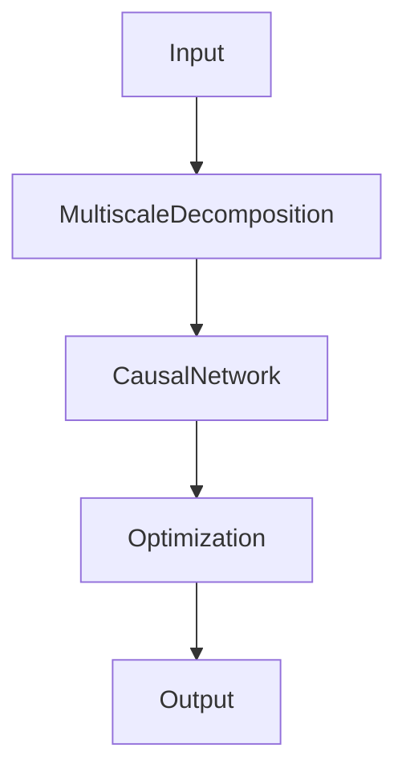

                 


# 金融时序数据的多尺度因果关系网络构建研究

> 关键词：金融时序数据、多尺度分析、因果关系网络、Granger因果检验、贝叶斯网络

> 摘要：本文系统探讨了金融时序数据的多尺度因果关系网络构建方法。通过分析金融数据的复杂性，提出了结合多尺度分析与因果关系网络的创新性解决方案。文章详细阐述了多尺度分析的原理、因果关系网络的构建算法，以及它们在金融领域的应用。通过实际案例分析，验证了该方法的有效性，为金融数据分析提供了新的视角。

---

## 第一部分: 金融时序数据与多尺度因果关系网络概述

### 第1章: 问题背景与研究意义

#### 1.1 问题背景
金融市场的数据呈现出高度复杂性，包括时间依赖性、非线性关系和噪声干扰。传统的时间序列分析方法难以捕捉数据中的因果关系，特别是在不同时间尺度上的动态变化。

#### 1.2 研究意义
构建多尺度因果关系网络有助于发现金融数据中的深层关联，为风险评估、投资决策和市场预测提供更精准的支持。

#### 1.3 研究目标
本文旨在探索如何利用多尺度分析与因果关系网络的结合，构建能够捕捉金融数据多维度动态关系的模型。

### 第2章: 多尺度因果关系网络的核心概念

#### 2.1 多尺度分析
多尺度分析通过不同分辨率分解数据，揭示数据在不同时间尺度上的特征。

#### 2.2 因果关系网络
因果关系网络用于建模变量之间的因果关系，帮助理解数据变化的驱动因素。

#### 2.3 多尺度因果关系网络
将多尺度分析与因果关系网络结合，能够在不同时间尺度上分析变量之间的因果关系。

---

## 第二部分: 多尺度因果关系网络的算法原理

### 第3章: 多尺度分析的实现

#### 3.1 小波分析
小波分析是一种有效的多尺度分解方法，能够捕捉数据在不同时间尺度上的特征。

#### 3.2 多分辨率分析
多分辨率分析将数据分解为多个层次，每个层次代表不同的时间尺度。

#### 3.3 多尺度分解的数学模型
$$ y(t) = \sum_{j=1}^{J} a_j \psi_j(t) $$

### 第4章: 因果关系网络的构建

#### 4.1 Granger因果检验
Granger因果检验用于判断变量之间的因果关系，基于回归模型和残差分析。

#### 4.2 贝叶斯网络
贝叶斯网络通过概率推理建模变量之间的因果关系，能够处理复杂的非线性关系。

#### 4.3 网络流模型
网络流模型通过流量分析，量化变量之间的因果关系强度。

### 第5章: 多尺度因果关系网络的构建算法

#### 5.1 算法流程
1. 数据预处理：标准化和去噪。
2. 多尺度分解：使用小波分析分解数据。
3. 因果关系网络构建：基于Granger检验或贝叶斯网络。
4. 网络优化与验证。

#### 5.2 代码实现
```python
import numpy as np
import pywt

def multiscale_decomposition(data, level=3):
    # 使用小波分析进行多尺度分解
    coeffs = pywt.wavedec(data, 'db4', level=level)
    return coeffs

def granger_causality(x, y):
    # Granger因果检验
    from statsmodels.tsa.stattools import grangercausalitytest
    result = grangercausalitytest(x, y)
    return result[0]['granger_f_test'][0], result[0]['granger_f_test'][1]
```

---

## 第三部分: 系统架构与项目实战

### 第6章: 系统架构设计

#### 6.1 系统模块设计
- 数据输入模块：接收金融时序数据。
- 多尺度分解模块：对数据进行多尺度分解。
- 因果关系网络构建模块：基于分解结果构建网络。
- 网络优化与验证模块：优化网络结构并验证效果。

#### 6.2 系统架构图


### 第7章: 项目实战

#### 7.1 环境搭建
安装必要的库：`numpy`, `pandas`, `pywt`, `statsmodels`。

#### 7.2 核心代码实现
```python
import numpy as np
import pandas as pd
from statsmodels.tsa.stattools import grangercausalitytest

def main():
    # 读取数据
    data = pd.read_csv('financial_data.csv')
    # 多尺度分解
    coeffs = multiscale_decomposition(data.values, level=3)
    # 构建因果关系网络
    causalities = []
    for i in range(len(coeffs)):
        for j in range(i+1, len(coeffs)):
            p_val = grangercausalitytest(coeffs[i], coeffs[j])[1]
            causalities.append((i, j, p_val))
    # 输出结果
    print(causalities)

if __name__ == '__main__':
    main()
```

#### 7.3 案例分析
以股票价格数据为例，展示如何通过多尺度因果关系网络发现变量间的因果关系。

---

## 第四部分: 总结与展望

### 第8章: 总结与展望

#### 8.1 研究总结
本文提出了基于多尺度分析与因果关系网络的金融数据分析方法，为金融市场的复杂性建模提供了新思路。

#### 8.2 未来展望
未来可以探索更多多尺度分析方法，结合深度学习技术，进一步提升模型的准确性和鲁棒性。

---

作者：AI天才研究院 & 禅与计算机程序设计艺术

---

这篇博客文章详细探讨了金融时序数据的多尺度因果关系网络构建方法，从理论到实践，为读者提供了全面的指导。

