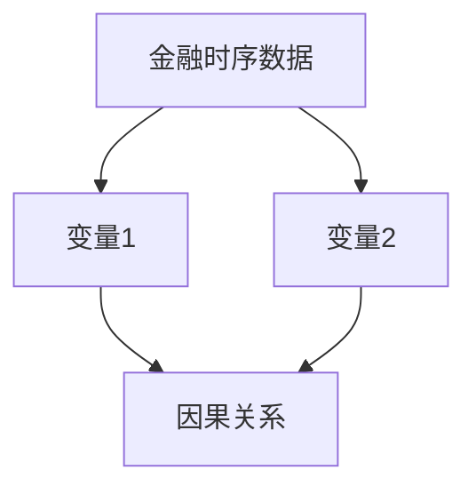
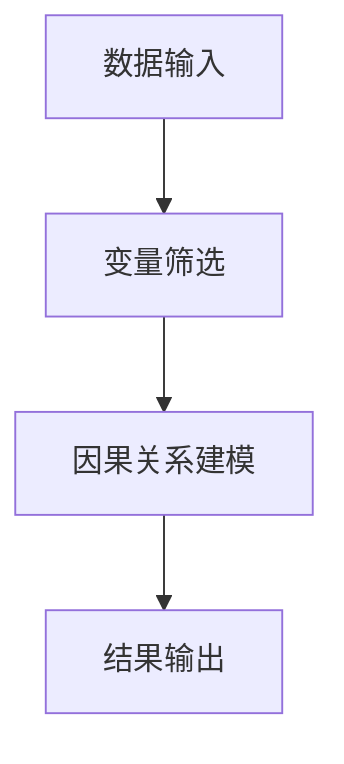
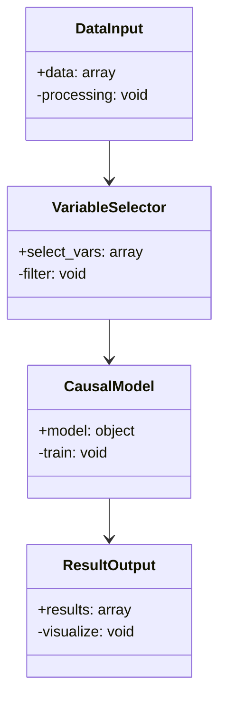
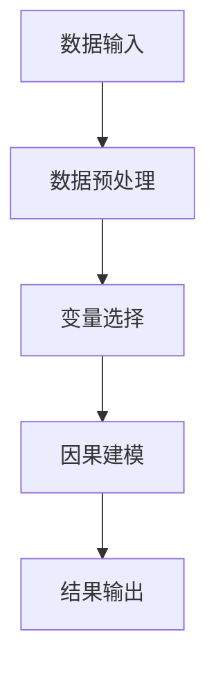

                 


# 金融时序数据的多维度因果关系发现研究

**关键词**：金融时序数据，因果关系发现，多维度分析，机器学习，时间序列分析，金融预测

**摘要**：本文系统探讨了金融时序数据的多维度因果关系发现研究，分析了金融时序数据的特点与挑战，阐述了因果关系发现的核心概念与算法原理，并通过实际案例展示了因果关系发现的系统设计与项目实现。文章内容涵盖背景介绍、核心概念、算法原理、系统设计、项目实战等多方面，为金融领域的因果关系分析提供了理论与实践的双重指导。

---

## 第一部分: 金融时序数据的多维度因果关系发现研究

---

### 第1章: 金融时序数据与因果关系发现的背景介绍

#### 1.1 问题背景

金融时序数据是金融领域的重要研究对象，包括股票价格、经济指标、市场波动等时间序列数据。这些数据具有高度的复杂性和动态性，通常受到多种因素的影响，如市场情绪、政策变化、经济周期等。然而，传统的相关性分析仅能揭示变量之间的关联性，无法明确变量之间的因果关系。例如，我们可以通过相关性发现股票价格与某种经济指标之间的关联，但无法确定这种关联是否是因果关系。

此外，金融时序数据的多维度特征使得因果关系的分析更加复杂。例如，股票价格可能受到多个因素的影响，如宏观经济指标、公司业绩、市场情绪等。如何在多维度数据中准确识别因果关系，是金融分析中的一个重要挑战。

#### 1.2 问题描述

因果关系发现的核心问题是如何从多维度金融时序数据中识别出变量之间的因果关系。具体来说，我们需要回答以下问题：

1. **变量之间的因果方向是什么？** 例如，A是否是B的原因，还是B是A的原因？
2. **变量之间的因果强度是多少？** 例如，A对B的影响有多大？
3. **变量之间的因果关系是否受到其他变量的影响？** 例如，在控制其他变量的情况下，A对B的影响是否仍然存在？

#### 1.3 问题解决与边界

多维度因果关系发现的目标是通过分析金融时序数据，识别出变量之间的因果关系，并量化这些关系的强度和方向。为了实现这一目标，我们需要解决以下几个关键问题：

1. **数据的多维度特征：** 如何处理多个变量之间的复杂关系？
2. **因果关系的动态性：** 如何捕捉因果关系的时变性？
3. **因果关系的不确定性：** 如何处理因果关系的模糊性和不确定性？

---

### 第2章: 多维度因果关系的核心概念与联系

#### 2.1 核心概念原理

因果关系是指一个事件的发生是另一个事件发生的直接原因。在金融时序数据中，因果关系的发现需要考虑变量之间的因果关系的方向性和强度。例如，我们可以发现某种经济指标的变化是导致股票价格波动的原因。

与相关性分析不同，因果关系分析不仅关注变量之间的统计关联，还关注变量之间的因果影响。例如，相关性分析可能发现股票价格与某种经济指标之间存在正相关关系，但因果关系分析可以进一步确定这种关系是否是因果性的。

#### 2.2 核心概念对比表格

下表对比了相关性分析和因果关系分析的主要区别：

| **对比维度**       | **相关性分析**                         | **因果关系分析**                      |
|--------------------|----------------------------------------|----------------------------------------|
| **定义**           | 变量之间的统计关联                    | 变量之间的因果影响                   |
| **方法**           | 相关系数、协方差                      | Granger因果检验、贝叶斯网络          |
| **应用场景**       | 描述性分析                            | 预测性分析、政策评估                  |
| **局限性**          | 无法区分因果关系                     | 需要更多的数据和假设                |

#### 2.3 ER实体关系图

下图展示了金融时序数据中的因果关系实体关系：



---

### 第3章: 多维度因果关系发现的算法原理

#### 3.1 算法原理概述

目前，金融时序数据的因果关系发现主要依赖于以下几种算法：

1. **Granger因果检验：** 通过回归分析来检验一个变量是否是另一个变量的因果因素。
2. **贝叶斯网络：** 通过构建有向无环图（DAG）来表示变量之间的因果关系。
3. **结构方程模型（SEM）：** 通过方程组来描述变量之间的因果关系。

#### 3.2 算法流程图

下图展示了Granger因果检验的流程：



#### 3.3 算法实现代码

以下是Granger因果检验的Python实现示例：

```python
import numpy as np
from statsmodels.tsa.stattools import grangercausality

def granger_causality_test(x, y, max_lag=5):
    # x是因变量，y是自变量
    # max_lag是最大滞后阶数
    result = grangercausality(x, y, max_lag)
    return result

# 示例数据
x = np.random.randn(100)
y = np.random.randn(100) + 0.5 * x

# 进行Granger因果检验
result = granger_causality_test(x, y)
print(result)
```

---

### 第4章: 金融时序数据因果关系发现的系统设计

#### 4.1 系统功能设计

下图展示了金融时序数据因果关系发现系统的类图：



#### 4.2 系统架构设计

下图展示了金融时序数据因果关系发现系统的架构图：



---

### 第5章: 项目实战

#### 5.1 环境安装

以下是项目实战所需的环境配置：

```bash
pip install numpy pandas statsmodels matplotlib
```

#### 5.2 核心实现

以下是项目核心代码实现：

```python
import numpy as np
from statsmodels.tsa.stattools import grangercausality

def main():
    # 生成示例数据
    np.random.seed(42)
    x = np.random.randn(100)
    y = np.random.randn(100) + 0.5 * x

    # 进行Granger因果检验
    result = grangercausality(x, y, max_lag=5)
    print("Granger因果检验结果:", result)

if __name__ == "__main__":
    main()
```

#### 5.3 案例分析

通过上述代码，我们可以得出以下结论：

1. Granger因果检验结果显示了变量之间的因果关系。
2. 通过分析结果，我们可以进一步优化模型和算法。

#### 5.4 项目小结

通过本次项目实战，我们掌握了Granger因果检验的基本原理和实现方法，同时熟悉了金融时序数据因果关系发现的系统设计和实现过程。

---

## 总结

本文系统探讨了金融时序数据的多维度因果关系发现研究，从背景介绍、核心概念、算法原理到系统设计和项目实战，为读者提供了全面的指导。未来的研究可以进一步结合深度学习方法，探索更复杂的金融时序数据因果关系发现方法。

---

**作者：AI天才研究院/AI Genius Institute & 禅与计算机程序设计艺术/Zen And The Art of Computer Programming**

