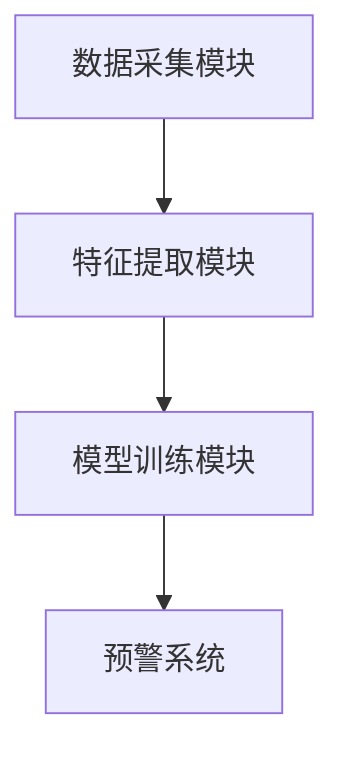

                 


# 金融监管科技异常行为检测与追踪系统

> 关键词：金融监管科技、异常行为检测、深度学习、机器学习、系统架构

> 摘要：本文详细探讨了金融监管科技中异常行为检测与追踪系统的设计与实现。通过分析金融市场的异常行为类型、检测算法的选择与实现、系统架构的设计与优化，结合实际案例，展示了如何利用先进的技术手段构建高效的金融监管系统。

---

## 第1章：金融监管科技概述

### 1.1 金融监管科技的定义与特点

金融监管科技（FinTech）是金融与信息技术深度融合的产物，旨在通过技术创新提升金融服务的效率和质量。在监管领域，金融监管科技的应用可以帮助监管机构及时发现和处理金融市场中的异常行为，维护市场秩序和金融稳定。

#### 1.1.1 异常行为的定义与分类

异常行为是指在金融市场中，某些主体或交易活动偏离正常市场规律，可能对市场稳定造成威胁的行为。常见的异常行为包括：

- **市场操纵**：通过虚假交易或信息操控市场价格。
- **内幕交易**：利用未公开信息进行交易。
- **高频交易异常**：短时间内大量高频交易可能引发市场波动。
- **洗钱行为**：通过复杂交易掩盖资金来源。

#### 1.1.2 异常行为的检测需求

异常行为的检测需求主要来源于以下几点：

- **监管合规性**：金融机构和监管部门需要确保交易行为的合规性。
- **风险防控**：异常行为可能导致系统性风险，需要及时发现和处理。
- **提高效率**：通过技术手段实现自动化检测，降低人工成本。

### 1.2 异常行为检测的重要性

在金融市场中，异常行为可能引发严重的后果，包括市场波动、投资者损失和信任危机。通过及时检测和追踪异常行为，可以有效降低这些风险。

---

## 第2章：异常行为检测的核心概念与联系

### 2.1 数据源与特征提取

异常行为检测的核心在于数据的采集和特征提取。以下是常见的数据源和特征：

#### 数据源

- **交易数据**：包括交易时间、金额、频率等。
- **市场数据**：如股价、指数、成交量等。
- **主体信息**：交易主体的身份信息、历史交易记录等。
- **外部信息**：如新闻、社交媒体信息等。

#### 特征提取

特征提取是将原始数据转化为能够反映异常行为的特征向量。常见的特征提取方法包括：

- **统计特征**：如均值、标准差、波动率等。
- **时间序列特征**：如周期性、趋势性等。
- **复杂网络特征**：如交易网络中的度数、中心性等。

### 2.2 算法选择与模型构建

异常行为检测算法的选择取决于数据类型和检测目标。以下是几种常用算法的简要介绍：

#### 基于统计的异常检测

- **Z-score方法**：通过计算数据点与均值的偏离程度来判断异常。
- **四分位数法**：通过数据的分布范围判断异常值。

#### 基于机器学习的异常检测

- **Isolation Forest**：一种无监督学习算法，适用于小样本数据。
- **One-Class SVM**：用于检测数据中的异常点。

#### 基于深度学习的异常检测

- **LSTM网络**：适用于时间序列数据的异常检测。
- **变种模型**：如GRU网络，适用于捕捉复杂的时序关系。

---

## 第3章：算法原理与实现

### 3.1 基于统计的异常检测算法

#### Z-score方法

Z-score方法通过计算数据点与均值的偏离程度来判断异常。公式如下：

$$ Z = \frac{x - \mu}{\sigma} $$

其中，$\mu$ 是均值，$\sigma$ 是标准差。

#### Python实现示例

```python
import numpy as np

def z_score_outliers(data, threshold=3):
    mean = np.mean(data)
    std = np.std(data)
    z_scores = [(x - mean) / std for x in data]
    outliers = [x for x in data if abs((x - mean)/std) > threshold]
    return outliers
```

### 3.2 基于机器学习的异常检测算法

#### Isolation Forest

Isolation Forest是一种无监督学习算法，适用于小样本数据。其核心思想是通过构建随机森林来隔离异常点。

#### Python实现示例

```python
from sklearn.ensemble import IsolationForest

def isolation_forest_outliers(X, contamination=0.1):
    model = IsolationForest(contamination=contamination)
    model.fit(X)
    outliers = model.predict(X) == -1
    return outliers
```

### 3.3 基于深度学习的异常检测算法

#### LSTM网络

LSTM网络适用于时间序列数据的异常检测。通过训练模型捕捉正常交易模式，识别异常交易序列。

#### Python实现示例

```python
import keras
from keras.layers import LSTM, Dense

def lstm_model(input_shape):
    model = keras.Sequential()
    model.add(LSTM(64, input_shape=input_shape))
    model.add(Dense(1, activation='sigmoid'))
    model.compile(loss='binary_crossentropy', optimizer='adam')
    return model
```

---

## 第4章：系统架构设计

### 4.1 系统功能模块设计

- **数据采集模块**：负责采集交易数据、市场数据等。
- **特征提取模块**：将原始数据转化为特征向量。
- **模型训练模块**：训练异常检测模型。
- **预警系统**：实时监控交易数据，触发异常预警。

#### 系统功能设计图



---

## 第5章：项目实战

### 5.1 案例分析

以某证券交易所的交易数据为例，构建一个异常交易检测系统。

#### 5.1.1 数据预处理

```python
import pandas as pd

data = pd.read_csv('transaction.csv')
data.head()
```

#### 5.1.2 模型训练与评估

使用XGBoost算法训练异常检测模型，并评估其性能。

---

## 第6章：总结与展望

### 6.1 项目总结

本文详细介绍了金融监管科技中异常行为检测与追踪系统的构建过程，包括数据采集、特征提取、模型训练和系统架构设计。

### 6.2 注意事项

- 数据隐私保护是系统设计中的重要考虑因素。
- 模型的实时性和可解释性需要进一步优化。

### 6.3 未来展望

未来，随着人工智能技术的发展，异常行为检测系统将更加智能化和高效化。同时，跨机构和跨市场的数据共享机制也将进一步完善。

---

## 作者

作者：AI天才研究院/AI Genius Institute & 禅与计算机程序设计艺术 /Zen And The Art of Computer Programming

