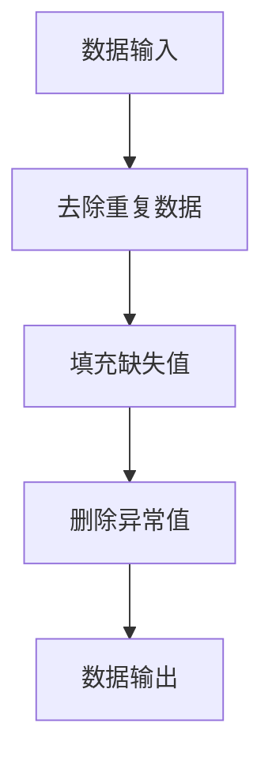
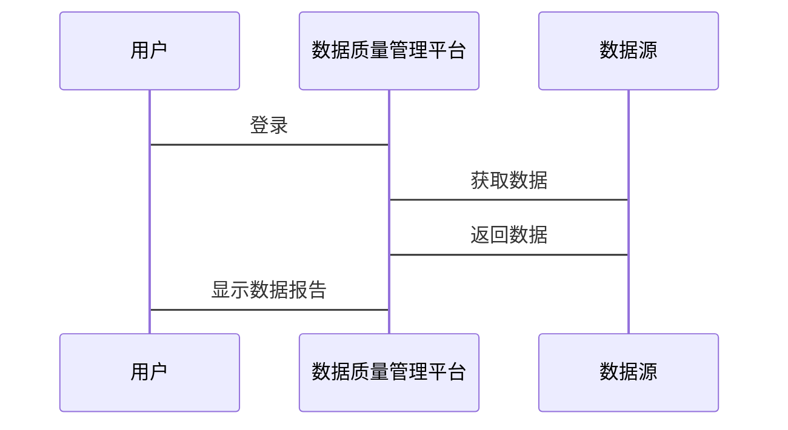

                 


# 《金融监管科技数据质量控制平台》

---

## 关键词：金融监管科技、数据质量控制、数据清洗、规则引擎、数据依赖性、系统架构设计

---

## 摘要：  
金融监管科技（RegTech）作为金融科技的重要组成部分，正在改变传统金融监管的方式和效率。数据质量控制是金融监管的核心环节，直接关系到监管决策的准确性和可靠性。本文深入分析了金融监管科技数据质量控制平台的构建逻辑，从背景、核心概念、算法原理到系统架构设计，结合实际案例，详细讲解了平台的实现过程。通过本文，读者将能够全面理解如何设计和实现一个高效、可靠的金融监管数据质量控制平台。

---

## 正文：

### 第1章: 金融监管科技与数据质量控制平台概述

#### 1.1 金融监管科技的背景与发展趋势
随着金融行业的快速发展，监管需求日益复杂，传统的人工监管方式已难以应对。金融监管科技（RegTech）的出现，为金融机构和监管机构提供了更高效、更智能的监管解决方案。数据作为金融监管的核心要素，其质量直接影响监管结果的准确性。因此，数据质量控制成为金融监管科技中的重要环节。

#### 1.2 数据质量控制平台的定义与作用
数据质量控制平台是指通过技术手段对金融数据进行清洗、验证、分析和优化，确保数据准确、完整、一致和合规的平台。其作用包括提高监管效率、降低合规成本、防范金融风险等。

#### 1.3 金融监管科技数据质量控制平台的背景介绍
在金融行业中，数据来源多样、格式复杂、数量庞大，容易出现数据缺失、重复、错误等问题。这些问题不仅会影响监管决策的准确性，还可能导致合规风险。因此，构建一个高效的数据质量控制平台成为迫切需求。

#### 1.4 本章小结
本章通过介绍金融监管科技的发展背景和数据质量控制的重要性，为后续章节奠定了基础。

---

### 第2章: 数据质量管理的核心概念与联系

#### 2.1 数据质量管理的核心原理
数据质量管理的核心原理包括数据清洗、数据验证、数据标准化和数据匹配等技术。这些技术能够帮助我们解决数据中的重复、错误、缺失等问题。

#### 2.2 数据质量管理的核心概念属性对比
通过对比数据完整性、准确性、一致性、及时性和安全性等核心属性，我们可以更好地理解数据质量管理的关键点。

#### 2.3 数据质量管理的ER实体关系图
以下是数据质量管理的ER实体关系图：
```mermaid
erDiagram
    actor 用户 {
        +id 用户ID
        +name 用户名称
        +role 用户角色
    }
    actor 监管机构 {
        +id 监管机构ID
        +name 监管机构名称
        +region 所属区域
    }
    actor 数据源 {
        +id 数据源ID
        +name 数据源名称
        +type 数据源类型
    }
    entity 数据 {
        +id 数据ID
        +value 数据值
        +source 数据来源
        +timestamp 时间戳
    }
    boundary 数据质量管理平台 {
        +id 平台ID
        +name 平台名称
        +version 版本号
    }
    监管机构 --> 数据质量管理平台: 使用
    用户 --> 数据质量管理平台: 登录
    数据源 --> 数据: 提供
    数据质量管理平台 --> 数据: 验证
```

---

### 第3章: 数据清洗与异常检测算法原理

#### 3.1 数据清洗算法
数据清洗是数据质量管理的重要环节，包括去重、填充缺失值、删除异常值等。以下是数据清洗的流程图：


#### 3.2 异常检测算法
异常检测算法是数据清洗的重要工具。以下是基于马尔可夫链的异常检测算法：
$$P(x_t | x_{t-1}, x_{t-2})$$
该算法通过分析数据序列的历史信息，判断当前数据是否异常。

#### 3.3 算法实现
以下是异常检测算法的Python代码示例：
```python
import numpy as np
from sklearn.metrics import pairwise_distances

def detect_anomalies(data, window_size=5):
    anomalies = []
    for i in range(window_size, len(data)):
        window = data[i-window_size:i]
        current = data[i]
        max_distance = max(pairwise_distances(current.reshape(1, -1), window))
        if max_distance > 0.1:  # 根据实际情况调整阈值
            anomalies.append(i)
    return anomalies
```

---

### 第4章: 数据质量管理平台的系统架构设计

#### 4.1 系统功能设计
数据质量管理平台的功能模块包括数据采集、数据清洗、数据验证、数据存储和数据报告等。

#### 4.2 系统架构设计
以下是系统的架构图：


#### 4.3 系统接口设计
系统接口包括数据源接口、用户界面接口和监管机构接口。

#### 4.4 系统交互流程
以下是系统的交互流程图：


---

### 第5章: 项目实战

#### 5.1 环境安装
需要安装Python、Jupyter Notebook和相关库（如pandas、numpy、scikit-learn）。

#### 5.2 核心代码实现
以下是数据清洗的核心代码：
```python
import pandas as pd

def clean_data(df):
    # 去除重复数据
    df = df.drop_duplicates()
    # 填充缺失值
    df['value'].fillna(df['value'].mean(), inplace=True)
    # 删除异常值
    df = df[df['value'] > df['value'].quantile(0.05)]
    return df
```

#### 5.3 案例分析
通过一个银行交易数据的案例，详细讲解数据清洗和异常检测的过程。

---

### 第6章: 最佳实践与小结

#### 6.1 最佳实践
包括数据质量管理的流程优化、算法选择和系统设计建议。

#### 6.2 小结
总结全文，强调数据质量控制平台在金融监管中的重要性。

---

## 作者：AI天才研究院/AI Genius Institute & 禅与计算机程序设计艺术 /Zen And The Art of Computer Programming

---

**Note:** 如果需要进一步扩展某些部分的内容，可以告诉我，我会继续补充详细信息。

