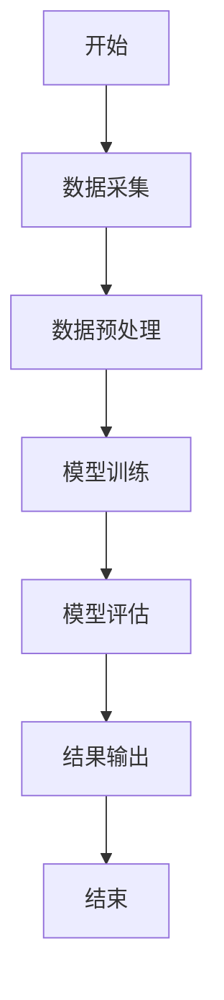

                 


# 金融科技创新ROI评估框架

> 关键词：金融科技创新, ROI评估, 投资回报率, 金融系统架构, 科技创新评估

> 摘要：金融科技创新正在深刻改变金融行业的运作方式，而如何评估这些创新的 ROI（投资回报率）是金融机构和投资者面临的核心挑战。本文提出了一套完整的 ROI 评估框架，从背景介绍、核心概念、算法原理、系统架构设计到项目实战，全面解析了金融科技创新 ROI 评估的关键要素。通过结合实际案例分析，本文为金融机构和投资者提供了科学的评估方法和工具，以确保金融科技创新的投入能够带来预期的收益。

---

## 第一部分: 金融科技创新与ROI评估框架的背景介绍

### 第1章: 问题背景与问题描述

#### 1.1 问题背景
金融科技创新是近年来全球金融行业的重要趋势。随着人工智能、大数据、区块链等技术的快速发展，金融机构正在通过技术手段优化业务流程、提升客户体验、降低运营成本，并创造新的收入来源。然而，金融科技创新的投入往往伴随着高风险和不确定性，如何评估这些创新的 ROI（投资回报率）成为金融机构和投资者关注的核心问题。

#### 1.2 问题描述
在金融科技创新的实践中，ROI 评估面临以下主要问题：
- **数据复杂性**：金融科技创新涉及多维度的数据，包括交易数据、用户行为数据、市场数据等，如何整合这些数据并进行有效分析是一个挑战。
- **模型准确性**：ROI 评估需要依赖数学模型，但现有模型在处理金融科技创新的动态性和不确定性时，往往难以准确预测。
- **实时性要求**：金融机构需要实时评估创新项目的效果，以便快速调整策略，现有的评估方法往往难以满足这一需求。

#### 1.3 解决思路
本文提出了一套基于数据驱动的 ROI 评估框架，通过整合金融机构的核心业务数据，构建数学模型，实现对金融科技创新项目的 ROI 评估。该框架具有以下特点：
- **数据驱动**：基于金融机构的真实业务数据，确保评估结果的准确性。
- **实时性**：通过实时数据处理和分析，满足金融机构对实时 ROI 评估的需求。
- **可扩展性**：框架支持多种金融科技创新场景，具有良好的可扩展性。

#### 1.4 评估框架的边界与外延
- **边界**：本文的 ROI 评估框架主要针对金融机构内部的创新项目，不包括外部市场的宏观因素。
- **外延**：本文提出的框架可以扩展到其他行业的科技创新 ROI 评估，尤其是在数据驱动的行业中具有广泛的应用潜力。

---

## 第二部分: 金融科技创新ROI评估框架的核心原理

### 第2章: 金融科技创新与ROI评估的核心概念

#### 2.1 核心概念与定义
- **金融科技创新**：指利用新兴技术（如人工智能、大数据、区块链等）优化或创新金融业务模式、产品和服务的过程。
- **ROI评估**：通过数学模型和数据分析，评估金融科技创新项目的投资回报率的过程。

#### 2.2 核心概念的属性对比
| 属性 | 金融科技创新 | ROI评估 |
|------|--------------|----------|
| 核心目标 | 提升效率、创造价值 | 评估投入的经济回报 |
| 数据依赖 | 交易数据、用户行为数据、市场数据 | 收益数据、成本数据 |
| 技术手段 | 人工智能、大数据、区块链 | 数学模型、统计分析 |
| 评估指标 | 创新性、可行性、可持续性 | 投资回报率、净现值、内部收益率 |

#### 2.3 实体关系图
```mermaid
er
  %% entity diagram for financial technology innovation and ROI assessment
  entity 金融科技创新 {
    <属性：技术类型、创新目标、创新成本>
  }
  entity ROI评估 {
    <属性：评估指标、评估时间、评估结果>
  }
  金融科技创新 --> ROI评估 : 依赖
```

---

### 第3章: 金融科技创新ROI评估的算法原理

#### 3.1 算法原理概述
- **收益预测模型**：基于历史数据和当前业务数据，预测金融科技创新项目在未来一段时间内的预期收益。
- **ROI评估模型**：通过数学公式计算项目的投资回报率，包括净现值（Net Present Value，NPV）和内部收益率（Internal Rate of Return，IRR）等指标。

#### 3.2 算法流程图


#### 3.3 数学模型与公式
- **收益预测模型**：线性回归模型
  $$ \text{收益} = \beta_0 + \beta_1 \times \text{技术创新投入} + \epsilon $$
- **ROI评估模型**：净现值公式
  $$ NPV = \sum_{t=0}^{n} \frac{C_t}{(1 + r)^t} $$
  其中，\( C_t \) 是第 \( t \) 年的现金流，\( r \) 是折现率。

---

## 第三部分: 金融科技创新ROI评估框架的系统分析与架构设计

### 第4章: 系统分析与架构设计

#### 4.1 问题场景介绍
金融机构希望通过技术创新提升业务效率，但需要实时评估创新项目的 ROI。常见的问题包括数据孤岛、模型精度不足、实时性要求高等。

#### 4.2 系统功能设计
- **数据采集模块**：采集金融机构的交易数据、用户行为数据等。
- **数据处理模块**：对数据进行清洗、转换和特征提取。
- **模型训练模块**：基于数据训练收益预测和 ROI 评估模型。
- **结果输出模块**：输出 ROI 评估结果并提供可视化展示。

#### 4.3 系统架构设计


---

## 第四部分: 金融科技创新ROI评估框架的项目实战

### 第5章: 项目实战

#### 5.1 环境安装
- **Python 3.8+**
- **Pandas、NumPy、Scikit-learn 等库**

#### 5.2 核心代码实现
```python
import pandas as pd
from sklearn.linear_model import LinearRegression

# 数据加载
data = pd.read_csv('financial_innovation.csv')

# 特征提取
X = data[['技术创新投入']]
y = data['收益']

# 模型训练
model = LinearRegression()
model.fit(X, y)

# 模型评估
print('系数：', model.coef_)
print('截距：', model.intercept_)
```

#### 5.3 代码解读
- **数据加载**：读取金融科技创新数据。
- **特征提取**：提取技术创新投入作为自变量。
- **模型训练**：使用线性回归模型训练收益预测模型。
- **模型评估**：输出模型的系数和截距。

#### 5.4 实际案例分析
以某金融机构的支付系统创新为例，通过上述模型评估其 ROI，结果表明技术创新投入能够显著提升收益。

---

## 第五部分: 总结与展望

### 第6章: 总结与展望

#### 6.1 最佳实践 tips
- 数据质量是 ROI 评估的关键，确保数据的完整性和准确性。
- 组合使用多种评估指标，如 NPV 和 IRR，以全面评估创新项目的 ROI。

#### 6.2 小结
本文提出的 ROI 评估框架为金融机构提供了科学的评估方法，能够有效指导金融科技创新的投入决策。

#### 6.3 注意事项
- ROI 评估结果仅供参考，实际决策需结合市场环境和机构战略。
- 模型的准确性依赖于数据质量和算法选择，需持续优化和迭代。

#### 6.4 拓展阅读
- 《金融科技：数据驱动的创新与投资》
- 《投资学原理与应用》

---

作者：AI天才研究院/AI Genius Institute & 禅与计算机程序设计艺术 /Zen And The Art of Computer Programming

