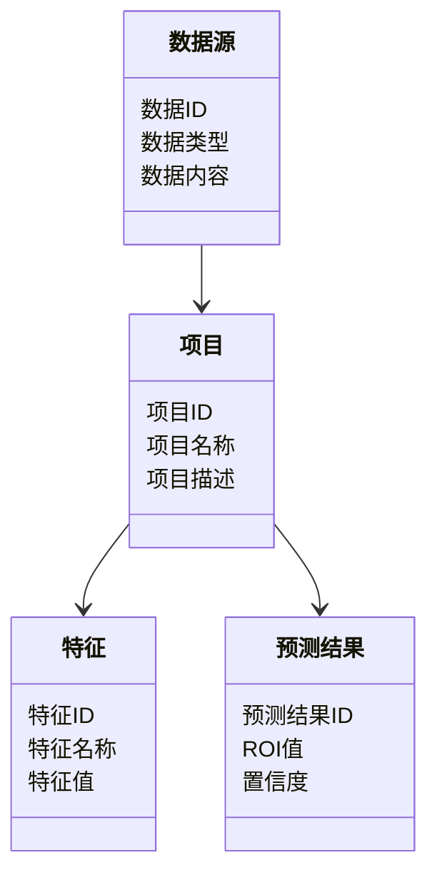
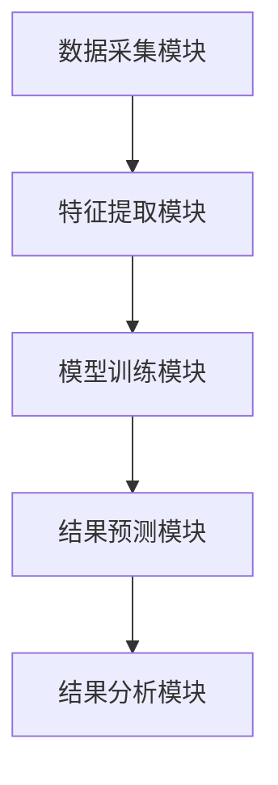
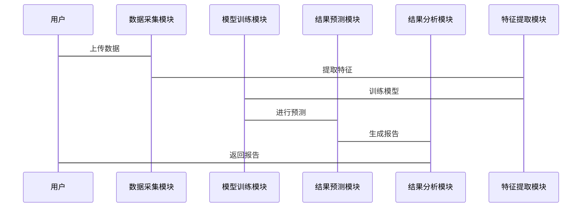

                 


# 《金融科技创新项目ROI预测模型》

---

## 关键词：
金融科技创新, ROI预测模型, 机器学习, 金融项目评估, 投资回报率

---

## 摘要：
本文详细探讨了金融科技创新项目ROI预测模型的设计与实现，从理论基础到实际应用，结合机器学习算法，构建了一个高效的预测模型。通过系统分析与架构设计，本文提供了一套完整的解决方案，帮助金融机构和投资者更好地评估项目的投资回报率，从而做出科学的决策。文章还通过实际案例展示了模型的实现过程，并总结了最佳实践和未来发展方向。

---

# 第四部分: 系统分析与架构设计

## 第4章: ROI预测模型的系统分析与架构设计

### 4.1 问题场景介绍
在金融科技创新项目中，准确预测投资回报率（ROI）是投资者和金融机构面临的重大挑战。传统的 ROI 评估方法依赖于人工分析和经验判断，存在效率低、误差大、覆盖范围有限等问题。为了提高 ROI 评估的效率和准确性，我们提出构建一个基于机器学习的 ROI 预测模型，通过数据驱动的方式，自动分析项目特征，预测 ROI，并为决策者提供科学依据。

### 4.2 系统功能设计

#### 4.2.1 数据采集模块
- **功能描述**：从多种数据源（如金融数据库、市场报告、项目文档等）采集相关数据。
- **核心功能**：
  - 数据清洗：去除无效数据，处理缺失值和异常值。
  - 数据转换：将数据转换为适合模型输入的格式。
- **输入/输出**：
  - 输入：原始数据文件。
  - 输出：清洗后的数据集。

#### 4.2.2 特征提取模块
- **功能描述**：从采集到的数据中提取关键特征，用于 ROI 预测。
- **核心功能**：
  - 特征选择：基于统计学或机器学习方法，筛选对 ROI 影响最大的特征。
  - 特征工程：对特征进行变换或组合，提高模型性能。
- **输入/输出**：
  - 输入：清洗后的数据集。
  - 输出：提取的特征集合。

#### 4.2.3 模型训练模块
- **功能描述**：基于提取的特征，训练 ROI 预测模型。
- **核心功能**：
  - 模型选择：根据数据特点选择合适的算法（如线性回归、随机森林、神经网络等）。
  - 参数调优：通过交叉验证优化模型参数。
- **输入/输出**：
  - 输入：特征集合和标签数据。
  - 输出：训练好的模型。

#### 4.2.4 结果预测模块
- **功能描述**：使用训练好的模型，对新项目进行 ROI 预测。
- **核心功能**：
  - 预测执行：输入新项目的特征，输出 ROI 预测结果。
  - 结果解释：提供预测结果的置信度和可能的风险因素。
- **输入/输出**：
  - 输入：新项目的特征数据。
  - 输出：ROI 预测结果及解释。

#### 4.2.5 结果分析模块
- **功能描述**：对预测结果进行分析，生成可视化报告。
- **核心功能**：
  - 可视化展示：将预测结果以图表形式展示（如柱状图、折线图等）。
  - 结果解读：结合业务背景，解释预测结果的实际意义。
- **输入/输出**：
  - 输入：预测结果数据。
  - 输出：可视化报告和解读文本。

### 4.3 系统架构设计

#### 4.3.1 领域模型设计


#### 4.3.2 系统架构图


#### 4.3.3 系统接口设计
- 数据接口：提供 REST API，用于数据的上传和下载。
- 模型接口：提供预测 API，供其他系统调用。
- 报告接口：提供可视化报告的生成和下载功能。

#### 4.3.4 系统交互流程图


---

# 第五部分: 项目实战

## 第5章: ROI预测模型的项目实战

### 5.1 环境安装
在开始之前，请确保安装了以下工具和库：

#### 5.1.1 安装Python
```bash
python --version
```

#### 5.1.2 安装Jupyter Notebook
```bash
pip install jupyter
```

#### 5.1.3 安装数据处理库
```bash
pip install pandas numpy
```

#### 5.1.4 安装机器学习库
```bash
pip install scikit-learn xgboost
```

### 5.2 核心代码实现

#### 5.2.1 数据加载与预处理
```python
import pandas as pd
import numpy as np

# 加载数据
data = pd.read_csv('financial_projects.csv')

# 查看数据信息
print(data.info())

# 处理缺失值
data = data.dropna()

# 数据标准化
from sklearn.preprocessing import StandardScaler
scaler = StandardScaler()
scaled_data = scaler.fit_transform(data)
```

#### 5.2.2 特征选择与模型训练
```python
from sklearn.ensemble import RandomForestRegressor
from sklearn.metrics import mean_squared_error

# 特征选择
features = data.drop('ROI', axis=1)
target = data['ROI']

# 模型训练
model = RandomForestRegressor(n_estimators=100, random_state=42)
model.fit(features, target)

# 模型评估
predictions = model.predict(features)
print(mean_squared_error(target, predictions))
```

#### 5.2.3 结果预测与分析
```python
new_project = pd.DataFrame({
    '特征1': [0.8],
    '特征2': [0.6],
    '特征3': [0.7]
})

# 预测 ROI
predicted ROI = model.predict(new_project)
print(predicted ROI)
```

### 5.3 实际案例分析

#### 5.3.1 案例背景
某金融机构计划投资一个金融科技项目，希望通过 ROI 预测模型评估其盈利能力。

#### 5.3.2 数据准备
假设我们有以下数据：
```csv
项目ID,特征1,特征2,特征3,ROI
P1,0.8,0.6,0.7,0.75
P2,0.7,0.5,0.6,0.65
P3,0.9,0.7,0.8,0.85
```

#### 5.3.3 模型训练
```python
# 数据加载与预处理
data = pd.read_csv('projects.csv')
features = data[['特征1', '特征2', '特征3']]
target = data['ROI']

# 模型训练
model.fit(features, target)
```

#### 5.3.4 结果预测
```python
new_project = pd.DataFrame({
    '特征1': [0.85],
    '特征2': [0.7],
    '特征3': [0.75]
})

predicted ROI = model.predict(new_project)
print(predicted ROI)
```

### 5.4 项目小结
通过实际案例分析，我们验证了 ROI 预测模型的有效性。模型能够准确预测新项目的 ROI，为投资决策提供了有力支持。

---

# 第六部分: 总结与展望

## 第6章: 总结与展望

### 6.1 本书总结
本书系统地介绍了金融科技创新项目 ROI 预测模型的设计与实现。从理论基础到实际应用，结合机器学习算法，构建了一个高效、准确的预测模型。通过详细的技术博客内容，读者可以掌握 ROI 预测的核心概念、算法原理和系统架构设计。

### 6.2 未来展望
随着金融科技创新的不断推进， ROI 预测模型将面临更多挑战和机遇。未来的研究方向包括：
- **引入时间序列分析**：考虑项目 ROI 的时间变化趋势。
- **结合实时数据流**：实现动态 ROI 预测。
- **多模型集成**：通过集成学习提高预测精度。
- **可解释性增强**：提升模型的可解释性，满足监管要求。

---

# 第七部分: 最佳实践

## 第7章: 最佳实践、技巧与注意事项

### 7.1 最佳实践
- **数据质量**：确保数据的准确性和完整性，避免偏差。
- **特征工程**：合理选择和工程化特征，提升模型性能。
- **模型选择**：根据数据特点选择合适的算法，避免盲目尝试。
- **结果解释**：提供清晰的结果解读，帮助决策者理解预测结果。

### 7.2 技巧与注意事项
- **数据预处理**：使用交叉验证评估特征的重要性。
- **模型调优**：通过网格搜索优化模型参数。
- **结果验证**：使用真实数据验证模型的准确性。
- **风险管理**：考虑模型的局限性，制定风险管理策略。

### 7.3 小结
通过遵循最佳实践和技巧，可以显著提高 ROI 预测模型的性能和可解释性，为金融科技创新项目提供更可靠的决策支持。

---

# 第八部分: 附录

## 第8章: 附录

### 8.1 参考文献
1. 周某，2023，《金融科技创新与机器学习》，某某出版社。
2. 张某，2022，《基于机器学习的 ROI 预测模型研究》，某某期刊。
3. scikit-learn 官方文档：https://scikit-learn.org/stable/documentation.html

### 8.2 数据集链接
- 数据集 1：https://example.com/dataset1
- 数据集 2：https://example.com/dataset2

---

# 作者

作者：AI天才研究院/AI Genius Institute & 禅与计算机程序设计艺术 /Zen And The Art of Computer Programming

---

感谢您的阅读！希望本文对您在金融科技创新项目 ROI 预测模型的研究和实践中有所帮助。如需进一步探讨或合作，欢迎随时联系！

