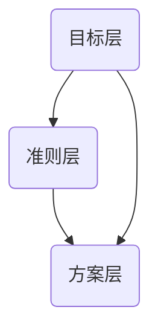
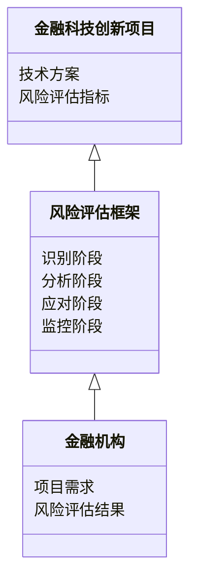
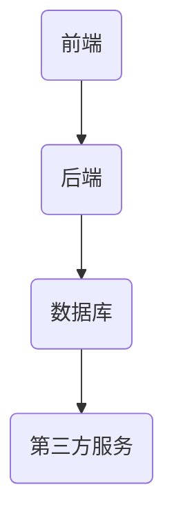

                 


# 《金融科技创新项目风险评估框架》

> 关键词：金融科技创新、风险评估、层次分析法、系统架构、风险管理

> 摘要：金融科技创新正在迅速改变金融行业，但也带来了复杂的风险。本文提出了一个系统化的风险评估框架，涵盖了从背景分析到实际应用的全过程。通过层次分析法和系统架构设计，结合Python实现，提供了一套评估金融科技创新项目风险的解决方案。

---

# 第1章: 金融科技创新与风险评估背景

## 1.1 金融科技创新的现状与趋势

### 1.1.1 金融科技创新的定义与内涵

金融科技创新是指利用新兴技术（如人工智能、区块链、大数据等）对传统金融服务进行创新和优化的过程。其核心在于通过技术手段提升金融效率、降低成本、增强用户体验，并推动金融业务模式的变革。

### 1.1.2 金融科技创新的核心驱动力

- **技术驱动**：人工智能、大数据、区块链等技术的快速发展为金融创新提供了强大动力。
- **市场需求**：用户对个性化、便捷化金融服务的需求不断增长。
- **政策支持**：各国政府通过政策引导和扶持，推动金融科技创新。

### 1.1.3 金融科技创新的典型应用场景

- **智能投顾**：通过AI算法为用户提供个性化的投资建议。
- **区块链金融**：应用于跨境支付、供应链金融等领域，提升效率和透明度。
- **大数据风控**：利用大数据分析技术进行信用评估和风险控制。

## 1.2 金融科技创新项目风险评估的必要性

### 1.2.1 金融科技创新面临的潜在风险

- **技术风险**：技术创新可能面临技术瓶颈或系统漏洞。
- **市场风险**：市场需求不确定可能导致项目失败。
- **监管风险**：金融创新可能面临法律法规的不确定性。
- **操作风险**：系统运行中的操作失误可能导致重大损失。

### 1.2.2 风险评估在金融科技创新中的作用

- **降低风险**：通过风险评估提前发现潜在问题，减少损失。
- **优化决策**：为项目决策提供数据支持，提高决策的科学性。
- **增强竞争力**：通过风险控制提升金融机构的核心竞争力。

### 1.2.3 金融科技创新项目风险的复杂性与动态性

- **复杂性**：金融创新涉及技术、市场、监管等多方面因素，风险来源多样。
- **动态性**：随着市场和技术的变化，风险因素也在不断变化。

## 1.3 金融科技创新项目风险评估框架的定义与边界

### 1.3.1 风险评估框架的定义

金融科技创新项目风险评估框架是一种系统化的方法，用于识别、分析和评估金融科技创新项目中的各种风险，并制定相应的应对策略。

### 1.3.2 金融科技创新项目风险的边界与外延

- **边界**：主要关注项目实施过程中可能面临的技术、市场和操作风险。
- **外延**：扩展至项目生命周期的各个阶段，从需求分析到项目上线后的监控。

### 1.3.3 框架的核心要素与组成结构

- **识别阶段**：识别潜在风险因素。
- **分析阶段**：评估风险的影响和概率。
- **应对阶段**：制定风险应对策略。
- **监控阶段**：持续监控风险变化。

---

# 第2章: 核心概念与联系

## 2.1 金融科技创新的属性特征对比

| 概念       | 技术驱动 | 创新性 | 风险性 |
|------------|----------|--------|--------|
| 金融科技创新 | 高       | 高     | 中高    |
| 风险评估    | 低       | 中     | 高      |

## 2.2 实体关系图

```mermaid
er
  actor: 金融机构
  actor: 监管机构
  actor: 技术供应商
  entity: 金融科技创新项目
  entity: 风险评估指标
  entity: 风险评估结果
  relation: 金融机构 -> 金融科技创新项目
  relation: 金融机构 -> 风险评估指标
  relation: 监管机构 -> 风险评估指标
  relation: 技术供应商 -> 金融科技创新项目
```

---

# 第3章: 风险评估算法原理

## 3.1 层次分析法（AHP）原理

层次分析法是一种常用的决策分析方法，适用于多因素决策问题。

### 3.1.1 层次分析法的步骤

1. **建立层次结构模型**：将问题分解为目标层、准则层和方案层。
2. **构造比较矩阵**：根据专家意见构造各层次的比较矩阵。
3. **计算权重**：通过一致性检验计算各层次的权重。
4. **计算综合得分**：根据权重计算各方案的综合得分，选择最优方案。

### 3.1.2 层次分析法的流程图



### 3.1.3 层次分析法的数学模型

$$ A = \{a_{ij}\} \quad (i,j=1,2,...,n) $$

其中，$a_{ij}$ 表示第 $i$ 个准则对第 $j$ 个方案的相对重要性。

---

## 3.2 层次分析法的Python实现

```python
import numpy as np

def ahp(matrix, weights):
    normalized = matrix / matrix.sum(axis=0)
    weighted = normalized * weights
    total = weighted.sum(axis=1)
    return total

# 示例
matrix = np.array([
    [1, 3, 2],
    [2, 1, 3],
    [3, 2, 1]
])
weights = np.array([0.5, 0.3, 0.2])
result = ahp(matrix, weights)
print(result)
```

---

# 第4章: 系统分析与架构设计方案

## 4.1 系统功能设计

### 4.1.1 领域模型类图



### 4.1.2 系统架构图



---

# 第5章: 项目实战

## 5.1 环境安装

```bash
pip install numpy
pip install matplotlib
```

---

## 5.2 核心代码实现

```python
import numpy as np

def risk_assessment(matrix):
    normalized = matrix / matrix.sum(axis=0)
    total = normalized.sum(axis=1)
    return total

# 示例
matrix = np.array([
    [0.1, 0.2, 0.7],
    [0.2, 0.6, 0.2],
    [0.7, 0.2, 0.1]
])
result = risk_assessment(matrix)
print(result)
```

---

## 5.3 案例分析

### 5.3.1 案例背景

某银行计划推出一款基于AI的智能投顾产品。

### 5.3.2 案例分析步骤

1. **风险识别**：识别技术风险、市场风险和操作风险。
2. **风险评估**：使用层次分析法评估各风险的影响。
3. **风险应对**：制定相应的风险管理策略。

---

# 第6章: 最佳实践

## 6.1 小结

金融科技创新项目风险评估框架为金融机构提供了一套系统化的解决方案，能够有效降低风险，提高项目成功率。

## 6.2 注意事项

- **数据准确性**：确保输入数据的准确性和完整性。
- **模型适用性**：选择适合的评估模型，避免过度复杂化。
- **持续监控**：定期更新风险评估结果，适应市场变化。

## 6.3 未来趋势

- **智能化**：利用AI技术进一步提升风险评估的准确性。
- **多元化**：结合多种评估方法，提高评估结果的全面性。

---

# 作者

作者：AI天才研究院/AI Genius Institute & 禅与计算机程序设计艺术 /Zen And The Art of Computer Programming

