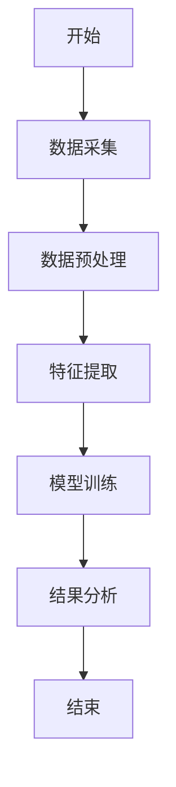
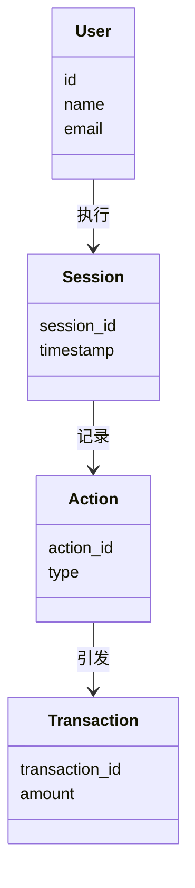
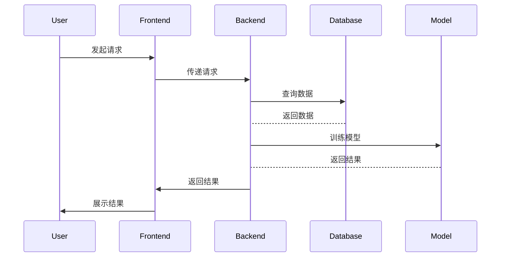

                 


# 金融科技用户行为分析平台

## 关键词
金融科技、用户行为分析、大数据分析、机器学习、系统架构设计

## 摘要
本文系统介绍了金融科技用户行为分析平台的构建过程，从背景分析、核心概念、算法原理到系统架构设计，再到项目实战，详细阐述了平台的实现方法和应用场景。通过本文，读者可以全面了解如何利用大数据和机器学习技术，对金融平台用户的在线行为进行分析和建模，为精准营销和风险控制提供数据支持。

---

## 第一部分: 金融科技用户行为分析平台背景与概述

## 第1章: 金融科技用户行为分析平台概述

### 1.1 金融科技用户行为分析的背景与意义
#### 1.1.1 金融科技的发展现状
金融科技（FinTech）近年来发展迅速，尤其是在互联网、大数据和人工智能技术的推动下，金融行业的数字化转型成为趋势。传统的金融服务模式逐渐被智能化、个性化服务所取代，用户行为分析在其中扮演着重要角色。

#### 1.1.2 用户行为分析在金融领域的应用价值
用户行为分析通过对用户在金融平台上的行为数据进行挖掘，可以发现用户的使用习惯、偏好和潜在需求，从而帮助金融机构进行精准营销、风险控制和产品优化。

#### 1.1.3 金融科技用户行为分析平台的目标与意义
平台的目标是通过收集和分析用户行为数据，构建用户行为模型，挖掘用户行为特征，为金融机构提供数据支持和决策依据。其意义在于提升用户体验、优化运营策略和提高业务效率。

### 1.2 问题背景与问题描述
#### 1.2.1 金融科技中的用户行为分析需求
随着金融平台的用户数量激增，如何高效地收集、处理和分析用户行为数据，成为金融机构面临的重要挑战。

#### 1.2.2 当前用户行为分析的主要挑战
数据量大、数据类型多样、分析模型复杂是当前用户行为分析的主要挑战。此外，如何在保护用户隐私的前提下进行数据分析也是亟待解决的问题。

#### 1.2.3 问题解决的必要性与可行性
用户行为分析能够帮助金融机构更好地理解用户需求，提升服务质量，降低风险。通过技术手段，如大数据处理和机器学习算法，问题解决是完全可行的。

### 1.3 问题解决与边界定义
#### 1.3.1 问题解决的核心思路
通过对用户行为数据的采集、处理、建模和分析，提取用户行为特征，构建用户画像，为金融机构提供决策支持。

#### 1.3.2 平台的边界与外延
平台的主要功能包括数据采集、数据处理、特征提取、模型训练和结果展示。边界在于不涉及具体的业务决策，而是为决策提供数据支持。

#### 1.3.3 核心功能与非功能需求
核心功能包括数据采集模块、数据处理模块、特征提取模块、模型训练模块和结果展示模块。非功能需求包括高可用性、数据安全性、可扩展性等。

### 1.4 核心概念与系统架构
#### 1.4.1 核心概念的定义与属性
- 用户：金融平台的使用用户。
- 会话：用户与金融平台之间的交互过程。
- 动作：用户在平台上的具体操作，如点击、提交等。
- 交易：用户在平台上的具体业务操作，如支付、转账等。

#### 1.4.2 实体关系图（ER图）

```mermaid
er
    title 金融科技用户行为分析平台 ER 图
    User [name, id, email, password]
    Session [session_id, timestamp, duration]
    Action [action_id, type, description]
    Transaction [transaction_id, amount, status]
    User --> Session: 执行
    Session --> Action: 记录
    Action --> Transaction: 引发
```

---

## 第2章: 核心概念与系统架构

### 2.1 核心概念与原理
#### 2.1.1 用户行为分析的核心原理
用户行为分析通过收集用户在平台上的行为数据，利用数据挖掘和机器学习技术，提取用户行为特征，构建用户画像，从而帮助金融机构进行精准营销和风险控制。

#### 2.1.2 数据采集与处理的关键步骤
1. 数据采集：通过日志记录用户行为数据。
2. 数据清洗：去除无效数据，处理异常值。
3. 数据转换：将数据转换为适合建模的格式。
4. 数据存储：将处理后的数据存储在数据库中。

#### 2.1.3 用户行为分析的算法选择
根据具体需求选择合适的算法，如协同过滤、聚类和分类等。

### 2.2 核心概念对比与ER图分析
#### 2.2.1 核心概念的属性对比表

| 概念   | 属性                 |
|--------|----------------------|
| 用户   | id, name, email      |
| 会话   | session_id, timestamp|
| 动作   | action_id, type      |
| 交易   | transaction_id, amount|

#### 2.2.2 ER图的详细分析
通过ER图可以看出，用户通过会话执行动作，动作引发交易。这种关系帮助我们理解用户行为的流程和数据之间的关联性。

### 2.3 系统架构设计
#### 2.3.1 系统功能模块划分
- 数据采集模块：负责采集用户行为数据。
- 数据处理模块：对数据进行清洗和转换。
- 特征提取模块：提取用户行为特征。
- 模型训练模块：基于特征训练用户行为模型。
- 结果展示模块：展示分析结果。

#### 2.3.2 系统架构的分层设计
系统架构分为数据层、业务逻辑层和用户界面层。数据层负责数据的存储和管理，业务逻辑层负责数据处理和模型训练，用户界面层负责结果展示。

---

## 第3章: 用户行为分析算法原理

### 3.1 算法原理概述
用户行为分析常用的算法包括协同过滤、聚类和分类等。协同过滤通过用户行为的相似性推荐相关内容，聚类用于将用户分为不同的群体，分类用于预测用户的行为类别。

### 3.2 算法流程图



### 3.3 算法实现代码
以下是一个基于协同过滤的用户行为分析算法的示例代码：

```python
def user_behavior_analysis(data):
    # 数据预处理
    processed_data = preprocess(data)
    # 特征提取
    features = extract_features(processed_data)
    # 模型训练
    model = train_model(features)
    # 结果分析
    results = analyze_results(model, features)
    return results
```

---

## 第4章: 系统分析与架构设计

### 4.1 问题场景介绍
金融机构需要通过用户行为分析平台来提升用户体验和风险控制能力。

### 4.2 项目介绍
本项目旨在构建一个用户行为分析平台，帮助金融机构进行用户行为建模和分析。

### 4.3 系统功能设计

#### 4.3.1 领域模型类图



#### 4.3.2 系统架构图

```mermaid
docker
    title 金融科技用户行为分析平台架构图
    frontend --> backend: 发送请求
    backend --> database: 查询数据
    backend --> model: 训练模型
    model --> results: 输出结果
    results --> frontend: 展示结果
```

#### 4.3.3 系统接口设计
- 数据采集接口：接收用户行为数据。
- 数据处理接口：对数据进行清洗和转换。
- 模型训练接口：基于特征训练用户行为模型。
- 结果展示接口：展示分析结果。

#### 4.3.4 系统交互序列图



---

## 第5章: 项目实战

### 5.1 环境安装
安装必要的开发环境和工具，如Python、Jupyter Notebook、数据库等。

### 5.2 系统核心实现源代码
以下是用户行为分析平台的核心实现代码示例：

```python
import pandas as pd
from sklearn.cluster import KMeans

# 数据加载
data = pd.read_csv('user_behavior.csv')

# 数据预处理
data.dropna(inplace=True)

# 特征提取
features = data[['clicks', 'time_spent', 'transactions']]

# 模型训练
model = KMeans(n_clusters=3, random_state=0)
model.fit(features)

# 结果分析
labels = model.labels_
print(labels)
```

### 5.3 代码应用解读与分析
代码首先加载数据，然后进行数据清洗，提取特征后训练聚类模型，最后输出用户的簇标签。

### 5.4 实际案例分析和详细讲解剖析
以一个具体案例为例，分析用户行为特征，并根据结果进行业务决策。

### 5.5 项目小结
总结项目实现的过程，指出优缺点，提出改进建议。

---

## 小结
通过本文的详细讲解，读者可以系统地了解金融科技用户行为分析平台的构建过程，从理论到实践，为金融机构提供高效的数据支持和决策依据。

---

## 最佳实践 tips
- 数据隐私保护是用户行为分析的重要考虑因素。
- 在实际应用中，建议结合业务需求选择合适的算法。
- 定期更新模型，以适应用户行为的变化。

---

## 注意事项
- 数据处理过程中要注意数据安全，避免数据泄露。
- 模型训练时要确保数据的代表性和多样性。

---

## 拓展阅读
1. 《大数据分析与机器学习》
2. 《用户行为分析实战》
3. 《系统架构设计指南》

---

## 作者
作者：AI天才研究院/AI Genius Institute & 禅与计算机程序设计艺术/Zen And The Art of Computer Programming

