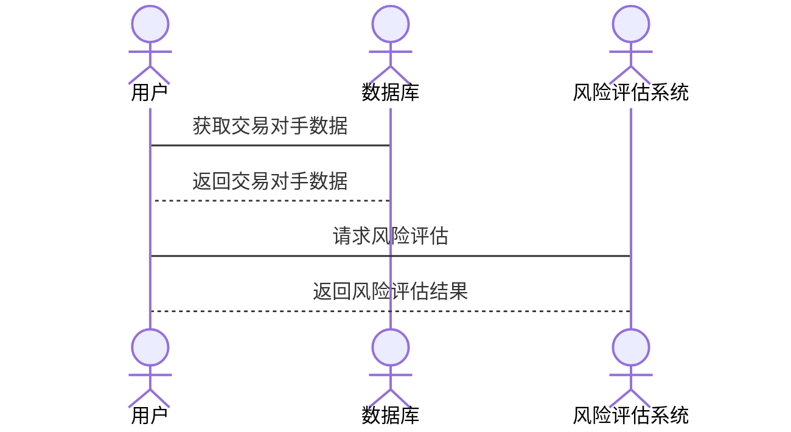

                 


# 金融衍生品交易对手风险评估

## 关键词
- 金融衍生品
- 交易对手风险
- 风险评估
- 信用风险
- VaR
- CVaR

## 摘要
金融衍生品交易对手风险评估是金融风险管理中的重要环节，旨在通过量化交易对手的信用风险，帮助机构有效控制和规避潜在的财务损失。本文详细介绍了交易对手风险的核心概念、评估方法、算法原理、系统架构设计以及实际项目案例，为读者提供从理论到实践的全面指导。

---

# 第1章: 交易对手风险评估的背景与概念

## 1.1 交易对手风险的定义与背景

### 1.1.1 金融衍生品的基本概念
金融衍生品是基于基础资产（如股票、债券、货币等）的金融合约，其价值来源于基础资产的价格波动。常见的金融衍生品包括期货、期权、掉期和远期合约。

### 1.1.2 交易对手风险的定义
交易对手风险是指在金融交易中，交易对手未能履行其合同义务而导致的损失风险。在金融衍生品交易中，这种风险尤为突出，因为合约的履行依赖于双方的信用状况。

### 1.1.3 交易对手风险的重要性
金融衍生品的杠杆效应放大了交易对手风险，一旦交易对手违约，可能导致巨大的财务损失。因此，准确评估交易对手风险是金融机构风险管理的核心任务之一。

---

## 1.2 交易对手风险评估的核心概念

### 1.2.1 交易对手风险的分类
交易对手风险可以分为信用风险和市场风险两大类。信用风险是指交易对手因信用问题而违约的风险，市场风险则是指因市场价格波动导致交易对手无法履行合约的风险。

### 1.2.2 交易对手风险的影响因素
- **信用状况**：交易对手的信用评级和历史违约记录。
- **市场环境**：宏观经济环境和市场波动性。
- **合约条款**：合约的期限、金额和条件。

### 1.2.3 交易对手风险评估的目标
通过量化交易对手的信用风险，帮助金融机构制定合理的风险管理策略，降低潜在的财务损失。

---

## 1.3 交易对手风险与信用风险的对比

### 1.3.1 信用风险的定义与特点
信用风险是指交易对手因自身财务状况恶化或违约而导致的损失风险。它是交易对手风险的重要组成部分，但不包括市场风险等因素。

### 1.3.2 交易对手风险与信用风险的异同
- **相同点**：两者都涉及交易对手的信用状况。
- **不同点**：交易对手风险还包括市场风险等因素，而信用风险主要关注交易对手的信用状况。

### 1.3.3 交易对手风险的独特性
交易对手风险不仅包括信用风险，还包括因市场波动、法律风险等多种因素导致的风险，因此在评估时需要综合考虑多种因素。

---

## 1.4 交易对手风险评估的框架

### 1.4.1 交易对手风险评估的基本流程
1. **数据收集**：收集交易对手的信用评级、历史违约记录等数据。
2. **风险量化**：使用VaR、CVaR等方法量化交易对手的风险。
3. **风险分析**：分析风险来源，并制定相应的风险管理策略。

### 1.4.2 交易对手风险评估的关键步骤
- 数据清洗与预处理
- 风险模型的选择与构建
- 风险结果的解释与应用

### 1.4.3 交易对手风险评估的边界与外延
- 交易对手风险的范围：仅限于金融衍生品交易中的风险。
- 外延：包括信用风险、市场风险等其他相关风险。

---

## 1.5 本章小结
本章介绍了交易对手风险的基本概念、分类、影响因素和评估框架，为后续的深入分析奠定了基础。

---

# 第2章: 交易对手风险评估的核心概念与联系

## 2.1 交易对手信用风险的量化方法

### 2.1.1 交易对手信用风险的度量指标
- **违约概率（PD）**：交易对手在一定时间内的违约概率。
- **损失给定违约率（LGD）**：在交易对手违约时，机构可能遭受的损失比例。
- **风险敞口**：机构在交易对手违约时的潜在损失金额。

### 2.1.2 交易对手信用风险的数学模型
$$ \text{风险敞口} = \text{违约概率} \times \text{损失给定违约率} \times \text{合约金额} $$

### 2.1.3 交易对手信用风险的评估公式
$$ \text{信用风险} = \text{PD} \times \text{LGD} \times \text{合约金额} $$

---

## 2.2 交易对手风险评估的框架模型

### 2.2.1 交易对手风险评估的三要素模型
- **PD**：违约概率
- **LGD**：损失给定违约率
- **EAD**：风险敞口

### 2.2.2 交易对手风险评估的五要素模型
- **PD**：违约概率
- **LGD**：损失给定违约率
- **EAD**：风险敞口
- **R**：相关性
- **VaR**：在险价值

### 2.2.3 交易对手风险评估的综合模型
通过整合PD、LGD、VaR等指标，构建综合风险评估模型。

---

## 2.3 交易对手风险评估的核心要素

### 2.3.1 交易对手的信用评级
信用评级是评估交易对手信用风险的重要指标，常用的评级机构包括穆迪、标普和惠誉。

### 2.3.2 交易对手的违约概率
违约概率是交易对手在一定时间内的违约可能性，可以通过历史数据和统计模型进行估计。

### 2.3.3 交易对手的损失给定违约率
损失给定违约率是交易对手违约时，机构可能遭受的损失比例，通常基于历史数据和行业标准进行估算。

---

## 2.4 交易对手风险评估的实体关系图

### 2.4.1 实体关系图的定义与作用
实体关系图（ER图）用于描述系统中各实体之间的关系，帮助理解系统的数据结构。

### 2.4.2 交易对手风险评估的ER图
```mermaid
erDiagram
    actor 交易对手 {
        <string> ID
        <string> 名称
        <string> 信用评级
        <float> 违约概率
        <float> 损失给定违约率
    }
    actor 风险评估系统 {
        <string> 评估ID
        <float> 风险敞口
        <float> 在险价值
    }
    risk-Assessment_交易对手风险评估系统 --> 交易对手
```

### 2.4.3 交易对手风险评估的实体关系图分析
通过ER图可以看出，交易对手和风险评估系统之间的关系，以及各实体的关键属性。

---

## 2.5 本章小结
本章详细介绍了交易对手风险评估的核心概念和模型，为后续的算法实现奠定了理论基础。

---

# 第3章: 交易对手风险评估的算法原理

## 3.1 交易对手信用风险的度量算法

### 3.1.1 VaR（Value at Risk）算法
VaR是一种常用的金融风险度量方法，用于估计在一定置信水平下，资产组合的最大可能损失。

#### VaR算法步骤
1. 收集历史市场价格数据。
2. 计算资产组合的历史收益率分布。
3. 确定置信水平，找到对应的分位数。
4. 计算 VaR 值。

#### VaR 算法示例
```python
import numpy as np

# 假设收益率数据
returns = np.array([0.01, -0.02, 0.03, -0.01, 0.02])

# 计算 VaR
np.random.seed(42)
simulations = 10000
VaR = np.quantile(-returns, 0.95)

print(f"VaR 在 95% 置信水平下为: {VaR}")
```

### 3.1.2 CVaR（Conditional Value at Risk）算法
CVaR 是 VaR 的扩展，用于估计在 VaR 水平上的平均损失。

#### CVaR 算法步骤
1. 计算 VaR。
2. 计算 VaR 水平以上的平均损失。

#### CVaR 示例
```python
import numpy as np

# 假设收益率数据
returns = np.array([0.01, -0.02, 0.03, -0.01, 0.02])

# 计算 CVaR
np.random.seed(42)
simulations = 10000
VaR = np.quantile(-returns, 0.95)
CVar = np.mean(returns[returns <= -VaR])

print(f"CVar 在 95% 置信水平下为: {CVar}")
```

### 3.1.3 CreditMetrics 模型
CreditMetrics 是一种基于统计方法的信用风险模型，用于估计资产组合的信用风险。

#### CreditMetrics 模型步骤
1. 确定资产组合的信用评级。
2. 计算各资产的违约概率和损失给定违约率。
3. 计算资产组合的总信用风险。

---

## 3.2 交易对手信用风险的分类算法

### 3.2.1 交易对手信用风险的分类方法
- **聚类分析**：将交易对手按信用风险特征进行聚类。
- **决策树模型**：基于交易对手的信用特征进行分类。

### 3.2.2 交易对手信用风险的分类流程
1. 数据预处理。
2. 特征选择。
3. 模型训练。
4. 模型评估。

### 3.2.3 交易对手信用风险的分类示例
```python
from sklearn.tree import DecisionTreeClassifier
from sklearn.model_selection import train_test_split
from sklearn.metrics import accuracy_score

# 假设数据集
X = [[特征1, 特征2, ...], ...]
y = [标签, ...]

# 划分训练集和测试集
X_train, X_test, y_train, y_test = train_test_split(X, y, test_size=0.3)

# 训练决策树模型
model = DecisionTreeClassifier()
model.fit(X_train, y_train)

# 预测并评估
y_pred = model.predict(X_test)
print(f"准确率: {accuracy_score(y_test, y_pred)}")
```

---

## 3.3 交易对手风险评估的算法实现

### 3.3.1 算法实现步骤
1. 数据清洗与预处理。
2. 选择合适的算法模型。
3. 训练模型并进行预测。
4. 结果分析与优化。

### 3.3.2 算法实现示例
```python
import numpy as np
import pandas as pd
from sklearn.ensemble import RandomForestClassifier

# 假设数据集
data = pd.DataFrame({
    '交易对手ID': [1, 2, 3, 4, 5],
    '信用评级': ['A', 'B', 'A', 'C', 'B'],
    '违约概率': [0.02, 0.05, 0.03, 0.1, 0.07],
    '损失给定违约率': [0.4, 0.3, 0.45, 0.2, 0.35]
})

# 数据预处理
data['信用评级'] = pd.factorize(data['信用评级'])[0]

# 训练模型
model = RandomForestClassifier()
model.fit(data[['信用评级', '违约概率']], data['损失给定违约率'])

# 预测
new_data = pd.DataFrame({
    '信用评级': [1],
    '违约概率': [0.04]
})
prediction = model.predict(new_data[['信用评级', '违约概率']])
print(f"预测的损失给定违约率: {prediction}")
```

---

## 3.4 本章小结
本章详细介绍了交易对手风险评估的主要算法，包括VaR、CVaR和CreditMetrics模型，并通过代码示例展示了这些算法的实现过程。

---

# 第4章: 交易对手风险评估的系统分析与架构设计

## 4.1 系统功能设计

### 4.1.1 系统功能模块
- 数据采集模块
- 风险评估模块
- 结果展示模块

### 4.1.2 系统功能流程
1. 数据采集：收集交易对手的信用评级、违约概率等数据。
2. 风险评估：使用VaR、CVaR等算法进行风险评估。
3. 结果展示：生成风险报告并展示给用户。

---

## 4.2 系统架构设计

### 4.2.1 系统架构图


### 4.2.2 系统接口设计
- 数据接口：与数据库或其他数据源对接。
- 用户接口：供用户输入参数和查看结果。

### 4.2.3 系统交互设计


---

## 4.3 系统实现

### 4.3.1 环境配置
- 安装必要的库：如NumPy、Pandas、Scikit-learn等。
- 配置数据源：连接数据库或其他数据源。

### 4.3.2 核心实现代码
```python
import numpy as np
import pandas as pd
from sklearn.ensemble import RandomForestClassifier

# 数据加载
data = pd.read_csv('交易对手数据.csv')

# 数据预处理
data['信用评级'] = pd.factorize(data['信用评级'])[0]

# 模型训练
model = RandomForestClassifier()
model.fit(data[['信用评级', '违约概率']], data['损失给定违约率'])

# 预测
new_data = pd.DataFrame({
    '信用评级': [1],
    '违约概率': [0.04]
})
prediction = model.predict(new_data[['信用评级', '违约概率']])
print(f"预测的损失给定违约率: {prediction}")
```

---

## 4.4 本章小结
本章详细介绍了交易对手风险评估系统的功能设计、架构设计和实现过程，为实际应用提供了参考。

---

# 第5章: 交易对手风险评估的项目实战

## 5.1 项目背景与目标

### 5.1.1 项目背景
某金融机构需要评估其交易对手的信用风险，以降低潜在的财务损失。

### 5.1.2 项目目标
- 建立交易对手信用风险评估模型。
- 提供风险报告，帮助机构制定风险管理策略。

---

## 5.2 数据收集与预处理

### 5.2.1 数据来源
- 交易对手的历史交易数据。
- 交易对手的信用评级数据。
- 市场数据，如利率和汇率。

### 5.2.2 数据清洗
- 去除缺失值。
- 标准化数据格式。

---

## 5.3 模型实现与分析

### 5.3.1 模型选择
选择随机森林模型进行交易对手信用风险分类。

### 5.3.2 模型实现
```python
from sklearn.ensemble import RandomForestClassifier

# 数据加载与预处理
data = pd.read_csv('交易对手数据.csv')
data['信用评级'] = pd.factorize(data['信用评级'])[0]

# 划分训练集和测试集
X = data[['信用评级', '违约概率']]
y = data['损失给定违约率']
X_train, X_test, y_train, y_test = train_test_split(X, y, test_size=0.3)

# 模型训练
model = RandomForestClassifier()
model.fit(X_train, y_train)

# 模型评估
print(f"准确率: {model.score(X_test, y_test)}")
```

### 5.3.3 模型分析
- 准确率：模型在测试集上的准确率。
- 特征重要性：分析信用评级和违约概率对模型的影响。

---

## 5.4 实际案例分析

### 5.4.1 案例背景
某金融机构与交易对手A进行衍生品交易，需评估A的信用风险。

### 5.4.2 数据分析
- 交易对手A的信用评级为B。
- 违约概率为0.05。
- 损失给定违约率为0.3。

### 5.4.3 风险评估
通过模型预测，交易对手A的信用风险为中等，机构应采取相应的风险管理措施。

---

## 5.5 本章小结
本章通过实际案例展示了交易对手风险评估的全过程，从数据收集到模型实现，再到结果分析，为读者提供了实践指导。

---

# 第6章: 交易对手风险评估的最佳实践与小结

## 6.1 最佳实践

### 6.1.1 数据质量管理
确保数据的完整性和准确性，避免因数据问题导致评估结果偏差。

### 6.1.2 模型选择与优化
根据具体场景选择合适的模型，并通过交叉验证等方法进行优化。

### 6.1.3 结果解释与应用
将评估结果应用于实际风险管理，定期更新模型和数据。

---

## 6.2 小结

### 6.2.1 交易对手风险评估的核心内容
- 交易对手信用风险的量化方法。
- 风险评估模型的选择与实现。
- 系统架构设计与实现。

### 6.2.2 交易对手风险评估的未来方向
- 结合人工智能技术，提高风险评估的准确性和效率。
- 推动交易对手风险评估的标准化和国际化。

---

## 6.3 注意事项

### 6.3.1 数据隐私与安全
在数据收集和处理过程中，必须遵守相关法律法规，保护数据隐私。

### 6.3.2 模型的可解释性
选择可解释性强的模型，便于结果分析和决策制定。

### 6.3.3 模型的实时性
在金融市场中，实时性是交易对手风险评估的重要指标，需确保模型能够快速响应市场变化。

---

## 6.4 拓展阅读

### 6.4.1 推荐书籍
- 《信用风险建模》
- 《金融衍生品与风险管理》

### 6.4.2 推荐论文
- "Credit Risk Modeling Using Machine Learning"
- "Advances in Risk Management Techniques"

---

# 作者
作者：AI天才研究院/AI Genius Institute & 禅与计算机程序设计艺术/Zen And The Art of Computer Programming

