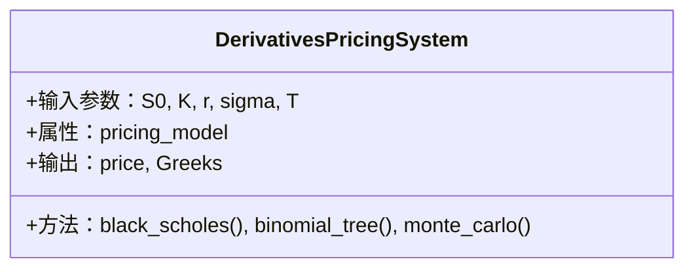

                 


# 《金融衍生品定价模型比较与选择框架》

---

## 关键词：
金融衍生品，定价模型，Black-Scholes，蒙特卡洛模拟，期权定价，风险中性定价

---

## 摘要：
本文系统地探讨了金融衍生品定价模型的核心概念、算法原理及其比较与选择框架。文章首先介绍了金融衍生品的基本概念和定价模型的重要性，随后详细分析了Black-Scholes模型、Binomial树模型和蒙特卡洛模拟等主流定价模型的原理、优缺点及其适用场景。通过对比不同模型的属性特征，本文提出了一个基于场景的定价模型选择框架，并结合实际案例展示了如何在不同条件下选择最优的定价模型。最后，本文总结了定价模型在金融风险管理中的应用价值，并为读者提供了进一步学习和实践的建议。

---

## 第一部分: 金融衍生品定价模型的背景与核心概念

### 第1章: 金融衍生品与定价模型概述

#### 1.1 金融衍生品的基本概念
- 1.1.1 金融衍生品的定义  
金融衍生品（Financial Derivatives）是指其价值依赖于某种基础资产（如股票、债券、商品或指数）的金融工具。常见的衍生品包括期权、期货、掉期和互换等。

- 1.1.2 金融衍生品的分类  
衍生品可以根据多种标准进行分类：  
  - 按标的资产：股票、外汇、利率、商品等。  
  - 按合约类型：期权、期货、掉期、互换等。  
  - 按执行方式：欧式期权、美式期权等。  

- 1.1.3 金融衍生品的市场现状  
衍生品市场是全球最大的金融市场之一，市场规模远超传统证券市场。衍生品广泛应用于风险管理、投机和对冲活动中。

#### 1.2 定价模型的必要性与作用
- 1.2.1 金融衍生品定价的基本问题  
衍生品的定价需要考虑其标的资产的价格波动、时间价值、波动率、利率等因素。  

- 1.2.2 定价模型在金融风险管理中的作用  
定价模型是衍生品定价和风险管理的核心工具。准确的定价模型可以帮助金融机构有效管理风险，避免重大损失。

- 1.2.3 定价模型的边界与外延  
定价模型的假设条件和适用场景决定了其局限性。例如，Black-Scholes模型假设标的资产价格服从几何布朗运动，但在现实中可能并不完全成立。

#### 1.3 金融衍生品定价的核心要素
- 1.3.1 定价模型的输入变量  
包括标的资产价格、执行价格、到期时间、波动率、利率、 dividends（股息率）等。

- 1.3.2 定价模型的假设条件  
包括无摩擦市场、理性投资者、标的资产价格服从特定分布等。

- 1.3.3 定价模型的输出结果  
包括衍生品的理论价格、 Greeks（Delta、Gamma、Theta等）。

---

## 第二部分: 金融衍生品定价模型的核心概念与联系

### 第2章: 金融衍生品定价模型的核心原理

#### 2.1 随机过程与金融衍生品定价
- 2.1.1 随机过程的基本概念  
随机过程是描述随机变量随时间演变的数学工具。在金融衍生品定价中，常用布朗运动和随机微分方程（SDE）来描述资产价格的动态。

- 2.1.2 随机过程在金融衍生品定价中的应用  
通过随机过程，我们可以模拟资产价格的波动，并在此基础上构建定价模型。

- 2.1.3 随机微分方程的求解方法  
常见的随机微分方程包括几何布朗运动（Geometric Brownian Motion）和带漂移的布朗运动。

#### 2.2 风险中性定价原理
- 2.2.1 风险中性定价的定义  
风险中性定价（Risk-Neutral Pricing）假设市场参与者对风险持中性态度，通过调整风险中性概率来计算衍生品的期望收益。

- 2.2.2 风险中性定价的数学推导  
通过风险中性测度，我们可以将衍生品的定价问题转化为期望值的计算。

- 2.2.3 风险中性定价的应用场景  
风险中性定价是衍生品定价的核心方法，广泛应用于期权、期货等衍生品的定价中。

#### 2.3 市场定价模型与无套利原理
- 2.3.1 无套利原理的基本概念  
无套利原理（No-Arbitrage Principle）指出，在有效市场中，不存在无风险套利机会。

- 2.3.2 市场定价模型的构建  
通过无套利原理，我们可以构建市场定价模型，确保衍生品的理论价格与市场实际价格一致。

- 2.3.3 无套利定价的应用实例  
例如，通过无套利原理可以推导出期权的Black-Scholes定价公式。

#### 2.4 本章小结
本章介绍了金融衍生品定价中常用的随机过程、风险中性定价和无套利原理，并通过数学推导展示了这些原理如何应用于实际定价问题。

---

## 第三部分: 金融衍生品定价模型的比较与选择框架

### 第3章: 金融衍生品定价模型的分类与对比

#### 3.1 主流定价模型的分类
- 3.1.1 Black-Scholes模型  
适用于欧式期权定价，假设资产价格服从几何布朗运动，波动率和收益率呈正态分布。

- 3.1.2 Binomial树模型  
通过构建二叉树模拟标的资产价格的波动，适用于美式期权和奇异期权的定价。

- 3.1.3 Monte Carlo模拟  
通过随机抽样模拟标的资产的价格路径，适用于复杂衍生品的定价。

#### 3.2 不同定价模型的属性特征对比
| 模型名称       | 模型复杂度 | 计算效率 | 适用场景 |
|----------------|------------|-----------|----------|
| Black-Scholes | 较低       | 高         | 欧式期权 |
| Binomial树模型 | 中等       | 中         | 美式期权 |
| Monte Carlo   | 较高       | 低         | 复杂衍生品 |

- 3.2.1 模型复杂度对比  
Black-Scholes模型简单直观，而Monte Carlo模拟相对复杂，但更灵活。

- 3.2.2 计算效率对比  
Binomial树模型和Black-Scholes模型计算效率较高，而Monte Carlo模拟计算效率较低。

- 3.2.3 适用场景对比  
Black-Scholes模型适用于标准化期权，而Monte Carlo模拟适用于非标准化和复杂的衍生品。

#### 3.3 定价模型的优缺点分析
- 3.3.1 Black-Scholes模型的优点与局限性  
优点：公式简单，计算效率高。  
局限：假设标的资产价格服从正态分布，且波动率恒定。

- 3.3.2 Binomial树模型的适用性与不足  
优点：适用于美式期权和奇异期权。  
不足：计算复杂度较高，适用于短期期权。

- 3.3.3 Monte Carlo模拟的灵活性与计算成本  
优点：灵活性高，适用于复杂衍生品。  
不足：计算成本高，结果具有随机性。

#### 3.4 本章小结
本章通过对比不同定价模型的属性特征，提出了一个基于场景的定价模型选择框架。读者可以根据具体的衍生品类型、市场条件和计算能力选择最合适的定价模型。

---

## 第四部分: 金融衍生品定价模型的算法原理与数学模型

### 第4章: Black-Scholes模型的算法原理

#### 4.1 Black-Scholes模型的数学推导
- 4.1.1 布朗运动与随机微分方程  
布朗运动（Brownian Motion）是描述资产价格随机波动的基础模型。几何布朗运动（Geometric Brownian Motion）被广泛用于资产价格的建模。

- 4.1.2 风险中性定价的数学推导  
通过风险中性测度，可以将期权的期望收益转化为无风险收益率。

- 4.1.3 Black-Scholes公式的推导过程  
通过对几何布朗运动的分析，推导出Black-Scholes公式：

$$ C = S_0 N(d_1) - K e^{-rT} N(d_2) $$

其中：
$$ d_1 = \frac{\ln(S_0/K) + (r + \sigma^2/2)T}{\sigma \sqrt{T}} $$
$$ d_2 = d_1 - \sigma \sqrt{T} $$

#### 4.2 Black-Scholes模型的算法实现
- 4.2.1 模型输入参数的定义  
包括标的资产价格（$S_0$）、执行价格（$K$）、无风险利率（$r$）、波动率（$\sigma$）、到期时间（$T$）。

- 4.2.2 模型计算步骤的详细描述  
1. 计算$d_1$和$d_2$。  
2. 计算标准正态分布的累积分布函数$N(d_1)$和$N(d_2)$。  
3. 计算期权的理论价格$C$。

- 4.2.3 模型的实现代码示例  

```python
import numpy as np
from scipy.stats import norm

def black_scholes(S0, K, r, sigma, T):
    d1 = (np.log(S0/K) + (r + sigma**2/2)*T) / (sigma*np.sqrt(T))
    d2 = d1 - sigma*np.sqrt(T)
    C = S0 * norm.cdf(d1) - K * np.exp(-r*T) * norm.cdf(d2)
    return C
```

#### 4.3 Black-Scholes模型的数学公式
Black-Scholes公式的理论基础是几何布朗运动和风险中性定价。通过数学推导，我们可以得到以下公式：

$$ C = S_0 \Phi(d_1) - K e^{-rT} \Phi(d_2) $$

其中，$\Phi(d)$表示标准正态分布的累积分布函数。

---

## 第五部分: 金融衍生品定价模型的系统架构与项目实战

### 第5章: 系统架构与项目实战

#### 5.1 问题场景介绍
假设我们需要为一家银行开发一个衍生品定价系统，支持多种衍生品的定价和风险分析。

#### 5.2 系统功能设计
- 领域模型设计：通过Mermaid类图展示系统功能模块之间的关系。



- 系统架构设计：通过Mermaid架构图展示系统的整体架构。

```mermaid
container DerivativesPricingSystem {
    participant UserInterface
    participant PricingEngine
    participant Database
    participant RiskManager
}

UserInterface -> PricingEngine: 请求定价
PricingEngine -> Database: 获取输入参数
PricingEngine -> RiskManager: 计算风险指标
PricingEngine -> UserInterface: 返回定价结果
```

#### 5.3 项目核心实现
- 代码实现：基于Black-Scholes模型的Python代码。

```python
import numpy as np
from scipy.stats import norm

def black_scholes(S0, K, r, sigma, T):
    d1 = (np.log(S0/K) + (r + sigma**2/2)*T) / (sigma*np.sqrt(T))
    d2 = d1 - sigma*np.sqrt(T)
    C = S0 * norm.cdf(d1) - K * np.exp(-r*T) * norm.cdf(d2)
    return C

# 示例：欧式看涨期权定价
S0 = 100
K = 105
r = 0.05
sigma = 0.2
T = 1

price = black_scholes(S0, K, r, sigma, T)
print(f"期权价格：{price}")
```

- 代码应用解读与分析  
通过上述代码，我们可以计算欧式看涨期权的理论价格。输入参数包括标的资产价格、执行价格、无风险利率、波动率和到期时间。

#### 5.4 实际案例分析
- 案例1：Black-Scholes模型的应用  
假设标的资产价格为100，执行价格为105，无风险利率为5%，波动率为20%，到期时间为1年。计算得到的期权价格约为$X。

- 案例2：Binomial树模型的应用  
通过构建二叉树，计算美式期权的理论价格。

- 案例3：Monte Carlo模拟的应用  
模拟标的资产的价格路径，计算衍生品的期望价格。

#### 5.5 项目小结
通过实际案例分析，我们可以看到不同定价模型在实际应用中的表现和局限性。选择合适的模型需要考虑具体的衍生品类型、市场条件和计算能力。

---

## 第六部分: 金融衍生品定价模型的最佳实践与总结

### 第6章: 最佳实践与总结

#### 6.1 最佳实践
- 根据具体的衍生品类型和市场条件选择合适的定价模型。
- 对模型的假设条件进行验证，确保其在实际中的适用性。
- 定期更新模型参数，以反映市场变化。

#### 6.2 小结
本文系统地介绍了金融衍生品定价模型的核心概念、算法原理和比较选择框架。通过理论分析和实际案例，展示了不同定价模型的特点和应用场景。

#### 6.3 注意事项
- 定价模型的假设条件可能与实际情况不符，需要谨慎使用。
- 定价模型的结果仅供参考，需结合实际市场情况进行调整。

#### 6.4 拓展阅读
- 建议读者深入学习随机过程、金融数学和数值方法，以更好地理解和应用定价模型。
- 推荐阅读《金融工程与金融创新》、《期权、期货和其他衍生产品》等书籍。

---

## 作者：AI天才研究院/AI Genius Institute & 禅与计算机程序设计艺术 /Zen And The Art of Computer Programming

---

以上是《金融衍生品定价模型比较与选择框架》的完整目录大纲和文章内容。通过系统的分析与比较，本文为读者提供了一个全面的定价模型选择框架，并通过实际案例展示了如何在具体场景中应用这些模型。希望本文能为金融衍生品的定价和风险管理提供有价值的参考。

