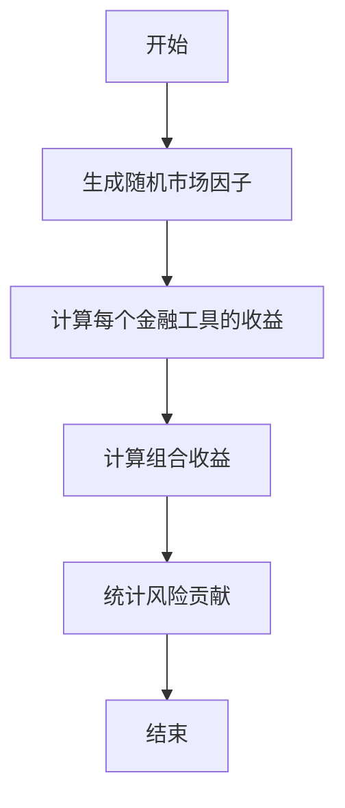
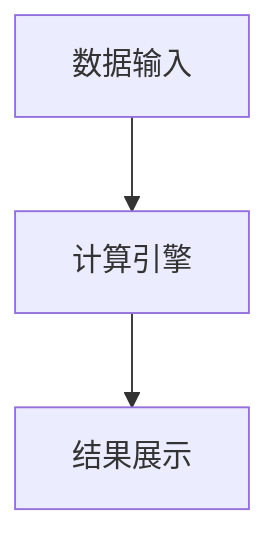
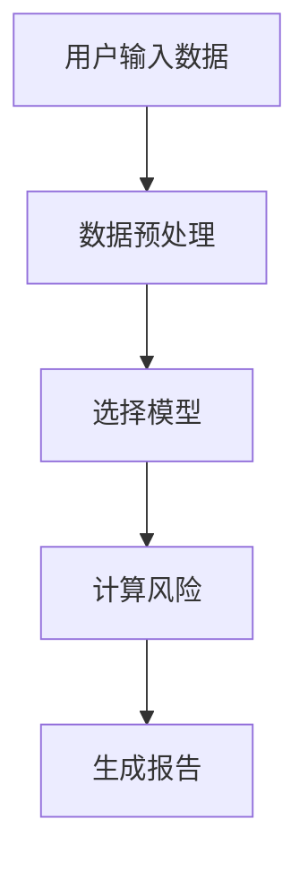

                 


# 《金融衍生品组合风险分解工具》

> 关键词：金融衍生品，风险分解，组合风险，VaR，蒙特卡洛模拟，风险管理，金融工具

> 摘要：本文介绍了一种用于金融衍生品组合风险分解的工具，详细讲解了其背景、核心概念、算法原理、系统架构、项目实战以及最佳实践。通过该工具，用户可以更好地理解和管理金融衍生品组合的风险。

---

## 第一部分: 金融衍生品组合风险分解工具概述

### 第1章: 金融衍生品组合风险分解工具的背景与概念

#### 1.1 金融衍生品的基本概念

金融衍生品是一种金融工具，其价值来源于基础资产（如股票、债券、商品等）的价格变动。常见的金融衍生品包括期货、期权、互换和远期合约等。这些工具可以用于对冲风险、投机或套利。

衍生品市场的特点是高杠杆和高风险，因此对风险的管理和分解至关重要。通过风险分解工具，投资者可以更清晰地理解不同衍生品对整体组合风险的贡献。

#### 1.2 风险分解的重要性

风险分解是将整体风险分解为各个组成部分的过程，有助于识别和量化每个金融工具对整体风险的影响。这对于优化投资组合、制定风险管理策略以及满足监管要求具有重要意义。

在金融衍生品组合中，风险分解可以帮助投资者：
- 识别哪些工具是风险的主要来源。
- 评估不同风险因子（如波动率、信用风险、利率风险）对组合的影响。
- 制定有效的对冲策略。

#### 1.3 金融衍生品组合风险分解工具的概述

金融衍生品组合风险分解工具是一种用于量化和分解金融组合风险的软件工具。它通过输入组合的构成、市场数据和模型参数，输出各个金融工具的风险贡献、VaR（Value at Risk）和潜在损失等指标。

该工具通常包括以下几个功能模块：
- 数据输入与处理：支持多种格式的金融数据输入，如持仓数据、市场数据等。
- 风险分解算法：采用蒙特卡洛模拟、历史模拟或其他统计方法进行风险计算。
- 结果展示与分析：以图表和报告形式展示风险分解结果，帮助用户理解和决策。

---

## 第二部分: 风险分解的核心概念与原理

### 第2章: 风险分解的核心概念

#### 2.1 风险分解的基本原理

风险分解的核心是将组合的整体风险分解为各个金融工具的风险贡献。这通常基于以下步骤：
1. **输入数据**：包括组合的持仓数据、市场数据（如收益率、波动率）和风险因子。
2. **选择模型**：根据需求选择合适的风险分解模型，如蒙特卡洛模拟或VaR模型。
3. **计算风险贡献**：通过模型计算每个金融工具对整体风险的贡献。
4. **结果分析**：识别高风险贡献的工具，并制定相应的风险管理策略。

#### 2.2 风险分解的数学模型

**VaR模型**：VaR是衡量金融组合在给定置信水平下的潜在损失。计算VaR通常需要模拟组合的收益分布。

**数学表达式**：
$$ VaR(\alpha) = \min\{R \in \mathbb{R} | P(R \leq VaR(\alpha)) \geq \alpha\} $$
其中，$\alpha$是置信水平，$R$是组合的收益。

**蒙特卡洛模拟**：通过模拟市场因子的变化，计算组合的潜在收益和损失分布。

**数学表达式**：
$$ R_i = \sum_{j=1}^{n} w_j \cdot R_j $$
其中，$R_i$是组合的收益，$w_j$是第j个金融工具的权重，$R_j$是第j个金融工具的收益。

#### 2.3 风险分解的算法原理

**蒙特卡洛模拟**：
1. 生成市场因子的随机样本。
2. 计算每个金融工具的收益。
3. 计算组合的收益。
4. 统计各金融工具的风险贡献。

**步骤示意图**：


---

## 第三部分: 风险分解工具的系统架构与实现

### 第3章: 风险分解工具的系统架构

#### 3.1 系统架构设计

风险分解工具的系统架构通常包括以下几个模块：
- **数据输入模块**：接收组合的持仓数据和市场数据。
- **计算引擎模块**：执行风险分解算法。
- **结果展示模块**：以图表和报告形式展示结果。

**模块关系图**：


#### 3.2 系统功能设计

**功能模块**：
1. 数据输入与处理：支持多种数据格式，如Excel、CSV。
2. 模型选择：提供蒙特卡洛模拟、VaR等多种模型。
3. 结果展示：生成风险分解报告和图表。

**功能流程图**：


#### 3.3 系统接口设计

**输入接口**：
- 支持CSV格式的持仓数据和市场数据。
- 提供用户友好的界面。

**输出接口**：
- 文本报告：详细说明风险分解结果。
- 图表：展示各金融工具的风险贡献。

---

## 第四部分: 风险分解工具的算法实现与数学模型

### 第4章: 风险分解算法的实现

#### 4.1 算法实现的步骤

1. **数据预处理**：清洗和转换输入数据。
2. **参数设置**：设置模型参数，如蒙特卡洛模拟的次数。
3. **算法运行**：执行蒙特卡洛模拟，计算组合收益。
4. **结果输出**：生成风险分解报告。

#### 4.2 算法实现的代码示例

```python
import numpy as np

def compute_risk_contribution(weights, returns, num_simulations=1000):
    # 生成随机市场因子
    factors = np.random.normal(size=num_simulations)
    
    # 计算每个金融工具的收益
    tool_returns = weights[:, np.newaxis] * returns
    tool_returns = np.sum(tool_returns, axis=0)
    
    # 计算组合收益
    portfolio_returns = np.sum(tool_returns, axis=1)
    
    # 统计风险贡献
    risk_contribution = np.std(portfolio_returns)
    return risk_contribution
```

#### 4.3 算法实现的数学模型

**数学模型**：
$$ R_p = \sum_{i=1}^{n} w_i R_i $$
其中，$R_p$是组合的收益，$w_i$是第i个金融工具的权重，$R_i$是第i个金融工具的收益。

---

## 第五部分: 风险分解工具的实际应用与案例分析

### 第5章: 风险分解工具的实际应用

#### 5.1 项目实战

**环境安装**：
- 安装Python和必要的库：numpy、pandas、matplotlib。

**核心实现代码**：
```python
import numpy as np
import pandas as pd
import matplotlib.pyplot as plt

# 示例数据
weights = [0.3, 0.2, 0.5]
returns = [0.05, 0.02, 0.08]

# 计算风险贡献
def compute_risk_contribution(weights, returns):
    # 计算组合收益方差
    var = np.dot(weights, np.dot(np.diag(returns), weights))
    return var

var = compute_risk_contribution(weights, returns)
print(f"VaR: {var}")
```

**实际案例分析**：
假设一个组合包含三种金融工具，权重分别为0.3、0.2、0.5，预期收益分别为5%、2%和8%。通过蒙特卡洛模拟，计算组合的VaR。

---

## 第六部分: 总结与最佳实践

### 6.1 最佳实践

- **工具选择**：根据具体需求选择合适的模型。
- **数据质量**：确保输入数据的准确性和完整性。
- **结果解读**：结合市场环境和业务需求解读结果。

### 6.2 小结

金融衍生品组合风险分解工具是风险管理的重要工具，通过量化和分解风险，帮助投资者制定有效的风险管理策略。本文详细介绍了工具的背景、原理、系统架构和实际应用，为读者提供了全面的视角。

---

## 作者

作者：AI天才研究院（AI Genius Institute） & 禅与计算机程序设计艺术（Zen And The Art of Computer Programming）

--- 

感谢您的耐心阅读！希望这篇文章能为您提供有价值的信息和启发。

