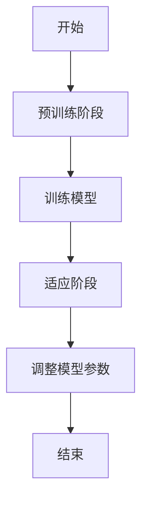
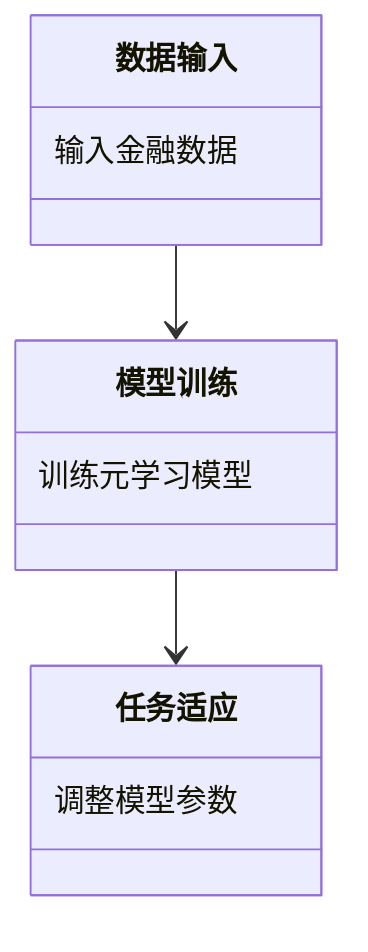
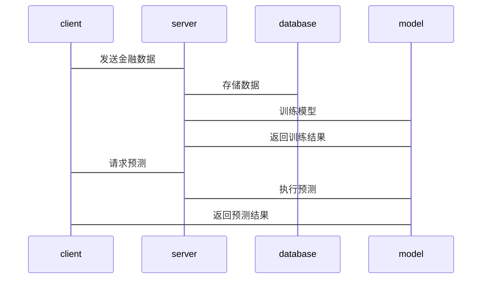

                 


# 金融领域元学习在小样本学习中的应用

> 关键词：元学习，小样本学习，金融领域，机器学习，数学模型

> 摘要：本文深入探讨了元学习在金融领域小样本学习中的应用，详细分析了元学习的核心概念、算法原理及其在金融分类和回归任务中的具体应用。通过系统架构设计和项目实战，展示了如何利用元学习解决金融领域小样本数据的挑战，并提供了最佳实践和未来研究方向。

---

# 第一部分: 金融领域元学习与小样本学习的背景与基础

## 第1章: 元学习与小样本学习的背景介绍

### 1.1 问题背景与挑战

#### 1.1.1 金融领域的数据特点
金融数据通常具有以下特点：
- **高维度性**：涉及价格、交易量、财务指标等多个维度。
- **小样本性**：某些金融场景（如新兴公司或小市场）数据量有限。
- **分布偏移**：数据分布可能因市场波动而发生变化。
- **噪声与干扰**：金融市场数据受多种因素影响，如政策、经济指标等。

#### 1.1.2 小样本学习的定义与问题描述
小样本学习（Few-shot Learning）是指在仅使用少量样本的情况下，模型仍能准确分类或预测的学习方法。小样本学习的核心问题是：
- **数据稀缺性**：传统机器学习方法需要大量数据，但在某些金融场景中难以获取。
- **泛化能力**：模型需要在小样本下保持良好的泛化能力。

#### 1.1.3 元学习的核心概念与作用
元学习（Meta-Learning）是一种通过学习如何学习的方法，其核心是：
- **快速适应**：在新任务上线时，模型能够快速调整参数以适应新数据。
- **跨任务迁移**：利用多个相关任务的数据来增强模型的泛化能力。

元学习在小样本学习中的作用：
- **减少数据需求**：通过元学习，模型可以在小样本数据上表现良好。
- **提升泛化能力**：元学习能够利用多个任务的数据，增强模型的泛化能力。

### 1.2 元学习与小样本学习的联系

#### 1.2.1 元学习的定义与特点
元学习的核心思想是“学会学习”。它通过在多个任务上预训练模型，使得模型能够快速适应新任务。元学习的特点包括：
- **任务多样性**：模型需要处理多个不同任务。
- **快速适应**：在新任务上线时，模型能够快速调整参数。

#### 1.2.2 小样本学习的核心问题与解决思路
小样本学习的核心问题是数据稀缺性。解决思路包括：
- **数据增强**：通过技术手段增加数据量。
- **迁移学习**：利用相关领域的数据进行迁移。
- **元学习**：通过预训练模型快速适应新任务。

#### 1.2.3 元学习在小样本学习中的应用价值
元学习在小样本学习中的应用价值体现在：
- **提升模型性能**：通过元学习，模型在小样本数据上表现更优。
- **减少数据需求**：元学习能够在小样本情况下训练出高性能模型。
- **适应性强**：元学习模型能够快速适应新任务。

### 1.3 本章小结
本章介绍了金融领域数据的特点，分析了小样本学习的定义与问题，阐述了元学习的核心概念与作用，并探讨了元学习在小样本学习中的应用价值。

---

## 第2章: 元学习的核心概念与原理

### 2.1 元学习的基本原理

#### 2.1.1 元学习的定义与核心思想
元学习是一种通过学习如何学习的方法。其核心思想是：模型在预训练阶段学习如何从少量样本中学习，从而在新任务上线时能够快速适应。

#### 2.1.2 元学习与传统机器学习的对比
| 对比维度       | 传统机器学习 | 元学习                     |
|----------------|--------------|---------------------------|
| 数据需求       | 需要大量数据  | 需要少量数据               |
| 任务适应性     | 适应单一任务  | 能够快速适应新任务         |
| 泛化能力       | 泛化能力有限  | 泛化能力强                 |

#### 2.1.3 元学习的数学模型与公式
元学习的数学模型通常可以表示为：
$$
\theta = \arg \min_{\theta} \sum_{i=1}^{N} \mathcal{L}_i(\theta)
$$
其中，$\theta$ 是模型参数，$\mathcal{L}_i$ 是第 $i$ 个任务的损失函数，$N$ 是任务的数量。

### 2.2 小样本学习的数学模型与算法

#### 2.2.1 小样本学习的核心算法
小样本学习的核心算法包括：
- **Meta-LSTM**：通过 LSTM 网络结构实现元学习。
- **MAML**：利用梯度下降方法进行元优化。

#### 2.2.2 元学习算法的数学推导
以 MAML 算法为例，其数学推导如下：
$$
\theta = \theta - \eta \nabla_{\theta} \mathcal{L}_{\text{meta}}(\theta)
$$
其中，$\eta$ 是学习率，$\mathcal{L}_{\text{meta}}$ 是元损失函数。

#### 2.2.3 元学习与小样本学习的结合
元学习通过在预训练阶段学习多个任务，使得模型在小样本情况下能够快速适应新任务。

### 2.3 元学习在金融领域的应用分析

#### 2.3.1 金融领域小样本学习的典型场景
- **新兴市场分析**：新兴市场数据量小，但需要快速分类。
- **实时金融数据预测**：需要模型能够快速适应新的市场变化。

#### 2.3.2 元学习在金融分类任务中的应用
以股票分类为例，元学习模型可以在小样本数据下准确分类股票走势。

#### 2.3.3 元学习在金融回归任务中的应用
以预测股票价格为例，元学习模型可以在小样本数据下准确预测价格走势。

### 2.4 本章小结
本章详细讲解了元学习的基本原理，分析了小样本学习的数学模型与算法，并探讨了元学习在金融领域的具体应用。

---

## 第3章: 元学习算法的数学模型与实现

### 3.1 元学习算法的核心模型

#### 3.1.1 Meta-LSTM模型
Meta-LSTM 模型通过 LSTM 网络结构实现元学习，其数学模型如下：
$$
h_t = \text{LSTM}(h_{t-1}, x_t)
$$
其中，$h_t$ 是第 $t$ 个时间步的隐藏状态，$x_t$ 是输入数据。

#### 3.1.2 MAML算法
MAML 算法通过梯度下降方法进行元优化，其数学模型如下：
$$
\theta = \theta - \eta \nabla_{\theta} \mathcal{L}_{\text{meta}}(\theta)
$$

#### 3.1.3 元学习算法的对比分析
| 对比维度       | Meta-LSTM | MAML     |
|----------------|------------|----------|
| 模型复杂性     | 较高       | 较低     |
| 训练效率       | 较低       | 较高     |

### 3.2 小样本学习的数学模型

#### 3.2.1 小样本分类的数学模型
小样本分类的数学模型可以表示为：
$$
p(y|x) = \frac{e^{w_x y}}{\sum_{y'} e^{w_x y'}}
$$
其中，$w_x$ 是输入 $x$ 的权重。

#### 3.2.2 元学习的数学公式推导
以 MAML 算法为例，其数学推导如下：
$$
\theta = \theta - \eta \nabla_{\theta} \mathcal{L}_{\text{meta}}(\theta)
$$

#### 3.2.3 小样本学习的优化目标
小样本学习的优化目标是：
$$
\min_{\theta} \sum_{i=1}^{N} \mathcal{L}_i(\theta)
$$

### 3.3 算法实现与流程图

#### 3.3.1 算法实现的关键点
- **预训练阶段**：在多个任务上预训练模型。
- **适应阶段**：在新任务上线时，快速调整模型参数。

#### 3.3.2 使用 Mermaid 绘制算法流程图


### 3.4 本章小结
本章详细讲解了元学习算法的核心模型，分析了小样本学习的数学模型与公式，并通过 Mermaid 流程图展示了算法实现的流程。

---

## 第4章: 金融领域小样本学习的系统架构设计

### 4.1 系统分析与设计

#### 4.1.1 问题场景介绍
系统需要在金融领域小样本数据下，实现准确的分类和预测。

#### 4.1.2 系统功能需求分析
- **数据输入**：接收金融数据。
- **模型训练**：训练元学习模型。
- **任务适应**：在新任务上线时，快速调整模型参数。

#### 4.1.3 系统功能设计图（Mermaid 类图）


### 4.2 系统架构设计

#### 4.2.1 系统架构设计图（Mermaid 架构图）


#### 4.2.2 系统接口设计
- **数据接口**：接收金融数据。
- **模型接口**：提供训练和预测功能。

#### 4.2.3 系统交互流程图（Mermaid 序列图）


### 4.3 系统实现与优化

#### 4.3.1 系统实现的关键点
- **数据预处理**：对金融数据进行清洗和特征提取。
- **模型优化**：选择合适的元学习算法进行优化。

#### 4.3.2 系统优化策略
- **数据增强**：通过技术手段增加数据量。
- **模型调优**：通过参数调节提升模型性能。

#### 4.3.3 系统测试与验证
- **测试数据集**：使用小样本数据进行测试。
- **验证指标**：评估模型的准确率和召回率。

### 4.4 本章小结
本章详细设计了金融领域小样本学习的系统架构，展示了系统功能设计图、架构图和交互序列图，并讨论了系统的实现与优化策略。

---

## 第5章: 项目实战——金融领域小样本分类任务

### 5.1 项目环境与工具安装

#### 5.1.1 环境配置
- **操作系统**：Linux/MacOS/Windows
- **编程语言**：Python 3.8+
- **深度学习框架**：TensorFlow/PyTorch

#### 5.1.2 工具安装与依赖管理
```bash
pip install numpy pandas scikit-learn tensorflow
```

#### 5.1.3 开发环境搭建
- **代码仓库**：使用 Git 进行版本控制。
- **开发工具**：使用 VS Code 或 PyCharm 进行开发。

### 5.2 项目核心实现

#### 5.2.1 环境配置与代码实现
```python
import numpy as np
import tensorflow as tf
from tensorflow.keras import layers

# 定义 Meta-LSTM 模型
class MetaLSTM:
    def __init__(self, input_dim, hidden_dim):
        self.input_dim = input_dim
        self.hidden_dim = hidden_dim
        self.lstm = layers.LSTM(hidden_dim)
    
    def call(self, inputs):
        return self.lstm(inputs)
```

#### 5.2.2 代码实现与解读
```python
# 定义 MAML 算法
def maml_update(model, loss_fn, learning_rate):
    with tf.GradientTape() as tape:
        # 计算损失
        loss = loss_fn(model(x), y)
    # 计算梯度
    gradients = tape.gradient(loss, model.trainable_weights)
    # 更新参数
    for g, w in zip(gradients, model.trainable_weights):
        w.assign_sub(learning_rate * g)
```

#### 5.2.3 代码应用解读与分析
- **Meta-LSTM 模型**：通过 LSTM 网络结构实现元学习。
- **MAML 算法**：利用梯度下降方法进行元优化。

### 5.3 实际案例分析与详细讲解

#### 5.3.1 数据集介绍
以股票分类为例，数据集包含股票价格、交易量等特征。

#### 5.3.2 模型训练与预测
```python
# 训练模型
model = MetaLSTM(input_dim=10, hidden_dim=32)
optimizer = tf.keras.optimizers.Adam(learning_rate=0.001)

for epoch in range(100):
    for batch in batches:
        x, y = batch
        optimizer.minimize(lambda: loss_fn(model(x), y), model.trainable_weights)
```

#### 5.3.3 模型评估
- **准确率**：预测结果与真实结果的匹配程度。
- **召回率**：预测结果中正确识别的正例比例。

### 5.4 项目小结
本章通过项目实战，详细讲解了金融领域小样本分类任务的实现过程，包括环境配置、模型训练和预测，以及模型评估。

---

## 第6章: 总结与展望

### 6.1 总结
本文详细探讨了元学习在金融领域小样本学习中的应用，分析了元学习的核心概念、算法原理以及在金融领域的具体应用。通过系统架构设计和项目实战，展示了如何利用元学习解决金融领域小样本数据的挑战。

### 6.2 最佳实践 tips
- **数据预处理**：对金融数据进行清洗和特征提取。
- **模型选择**：根据具体任务选择合适的元学习算法。
- **系统优化**：通过数据增强和模型调优提升性能。

### 6.3 注意事项
- **数据质量问题**：确保数据的准确性和完整性。
- **模型过拟合**：避免在小样本数据上过拟合。
- **计算资源**：需要足够的计算资源进行模型训练。

### 6.4 未来的研究方向
- **多模态数据融合**：结合文本、图像等多种数据源。
- **在线学习**：实现模型的在线更新与适应。
- **解释性增强**：提升模型的可解释性。

### 6.5 本章小结
本文总结了元学习在金融领域小样本学习中的应用，并提出了未来的研究方向。

---

# 作者：AI天才研究院/AI Genius Institute & 禅与计算机程序设计艺术 /Zen And The Art of Computer Programming

