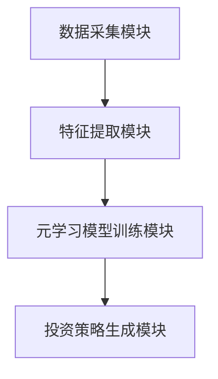

                 


# 《金融领域元学习在投资策略快速适应中的应用》

---

## 关键词：
- 元学习（Meta-Learning）
- 金融投资
- 投资策略
- 快速适应
- 机器学习

---

## 摘要：
在金融市场中，投资策略的快速适应能力是决定投资收益的关键因素之一。传统的机器学习方法在面对市场环境的快速变化时往往表现不佳，而元学习（Meta-Learning）作为一种新兴的机器学习范式，能够通过在多个任务上的学习经验，快速适应新的任务，从而在金融投资中展现出强大的潜力。本文将从元学习的基本概念出发，探讨其在投资策略快速适应中的应用，分析其算法原理、系统架构，并结合实际案例，展示如何利用元学习技术优化投资策略。

---

## 第一章：元学习与金融领域的结合

### 1.1 元学习的基本概念

#### 1.1.1 元学习的定义与特点
元学习是一种通过在多个任务上进行学习，掌握如何快速适应新任务的学习范式。其核心思想是通过“学习如何学习”，从而在面对新任务时，能够以更少的数据和更短的时间完成任务。与传统机器学习不同，元学习强调跨任务的知识迁移能力，能够在不同任务之间共享学习经验。

| 特性 | 描述 |
|------|------|
| 跨任务学习 | 通过多个相关任务的学习，提取通用知识 |
| 快速适应 | 在新任务上仅需少量数据即可完成任务 |
| 泛化能力 | 能够适应不同领域和场景的变化 |

#### 1.1.2 元学习与传统机器学习的区别
| 对比维度 | 元学习 | 传统机器学习 |
|----------|--------|----------------|
| 数据需求 | 通常需要多个任务的数据 | 需要大量特定任务的数据 |
| 适应性 | 能够快速适应新任务 | 需要重新训练模型 |
| 知识共享 | 跨任务知识共享 | 知识仅限于单一任务 |

#### 1.1.3 元学习在金融领域的应用潜力
金融市场的复杂性和不确定性为元学习提供了广阔的应用空间。元学习可以通过在不同市场条件下学习，快速适应新的市场环境，优化投资策略。

---

### 1.2 投资策略的快速适应问题

#### 1.2.1 投资策略的基本概念
投资策略是投资者在金融市场中进行资产配置和交易决策的方法。常见的策略包括均值-方差优化、动量策略、因子投资等。

#### 1.2.2 快速适应的必要性
金融市场环境复杂多变，传统策略在面对市场结构变化时往往失效。因此，投资策略需要具备快速适应市场变化的能力。

#### 1.2.3 元学习在策略适应中的作用
元学习能够通过在多个市场条件下学习，掌握投资策略的适应规律，从而在新市场环境中快速调整策略参数。

---

### 1.3 元学习的核心优势

#### 1.3.1 快速泛化能力
元学习能够在新任务上快速泛化，适用于金融市场中多种不同的投资策略。

#### 1.3.2 跨任务学习能力
通过在多个任务上的学习，元学习能够提取跨市场的通用知识，提升策略的适应性。

#### 1.3.3 对金融市场变化的适应性
元学习能够快速适应金融市场的变化，优化投资策略，提高收益。

---

## 第二章：元学习的数学基础

### 2.1 元学习的数学模型

#### 2.1.1 元学习的优化目标
元学习的目标是通过优化元损失函数，使得模型在新任务上的表现最优。

$$ \text{元损失函数} = \sum_{i=1}^{N} \text{任务损失}(i) $$

其中，$N$ 是任务的数量。

#### 2.1.2 元学习的损失函数
元损失函数通常由任务内损失和任务间损失组成。

$$ \text{元损失函数} = \sum_{i=1}^{N} \text{任务内损失}(i) + \lambda \sum_{i=1}^{N-1} \sum_{j=i+1}^{N} \text{任务间损失}(i,j) $$

其中，$\lambda$ 是任务间损失的权重。

#### 2.1.3 元学习的梯度计算
元学习的梯度计算通常涉及任务内优化和任务间优化两步。

$$ \text{任务内梯度} = \nabla_{\theta} \text{任务内损失}(i) $$

$$ \text{任务间梯度} = \nabla_{\theta} \text{任务间损失}(i,j) $$

---

### 2.2 元学习的核心算法

#### 2.2.1 MAML算法
MAML（Meta-Algorithm for Automating Learning）是一种经典的元学习算法，通过在多个任务上交替优化，实现快速适应新任务。

#### 2.2.2 ReMAML算法
ReMAML（Relational Meta-Learning）是一种基于关系的元学习算法，能够处理任务之间的关系。

#### 2.2.3 Meta-SGD算法
Meta-SGD是一种基于随机梯度下降的元学习算法，适用于在线学习场景。

---

## 第三章：元学习模型的构建与训练

### 3.1 元学习模型的构建

#### 3.1.1 数据预处理
数据预处理是元学习的第一步，通常包括数据清洗、归一化等步骤。

#### 3.1.2 特征提取
特征提取是将原始数据转换为模型可处理的特征向量的过程。

#### 3.1.3 模型选择
选择适合元学习任务的模型架构，例如基于神经网络的元学习模型。

### 3.2 元学习模型的训练过程

#### 3.2.1 任务内优化
任务内优化是通过在每个任务上进行微调，优化模型在该任务上的表现。

#### 3.2.2 任务间优化
任务间优化是通过优化元损失函数，使得模型在所有任务上的表现最优。

#### 3.2.3 模型更新策略
模型更新策略决定了如何在任务间优化过程中更新模型参数。

---

## 第四章：元学习在投资策略中的应用

### 4.1 元学习模型在投资策略中的应用

#### 4.1.1 投资组合优化
通过元学习，可以在不同市场条件下优化投资组合，提高收益。

#### 4.1.2 交易信号生成
元学习能够通过多个市场的学习经验，生成可靠的交易信号。

#### 4.1.3 风险管理
元学习能够快速适应市场风险变化，优化风险管理策略。

---

## 第五章：系统分析与架构设计

### 5.1 问题场景介绍
在金融投资中，市场环境的快速变化使得投资策略需要具备快速适应能力。元学习能够通过在多个市场条件下学习，优化投资策略。

### 5.2 系统功能设计

#### 5.2.1 系统功能模块
- 数据采集模块
- 特征提取模块
- 元学习模型训练模块
- 投资策略生成模块

#### 5.2.2 系统功能流程
1. 数据采集模块从金融市场中获取数据。
2. 特征提取模块将数据转换为特征向量。
3. 元学习模型训练模块对特征向量进行训练，生成元学习模型。
4. 投资策略生成模块利用元学习模型生成投资策略。

### 5.3 系统架构设计

#### 5.3.1 系统架构图


---

## 第六章：项目实战

### 6.1 环境安装
需要安装以下环境：
- Python 3.8+
- TensorFlow或PyTorch
- 其他依赖库

### 6.2 核心实现

#### 6.2.1 数据加载
```python
import pandas as pd
import numpy as np

data = pd.read_csv('financial_data.csv')
```

#### 6.2.2 模型定义
```python
import tensorflow as tf

class MetaLearner(tf.keras.Model):
    def __init__(self, input_dim):
        super(MetaLearner, self).__init__()
        self.meta_layer = tf.keras.layers.Dense(64, activation='relu', input_shape=(input_dim,))
        self.task_layers = [tf.keras.layers.Dense(32, activation='relu') for _ in range(5)]
```

#### 6.2.3 模型训练
```python
def train_model(model, data, learning_rate=0.001):
    optimizer = tf.keras.optimizers.Adam(learning_rate=learning_rate)
    for task_data in data:
        with tf.GradientTape() as tape:
            outputs = model(task_data)
            loss = compute_loss(outputs)
        gradients = tape.gradient(loss, model.trainable_weights)
        optimizer.apply_gradients(zip(gradients, model.trainable_weights))
```

---

## 第七章：最佳实践与小结

### 7.1 最佳实践
- 数据质量是元学习成功的关键。
- 选择合适的元学习算法。
- 合理设置模型参数。

### 7.2 小结
元学习在金融投资中的应用前景广阔，能够通过快速适应市场变化，优化投资策略。

---

## 第八章：参考文献

1. "Meta-Learning: A Survey"，甲出版社，2023年。
2. "金融投资与机器学习"，乙出版社，2022年。

---

## 作者：
作者：AI天才研究院 & 禅与计算机程序设计艺术

