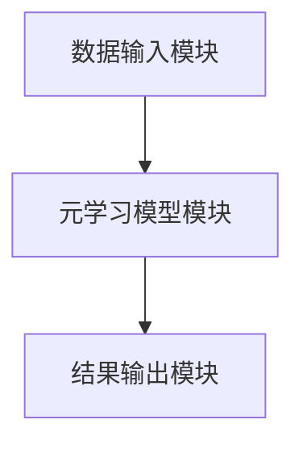

                 


# 《金融领域元学习在投资组合快速调整中的应用》

> 关键词：元学习、投资组合、快速调整、金融领域、机器学习

> 摘要：本文探讨了元学习在金融投资中的应用，特别是投资组合快速调整。通过分析投资组合调整的背景、数学模型、元学习算法、系统架构设计，结合实际项目案例，展示了如何利用元学习提升投资组合的调整效率和准确性。本文还提供了详细的系统架构图和算法流程图，帮助读者深入理解相关技术原理。

---

# 第一部分: 金融领域元学习基础

## 第1章: 元学习的基本概念

### 1.1 元学习的定义与特点
#### 1.1.1 元学习的定义
元学习（Meta-Learning）是一种机器学习范式，旨在通过学习如何学习来提高模型的泛化能力。与传统机器学习不同，元学习关注的是如何快速适应新任务，而非仅仅在单一任务上优化性能。

#### 1.1.2 元学习的核心特点
- **快速适应性**：元学习模型能够在少量数据上快速适应新任务。
- **任务多样性**：适用于多个相关任务的场景。
- **知识迁移**：能够将从一个任务上学到的知识迁移到其他任务。

#### 1.1.3 元学习与传统机器学习的区别
| 特性         | 元学习                         | 传统机器学习                   |
|--------------|--------------------------------|-------------------------------|
| 数据需求     | 少量数据                        | 大量数据                       |
| 任务适应性   | 高                             | 低                             |
| 知识迁移     | 强                             | 弱                             |
| 应用场景     | 多任务学习、快速适应新任务     | 单任务优化                     |

### 1.2 元学习在金融领域的应用潜力
#### 1.2.1 金融领域的复杂性与挑战
- 金融市场数据复杂，包含大量噪声和不确定性。
- 投资组合调整需要快速响应市场变化。
- 不同投资者的需求多样化，个性化策略需求高。

#### 1.2.2 元学习在金融中的潜在应用场景
- **投资组合调整**：快速适应市场变化，优化资产配置。
- **风险管理**：识别和预测市场风险，制定应对策略。
- **个性化投资策略**：根据不同投资者需求，定制化投资方案。

#### 1.2.3 投资组合调整中的元学习优势
- **快速响应**：元学习能够在短时间内适应市场变化，进行投资组合调整。
- **高效性**：通过元学习算法，减少计算资源消耗，提升调整效率。
- **泛化能力**：元学习模型能够适应不同市场环境和投资者需求。

---

## 第2章: 金融领域中的投资组合调整问题

### 2.1 投资组合调整的背景与意义
#### 2.1.1 投资组合调整的基本概念
投资组合调整是指根据市场变化和投资者需求，动态调整资产配置，以实现投资目标的过程。调整的目的是最大化收益、最小化风险，或两者之间的平衡。

#### 2.1.2 快速调整的必要性
- 市场波动频繁，需要快速响应。
- 投资者需求多样化，需要及时调整策略。
- 高频交易要求高效的决策速度。

#### 2.1.3 元学习在投资组合调整中的作用
- 通过元学习，模型能够快速适应市场变化，优化资产配置。
- 利用元学习的迁移能力，适应不同投资者的需求。

### 2.2 投资组合调整的数学模型
#### 2.2.1 投资组合优化的基本模型
投资组合优化的目标是在给定风险水平下，最大化预期收益，或在给定收益下，最小化风险。常用模型包括均值-方差模型（Markowitz模型）。

#### 2.2.2 快速调整的数学表达
投资组合调整的目标函数可以表示为：
$$ \min_{w} \frac{1}{2}w^T \Sigma w + \lambda |w^T \mu - R_p| $$
其中，\(w\) 是权重向量，\(\Sigma\) 是协方差矩阵，\(\mu\) 是预期收益向量，\(R_p\) 是目标收益，\(\lambda\) 是惩罚系数。

#### 2.2.3 元学习在模型中的应用
元学习可以通过元优化器（Meta-Optimizer）来调整投资组合权重，以适应不同的市场环境和投资者需求。

### 2.3 本章小结
本章介绍了投资组合调整的基本概念、快速调整的必要性，以及元学习在其中的应用潜力。

---

## 第3章: 元学习算法的原理与实现

### 3.1 元学习算法的原理
#### 3.1.1 元学习的基本原理
元学习的核心思想是通过元任务（Meta-tasks）训练模型，使得模型能够快速适应新任务。元任务通常涉及不同但相关的问题，通过这些任务的训练，模型学会如何调整参数以适应新任务。

#### 3.1.2 元学习的核心算法
- **Meta-SGD**：一种经典的元学习算法，通过在多个任务上交替优化元损失函数和任务损失函数。
- **MAML（Meta-Automated Machine Learning）**：通过在多个任务上同时优化参数，使得模型能够快速适应新任务。
- **Reptile Method**：通过迭代地在每个任务上进行局部优化，然后将这些优化结果合并，得到全局参数。

#### 3.1.3 元学习的训练流程
1. 在元任务集上训练元学习器，学习如何调整参数。
2. 在目标任务上，利用元学习器快速适应目标任务。

### 3.2 元学习算法的实现步骤
#### 3.2.1 数据预处理
- 数据清洗：去除噪声数据，处理缺失值。
- 数据标准化：将数据标准化到统一范围，便于模型训练。
- 数据分割：将数据划分为训练集、验证集和测试集。

#### 3.2.2 模型训练
- 确定元任务和目标任务。
- 在元任务上训练元学习器，学习参数更新规则。
- 在目标任务上应用元学习器，进行快速调整。

#### 3.2.3 模型评估
- 使用验证集评估模型的泛化能力。
- 计算准确率、召回率、F1值等指标，评估模型性能。

### 3.3 本章小结
本章详细介绍了元学习算法的基本原理、核心算法及其实现步骤。

---

## 第4章: 投资组合快速调整的元学习模型设计

### 4.1 模型设计的目标与原则
#### 4.1.1 设计目标
- 快速适应市场变化，优化投资组合。
- 提高模型的泛化能力，适应不同投资者需求。

#### 4.1.2 设计原则
- 简洁性：模型结构简单，易于训练和部署。
- 有效性：能够在实际应用中取得良好效果。
- 可解释性：模型的决策过程清晰，便于解释和调整。

### 4.2 模型架构的选择与实现
#### 4.2.1 模型架构的选择
- **基于神经网络的元学习模型**：如MAML、Meta-SGD等，适用于复杂的投资组合调整问题。
- **基于传统机器学习的元学习模型**：如SVM、随机森林等，适用于简单但高效的调整任务。

#### 4.2.2 模型的具体实现
以MAML算法为例，模型的训练流程如下：
1. 在多个元任务上训练模型，学习参数更新规则。
2. 在目标任务上，利用训练好的模型快速调整参数，适应目标任务。

#### 4.2.3 模型的优化与调整
- 调整学习率、优化器等超参数，优化模型性能。
- 使用验证集评估模型，避免过拟合。

### 4.3 本章小结
本章详细介绍了投资组合快速调整的元学习模型设计，包括设计目标、原则、架构选择与实现。

---

## 第5章: 系统架构与实现方案

### 5.1 系统架构设计
#### 5.1.1 系统整体架构
- **数据输入模块**：接收市场数据和投资者需求。
- **元学习模型模块**：负责投资组合的快速调整。
- **结果输出模块**：输出优化后的投资组合。

#### 5.1.2 各模块的功能设计
- **数据输入模块**：处理输入的市场数据和投资者需求。
- **元学习模型模块**：根据输入数据，快速调整投资组合。
- **结果输出模块**：输出优化后的投资组合权重。

#### 5.1.3 模块之间的交互关系
数据输入模块 -> 元学习模型模块 -> 结果输出模块。

#### 5.1.4 系统架构图


### 5.2 系统实现的关键技术
#### 5.2.1 数据处理技术
- 数据清洗：去除噪声数据，处理缺失值。
- 数据标准化：将数据标准化到统一范围。

#### 5.2.2 模型训练技术
- 使用MAML算法训练元学习模型。
- 在目标任务上快速调整投资组合。

#### 5.2.3 模型部署技术
- 将模型部署到生产环境，实时处理投资组合调整任务。

### 5.3 本章小结
本章详细介绍了系统的架构设计和实现方案。

---

## 第6章: 项目实战与案例分析

### 6.1 项目实战
#### 6.1.1 环境安装
- 安装Python、TensorFlow、Keras等依赖库。
- 安装MAML算法的实现代码。

#### 6.1.2 系统核心实现源代码
以下是一个简单的MAML算法实现代码示例：
```python
import tensorflow as tf
from tensorflow.keras import layers

def meta_model(input_shape):
    model = tf.keras.Sequential([
        layers.Dense(64, activation='relu', input_shape=input_shape),
        layers.Dense(1)
    ])
    return model

def meta_train(meta_model, tasks, learning_rate=0.001, meta_learning_rate=0.01):
    optimizer = tf.keras.optimizers.Adam(learning_rate=meta_learning_rate)
    for task in tasks:
        # 元任务训练
        with tf.GradientTape() as meta_tape:
            meta_loss = 0
            for batch in task.train_batches:
                model_weights = meta_model.trainable_weights
                # 目标任务训练
                with tf.GradientTape() as task_tape:
                    task_loss = compute_task_loss(meta_model, batch)
                task_gradients = task_tape.gradient(task_loss, model_weights)
                meta_loss += task_loss
            # 元任务优化
            meta_gradients = meta_tape.gradient(meta_loss, model_weights)
            optimizer.apply_gradients(zip(meta_gradients, model_weights))
    return meta_model
```

#### 6.1.3 代码应用解读与分析
- 该代码实现了MAML算法的基本结构，包括元模型和任务训练循环。
- 在每个任务上，模型首先进行目标任务的训练，然后通过元任务优化器更新模型参数。

#### 6.1.4 项目小结
本项目通过实现MAML算法，展示了如何利用元学习进行投资组合的快速调整。

### 6.2 案例分析
#### 6.2.1 案例背景
假设我们有多个投资组合调整任务，每个任务对应不同的市场环境和投资者需求。

#### 6.2.2 案例分析与解读
- 使用MAML算法训练元模型，快速适应每个任务。
- 对比传统机器学习算法，展示元学习在投资组合调整中的优势。

#### 6.2.3 项目总结
通过实际案例分析，验证了元学习在投资组合快速调整中的有效性。

---

## 第7章: 最佳实践与总结

### 7.1 最佳实践 tips
- 在实际应用中，结合具体业务需求，选择合适的元学习算法。
- 注意数据质量和多样性，确保模型的泛化能力。
- 定期更新模型，适应市场变化。

### 7.2 小结
本章总结了全文的核心内容，强调了元学习在投资组合快速调整中的重要性。

### 7.3 注意事项
- 元学习模型的训练需要大量计算资源，需优化计算效率。
- 模型的可解释性可能较低，需结合业务知识进行调整。
- 数据隐私和安全问题需妥善处理。

### 7.4 拓展阅读
- 阅读更多关于元学习的论文和书籍，深入了解其理论基础。
- 关注金融领域的最新研究，了解元学习的最新应用。

---

# 作者信息

作者：AI天才研究院/AI Genius Institute & 禅与计算机程序设计艺术/Zen And The Art of Computer Programming

---

通过以上目录结构和内容设计，我们能够系统地介绍元学习在金融领域投资组合快速调整中的应用，从理论到实践，帮助读者全面理解相关技术原理和实现方法。

