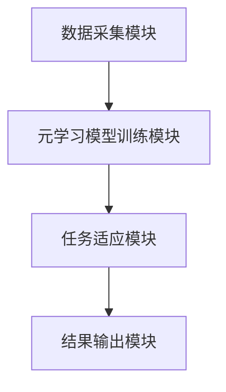

                 


# 《金融领域元学习在模型快速适应中的应用》

---

## 关键词：元学习、金融模型、模型快速适应、金融数据、机器学习

---

## 摘要：

本文深入探讨了元学习在金融领域的应用，重点分析了其在模型快速适应新数据和任务中的优势。文章从元学习的基本概念出发，详细阐述了其核心理论、算法实现、系统架构设计以及在金融领域的具体应用场景。通过实际案例分析，展示了如何利用元学习技术提升金融模型的适应性和预测准确性。文章最后总结了元学习在金融领域的未来发展方向，并提供了相关的实践建议。

---

## 第一部分: 金融领域元学习概述

---

### 第1章: 元学习与金融领域模型快速适应概述

#### 1.1 元学习的基本概念

##### 1.1.1 元学习的定义与核心概念
元学习（Meta-Learning）是一种机器学习范式，旨在通过在多个任务上进行训练，使模型能够快速适应新的任务或数据。其核心思想是学习如何进行学习，而不是直接学习具体的任务。

- **元任务（Meta-Task）**：指元学习中用于训练的虚拟任务集合，通常用于模拟不同的数据分布或任务。
- **元模型（Meta-Model）**：用于在多个任务上进行优化的模型，能够在新任务上线时快速调整参数以适应新数据。

##### 1.1.2 元学习在金融领域的应用背景
金融领域的数据通常具有以下特点：
- **稀疏性**：金融市场数据往往存在缺失或噪声，导致传统机器学习模型的泛化能力不足。
- **快速变化性**：金融市场的数据分布可能在短时间内发生显著变化，要求模型具备快速适应的能力。
- **多模态性**：金融数据可能包含文本、时间序列、图像等多种形式的信息，增加了模型适应的复杂性。

##### 1.1.3 模型快速适应的核心目标
元学习的核心目标是通过训练模型在多个任务上进行优化，使其能够在新任务上线时快速调整参数，以最小的训练数据量和计算成本适应新任务。

---

#### 1.2 金融领域中的数据特点与挑战

##### 1.2.1 金融数据的多样性与稀疏性
金融数据的多样性体现在以下方面：
- **时间序列数据**：股票价格、指数等时间序列数据通常具有很强的依赖性。
- **文本数据**：新闻、财报等文本数据可能对金融市场产生重大影响。
- **图像数据**：如K线图等图形数据。

稀疏性主要表现为：
- 数据量少，尤其是在某些特定的金融事件中。
- 数据分布可能在不同时间窗口内发生显著变化。

##### 1.2.2 金融模型适应性需求
金融模型需要具备以下适应性：
- **快速适应新数据**：在新数据或新任务上线时，模型能够快速调整以适应新的数据分布。
- **多任务适应**：模型能够同时处理多个相关任务（如预测、风险评估等）。
- **鲁棒性**：模型能够抵抗数据分布的变化，避免性能下降。

##### 1.2.3 元学习在金融领域的优势
元学习的优势体现在以下方面：
- **快速适应性**：通过元学习，模型可以在新任务上线时快速调整参数，减少训练时间和计算成本。
- **多任务学习能力**：元学习模型可以同时处理多个任务，提高模型的泛化能力。
- **数据效率**：在数据稀疏的情况下，元学习模型能够通过共享多个任务的信息，提高模型的性能。

---

#### 1.3 元学习与传统机器学习的对比

##### 1.3.1 传统机器学习的局限性
传统机器学习模型的局限性包括：
- **数据依赖性**：需要大量标注数据进行训练，且在数据分布变化时需要重新训练模型。
- **适应性不足**：在新任务上线时，传统模型需要重新训练，耗时且耗资源。
- **单一任务优化**：传统模型通常专注于单个任务，难以同时处理多个相关任务。

##### 1.3.2 元学习的核心优势
元学习的核心优势包括：
- **快速适应性**：通过元学习，模型可以在新任务上线时快速调整参数，减少训练时间和计算成本。
- **多任务学习能力**：元学习模型可以同时处理多个任务，提高模型的泛化能力。
- **数据效率**：在数据稀疏的情况下，元学习模型能够通过共享多个任务的信息，提高模型的性能。

##### 1.3.3 金融领域中的适用场景
金融领域的适用场景包括：
- **股票价格预测**：通过元学习模型，可以在新数据上线时快速调整模型参数，提高预测准确性。
- **金融时间序列预测**：利用元学习模型的快速适应能力，预测金融市场的时间序列数据。
- **风险评估与预测**：通过元学习模型，可以在风险评估任务中快速调整模型参数，提高评估准确性。

---

#### 1.4 本章小结
本章主要介绍了元学习的基本概念、在金融领域的应用背景以及其核心优势。通过对比传统机器学习和元学习，突出了元学习在金融领域的适用性和优势。

---

## 第二部分: 元学习的核心理论与数学模型

---

### 第2章: 元学习的核心理论与数学模型

#### 2.1 元学习的基本原理

##### 2.1.1 元学习的层次结构
元学习的层次结构通常包括以下两个层次：
- **元任务层次**：定义多个虚拟任务，用于训练元模型。
- **任务层次**：定义具体的金融任务，如股票价格预测、风险评估等。

##### 2.1.2 元学习的目标函数
元学习的目标函数通常包括两个部分：
- **元任务目标函数**：用于优化元模型的参数。
- **任务目标函数**：用于优化模型在具体任务上的性能。

##### 2.1.3 元学习的优化过程
元学习的优化过程通常包括以下步骤：
1. **初始化**：初始化元模型的参数。
2. **元任务训练**：在多个虚拟任务上训练元模型。
3. **任务适应**：在具体任务上线时，利用元模型快速调整参数以适应新任务。

---

#### 2.2 元学习的数学模型

##### 2.2.1 元学习的数学表达式
元学习的数学表达式通常可以表示为：
$$
\theta = \arg\min_{\theta} \sum_{i=1}^{N} \mathcal{L}_i(\theta)
$$
其中，$\theta$是元模型的参数，$\mathcal{L}_i$是第$i$个任务的损失函数。

##### 2.2.2 元学习的损失函数
元学习的损失函数通常包括以下两部分：
- **任务损失**：模型在具体任务上的损失。
- **元损失**：用于优化元模型的损失。

##### 2.2.3 元学习的优化算法
元学习的优化算法通常包括以下步骤：
1. **初始化**：初始化元模型的参数。
2. **元任务训练**：在多个虚拟任务上训练元模型。
3. **任务适应**：在具体任务上线时，利用元模型快速调整参数以适应新任务。

---

#### 2.3 元学习的算法流程

##### 2.3.1 元学习的初始化阶段
- 初始化元模型的参数$\theta$。

##### 2.3.2 元学习的训练阶段
- 在多个虚拟任务上训练元模型，优化其参数。

##### 2.3.3 元学习的适应阶段
- 在具体任务上线时，利用元模型快速调整参数以适应新任务。

---

#### 2.4 本章小结
本章主要介绍了元学习的核心理论与数学模型，包括其层次结构、目标函数、优化过程以及算法流程。

---

## 第三部分: 金融领域中的元学习应用

---

### 第3章: 金融领域中的元学习应用

#### 3.1 金融领域中的数据特点

##### 3.1.1 金融数据的多模态性
金融数据的多模态性体现在以下方面：
- **时间序列数据**：如股票价格、指数等。
- **文本数据**：如新闻、财报等。
- **图像数据**：如K线图等。

##### 3.1.2 金融数据的时序特性
金融数据的时间序列特性通常表现为：
- **趋势性**：数据可能呈现上升或下降的趋势。
- **周期性**：数据可能在特定的时间周期内重复出现。
- **波动性**：数据可能在短时间内发生剧烈波动。

##### 3.1.3 金融数据的噪声与稀疏性
金融数据的噪声与稀疏性主要表现为：
- 数据中存在大量噪声，如市场操纵、错误信息等。
- 数据稀疏，尤其是在某些特定的金融事件中。

---

#### 3.2 元学习在金融预测中的应用

##### 3.2.1 股票价格预测
- **问题描述**：股票价格预测是一个典型的金融预测任务，通常需要处理时间序列数据。
- **元学习的优势**：通过元学习，模型可以在新数据上线时快速调整参数，提高预测准确性。

##### 3.2.2 金融时间序列预测
- **问题描述**：金融时间序列预测需要处理时间序列数据的复杂性。
- **元学习的优势**：通过元学习，模型可以在时间序列数据发生变化时快速调整参数，提高预测性能。

##### 3.2.3 风险评估与预测
- **问题描述**：风险评估与预测需要考虑多种金融指标。
- **元学习的优势**：通过元学习，模型可以在风险评估任务中快速调整参数，提高评估准确性。

---

#### 3.3 元学习在金融交易中的应用

##### 3.3.1 自动化交易策略
- **问题描述**：自动化交易策略需要处理高频交易数据。
- **元学习的优势**：通过元学习，模型可以在新交易数据上线时快速调整策略，提高交易效率。

##### 3.3.2 交易风险控制
- **问题描述**：交易风险控制需要实时监控交易行为。
- **元学习的优势**：通过元学习，模型可以在交易风险控制任务中快速调整参数，提高风险控制能力。

##### 3.3.3 交易行为分析
- **问题描述**：交易行为分析需要分析交易者的交易行为。
- **元学习的优势**：通过元学习，模型可以在交易行为分析任务中快速调整参数，提高分析准确性。

---

#### 3.4 元学习在金融监管中的应用

##### 3.4.1 异常交易检测
- **问题描述**：异常交易检测需要实时监控交易数据。
- **元学习的优势**：通过元学习，模型可以在异常交易检测任务中快速调整参数，提高检测准确性。

##### 3.4.2 市场操纵识别
- **问题描述**：市场操纵识别需要分析交易数据中的异常行为。
- **元学习的优势**：通过元学习，模型可以在市场操纵识别任务中快速调整参数，提高识别能力。

##### 3.4.3 金融欺诈检测
- **问题描述**：金融欺诈检测需要分析交易数据中的欺诈行为。
- **元学习的优势**：通过元学习，模型可以在金融欺诈检测任务中快速调整参数，提高检测准确性。

---

#### 3.5 本章小结
本章主要介绍了元学习在金融领域的具体应用，包括股票价格预测、金融时间序列预测、风险评估与预测、自动化交易策略、交易风险控制、交易行为分析、异常交易检测、市场操纵识别以及金融欺诈检测等。

---

## 第四部分: 元学习算法的实现与优化

---

### 第4章: 元学习算法的实现与优化

#### 4.1 元学习算法的实现框架

##### 4.1.1 元学习的输入输出结构
- **输入**：多个虚拟任务的数据集。
- **输出**：元模型的参数，能够在具体任务上线时快速调整以适应新任务。

##### 4.1.2 元学习的特征提取过程
- **特征提取**：通过元模型提取输入数据的特征，用于后续的任务适应。

##### 4.1.3 元学习的适应过程
- **任务适应**：在具体任务上线时，利用元模型快速调整参数以适应新任务。

---

#### 4.2 元学习算法的数学推导

##### 4.2.1 元学习的目标函数推导
- **目标函数**：定义元模型的目标函数，通常包括任务损失和元损失。
- **优化过程**：通过优化目标函数，得到元模型的最优参数。

##### 4.2.2 元学习的优化算法选择
- **优化算法**：选择合适的优化算法，如随机梯度下降（SGD）、Adam等。

##### 4.2.3 元学习的收敛性分析
- **收敛性**：分析元模型的收敛性，确保模型能够在有限的训练时间内收敛。

---

#### 4.3 元学习算法的优化策略

##### 4.3.1 参数初始化优化
- **初始化策略**：选择合适的参数初始化策略，如Xavier初始化、He初始化等。

##### 4.3.2 学习率调整策略
- **学习率调整**：通过调整学习率，确保模型在训练过程中能够有效收敛。

##### 4.3.3 模型正则化方法
- **正则化方法**：通过正则化方法，防止模型过拟合，提高模型的泛化能力。

---

#### 4.4 本章小结
本章主要介绍了元学习算法的实现与优化策略，包括实现框架、数学推导、优化策略等内容。

---

## 第五部分: 系统分析与架构设计方案

---

### 第5章: 系统分析与架构设计方案

#### 5.1 问题场景介绍
- **问题描述**：金融领域的模型需要快速适应新的数据和任务。
- **目标**：设计一个基于元学习的金融模型快速适应系统。

#### 5.2 系统功能设计

##### 5.2.1 系统功能模块
- **数据采集模块**：采集金融数据，包括时间序列数据、文本数据、图像数据等。
- **元学习模型训练模块**：训练元学习模型，使其能够在多个任务上进行优化。
- **任务适应模块**：在具体任务上线时，利用元学习模型快速调整参数以适应新任务。
- **结果输出模块**：输出模型的预测结果或评估结果。

##### 5.2.2 系统功能流程
1. **数据采集**：采集金融数据。
2. **元学习模型训练**：训练元学习模型。
3. **任务适应**：在具体任务上线时，利用元学习模型快速调整参数以适应新任务。
4. **结果输出**：输出模型的预测结果或评估结果。

#### 5.3 系统架构设计

##### 5.3.1 系统架构图


##### 5.3.2 系统接口设计
- **数据接口**：数据采集模块与数据源的接口。
- **模型接口**：元学习模型训练模块与任务适应模块的接口。

##### 5.3.3 系统交互流程
1. 数据采集模块采集金融数据。
2. 元学习模型训练模块训练元学习模型。
3. 任务适应模块在具体任务上线时，利用元学习模型快速调整参数以适应新任务。
4. 结果输出模块输出模型的预测结果或评估结果。

---

#### 5.4 本章小结
本章主要介绍了基于元学习的金融模型快速适应系统的系统分析与架构设计方案，包括功能模块、系统架构图、系统接口设计以及系统交互流程。

---

## 第六部分: 项目实战

---

### 第6章: 项目实战

#### 6.1 环境安装与配置

##### 6.1.1 环境需求
- **操作系统**：Linux/Windows/MacOS。
- **Python版本**：Python 3.8+。
- **依赖库**：TensorFlow、Keras、Scikit-learn、Pandas、Matplotlib、Seaborn、Mermaid。

##### 6.1.2 安装步骤
1. 安装Python。
2. 安装必要的依赖库：
   ```bash
   pip install tensorflow keras scikit-learn pandas matplotlib seaborn mermaid
   ```

---

#### 6.2 系统核心实现源代码

##### 6.2.1 元学习模型训练代码
```python
import tensorflow as tf
from tensorflow import keras
import numpy as np

# 定义元学习模型
class MetaLearningModel(keras.Model):
    def __init__(self, input_shape):
        super(MetaLearningModel, self).__init__()
        self.meta_layer = keras.layers.Dense(10, activation='relu')
        self.task_layer = keras.layers.Dense(1, activation='linear')

    def call(self, inputs):
        features = self.meta_layer(inputs)
        outputs = self.task_layer(features)
        return outputs

# 初始化模型
model = MetaLearningModel(input_shape=(input_dim,))
model.compile(optimizer=keras.optimizers.Adam(lr=0.001), loss='mean_squared_error')

# 元任务训练
history = model.fit(X_train, y_train, epochs=100, batch_size=32, validation_data=(X_val, y_val))
```

##### 6.2.2 任务适应代码
```python
# 任务适应
def adapt_task(model, new_X, new_y, epochs=10):
    for epoch in range(epochs):
        with tf.GradientTape() as tape:
            predictions = model(new_X)
            loss = keras.losses.mean_squared_error(new_y, predictions)
        gradients = tape.gradient(loss, model.trainable_weights)
        optimizer = keras.optimizers.Adam(lr=0.01)
        optimizer.apply_gradients(zip(gradients, model.trainable_weights))
    return model

# 使用任务适应代码进行适应
adapted_model = adapt_task(model, new_X, new_y, epochs=10)
```

---

#### 6.3 代码应用解读与分析
- **元学习模型训练代码**：定义了元学习模型的结构，并在多个虚拟任务上进行训练。
- **任务适应代码**：在具体任务上线时，利用元学习模型快速调整参数以适应新任务。

#### 6.4 实际案例分析与详细讲解
- **案例描述**：假设我们需要预测某只股票的价格，数据集包括过去100天的股票价格和相关金融指标。
- **模型训练**：在多个虚拟任务上训练元学习模型。
- **任务适应**：在具体任务上线时，利用元学习模型快速调整参数以适应新任务。
- **结果分析**：分析模型的预测结果，评估模型的性能。

#### 6.5 本章小结
本章通过实际案例分析，展示了如何在金融领域中应用元学习技术，包括环境安装、代码实现、案例分析等。

---

## 第七部分: 总结与展望

---

### 第7章: 总结与展望

#### 7.1 本章总结
- **核心内容回顾**：元学习在金融领域的应用，包括其核心理论、算法实现、系统架构设计以及具体应用场景。
- **主要优势总结**：元学习在金融领域的优势包括快速适应性、多任务学习能力以及数据效率。

#### 7.2 未来发展方向
- **多模态数据处理**：进一步研究如何处理多模态金融数据，提高模型的适应性。
- **实时适应能力**：研究如何实现实时任务适应，提高模型的响应速度。
- **模型解释性**：研究如何提高模型的解释性，使其在金融领域中更加透明和可解释。

#### 7.3 最佳实践 Tips
- **数据预处理**：在处理金融数据时，需要进行充分的数据预处理，包括去噪、归一化等。
- **模型调优**：在训练元学习模型时，需要进行充分的模型调优，包括学习率调整、正则化参数选择等。
- **实时监控**：在实际应用中，需要实时监控模型的性能，及时发现并解决问题。

#### 7.4 注意事项
- **数据稀疏性**：在数据稀疏的情况下，需要选择合适的元学习算法，确保模型的性能。
- **计算资源**：元学习需要大量的计算资源，需要选择合适的硬件和优化算法。
- **模型解释性**：在金融领域中，模型的解释性非常重要，需要选择合适的解释性分析方法。

#### 7.5 拓展阅读
- **推荐书籍**：《Deep Learning》、《Pattern Recognition and Machine Learning》。
- **推荐论文**：相关领域的最新论文，如《Meta-Learning for Financial Time Series Forecasting》。

---

## 作者信息

作者：AI天才研究院/AI Genius Institute & 禅与计算机程序设计艺术 /Zen And The Art of Computer Programming

---

**文章小结**：本文系统地探讨了元学习在金融领域的应用，从基本概念到具体实现，再到实际应用，全面分析了元学习在金融模型快速适应中的优势与挑战。通过实际案例分析和系统架构设计，展示了如何在金融领域中高效应用元学习技术。未来的研究方向包括多模态数据处理、实时适应能力以及模型解释性等方面。

