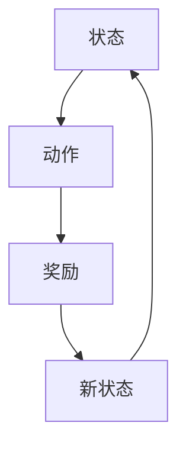
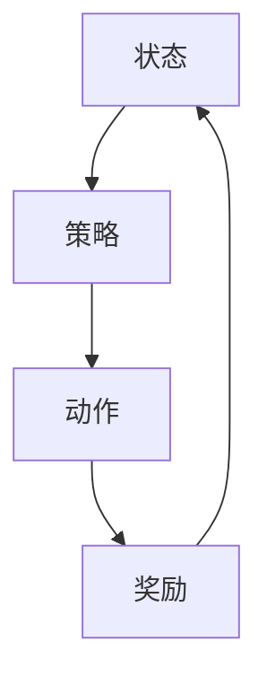

                 


# 《金融领域元强化学习在多周期多目标投资决策中的应用》

> 关键词：元强化学习，多周期投资，多目标优化，金融投资决策，强化学习算法

> 摘要：本文深入探讨了元强化学习在金融投资领域的应用，特别是在多周期和多目标投资决策中的创新应用。文章从强化学习和元强化学习的基本概念出发，分析了多周期多目标投资决策的复杂性与挑战，详细阐述了元强化学习的原理、算法、系统架构以及实际项目案例。通过理论与实践相结合的方式，展示了元强化学习如何帮助投资者在复杂金融市场中实现高效、智能的投资决策。

---

## 第1章: 强化学习与元强化学习概述

### 1.1 强化学习的基本概念
强化学习是一种机器学习范式，通过智能体与环境的交互，学习最优策略以最大化累计奖励。其核心要素包括：
- **状态（State）**：智能体所处环境的当前情况。
- **动作（Action）**：智能体在特定状态下采取的行为。
- **奖励（Reward）**：智能体采取动作后所获得的反馈，用于指导学习方向。

### 1.2 元强化学习的定义与特点
元强化学习（Meta Reinforcement Learning）是在强化学习基础上的高级形式，旨在通过元学习（Meta-Learning）技术，使智能体能够快速适应新任务或环境的变化。其特点包括：
- **快速适应性**：能够在新环境中快速调整策略，减少对大量数据的依赖。
- **多任务学习能力**：能够同时优化多个目标或任务，提升整体性能。
- **灵活性与通用性**：适用于复杂动态环境，具有较强的泛化能力。

---

## 第2章: 多周期多目标投资决策的背景与挑战

### 2.1 金融投资决策的复杂性
金融市场的复杂性使得投资决策面临多重挑战：
- **多周期性**：投资决策需要考虑短期、中期和长期目标，不同周期的收益和风险权衡复杂。
- **多目标性**：投资者通常需要在收益、风险、流动性等多个目标之间进行权衡，传统单目标优化方法难以满足需求。
- **动态性与不确定性**：金融市场环境瞬息万变，传统静态策略难以应对动态变化。

### 2.2 元强化学习在金融投资中的应用价值
- **多周期优化**：元强化学习能够同时优化不同周期的投资策略，实现长期收益与短期收益的平衡。
- **多目标优化**：通过元学习技术，元强化学习能够在多目标优化中找到帕累托最优解。
- **动态适应性**：元强化学习能够快速适应市场环境的变化，提升投资决策的灵活性。

---

## 第3章: 元强化学习的核心概念与联系

### 3.1 元强化学习的原理与机制
元强化学习通过元学习技术，将强化学习模型作为参数或网络结构，进行元优化。其核心机制包括：
1. **元优化器**：负责优化多个任务或环境的参数。
2. **任务嵌入**：通过提取任务特征，实现跨任务的知识共享。
3. **策略调整**：根据环境反馈，动态调整投资策略。

### 3.2 元强化学习与多目标优化的关系
多目标优化的目标是在多个目标之间找到最优平衡点。元强化学习通过元学习技术，能够同时优化多个目标，实现帕累托最优。

---

## 第4章: 元强化学习的数学模型与算法原理

### 4.1 元强化学习的数学模型
元强化学习的数学模型通常包括以下几个部分：
1. **状态空间**：描述投资环境的状态，如市场指数、资产价格等。
2. **动作空间**：描述投资者可能采取的动作，如买入、卖出、持有等。
3. **奖励函数**：描述投资行为的收益与风险，通常设计为多目标奖励函数。

### 4.2 元强化学习的核心算法
以下是几种典型的元强化学习算法：

#### 4.2.1 基于Q-learning的元强化学习算法


#### 4.2.2 基于策略梯度的元强化学习算法


---

## 第5章: 元强化学习的系统分析与架构设计

### 5.1 问题场景介绍
多周期多目标投资决策的场景描述如下：
- **输入**：市场数据（如股票价格、指数等）、投资周期、目标函数。
- **输出**：最优投资策略。

### 5.2 系统功能设计
以下是系统的功能模块划分：
1. **数据采集模块**：负责采集金融市场数据。
2. **模型训练模块**：负责训练元强化学习模型。
3. **策略优化模块**：负责优化多目标投资策略。
4. **结果输出模块**：负责输出最优投资策略。

---

## 第6章: 项目实战

### 6.1 环境安装
安装必要的环境和库：
```bash
pip install gym numpy tensorflow
```

### 6.2 系统核心实现源代码
以下是核心代码实现：
```python
import numpy as np
import gym

class MetaRLAgent:
    def __init__(self, state_space, action_space):
        self.state_space = state_space
        self.action_space = action_space
        self.model = self.build_model()

    def build_model(self):
        # 构建元强化学习模型
        pass

    def act(self, state):
        # 采取动作
        pass

    def train(self, state, action, reward, next_state):
        # 更新模型
        pass
```

### 6.3 代码应用解读与分析
通过代码实现，我们可以看到元强化学习模型的核心部分包括状态空间、动作空间、模型构建和训练过程。

---

## 第7章: 最佳实践与总结

### 7.1 最佳实践 tips
1. 在实际应用中，建议结合具体的投资目标和周期进行模型调优。
2. 数据质量和实时性对模型性能有重要影响，需确保数据来源可靠。

### 7.2 小结
本文详细探讨了元强化学习在金融投资中的应用，特别是在多周期多目标投资决策中的创新应用。通过理论与实践相结合的方式，展示了元强化学习如何帮助投资者在复杂金融市场中实现高效、智能的投资决策。

---

## 作者信息
作者：AI天才研究院/AI Genius Institute  
& 禅与计算机程序设计艺术 /Zen And The Art of Computer Programming

