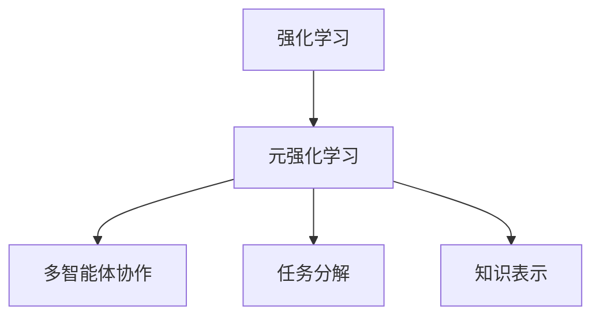
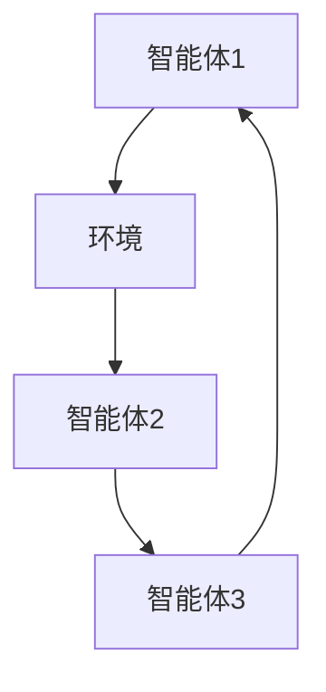
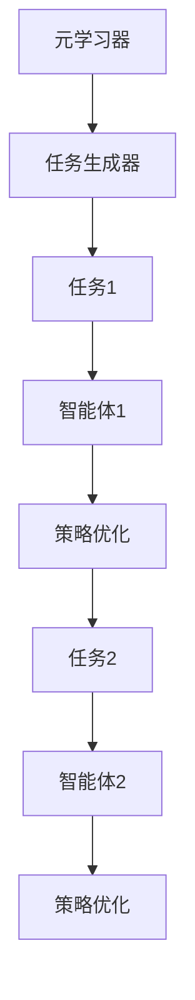
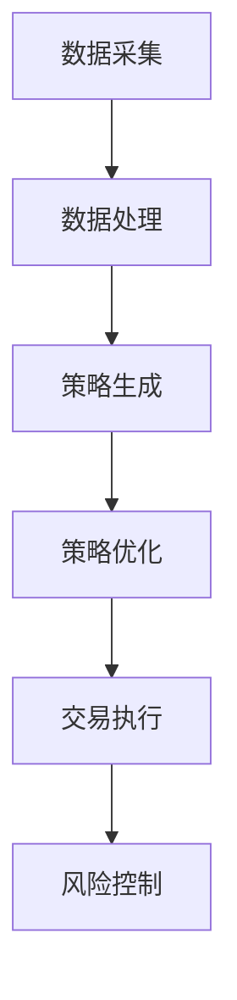
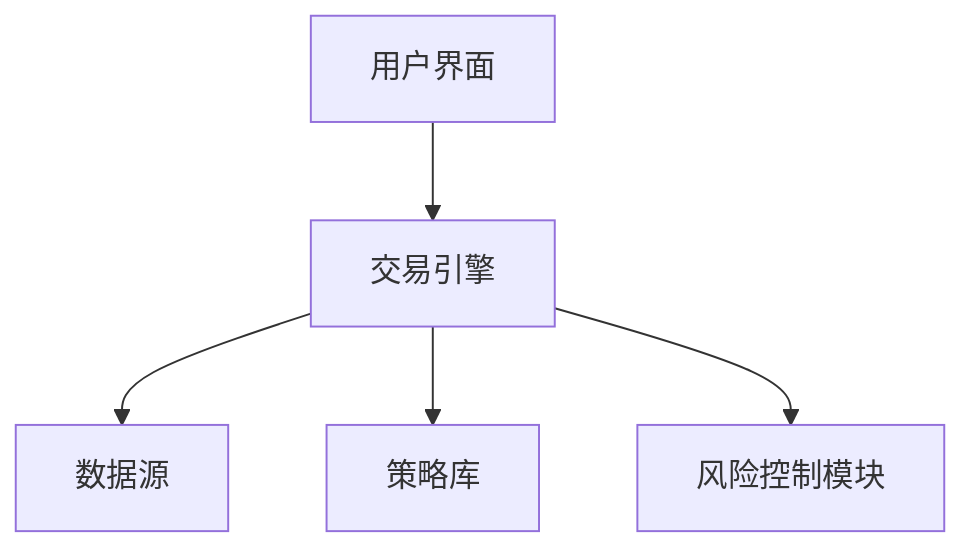
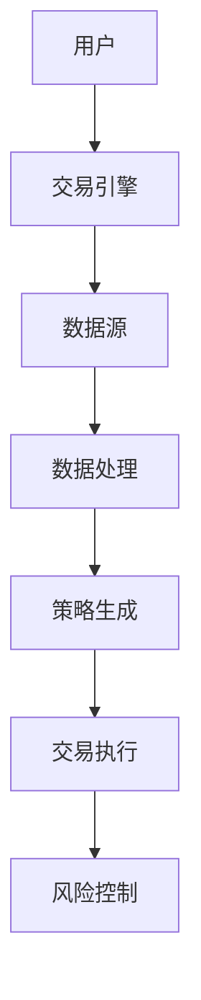

                 


# 金融领域元强化学习在高频交易中的应用

> 关键词：元强化学习，高频交易，强化学习，金融算法，交易系统

> 摘要：本文深入探讨了元强化学习在金融高频交易中的应用，从理论基础到实际案例，详细分析了元强化学习如何优化交易策略，提升交易效率。通过系统化的分析与实践，本文揭示了元强化学习在高频交易中的独特优势与实现路径。

---

## 第一部分: 金融领域元强化学习与高频交易背景

### 第1章: 元强化学习与高频交易概述

#### 1.1 元强化学习的基本概念

##### 1.1.1 强化学习的定义与特点
强化学习是一种机器学习范式，通过智能体与环境的交互，学习最优策略以最大化累积奖励。其特点包括：
- **试错性**：通过不断尝试和错误来优化策略。
- **延迟奖励**：奖励可能在多个动作之后才得到。
- **动态性**：环境状态可能随时间变化。

##### 1.1.2 元强化学习的核心思想
元强化学习（Meta Reinforcement Learning）是在强化学习基础上引入元学习（Meta-Learning）的概念，旨在通过学习多个任务来加速新任务的学习。其核心思想包括：
- **任务生成**：能够自动生成相关任务。
- **知识迁移**：能够将已掌握的任务知识迁移到新任务。
- **多智能体协作**：多个智能体协同完成复杂任务。

##### 1.1.3 元强化学习与传统强化学习的区别
| 特性          | 传统强化学习                          | 元强化学习                          |
|---------------|---------------------------------------|---------------------------------------|
| 任务处理      | 单一任务                              | 多个任务或任务生成                    |
| 知识迁移      | 无                                   | 有，通过元学习加速新任务学习          |
| 智能体协作     | 单一智能体或简单协作                  | 多智能体协作，复杂任务分解            |

#### 1.2 高频交易的定义与特点

##### 1.2.1 高频交易的定义
高频交易是指在极短的时间内，利用计算机算法进行大量的交易操作，通常以 microseconds（微秒）为单位完成交易决策和执行。

##### 1.2.2 高频交易的核心特征
- **高频性**：交易速度极快，通常在几毫秒内完成。
- **自动化**：依赖算法自动决策，减少人为干预。
- **大数据量**：处理的数据量大，需要快速决策。

##### 1.2.3 高频交易在金融领域中的地位
高频交易已成为现代金融市场的重要组成部分，尤其是在股票、期货等市场中，高频交易占总交易量的比例不断上升。高频交易通过算法优势，能够在短时间内捕捉市场微小波动，获取利润。

#### 1.3 元强化学习在高频交易中的应用前景

##### 1.3.1 元强化学习在高频交易中的优势
- **多策略优化**：通过元强化学习，可以同时优化多个交易策略，提高整体收益。
- **快速适应市场变化**：元强化学习能够快速适应市场环境变化，及时调整交易策略。
- **复杂决策能力**：在复杂市场环境中，元强化学习能够分解任务，协调多个智能体完成复杂决策。

##### 1.3.2 高频交易对元强化学习的需求
- **高速决策需求**：高频交易需要在极短时间内做出决策，这要求元强化学习算法必须高效。
- **多任务处理能力**：高频交易往往需要同时处理多个相关任务，元强化学习的多任务处理能力正好满足这一需求。
- **动态适应性**：市场环境不断变化，元强化学习能够动态调整策略，适应新环境。

##### 1.3.3 应用中的挑战与机遇
- **挑战**：高频交易的复杂性和动态性对元强化学习提出了更高的要求，算法的效率和稳定性面临考验。
- **机遇**：通过元强化学习优化高频交易策略，能够显著提高交易效率和收益。

---

### 第2章: 元强化学习的核心概念与联系

#### 2.1 元强化学习的原理

##### 2.1.1 多智能体协作机制
多智能体协作机制是元强化学习的重要组成部分，通过多个智能体的协作完成复杂任务。每个智能体负责不同的子任务，共同完成整体目标。

##### 2.1.2 任务分解与组合
任务分解与组合是元强化学习的关键步骤，通过将复杂任务分解为多个子任务，分别优化每个子任务的性能，再将优化后的子任务组合起来，完成整体任务。

##### 2.1.3 知识表示与推理
知识表示与推理是元强化学习的理论基础，通过有效的知识表示和推理，智能体能够快速学习和适应新任务。

#### 2.2 核心概念对比表
| 特性          | 传统强化学习                          | 元强化学习                          |
|---------------|---------------------------------------|---------------------------------------|
| 任务处理      | 单一任务                              | 多个任务或任务生成                    |
| 知识迁移      | 无                                   | 有，通过元学习加速新任务学习          |
| 智能体协作     | 单一智能体或简单协作                  | 多智能体协作，复杂任务分解            |

#### 2.3 ER实体关系图


---

### 第3章: 高频交易中的算法原理

#### 3.1 元强化学习算法框架

##### 3.1.1 多智能体强化学习流程


##### 3.1.2 元强化学习算法流程


#### 3.2 数学模型与公式

##### 3.2.1 状态空间表示
$$ s \in S $$

##### 3.2.2 动作空间表示
$$ a \in A $$

##### 3.2.3 奖励函数
$$ R(s, a) = r $$

##### 3.2.4 策略函数
$$ \pi(a|s) = p $$

#### 3.3 举例说明

##### 3.3.1 简单案例分析
假设在高频交易中，智能体需要在两个资产之间进行投资决策。通过元强化学习，智能体可以同时优化多个交易策略，提高整体收益。

##### 3.3.2 实际交易场景模拟
在实际交易中，元强化学习可以通过多智能体协作，分别优化订单生成、风险控制等子任务，最终实现整体交易策略的最优。

---

### 第4章: 系统分析与架构设计

#### 4.1 问题场景介绍

##### 4.1.1 高频交易中的典型问题
- **市场微观结构**：高频交易需要考虑市场微观结构的影响，如订单簿、市场深度等。
- **交易成本**：高频交易需要在极短时间内完成交易，交易成本包括时间成本和交易费用。
- **风险控制**：高频交易需要实时监控和管理风险，防止出现重大损失。

##### 4.1.2 元强化学习的应用场景
- **多策略优化**：优化多个交易策略，提高整体收益。
- **动态适应性**：快速适应市场环境变化，调整交易策略。
- **复杂决策能力**：在复杂市场环境中，分解任务，协调多个智能体完成复杂决策。

#### 4.2 系统功能

##### 4.2.1 系统功能模块
- **数据采集与处理**：从市场获取实时数据，进行预处理。
- **策略生成与优化**：通过元强化学习生成和优化交易策略。
- **交易执行**：根据优化后的策略执行交易。
- **风险控制**：实时监控和管理交易风险。

##### 4.2.2 系统功能流程


#### 4.3 系统架构设计

##### 4.3.1 系统架构图


##### 4.3.2 系统交互流程


---

## 第五章: 项目实战

### 5.1 环境安装与配置

#### 5.1.1 系统环境
- 操作系统：Linux/Windows/MacOS
- Python版本：3.7以上
- 硬件要求：具备足够计算能力的CPU或GPU

#### 5.1.2 安装依赖
```bash
pip install gym numpy tensorflow pandas matplotlib
```

### 5.2 核心实现源代码

#### 5.2.1 元强化学习框架代码
```python
import numpy as np
import gym

class MetaRLAgent:
    def __init__(self, state_space, action_space):
        self.state_space = state_space
        self.action_space = action_space
        # 初始化策略网络
        self.policy = self.build_policy_network()

    def build_policy_network(self):
        # 网络结构：输入层->隐藏层->输出层
        pass

    def act(self, state):
        # 根据策略网络输出动作
        pass

    def update_policy(self, rewards):
        # 更新策略网络
        pass
```

#### 5.2.2 高频交易环境代码
```python
class TradingEnv(gym.Env):
    def __init__(self):
        super(TradingEnv, self).__init__()
        # 定义状态空间和动作空间
        self.state_space = ...
        self.action_space = ...
    
    def reset(self):
        # 初始化环境
        pass
    
    def step(self, action):
        # 执行动作，返回新状态、奖励、是否终止
        pass
```

### 5.3 实际案例分析与代码解读

#### 5.3.1 简单案例分析
假设我们有一个简单的高频交易环境，其中智能体需要在两个资产之间进行投资决策。我们可以通过元强化学习框架来优化交易策略。

#### 5.3.2 代码实现
```python
# 初始化环境
env = TradingEnv()
agent = MetaRLAgent(env.state_space, env.action_space)

# 开始训练
for episode in range(1000):
    state = env.reset()
    while not done:
        action = agent.act(state)
        next_state, reward, done, info = env.step(action)
        agent.update_policy(reward)
```

---

## 第六章: 总结与展望

### 6.1 总结

#### 6.1.1 核心观点回顾
- 元强化学习在高频交易中的应用前景广阔。
- 通过多智能体协作和任务分解，能够显著提高交易效率和收益。

#### 6.1.2 本文主要贡献
- 提供了元强化学习在高频交易中的系统化分析与实践。
- 展示了如何通过元强化学习优化交易策略，提升交易效率。

### 6.2 展望

#### 6.2.1 未来研究方向
- 元强化学习算法的优化与改进。
- 元强化学习在更复杂金融场景中的应用。

#### 6.2.2 技术发展趋势
- 结合其他机器学习技术，如深度学习、强化学习等，进一步提升交易系统性能。
- 在金融领域，元强化学习将朝着更智能化、自动化方向发展。

---

## 作者：AI天才研究院 & 禅与计算机程序设计艺术

---

以上是《金融领域元强化学习在高频交易中的应用》的技术博客文章大纲及部分正文内容，根据实际需求，您可以进一步扩展每个章节的内容，添加更多细节和案例分析。

