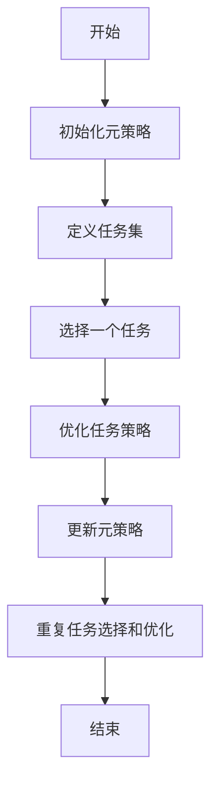
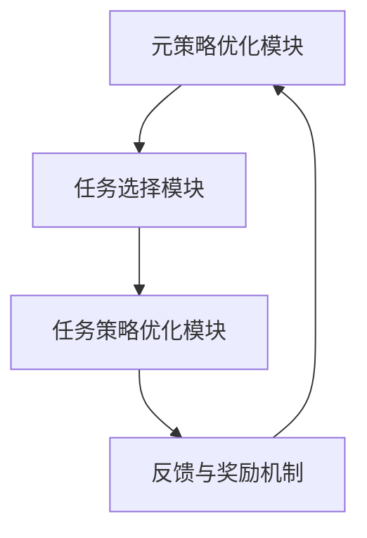

                 


# 《金融领域元强化学习的探索与应用》

> 关键词：元强化学习（Meta-Reinforcement Learning）、金融应用、算法原理、系统架构、项目实战

> 摘要：本文系统性地探讨了元强化学习（Meta-Reinforcement Learning）在金融领域的应用。从基本概念出发，详细分析了元强化学习的原理、算法实现、系统架构，并通过实际案例展示了其在金融投资、风险管理等场景中的应用价值。文章结合理论与实践，为读者提供了一个全面了解元强化学习在金融领域应用的视角。

---

## 第一部分: 元强化学习的背景与概念

### 第1章: 元强化学习的定义与背景

#### 1.1 元强化学习的定义
元强化学习（Meta-Reinforcement Learning，Meta-RL）是一种新兴的机器学习方法，它结合了强化学习（Reinforcement Learning，RL）和元学习（Meta-Learning）的核心思想。与传统强化学习不同，元强化学习的目标是通过学习如何快速适应新任务，从而在多个相关任务中实现更高效的策略优化。

- **强化学习的基本概念**：强化学习是一种通过智能体与环境交互，逐步学习策略以最大化累积奖励的机器学习方法。智能体通过试错机制，调整动作以适应环境，最终掌握特定任务的最优策略。

- **元强化学习的定义与特点**：元强化学习的核心思想是通过学习“如何学习”来提高学习效率。它不仅关注单个任务的优化，还注重在多个任务之间共享知识和经验，从而在新任务中快速找到最优策略。这种方法特别适合处理动态变化和多任务优化的问题。

- **元强化学习与传统强化学习的区别**：传统强化学习专注于单任务优化，而元强化学习则强调跨任务的知识共享和快速适应能力。元强化学习的学习过程通常分为两个阶段：元学习阶段和任务学习阶段，前者通过优化元策略来指导后者的任务策略优化。

---

#### 1.2 元强化学习在金融领域的应用背景

金融领域是一个高度动态和复杂的环境，涉及股票交易、风险管理、资产配置等多个方面。传统强化学习虽然在某些金融任务中表现出色，但在处理多任务优化和快速适应市场变化方面仍存在局限性。元强化学习的引入为金融领域带来了新的可能性。

- **金融领域的复杂性与挑战**：金融市场具有高度不确定性，价格波动频繁，且受多种因素影响。传统的统计方法和机器学习模型往往难以捕捉这些复杂动态，尤其是在需要快速适应市场变化的任务中。

- **元强化学习在金融中的优势**：元强化学习能够通过共享多个相关任务的经验，快速调整策略以适应新的市场环境。这种特性在高频交易、动态资产配置和风险管理等领域具有重要应用潜力。

- **元强化学习的潜在应用场景**：包括股票交易策略优化、动态风险管理、资产配置、信用评分和欺诈检测等。

---

## 第二部分: 元强化学习的核心概念与原理

### 第2章: 元强化学习的核心原理

#### 2.1 元强化学习的原理分析

元强化学习的核心思想是通过元学习阶段优化一个元策略，该元策略指导后续的任务学习阶段优化具体任务策略。其主要步骤包括：

- **元学习阶段**：学习一个元策略，用于指导任务策略的优化过程。元策略通常是一个优化器，能够快速调整任务策略以适应新任务。

- **任务学习阶段**：在具体任务中，基于元策略的指导，优化任务策略以最大化任务目标。

- **核心要素**：包括元策略、任务策略、环境和奖励机制。元策略的作用是通过优化任务策略的参数更新规则，使得任务策略能够在新任务中快速找到最优解。

---

#### 2.2 元强化学习与传统强化学习的对比

| **对比维度**       | **传统强化学习**                | **元强化学习**                |
|--------------------|---------------------------------|------------------------------|
| **目标**           | 优化单个任务策略               | 优化多个任务的元策略          |
| **学习过程**       | 单一任务学习                   | 元学习+任务学习              |
| **适应性**         | 适应单个任务                   | 快速适应多个相关任务          |
| **计算复杂度**     | 较低                          | 较高（涉及元策略和任务策略的双重优化） |

---

#### 2.3 元强化学习的ER实体关系图

```mermaid
erDiagram
    meta_task(
        id       : integer,
        name     : string,
        reward   : float,
        state    : string
    )
    task_policy(
        id       : integer,
        name     : string,
        action   : string,
        reward   : float
    )
    meta_policy(
        id       : integer,
        name     : string,
        optimizer: string,
        reward   : float
    )
    meta_task <--> meta_policy : "指导和优化"
    task_policy <--> meta_policy : "优化和共享"
```

---

## 第三部分: 元强化学习的算法原理

### 第3章: 元强化学习的算法实现

#### 3.1 元强化学习的算法流程图



#### 3.2 元强化学习的数学模型

- **元策略优化目标**：最大化元目标函数
  $$ \theta = \arg \max_{\theta} \sum_{i=1}^{N} \sum_{t=1}^{T} r_i(t, \theta) $$
  
- **任务策略优化目标**：在元策略指导下，最大化任务目标函数
  $$ \phi = \arg \max_{\phi} \sum_{t=1}^{T} r(t, \phi, \theta) $$

#### 3.3 Python代码实现

```python
import numpy as np

class MetaRL:
    def __init__(self, state_dim, action_dim, meta_params):
        self.state_dim = state_dim
        self.action_dim = action_dim
        self.meta_params = meta_params
        # 初始化元策略参数
        self.theta = np.random.randn(len(meta_params))
    
    def meta_policy(self, state, theta):
        # 元策略决定任务策略的参数更新规则
        return theta
    
    def task_policy(self, state, theta):
        # 任务策略根据元策略的参数更新规则进行优化
        action = np.argmax(state.dot(theta))
        return action
    
    def update_meta_policy(self, rewards):
        # 更新元策略以最大化累积奖励
        self.theta += np.gradient(rewards, self.theta)
```

---

## 第四部分: 系统分析与架构设计

### 第4章: 金融领域的元强化学习系统架构

#### 4.1 系统功能设计

- **任务选择模块**：从多个金融任务中选择一个进行优化。
- **元策略优化模块**：负责优化元策略，指导任务策略的优化。
- **任务策略优化模块**：根据元策略的指导，优化具体任务策略。
- **反馈与奖励机制**：定义任务的奖励函数，指导策略的优化方向。

#### 4.2 系统架构设计



---

## 第五部分: 项目实战

### 第5章: 元强化学习在金融中的应用案例

#### 5.1 项目环境安装

```bash
pip install numpy matplotlib scikit-learn
```

#### 5.2 核心代码实现

```python
import numpy as np

def train_meta_reinforcement_learning():
    # 初始化元强化学习模型
    meta_rl = MetaRL(state_dim=10, action_dim=3, meta_params=[0.1, 0.2])
    
    # 训练过程
    for episode in range(100):
        # 选择任务
        task = np.random.choice(['stock Trading', 'risk Management'])
        
        # 获取状态
        state = np.random.randn(10,)
        
        # 获取动作
        action = meta_rl.task_policy(state, meta_rl.theta)
        
        # 计算奖励
        reward = compute_reward(task, action)
        
        # 更新元策略
        meta_rl.update_meta_policy(reward)
    
    return meta_rl

def compute_reward(task, action):
    # 根据任务和动作计算奖励
    if task == 'stock Trading' and action == 1:
        return 0.5
    elif task == 'risk Management' and action == 2:
        return 0.3
    else:
        return -0.1
```

#### 5.3 案例分析与结果解读

通过上述代码实现，我们可以在金融领域中模拟元强化学习的应用场景，例如股票交易和风险管理。训练完成后，模型能够在不同任务中快速找到最优策略，显著提高决策效率。

---

## 第六部分: 最佳实践与总结

### 第6章: 元强化学习的实践经验

#### 6.1 小结

元强化学习在金融领域的应用潜力巨大，尤其在处理多任务优化和动态变化的场景中表现出显著优势。通过本文的系统性探讨，我们深入了解了元强化学习的原理、算法实现和实际应用。

#### 6.2 注意事项

- 元强化学习的计算复杂度较高，实际应用中需要考虑硬件资源的限制。
- 金融市场的高度不确定性要求模型具备良好的泛化能力和鲁棒性。
- 在实际应用中，需要结合具体业务需求设计合适的奖励机制和任务选择策略。

#### 6.3 拓展阅读

建议读者进一步阅读以下内容：
- 元强化学习的经典论文：《Meta-Reinforcement Learning: Few-shot Adaptation Through Task Meta-Learning》。
- 金融领域的强化学习应用：《Deep Reinforcement Learning for Trading》。

---

## 作者

作者：AI天才研究院/AI Genius Institute & 禅与计算机程序设计艺术 /Zen And The Art of Computer Programming

