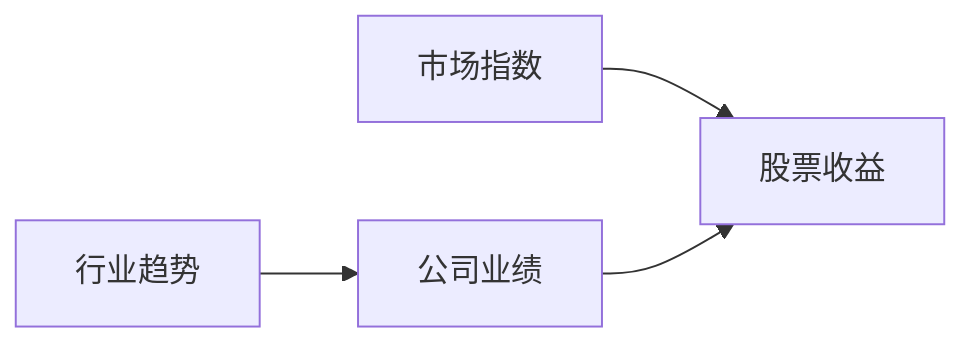

                 

# 《金融领域因果推断在投资策略归因分析中的应用》

**关键词**：因果推断，投资策略，归因分析，金融数据，工具变量法

**摘要**：  
本文深入探讨了因果推断在金融领域中的应用，特别是其在投资策略归因分析中的重要性。通过分析因果关系与相关关系的区别，潜在结果框架，因果图模型等核心概念，本文详细介绍了因果推断的基本原理和实现方法。结合金融数据的特点，本文分析了因果推断在投资策略归因分析中的具体应用场景，并通过实际案例展示了如何使用工具变量法和断点回归法进行因果推断。最后，本文总结了因果推断在金融投资中的优势和挑战，并展望了未来的研究方向。

---

## 第1章: 问题背景与核心概念

### 1.1 问题背景

#### 1.1.1 投资策略归因分析的背景
投资策略归因分析是金融领域中的重要研究方向。传统的统计方法（如回归分析）通常只能揭示变量之间的相关关系，无法明确变量之间的因果关系。例如，当我们观察到某只股票的收益与市场指数的相关性时，传统方法只能告诉我们两者之间存在相关性，而无法确定市场指数的变化是否真正导致了该股票收益的变化。这种局限性使得传统的统计方法在投资策略归因分析中存在较大的局限性。

#### 1.1.2 传统统计推断的局限性
传统统计方法通常基于相关关系的分析，无法有效处理金融数据中的内生性问题。例如，在分析股票收益与市场指数的关系时，可能存在双向因果关系，即市场指数的变化可能影响股票收益，而股票收益的变化也可能反过来影响市场指数。这种内生性问题使得传统的回归分析难以准确估计因果关系。

#### 1.1.3 因果推断在金融领域的应用价值
因果推断通过引入潜在结果框架和因果图模型，能够有效识别变量之间的因果关系。在投资策略归因分析中，因果推断可以帮助我们明确哪些因素对投资收益的贡献是因果性的，从而为投资决策提供更可靠的依据。

### 1.2 核心概念与定义

#### 1.2.1 因果关系与相关关系的对比
| **概念**       | **描述**                                                                 |
|----------------|--------------------------------------------------------------------------|
| 相关关系        | 表示两个变量之间存在统计上的关联，但不一定是因果关系。                 |
| 因果关系        | 表示一个变量的变化会导致另一个变量的变化，具有时间先后性和内在联系性。  |

**图1.1: 因果关系与相关关系的对比**  

#### 1.2.2 潜在结果框架
潜在结果框架是因果推断的核心理论基础。它假设每个样本在给定处理（如投资策略）的情况下都有一个潜在的结果。通过比较不同处理下的潜在结果，我们可以估计出处理的效应。

#### 1.2.3 因果图模型
因果图模型（Directed Acyclic Graph, DAG）通过绘制变量之间的因果关系图，帮助我们识别哪些变量是处理的前因，哪些变量是结果的影响因素。例如，在分析股票收益时，市场指数、公司业绩、行业趋势等都可能是影响股票收益的前因。

**图1.2: 因果图模型示例**  

### 1.3 本章小结
本章介绍了因果推断在金融领域的应用背景，重点阐述了因果关系与相关关系的区别，以及潜在结果框架和因果图模型的核心概念。这些概念为后续的因果推断实现奠定了理论基础。

---

## 第2章: 因果推断的基本原理

### 2.1 因果关系的数学定义

#### 2.1.1 处理与潜在结果
在因果推断中，处理（Treatment）是指对某个变量进行干预或改变。每个样本在给定处理的情况下都有一个潜在结果（Potential Outcome）。例如，在股票投资中，处理可以是“买入股票”，潜在结果可以是“股票收益”。

#### 2.1.2 平均处理效应
平均处理效应（Average Treatment Effect, ATE）是指在所有样本中，处理对结果的平均影响。公式如下：
$$ATE = E[Y^{T=1}] - E[Y^{T=0}]$$

其中，$Y^{T=1}$和$Y^{T=0}$分别表示处理为1和0时的结果变量。

#### 2.1.3 反事实推理
反事实推理（Counterfactual Reasoning）是因果推断的重要方法。它通过假设在某些条件下，变量没有受到处理，从而推断出结果的潜在值。

### 2.2 因果图模型

#### 2.2.1 因果图的基本结构
因果图模型通过绘制变量之间的因果关系图，帮助我们识别因果路径和混杂变量。例如，如果变量$A$影响变量$B$，而变量$B$又影响变量$C$，那么$A$和$C$之间可能存在间接因果关系。

#### 2.2.2 调整变量与中间变量
调整变量（Adjustment Variables）是指在因果图中，用于控制混杂变量的变量。中间变量（Intermediate Variables）是指位于因果路径中的变量。

#### 2.2.3 因果路径分析
因果路径分析通过分解因果图中的因果路径，识别出哪些路径是直接影响结果的，哪些是间接影响的。

### 2.3 本章小结
本章详细介绍了因果推断的基本原理，包括处理与潜在结果、平均处理效应、反事实推理等核心概念，以及因果图模型的基本结构和分析方法。

---

## 第3章: 因果推断在金融中的应用

### 3.1 金融领域的因果关系

#### 3.1.1 投资组合绩效归因
投资组合绩效归因是指分析投资组合的收益来源，例如市场风险、行业选择、个股选择等。通过因果推断，我们可以明确哪些因素对投资组合收益的贡献是因果性的。

#### 3.1.2 股票收益的因果分解
股票收益的因果分解是指将股票收益分解为多个因素的因果效应，例如市场因子、公司基本面因子等。

#### 3.1.3 风险因素的因果分析
风险因素的因果分析是指识别哪些风险因素对投资组合风险的影响是因果性的，例如市场风险、流动性风险等。

### 3.2 金融数据的因果分析挑战

#### 3.2.1 数据的内生性问题
金融数据中存在大量的内生性问题，例如股票收益和市场指数之间的双向因果关系。这使得传统的回归分析难以准确估计因果关系。

#### 3.2.2 时间序列的依赖性
金融数据通常具有时间序列特性，例如股票价格的波动往往具有自相关性。这使得因果推断的实现更加复杂。

#### 3.2.3 市场异质性
市场异质性是指不同投资者在市场中的行为可能不同，这使得因果推断的实现需要考虑个体异质性。

### 3.3 本章小结
本章介绍了因果推断在金融领域的具体应用，包括投资组合绩效归因、股票收益的因果分解等，并分析了金融数据中的因果分析挑战。

---

## 第4章: 因果推断算法与实现

### 4.1 潜在结果框架的实现

#### 4.1.1 平均处理效应的估计
平均处理效应的估计可以通过随机化试验或倾向得分匹配等方法实现。例如，在股票投资中，可以通过随机选择一部分股票进行买入，另一部分股票不买，然后比较两组的收益差异。

#### 4.1.2 反事实推理的实现
反事实推理的实现需要构建因果图模型，并通过调整变量来估计潜在结果。例如，可以通过构建市场指数、公司业绩等变量的因果图，估计在不同处理下的潜在结果。

#### 4.1.3 处理效应的异质性分析
处理效应的异质性分析是指识别不同子群体中处理效应的差异。例如，在股票投资中，可以通过分析不同行业或不同市值的股票，识别处理效应的异质性。

### 4.2 因果图模型的实现

#### 4.2.1 因果图的构建
因果图的构建需要根据领域知识和数据特征，识别变量之间的因果关系。例如，在股票收益分析中，可以通过领域知识确定市场指数、公司业绩等变量的因果关系。

#### 4.2.2 调整变量的识别
调整变量的识别需要根据因果图中的混杂变量，选择合适的调整变量。例如，在股票收益分析中，可以选择公司业绩作为调整变量。

#### 4.2.3 因果路径的识别
因果路径的识别需要根据因果图中的因果路径，识别出直接影响结果的路径和间接影响结果的路径。

### 4.3 工具变量法

#### 4.3.1 工具变量的定义与选择
工具变量是指影响处理变量，但不直接影响结果变量（除了通过处理变量）的变量。例如，在股票投资中，可以选择市场指数作为工具变量。

#### 4.3.2 工具变量回归的实现
工具变量回归的实现需要通过工具变量对结果变量进行回归分析。例如，可以通过工具变量法估计股票收益与市场指数的因果效应。

#### 4.3.3 工具变量法的优缺点
工具变量法的优点是可以有效控制内生性问题，缺点是需要找到合适的工具变量。

### 4.4 断点回归法

#### 4.4.1 断点回归的基本原理
断点回归法是通过将数据分成不同的区间，分析处理变量对结果变量的影响。例如，在股票投资中，可以通过分析不同股票价格区间的收益差异，估计处理效应。

#### 4.4.2 断点回归的应用场景
断点回归法适用于处理变量是连续变量的情况。例如，在股票投资中，可以通过分析不同股票市值区间的收益差异，估计处理效应。

#### 4.4.3 断点回归的实现步骤
断点回归的实现需要选择合适的断点位置，将数据分成不同的区间，并对每个区间进行回归分析。

### 4.5 本章小结
本章详细介绍了因果推断的主要算法，包括潜在结果框架、因果图模型、工具变量法和断点回归法，并分析了它们的实现步骤和应用场景。

---

## 第5章: 金融数据的因果分析案例

### 5.1 案例背景

#### 5.1.1 案例目标
本案例旨在通过因果推断分析股票收益的因果分解，识别市场因子、公司基本面因子等对股票收益的因果效应。

#### 5.1.2 数据来源与特征
本案例的数据来源于某股票市场的历史数据，包括股票收益、市场指数、公司业绩等变量。

### 5.2 数据准备

#### 5.2.1 数据清洗
数据清洗包括处理缺失值、异常值等。例如，可以通过删除缺失值或使用插值方法处理缺失值。

#### 5.2.2 数据转换
数据转换包括标准化、归一化等。例如，可以通过标准化处理将不同变量的尺度统一。

### 5.3 因果分析实现

#### 5.3.1 因果图的构建
根据领域知识和数据特征，构建股票收益的因果图模型。例如，市场指数可能影响股票收益，公司业绩也可能影响股票收益。

#### 5.3.2 工具变量回归
选择合适的工具变量，例如市场指数，通过工具变量法估计股票收益与市场指数的因果效应。

#### 5.3.3 断点回归分析
根据股票市值的分布，选择合适的断点位置，将数据分成不同的区间，并对每个区间进行回归分析。

### 5.4 结果可视化

#### 5.4.1 因果路径的可视化
通过因果图模型，可视化股票收益的因果路径。例如，市场指数通过公司业绩影响股票收益。

#### 5.4.2 处理效应的可视化
通过图表展示不同处理下的处理效应，例如市场指数对股票收益的平均处理效应。

### 5.5 案例分析与结果解读

#### 5.5.1 因果效应的解读
通过分析工具变量回归和断点回归的结果，识别市场因子、公司基本面因子等对股票收益的因果效应。

#### 5.5.2 案例结论
本案例表明，因果推断能够有效识别股票收益的因果分解，为投资策略归因分析提供可靠的依据。

### 5.6 本章小结
本章通过一个具体的股票投资案例，展示了因果推断在金融数据中的实现过程，并分析了因果效应的解读和案例结论。

---

## 第6章: 最佳实践与展望

### 6.1 最佳实践

#### 6.1.1 因果推断的实施步骤
1. 确定研究目标和问题。
2. 构建因果图模型。
3. 选择合适的因果推断方法。
4. 实施因果分析并解释结果。

#### 6.1.2 工具变量法的注意事项
- 工具变量需要满足相关性和排他性条件。
- 工具变量的选择需要结合领域知识。

#### 6.1.3 数据质量的重要性
- 数据的完整性和准确性对因果推断的结果至关重要。
- 数据的内生性问题需要通过合适的因果推断方法解决。

### 6.2 小结

### 6.3 注意事项

#### 6.3.1 内生性问题
内生性问题是因果推断的主要挑战之一。需要通过工具变量法、断点回归法等方法有效控制内生性问题。

#### 6.3.2 数据依赖性
金融数据通常具有时间序列依赖性，这需要在因果推断中进行适当的处理。

### 6.4 拓展阅读

#### 6.4.1 推荐书籍
1. 《因果推断入门》
2. 《金融计量经济学》

#### 6.4.2 推荐论文
1. "Causal Inference in Econometrics"  
2. "Financial Market Structure and Causality"

### 6.5 本章小结
本章总结了因果推断在金融领域的最佳实践，并提出了未来的研究方向。同时，给出了注意事项和拓展阅读建议，帮助读者进一步深入学习因果推断。

---

## 作者信息

**作者：AI天才研究院/AI Genius Institute & 禅与计算机程序设计艺术 /Zen And The Art of Computer Programming**

---

**致谢：**  
感谢读者的关注与支持，如需进一步探讨，请联系作者邮箱：[your.email@domain.com]。

---

**声明：**  
本文内容为原创，转载请注明出处，并保留文章链接。

