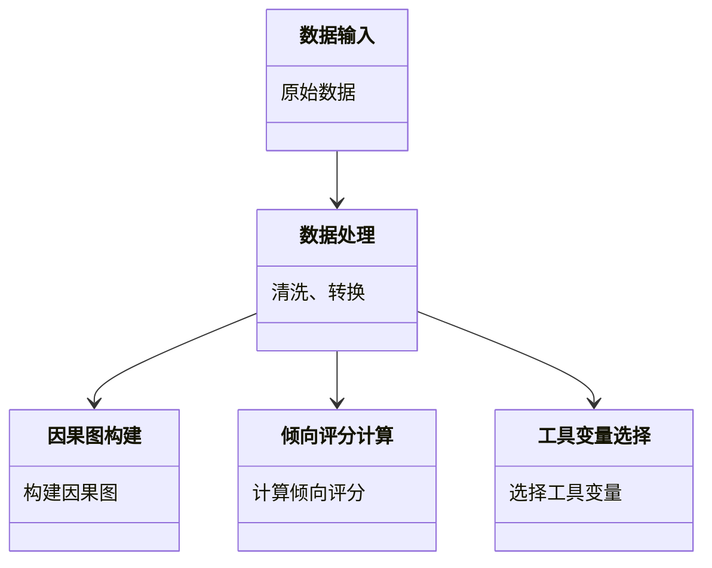
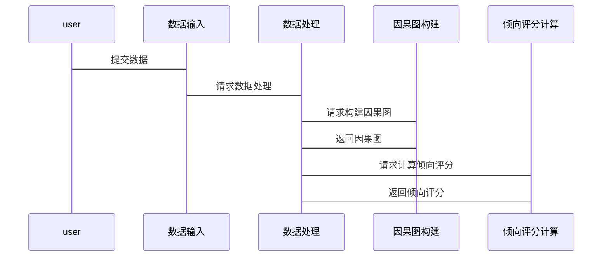

                 


# 《金融领域因果推断在政策评估中的应用》

> 关键词：因果推断，金融政策，政策评估，倾向评分匹配，工具变量法，因果图

> 摘要：本文探讨了因果推断在金融政策评估中的应用，重点介绍了潜在结果框架、因果图、倾向评分匹配和工具变量法等核心概念和方法，并通过实际案例分析了这些方法在金融领域的应用，最后提出了系统的架构设计和最佳实践。

## 第一部分: 背景介绍与核心概念

### 第1章: 因果推断的基本概念与背景

#### 1.1 什么是因果推断
- 1.1.1 因果推断的定义  
因果推断是指通过观察数据或实验数据，推断变量之间的因果关系，进而预测干预措施的效果。  
- 1.1.2 因果推断与相关概念的区分  
因果推断不同于相关分析，它关注的是因果关系，而相关分析只关注变量之间的关联。  
- 1.1.3 因果推断在金融领域的应用背景  
金融领域的政策评估需要准确理解政策对市场和经济变量的因果影响，而不仅仅关注相关性。

#### 1.2 金融政策评估中的因果推断
- 1.2.1 金融政策评估的基本问题  
金融政策评估需要解决因果识别问题，即确定政策是否真正导致了某些经济结果。  
- 1.2.2 因果推断在金融政策评估中的作用  
因果推断帮助政策制定者评估政策的真实效果，避免错误归因。  
- 1.2.3 金融政策评估中的因果推断挑战  
金融数据通常存在内生性问题，因果推断需要克服观察数据的局限性。

---

## 第二部分: 因果推断的核心原理

### 第2章: 因果推断的基本原理

#### 2.1 潜在结果框架
- 2.1.1 潜在结果的概念  
潜在结果是指在给定一组变量的情况下，某个处理的可能结果。  
- 2.1.2 平均处理效应（ATE）和条件处理效应（CATE）  
ATE是所有样本的平均处理效应，CATE是每个样本的处理效应。  
- 2.1.3 潜在结果框架在政策评估中的应用  
通过潜在结果框架，可以评估政策对不同群体的平均处理效应。

#### 2.2 因果图与因果结构
- 2.2.1 因果图的基本概念  
因果图是一种图形化工具，用于表示变量之间的因果关系。  
- 2.2.2 因果图的分类与应用  
因果图可以分为有向图和无向图，用于识别因果关系和潜在的混杂变量。  
- 2.2.3 金融政策评估中的因果图构建  
通过因果图，可以识别哪些变量是混杂变量，哪些是中介变量，从而设计合理的分析策略。

---

## 第三部分: 金融领域中的因果推断方法

### 第3章: 金融领域因果推断的方法论

#### 3.1 倾向评分匹配法（Propensity Score Matching, PSM）
- 3.1.1 倾向评分的概念与计算  
倾向评分是处理变量对结果变量的条件概率。  
- 3.1.2 匹配方法的选择与应用  
常用的匹配方法包括一对一匹配、多对一匹配等。  
- 3.1.3 PSM在金融政策评估中的应用案例  
通过倾向评分匹配，可以评估某项金融政策对市场流动性的影响。

#### 3.2 工具变量法（Instrumental Variables, IV）
- 3.2.1 工具变量的概念与选择  
工具变量是一个与处理变量相关，但仅通过处理变量影响结果变量的变量。  
- 3.2.2 IV法的基本原理与步骤  
IV法通过工具变量消除内生性问题，得到一致估计量。  
- 3.2.3 IV在金融政策评估中的应用  
例如，评估最低资本要求对银行风险的影响。

#### 3.3 差分法（Difference in Differences, DiD）
- 3.3.1 DiD法的基本原理  
DiD法通过比较处理组和对照组在处理前后的变化，消除时间效应。  
- 3.3.2 在金融政策评估中的应用  
例如，评估货币政策变化对金融市场的影响。  
- 3.3.3 模型设定与实现  
需要确保数据的平行性假设，即处理组和对照组在处理前具有相似的基线。

---

## 第四部分: 金融领域因果推断的数学模型与公式

### 第4章: 因果推断的数学模型

#### 4.1 潜在结果框架的数学表达
- 4.1.1 潜在结果的定义与表达  
对于每个样本，潜在结果是 $Y_i(1)$ 和 $Y_i(0)$。  
- 4.1.2 平均处理效应的公式推导  
$$ ATE = E[Y_i(1) - Y_i(0)] $$
- 4.1.3 条件处理效应的公式推导  
$$ CATE = E[Y_i(1) - Y_i(0) | X_i] $$

#### 4.2 因果图的数学表达
- 4.2.1 因果图的结构化表示  
用有向图表示变量之间的因果关系。  
- 4.2.2 因果关系的数学表达  
例如，$Y \leftarrow X \leftarrow Z$ 表示 $Z$ 是 $X$ 的原因，而 $X$ 是 $Y$ 的原因。  
- 4.2.3 金融政策评估中的因果图数学模型  
构建因果图以识别中介变量和混杂变量。

#### 4.3 倾向评分匹配的数学公式
- 4.3.1 倾向评分的计算公式  
$$ P(T=1 | X) = \frac{\exp(\beta X)}{1 + \exp(\beta X)} $$
- 4.3.2 匹配方法的数学表达  
例如，最近邻匹配基于倾向评分的距离进行匹配。  
- 4.3.3 评估效果的数学公式  
$$ \hat{ATE} = \frac{1}{n} \sum_{i=1}^{n} (Y_i^{obs} - Y_i^{treated}) $$

#### 4.4 工具变量法的数学公式
- 4.4.1 工具变量的定义与选择  
工具变量 $Z$ 满足 $Z \perp U$ 和 $Z \perp Y | X$。  
- 4.4.2 IV估计量的公式推导  
$$ \hat{\theta} = \frac{\text{Cov}(Z, X)}{\text{Cov}(Z, Y)} $$
- 4.4.3 金融政策评估中的IV应用公式  
例如，评估最低资本要求对银行风险的影响时，可以使用监管强度作为工具变量。

---

## 第五部分: 金融领域因果推断的系统分析与架构设计

### 第5章: 金融政策评估系统的系统分析与架构设计

#### 5.1 问题场景介绍
- 5.1.1 金融政策评估的基本问题  
如何准确评估金融政策的真实效果，克服内生性问题。  
- 5.1.2 系统目标与范围  
构建一个能够进行因果推断的金融政策评估系统。  
- 5.1.3 项目介绍  
通过系统化的方法，结合因果推断理论，设计一个可扩展的金融政策评估框架。

#### 5.2 系统功能设计
- 5.2.1 功能需求概述  
包括数据预处理、因果图构建、倾向评分计算、工具变量选择等。  
- 5.2.2 领域模型（Mermaid 类图）  


#### 5.3 系统架构设计
- 5.3.1 系统架构概述  
采用分层架构，包括数据层、计算层、应用层。  
- 5.3.2 系统架构（Mermaid 架构图）  

- 5.3.3 系统接口设计  
定义接口，如数据输入接口、算法调用接口等。  
- 5.3.4 系统交互（Mermaid 序列图）  


---

## 第六部分: 项目实战

### 第6章: 金融政策评估的实战分析

#### 6.1 环境安装
- 6.1.1 安装所需的工具与库  
例如，Python、Pandas、Scikit-learn、NetworkX等。  
- 6.1.2 数据获取与预处理  
加载数据，清洗，转换为适合分析的形式。  
- 6.1.3 确定项目目标  
例如，评估某项货币政策对通货膨胀的影响。

#### 6.2 核心实现
- 6.2.1 数据预处理  
处理缺失值、异常值等。  
- 6.2.2 因果图构建  
使用NetworkX库构建因果图。  
- 6.2.3 倾向评分计算  
使用Logistic回归模型计算倾向评分。  
- 6.2.4 工具变量选择  
选择合适的工具变量，如外部冲击或政策执行前的变量。

#### 6.3 代码实现
```python
import numpy as np
import pandas as pd
from sklearn.linear_model import LogisticRegression
import networkx as nx

# 数据预处理
data = pd.read_csv('financial_policy.csv')
data.dropna(inplace=True)

# 构建因果图
G = nx.DiGraph()
G.add_edges_from([('Policy', 'GDP'), ('GDP', 'Inflation'), ('Policy', 'Interest Rate')])
nx.draw(G, with_labels=True)
```

#### 6.4 案例分析与结果解读
- 6.4.1 实施倾向评分匹配  
使用倾向评分匹配方法，评估政策对通货膨胀的影响。  
- 6.4.2 应用工具变量法  
通过工具变量法，消除内生性问题，得到一致估计量。  
- 6.4.3 结果分析与解释  
解释结果的经济含义，评估政策的真实效果。

---

## 第七部分: 最佳实践与总结

### 第7章: 最佳实践与总结

#### 7.1 最佳实践 tips
- 确保数据质量，处理缺失值和异常值。  
- 合理选择工具变量，确保其符合外生性和相关性。  
- 在实际应用中，结合领域知识，选择合适的因果推断方法。  

#### 7.2 小结
因果推断在金融政策评估中具有重要的应用价值，能够帮助政策制定者更准确地评估政策效果。通过潜在结果框架、因果图、倾向评分匹配和工具变量法等方法，可以有效克服内生性问题，提高评估结果的可靠性。

#### 7.3 注意事项
- 金融数据通常具有复杂性，需要结合领域知识进行分析。  
- 内生性问题可能会导致估计偏差，需要通过因果推断方法进行调整。  
- 在实际应用中，需要考虑数据的可获得性和模型的适用性。  

#### 7.4 拓展阅读
- 安德鲁·G·特恩斯的《因果推断：理论与方法》  
- 贾斯汀·马奎斯的《因果推断入门》  
- 维基百科上的因果图和倾向评分匹配相关词条。

---

## 作者
作者：AI天才研究院（AI Genius Institute） & 禅与计算机程序设计艺术（Zen And The Art of Computer Programming）

