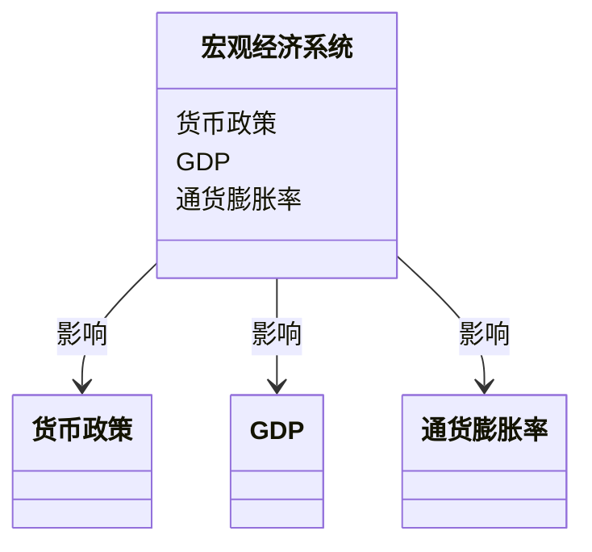
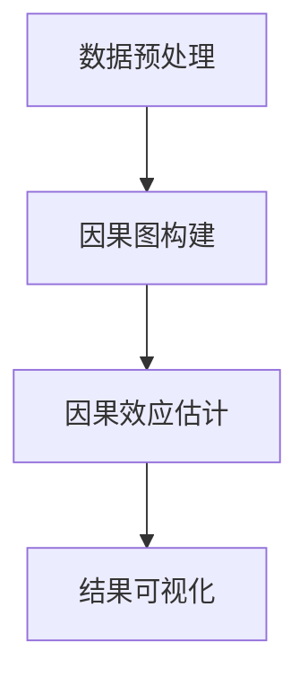

                 

# 金融领域因果推理在宏观经济分析中的应用

**关键词**：因果推理、宏观经济分析、金融领域、因果图模型、潜在结果框架

**摘要**：  
本文深入探讨了因果推理在金融领域宏观经济分析中的应用，结合理论与实践，系统性地分析了因果推理的核心概念、算法原理以及在宏观经济预测和政策评估中的实际应用。通过具体案例，展示了如何利用因果推理解决复杂的宏观经济问题，并提出了构建宏观经济因果推理模型的方法和系统架构设计方案。文章旨在为金融领域的研究人员和实践者提供理论与实践相结合的指导，帮助他们更好地理解和应用因果推理技术。

---

# 第1章 背景介绍与问题背景

## 1.1 问题背景

### 1.1.1 金融领域分析的复杂性
金融领域的分析往往涉及复杂的经济系统和多维度的变量关系。例如，货币政策、财政政策、市场行为等都会对宏观经济指标（如GDP、通货膨胀率、失业率等）产生影响。然而，这些变量之间的关系往往是非线性的，且存在复杂的反馈机制。传统的方法（如相关性分析）难以揭示变量之间的因果关系，容易导致错误的结论。

### 1.1.2 宏观经济分析的核心挑战
宏观经济分析的核心目标是理解变量之间的因果关系，并基于这些关系进行预测和政策评估。然而，以下挑战使得传统的统计方法难以应对：
- **内生性问题**：许多宏观经济变量之间存在双向因果关系，例如货币政策可能影响经济增长，而经济增长又可能反过来影响货币政策。
- **数据的不可实验性**：宏观经济数据通常是观察数据，而非实验数据，这使得随机化试验难以实施。
- **复杂性与动态性**：宏观经济系统具有高度的复杂性和动态性，变量之间的关系可能会随时间发生变化。

### 1.1.3 因果推理在金融分析中的重要性
因果推理通过揭示变量之间的因果关系，为宏观经济分析提供了更强大的工具。例如：
- 在货币政策评估中，因果推理可以识别货币政策对GDP的实际影响，而非仅仅是相关性。
- 在经济预测中，因果推理可以帮助建立更准确的预测模型，避免传统相关性分析可能导致的错误。

## 1.2 问题描述

### 1.2.1 宏观经济变量之间的关系
宏观经济变量之间的关系通常是复杂且多层次的。例如，GDP增长可能受到货币政策、财政政策、市场信心等多种因素的影响。

### 1.2.2 传统相关性分析的局限性
相关性分析只能揭示变量之间的统计关联性，而无法确定因果关系。例如，两个变量可能同时受到其他因素的影响，从而表现出正相关性，但这并不意味着它们之间存在因果关系。

### 1.2.3 因果推理的目标与意义
因果推理的目标是识别变量之间的因果关系，并量化这些因果关系的强度。这有助于宏观经济分析者更好地理解经济系统的运行机制，并制定更有效的政策。

---

# 第2章 因果推理的核心概念与理论基础

## 2.1 因果关系与相关性

### 2.1.1 相关性与因果关系的区别
相关性分析只关注变量之间的统计关联性，而因果推理关注的是变量之间的因果关系。例如，吸烟与肺癌的相关性并不等同于吸烟导致肺癌的因果关系。

### 2.1.2 方向性因果关系
因果关系具有方向性。例如，A→B表示A是B的原因，但反过来B→A并不成立。

### 2.1.3 马尔可夫假设与时间顺序性
马尔可夫假设认为，因果关系可以通过时间顺序来识别。例如，先发生A，后发生B，这可能表明A是B的原因。

## 2.2 因果推理的基本原理

### 2.2.1 潜在结果框架
潜在结果框架是因果推理的基础。它假设对于每个单位（如国家、企业），在给定某些处理（如政策）的情况下，存在一个潜在的结果。例如，对于国家i，实施政策A时的GDP为$Y_i(A)$，不实施政策A时的GDP为$Y_i(A^c)$。

### 2.2.2 因果图模型
因果图模型（Directed Acyclic Graph，DAG）通过图结构表示变量之间的因果关系。例如，因果图可以表示货币政策→GDP→通货膨胀之间的因果关系。

### 2.2.3 隐变量与观察数据的关系
隐变量是因果图中未观测到的变量，它们可能会影响多个变量。例如，市场信心可能是一个隐变量，影响货币政策和GDP。

---

# 第3章 因果推理的数学模型

## 3.1 潜在结果框架

### 3.1.1 潜在结果的定义
对于每个单位i和处理A，潜在结果$Y_i(A)$是该单位在处理A下的结果。例如，$Y_i(\text{政策A})$表示国家i在实施政策A后的GDP。

### 3.1.2 平均处理效应（ATE）
平均处理效应是处理A的潜在结果的平均值与对照组的潜在结果的平均值之差：
$$
ATE = E[Y_i(A)] - E[Y_i(A^c)]
$$

### 3.1.3 因果效应的分解
因果效应可以通过分解成直接效应和间接效应来分析。例如，货币政策对GDP的直接效应和通过通货膨胀的间接效应。

## 3.2 因果图模型

### 3.2.1 贝叶斯网络与因果图
因果图可以表示为贝叶斯网络，其中节点代表变量，边代表因果关系。例如，货币政策→GDP→通货膨胀。

### 3.2.2 调整子图与干预分析
调整子图是因果图中用于识别因果效应的子图。例如，通过调整货币政策变量，可以识别其对GDP的因果效应。

---

# 第4章 因果推理算法原理

## 4.1 因果推理算法概述

### 4.1.1 工具变量法
工具变量法通过引入工具变量来估计因果效应。例如，使用某种政策作为工具变量，估计货币政策对GDP的因果效应。

### 4.1.2 回归分析与倾向评分
倾向评分匹配是一种通过回归分析估计因果效应的方法。例如，通过回归分析估计每个单位在处理A下的倾向评分，然后匹配相似的单位进行因果效应估计。

## 4.2 因果森林算法

### 4.2.1 算法基本原理
因果森林算法通过构建多棵回归树来估计因果效应。每棵回归树用于估计一个子集的因果效应，最终通过加权平均得到整体的因果效应。

### 4.2.2 算法实现步骤
1. 将数据划分为多个子集。
2. 对每个子集构建回归树。
3. 对每个回归树进行剪枝，以避免过拟合。
4. 计算每个节点的因果效应。
5. 最终通过加权平均得到整体的因果效应。

## 4.3 断点回归法

### 4.3.1 断点回归的基本原理
断点回归法通过识别断点（即处理的临界值）来估计因果效应。例如，通过识别GDP的临界值，估计货币政策对GDP的因果效应。

### 4.3.2 断点回归的实现步骤
1. 确定处理的临界值。
2. 构建回归模型，以处理变量为因变量，其他变量为自变量。
3. 通过回归模型估计因果效应。

---

# 第5章 宏观经济分析中的因果推理应用

## 5.1 宏观经济变量的因果关系建模

### 5.1.1 因果图构建
通过构建因果图，识别宏观经济变量之间的因果关系。例如，货币政策→GDP→通货膨胀。

### 5.1.2 因果关系的识别与估计
通过工具变量法或断点回归法，识别和估计因果关系。例如，使用某种政策作为工具变量，估计货币政策对GDP的因果效应。

## 5.2 宏观经济预测中的因果推理

### 5.2.1 基于因果关系的预测模型
通过因果图模型构建预测模型，例如，GDP预测模型考虑货币政策、财政政策等变量的因果关系。

### 5.2.2 经济周期预测的因果基础
通过因果推理识别经济周期的关键变量，例如，识别通货膨胀对GDP的影响，进而预测经济周期。

---

# 第6章 项目实战与系统架构设计

## 6.1 项目介绍

### 6.1.1 项目目标
构建一个宏观经济因果推理模型，用于分析货币政策对GDP的因果效应。

### 6.1.2 数据来源
使用公开的宏观经济数据，例如，GDP、通货膨胀率、利率等。

### 6.1.3 工具与技术选型
选择Python作为编程语言，使用因果推理库（如`doct`或`py causal`)进行模型构建。

## 6.2 系统功能设计

### 6.2.1 数据预处理模块
对数据进行清洗、归一化等预处理。

### 6.2.2 因果图构建模块
通过因果图模型识别变量之间的因果关系。

### 6.2.3 因果效应估计模块
使用工具变量法或断点回归法估计因果效应。

### 6.2.4 结果可视化模块
将因果效应可视化，例如，通过图表展示因果图和因果效应。

## 6.3 系统架构设计

### 6.3.1 领域模型
领域模型是一个简单的宏观经济系统，包括货币政策、GDP、通货膨胀率等变量。

### 6.3.2 系统架构
系统架构采用模块化设计，包括数据预处理、因果图构建、因果效应估计和结果可视化四个模块。

---

# 第7章 总结与展望

## 7.1 总结
本文深入探讨了因果推理在金融领域宏观经济分析中的应用，通过理论与实践相结合，展示了如何利用因果推理解决复杂的宏观经济问题。

## 7.2 展望
未来的研究可以进一步探索因果推理在其他金融领域的应用，例如，金融市场波动、风险管理等。

---

**作者**：AI天才研究院/AI Genius Institute & 禅与计算机程序设计艺术 /Zen And The Art of Computer Programming

