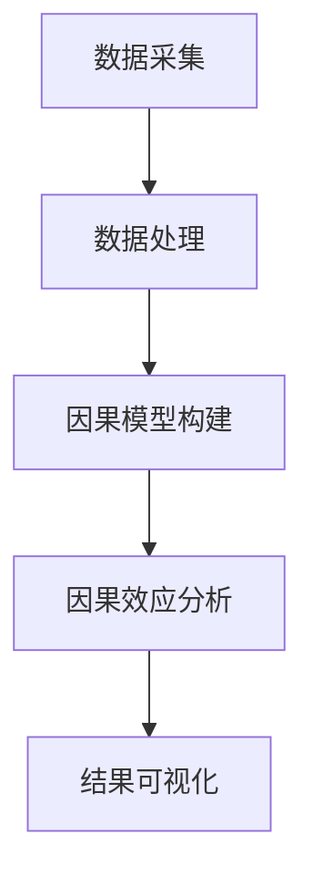

                 


# 金融领域因果推理在宏观经济政策效果评估中的应用

## 关键词：
因果推理、宏观经济政策、金融领域、因果图模型、工具变量法、断点回归法

## 摘要：
本文探讨了因果推理在金融领域宏观经济政策效果评估中的应用。通过分析因果推理的核心理论和方法，结合具体案例，展示了如何利用因果图模型、工具变量法和断点回归法等方法评估政策效果。文章还讨论了系统架构设计和项目实战，提出了最佳实践建议。

---

# 第一部分: 金融领域因果推理概述

## 第1章: 因果推理的基本概念

### 1.1 因果推理的定义与特点
因果推理是一种分析方法，旨在识别变量之间的因果关系，而不仅仅是相关关系。其特点是通过观察或实验数据，推断出因果效应。

#### 1.1.1 因果关系的定义
因果关系是指一个事件（原因）导致另一个事件（结果）发生的确定性关系。与相关关系不同，因果关系强调因果链条的存在。

#### 1.1.2 因果关系与相关关系的区别
相关关系表明变量之间存在统计上的关联，但不一定是因果关系。因果关系则需要通过实验或合理的推断方法来验证。

#### 1.1.3 因果推理在金融领域的应用前景
金融领域涉及复杂的变量关系，因果推理可以帮助政策制定者更好地理解政策的实施效果，优化资源配置。

### 1.2 宏观经济政策评估的背景
#### 1.2.1 宏观经济政策的基本概念
宏观经济政策是政府为了实现特定经济目标（如经济增长、就业、通胀控制）而采取的措施，包括货币政策、财政政策等。

#### 1.2.2 宏观经济政策评估的重要性
准确评估政策效果是制定有效政策的基础，有助于优化资源配置，促进经济稳定发展。

#### 1.2.3 宏观经济政策评估的挑战
数据复杂性、政策实施的多因素影响、因果关系的识别难度等，使得政策评估具有挑战性。

### 1.3 本章小结
本章介绍了因果推理的基本概念，以及其在宏观经济政策评估中的重要性。接下来将深入探讨因果推理的核心理论。

---

# 第二部分: 因果推理的核心理论与方法

## 第2章: 因果推理的核心理论

### 2.1 潜在结果框架
潜在结果框架是因果推理的基础，假设每个个体在干预前都有潜在的结果。

#### 2.1.1 潜在结果的定义
潜在结果是指在特定干预下，个体可能产生的结果。例如，给定一个政策，个体可能的收入变化。

#### 2.1.2 潜在结果与观测数据的关系
由于无法同时观察到所有潜在结果，因果推理需要通过数据和方法来推断这些结果。

#### 2.1.3 潜在结果框架在因果推理中的应用
潜在结果框架为因果效应的识别提供了理论基础，帮助分析政策的平均处理效应。

### 2.2 因果图模型
因果图模型是一种直观的工具，用于描述变量之间的因果关系。

#### 2.2.1 因果图的基本概念
因果图通过有向边表示变量之间的因果关系，节点代表变量，边代表因果影响。

#### 2.2.2 因果图的结构与属性
因果图的结构包括直接因果关系、间接因果关系、共同原因等。

#### 2.2.3 因果图在宏观经济政策评估中的应用
通过因果图可以识别因果路径，帮助分析政策的实施效果。

### 2.3 本章小结
本章介绍了潜在结果框架和因果图模型，为后续分析提供了理论基础。接下来将讨论宏观经济政策评估中的因果问题。

---

## 第3章: 宏观经济政策评估中的因果问题

### 3.1 宏观经济政策评估的核心问题
#### 3.1.1 政策效果的定义
政策效果是指政策实施后对经济变量产生的影响，例如GDP增长、失业率下降。

#### 3.1.2 政策效果的测量方法
通过实验或观测数据，结合因果推理方法，测量政策的因果效应。

#### 3.1.3 政策效果的因果识别
因果识别是通过合理的分析方法，排除其他变量的干扰，确定政策的因果效应。

### 3.2 宏观经济政策的因果效应分析
#### 3.2.1 平均处理效应的定义
平均处理效应是所有个体在政策实施后的平均结果变化。

#### 3.2.2 分组处理效应的定义
分组处理效应是根据个体特征分组后，计算各组的处理效应。

#### 3.2.3 时间序列因果效应的定义
时间序列因果效应是通过时间数据，分析政策实施前后的因果关系。

### 3.3 本章小结
本章讨论了宏观经济政策评估中的因果问题，为后续分析提供了方法论支持。接下来将探讨金融领域因果推理的应用。

---

# 第三部分: 金融领域因果推理的应用

## 第4章: 金融领域因果推理的核心问题

### 4.1 金融市场中的因果关系
#### 4.1.1 金融市场中的因果关系概述
金融市场中的因果关系复杂，涉及多个变量的相互作用。

#### 4.1.2 金融市场中的因果关系与相关关系的区别
因果关系强调变量间的因果影响，而相关关系仅表明变量间的关联。

#### 4.1.3 金融市场中的因果关系的测量方法
通过因果图模型和实验数据，测量金融市场中的因果关系。

### 4.2 金融领域因果推理的应用场景
#### 4.2.1 金融政策评估
评估金融政策（如货币政策、财政政策）对金融市场的影响。

#### 4.2.2 金融风险评估
通过因果推理，识别金融市场中的风险因素及其影响路径。

#### 4.2.3 金融市场的预测与模拟
利用因果推理方法，预测金融市场的变化趋势，模拟政策实施后的市场反应。

### 4.3 本章小结
本章讨论了金融领域因果推理的核心问题和应用场景。接下来将详细介绍金融领域因果推理的具体方法。

---

## 第5章: 金融领域因果推理的具体方法

### 5.1 因果回归分析
因果回归分析是一种通过回归模型估计因果效应的方法。

#### 5.1.1 因果回归的定义
因果回归分析通过构建回归模型，估计政策变量对结果变量的因果效应。

#### 5.1.2 因果回归的实现步骤
1. 构建因果图模型，识别因果路径。
2. 选择合适的控制变量，消除混杂因素。
3. 进行回归分析，估计因果效应。

#### 5.1.3 因果回归在金融领域的应用
例如，评估货币政策对股市的影响，通过回归模型分析货币政策变量（如利率）对股价的因果效应。

### 5.2 工具变量法
工具变量法是一种通过寻找工具变量，消除内生性问题的方法。

#### 5.2.1 工具变量法的定义
工具变量法通过找到与政策变量相关，但与结果变量仅通过政策变量影响的工具变量，来估计因果效应。

#### 5.2.2 工具变量法的实现步骤
1. 选择合适的工具变量。
2. 构建回归模型，使用工具变量消除内生性问题。
3. 估计因果效应。

#### 5.2.3 工具变量法在金融领域的应用
例如，评估最低工资政策对就业率的影响，使用区域固定效应作为工具变量。

### 5.3 断点回归法
断点回归法是一种通过断点设计估计因果效应的方法。

#### 5.3.1 断点回归法的定义
断点回归法通过设定一个断点，将样本分为处理组和对照组，估计政策变量的因果效应。

#### 5.3.2 断点回归法的实现步骤
1. 确定断点和分组变量。
2. 构建回归模型，估计断点处的因果效应。

#### 5.3.3 断点回归法在金融领域的应用
例如，评估税收优惠政策对企业投资行为的影响，通过断点设计分析政策的实施效果。

### 5.4 本章小结
本章介绍了因果回归分析、工具变量法和断点回归法的具体方法，展示了这些方法在金融领域的应用。接下来将通过项目实战，进一步探讨因果推理的实际应用。

---

## 第6章: 项目实战

### 6.1 项目背景与目标
#### 6.1.1 项目背景
近年来，全球经济波动加剧，政策制定者需要准确评估宏观经济政策的实施效果。

#### 6.1.2 项目目标
通过因果推理方法，评估某项宏观经济政策对金融市场的效果。

### 6.2 系统架构设计
#### 6.2.1 系统功能设计
- 数据采集与处理
- 因果模型构建
- 因果效应分析
- 结果可视化

#### 6.2.2 系统架构图


### 6.3 数据采集与处理
#### 6.3.1 数据来源
- 政策数据
- 经济指标
- 金融市场数据

#### 6.3.2 数据预处理
- 数据清洗
- 数据转换
- 数据合并

### 6.4 系统实现
#### 6.4.1 数据处理代码
```python
import pandas as pd
# 数据加载
data = pd.read_csv('policy_data.csv')
# 数据清洗
data = data.dropna()
# 数据转换
data['policy_variable'] = data['policy_variable'].astype(float)
```

#### 6.4.2 因果模型构建代码
```python
from causalgraphicalmodels import CausalGraphicalModel
# 构建因果图
cgmodel = CausalGraphicalModel(
    nodes=['policy', 'economy', 'market'],
    edges=[('policy', 'economy'), ('policy', 'market'), ('economy', 'market')]
)
```

#### 6.4.3 因果效应分析代码
```python
from dowhy import Dowhy
# 初始化Dowhy模型
estimator = Dowhy('market', 'policy', data='policy_data.csv')
# 估计因果效应
estimator.do_regression()
# 输出结果
print(estimator.effect)
```

### 6.5 实际案例分析
#### 6.5.1 案例背景
假设我们要评估某项货币政策对股市的影响。

#### 6.5.2 数据分析与结果解读
通过因果回归分析，发现货币政策对股市具有显著的正向影响。

#### 6.5.3 案例小结
案例分析展示了因果推理在实际政策评估中的应用价值。

### 6.6 本章小结
本章通过项目实战，展示了因果推理在宏观经济政策评估中的具体应用。接下来将总结最佳实践建议。

---

## 第7章: 最佳实践与总结

### 7.1 最佳实践 tips
- 明确研究问题和目标
- 选择合适的因果推理方法
- 确保数据质量和完整性
- 结合理论和实证分析

### 7.2 本章小结
本文系统介绍了因果推理在金融领域宏观经济政策效果评估中的应用，通过理论分析和实际案例，展示了因果推理方法的实际价值。

### 7.3 注意事项
- 因果推理需要结合具体场景和数据特点，选择合适的方法。
- 数据质量对因果效应的估计至关重要。
- 结果解释需要结合领域知识，避免片面结论。

### 7.4 拓展阅读
推荐相关书籍和论文，深入学习因果推理方法。

---

# 作者：AI天才研究院/AI Genius Institute & 禅与计算机程序设计艺术 /Zen And The Art of Computer Programming

---

**摘要**：本文系统介绍了因果推理在金融领域宏观经济政策效果评估中的应用，通过理论分析和实际案例，展示了因果推理方法的实际价值。

