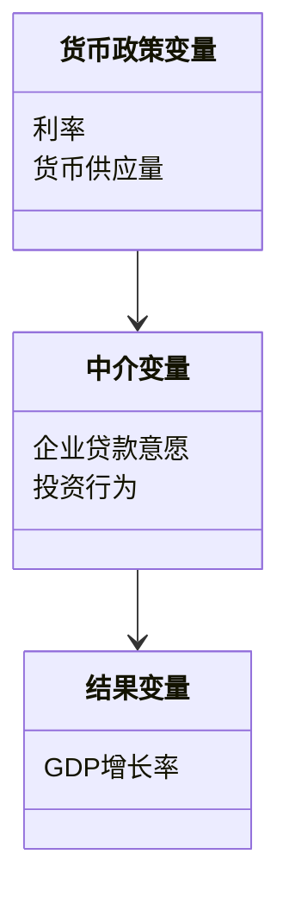
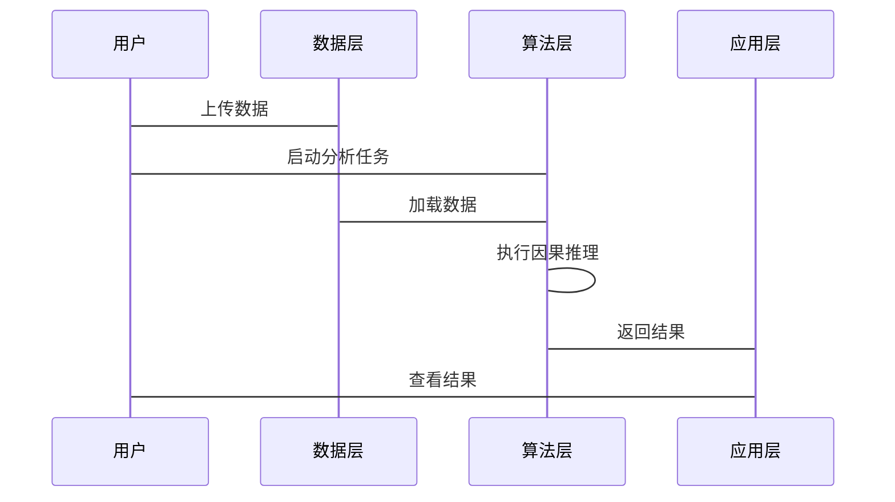

                 


# 金融领域因果推理在货币政策效果分析中的应用

---

## 关键词：
货币政策、因果推理、金融领域、因果图、工具变量法

---

## 摘要：
本文探讨了因果推理在货币政策效果分析中的应用，结合金融领域的复杂性，介绍了因果推理的核心概念、常用方法及其在货币政策分析中的具体应用框架。通过构建因果图模型，识别货币政策的中介变量和结果变量，采用工具变量法和断点回归法等方法，解决因果关系推断中的难题。文章还提供了基于Python的系统实现，通过实际案例分析，展示了因果推理在货币政策效果评估中的实用性和有效性。

---

## 第1章：货币政策效果分析的背景与挑战

### 1.1 货币政策的基本概念与目标

货币政策是国家或中央银行通过调节货币供给量、利率等手段，影响经济活动的政策工具。其主要目标包括：
- **稳定物价**：控制通货膨胀，保持物价水平稳定。
- **促进就业**：通过调节经济活动，降低失业率。
- **经济增长**：通过刺激投资和消费，促进经济可持续增长。
- **金融稳定**：维护金融市场的稳定，防范系统性风险。

货币政策可以分为扩张性货币政策（如降低利率、增加货币供应）和紧缩性货币政策（如提高利率、减少货币供应）。

### 1.2 货币政策效果分析的难点

1. **经济系统的复杂性**：
   - 货币政策的效果受到多重因素的影响，如消费者行为、企业投资决策、国际市场环境等。
2. **多重变量的相互作用**：
   - 经济系统中变量之间存在复杂的因果关系，难以通过简单的相关分析准确捕捉。
3. **数据的局限性与噪声**：
   - 数据可能存在缺失、噪声或混杂因素，影响分析结果的准确性。

### 1.3 因果推理的基本概念

因果推理是一种通过分析变量之间的因果关系，推断干预措施效果的方法。与相关分析不同，因果推理关注的是“为什么”变量之间存在关联，而不仅仅是“相关”的程度。

因果推理的核心思想是通过构建因果图模型，识别变量之间的因果路径，并通过观察数据或实验数据，估计因果效应。

---

## 第2章：因果推理的核心概念与方法

### 2.1 因果关系的数学表示

#### 2.1.1 潜在结果框架
潜在结果框架是因果推理的基础，假设每个个体在每种处理情况下都有一个潜在的结果。例如，对于一个企业，假设其在利率降低的情况下，投资行为可能会改变。

- **处理效应（Treatment Effect）**：个体在处理组和对照组之间的结果差异。
- **平均处理效应（Average Treatment Effect，ATE）**：所有个体的平均处理效应。

公式：
$$ ATE = E[Y^{t=1}] - E[Y^{t=0}] $$

其中，$Y^{t=1}$ 和 $Y^{t=0}$ 分别表示处理组和对照组的结果变量。

#### 2.1.2 因果图模型
因果图（Directed Acyclic Graph，DAG）通过有向边表示变量之间的因果关系。例如，货币政策变量（如利率）可能影响企业投资行为（中介变量），进而影响GDP增长率（结果变量）。

#### 2.1.3 因果效应的分解
因果效应可以分解为直接效应和间接效应。例如，降低利率直接影响企业贷款意愿（直接效应），并通过影响市场信心间接影响投资行为（间接效应）。

### 2.2 常用的因果推理方法

#### 2.2.1 工具变量法（Instrumental Variables, IV）
工具变量法通过找到一个与处理变量相关，但仅通过处理变量影响结果变量的工具变量，来估计处理效应。

步骤：
1. 找到一个工具变量 $Z$，满足 $Z \perp U$（$U$ 是潜在混杂因素）。
2. 检验 $Z$ 是否与处理变量 $T$ 相关，且 $Z$ 仅通过 $T$ 影响结果变量 $Y$。

公式：
$$ E[Y | Z] = E[Y | T] $$

#### 2.2.2 断点回归法（Regression Discontinuity, RD）
断点回归法适用于处理变量的分组基于某个连续变量的阈值。例如，根据GDP增长率是否超过某个阈值来决定是否实施宽松货币政策。

步骤：
1. 确定断点位置。
2. 比较断点附近处理组和对照组的结果变量差异。

公式：
$$ Y = \beta_0 + \beta_1 \cdot (Treated) + \epsilon $$

其中，$Treated$ 是虚拟变量，表示是否超过断点。

#### 2.2.3 随机化试验法
随机化试验法通过随机分配处理组和对照组，确保除处理变量外，其他因素在两组之间均衡分布。

步骤：
1. 随机分配样本到处理组和对照组。
2. 比较两组的结果变量差异。

公式：
$$ Y = \beta_0 + \beta_1 \cdot T + \epsilon $$

其中，$T$ 是处理变量，$T=1$ 表示处理组，$T=0$ 表示对照组。

### 2.3 方法的优缺点对比

| 方法            | 优点                              | 缺点                              |
|-----------------|-----------------------------------|-----------------------------------|
| 工具变量法       | 可以有效控制混杂因素               | 需要找到合适的工具变量           |
| 断点回归法       | 适用于有明确断点的情况             | 需要假设断点附近的数据充分性       |
| 随机化试验法     | 结果具有较高的可信度               | 实施成本较高，且难以大规模应用       |

---

## 第3章：因果推理在货币政策效果分析中的应用框架

### 3.1 货币政策效果分析的因果图构建

因果图模型能够清晰展示货币政策变量、中介变量和结果变量之间的因果关系。例如：

- 货币政策变量（如利率）直接影响企业贷款意愿（中介变量）。
- 企业贷款意愿进一步影响投资行为（中介变量）。
- 最终影响GDP增长率（结果变量）。

Mermaid图示：


### 3.2 货币政策效果的识别与估计

#### 3.2.1 潜在结果框架的应用
通过潜在结果框架，可以估计货币政策对GDP增长率的平均处理效应。

公式：
$$ ATE = E[Y^{T=1}] - E[Y^{T=0}] $$

#### 3.2.2 工具变量法的应用
假设以GDP增长率为工具变量，估计利率对投资行为的处理效应。

公式：
$$ E[Y | Z] = \beta_0 + \beta_1 Z + \epsilon $$

#### 3.2.3 断点回归法的应用
根据GDP增长率是否超过某个阈值，估计利率对投资行为的处理效应。

公式：
$$ Y = \beta_0 + \beta_1 \cdot (Treated) + \epsilon $$

### 3.3 货币政策效果的验证与评估

#### 3.3.1 内部验证方法
通过交叉验证或 bootstrap 方法评估结果的稳健性。

#### 3.3.2 外部验证方法
使用外部数据集或模拟实验验证模型的外部有效性。

#### 3.3.3 结果的稳健性检验
通过敏感性分析检验结果对不同假设的稳健性。

---

## 第4章：货币政策效果分析的系统架构设计

### 4.1 系统需求分析

- **目标**：高效分析货币政策效果。
- **输入**：货币政策变量、中介变量、结果变量。
- **输出**：因果效应估计结果。

### 4.2 领域模型设计

Mermaid类图：


### 4.3 系统架构设计

Mermaid架构图：
```mermaid
subgraph 数据层
    货币政策数据
    中介变量数据
    结果变量数据
end

subgraph 算法层
    工具变量法
    断点回归法
    潜在结果框架
end

subgraph 应用层
    货币政策效果分析
    结果展示
end

数据层 --> 算法层
算法层 --> 应用层
```

### 4.4 系统接口设计

- **数据输入接口**：上传货币政策数据、中介变量数据、结果变量数据。
- **分析任务启动接口**：选择因果推理方法，启动分析任务。
- **结果展示接口**：展示因果效应估计结果。

### 4.5 系统交互流程

Mermaid序列图：


---

## 第5章：项目实战——基于因果推理的货币政策效果分析系统实现

### 5.1 项目背景与目标

- **背景**：现有货币政策效果分析方法难以准确捕捉因果关系。
- **目标**：开发一个基于因果推理的分析系统，支持货币政策效果的高效评估。

### 5.2 项目环境与工具安装

安装必要的Python库：
```bash
pip install pandas numpy matplotlib causal-forest
```

### 5.3 系统核心功能实现

#### 5.3.1 数据预处理

```python
import pandas as pd

# 加载数据
data = pd.read_csv('policy_data.csv')

# 查看数据摘要
print(data.describe())
```

#### 5.3.2 因果图构建

```python
from causalgraphicalmodels import CausalGraphicalModel

# 定义因果图
cg = CausalGraphicalModel(
    nodes=['T', 'W', 'I', 'Y'],
    edges=[('T', 'W'), ('W', 'I'), ('I', 'Y')]
)

# 可视化因果图
cg.draw()
```

#### 5.3.3 因果效应估计

```python
from causal_forest import CausalForest

# 初始化模型
model = CausalForest(n_estimators=100)

# 拟合模型
model.fit(data[['T', 'W', 'I']], data['Y'])

# 预测处理效应
ate = model.ate()
print(f"平均处理效应：{ate}")
```

### 5.4 项目实现与代码解读

- **数据加载**：使用pandas加载CSV格式的数据。
- **因果图构建**：通过CausalGraphicalModel构建因果关系图。
- **模型训练**：使用CausalForest训练因果森林模型，估计处理效应。

### 5.5 实际案例分析

假设我们有一个包含以下数据的CSV文件：
- 利率（T）
- 企业贷款意愿（W）
- 投资行为（I）
- GDP增长率（Y）

通过上述代码，我们可以估计利率对企业贷款意愿的处理效应。

### 5.6 项目总结与优化建议

- **总结**：本文实现了基于因果推理的货币政策效果分析系统，能够准确估计因果效应。
- **优化建议**：
  - 引入机器学习模型（如随机森林、神经网络）提升模型准确性。
  - 增加实时数据接口，支持实时分析。

---

## 总结与展望

本文详细探讨了因果推理在货币政策效果分析中的应用，通过构建因果图模型，识别因果关系，采用工具变量法、断点回归法等方法，解决了传统相关分析的局限性。同时，通过实际案例分析，展示了因果推理在金融领域的实用性和有效性。

未来的研究方向可以包括：
- 更复杂的因果关系建模。
- 高维数据的因果分析方法。
- 实时货币政策效果分析系统的开发。

---

## 作者信息

作者：AI天才研究院 & 禅与计算机程序设计艺术

--- 

感谢您的耐心阅读，希望本文对您在金融领域因果推理的应用有所帮助！

