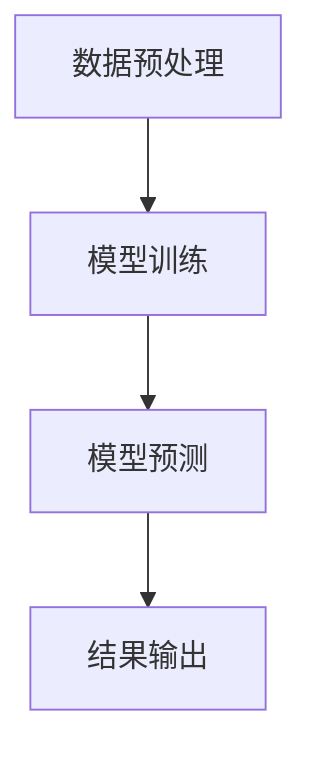

                 


# 金融领域图卷积网络在欺诈检测中的应用

> 关键词：金融欺诈检测，图卷积网络，深度学习，图数据，异常检测

> 摘要：本文详细探讨了图卷积网络（Graph Convolutional Networks，GCN）在金融领域欺诈检测中的应用。通过分析金融数据的图结构特征，本文提出了一种基于GCN的欺诈检测方法，涵盖了从数据建模到算法实现的完整流程。文章首先介绍了金融欺诈检测的背景和挑战，接着深入讲解了GCN的核心概念和数学原理，然后分析了金融领域图数据的建模方法，详细阐述了GCN在欺诈检测中的算法实现，最后通过实际案例展示了系统设计与项目实战。本文旨在为金融领域的欺诈检测提供一种高效且鲁棒的解决方案。

---

# 第1章: 金融欺诈检测概述

## 1.1 金融欺诈检测的重要性

### 1.1.1 金融欺诈的定义与类型

金融欺诈是指通过欺骗手段非法获取或占用他人或金融机构的财产或利益的行为。常见的金融欺诈类型包括信用卡欺诈、交易欺诈、洗钱、身份盗用等。这些欺诈行为不仅给个人和企业带来经济损失，还可能破坏金融系统的信任和稳定性。

### 1.1.2 金融欺诈对金融机构和用户的影响

金融欺诈对金融机构的影响包括直接经济损失、声誉损害、合规风险等。对于用户而言，欺诈可能导致财产损失、信用记录受损以及隐私泄露等问题。因此，有效检测和预防金融欺诈对金融机构和用户都具有重要意义。

### 1.1.3 传统欺诈检测方法的局限性

传统的欺诈检测方法主要包括规则-based检测、统计分析和基于机器学习的检测。然而，这些方法存在以下局限性：
- 规则-based检测依赖于人工设定的规则，难以应对复杂的欺诈手段。
- 统计分析方法依赖于假设分布，可能无法捕捉复杂的非线性关系。
- 基于机器学习的检测方法在处理高维、非结构化数据时表现有限，且难以捕捉数据间的复杂关联。

## 1.2 图卷积网络的基本概念

### 1.2.1 图论基础

图论是研究图结构的数学理论，图由节点（顶点）和边组成。在金融领域，节点可以表示用户、交易或账户，边可以表示交易关系或资金流动关系。图的性质（如度、中心性、社区结构等）可以帮助我们发现潜在的欺诈行为。

### 1.2.2 卷积神经网络基础

卷积神经网络（CNN）是一种深度学习模型，常用于处理图像、文本等结构化数据。其核心思想是通过局部感受野和权值共享机制来提取数据的特征。

### 1.2.3 图卷积网络的定义与特点

图卷积网络（GCN）是将卷积操作扩展到图结构数据的一种深度学习模型。其核心思想是将图的节点特征与其邻居节点的特征进行聚合，从而生成新的节点表示。GCN具有以下特点：
- 能够处理非结构化图数据。
- 能够捕捉节点之间的关系和上下文信息。
- 具有良好的可扩展性和灵活性。

## 1.3 图卷积网络在金融领域的应用前景

### 1.3.1 金融领域中的图数据特点

金融领域的图数据具有以下特点：
- 节点类型多样：包括用户、账户、交易等。
- 边类型多样：包括交易关系、转账关系等。
- 数据稀疏性：某些节点之间的连接较少。

### 1.3.2 图卷积网络在金融欺诈检测中的优势

GCN在金融欺诈检测中的优势包括：
- 能够捕捉复杂的节点关系和网络结构。
- 能够处理高维、非结构化的图数据。
- 能够发现潜在的欺诈模式和异常行为。

### 1.3.3 未来发展趋势与挑战

未来，GCN在金融欺诈检测中的应用将更加广泛，但也面临以下挑战：
- 图数据的稀疏性和噪声问题。
- 模型的可解释性和透明性。
- 计算资源和训练效率问题。

---

## 1.4 本章小结

本章介绍了金融欺诈检测的重要性，分析了传统方法的局限性，并提出了图卷积网络（GCN）作为一种新的解决方案。通过介绍GCN的基本概念和特点，我们为后续章节的深入分析奠定了基础。

---

# 第2章: 图卷积网络的核心概念与原理

## 2.1 图论基础

### 2.1.1 图的定义与表示

图由节点和边组成，通常用符号$G = (V, E)$表示，其中$V$是节点集合，$E$是边集合。

### 2.1.2 图的属性与特征

图的属性包括度（节点的度数）、中心性（如PageRank）、社区结构等。这些属性可以帮助我们理解图的结构特征。

### 2.1.3 图的遍历算法

常见的图遍历算法包括广度优先搜索（BFS）和深度优先搜索（DFS）。这些算法可以帮助我们探索图的结构。

## 2.2 卷积神经网络基础

### 2.2.1 卷积操作的定义

卷积操作通过对输入数据应用卷积核提取特征。例如，1维卷积操作可以表示为：
$$ y_i = \sum_{j=1}^{k} w_j x_{i+j} $$

### 2.2.2 池化操作的作用

池化操作（如最大池化）可以降低数据维度，同时保持特征的不变性。例如，最大池化操作可以表示为：
$$ y_i = \max_{j \in \text{neighbor}(i)} x_j $$

### 2.2.3 网络结构的优化

网络结构的优化包括卷积核大小的选择、跳跃连接的引入等，以提高模型的性能和泛化能力。

## 2.3 图卷积网络的数学模型

### 2.3.1 图的邻接矩阵表示

邻接矩阵$A$表示节点之间的连接关系，其中$A_{ij} = 1$表示节点$i$和$j$之间有边相连，否则为0。

### 2.3.2 图的拉普拉斯矩阵表示

拉普拉斯矩阵$L$可以表示为：
$$ L = D - A $$
其中$D$是对角度矩阵，$D_{ii} = \sum_{j} A_{ij}$。

### 2.3.3 图卷积操作的数学公式

图卷积操作可以表示为：
$$ y = \sum_{i=1}^{n} A_{ij}x_i $$

### 2.3.4 GCN的传播规则

GCN的传播规则可以表示为：
$$ h^{(l+1)} = \sigma(A h^{(l)} W^{(l)}) $$

其中$h^{(l)}$表示第$l$层的节点表示，$W^{(l)}$是权重矩阵，$\sigma$是非线性激活函数。

---

## 2.4 图卷积网络的算法流程

### 2.4.1 数据预处理

数据预处理包括图的构建、节点特征提取、边特征提取等。

### 2.4.2 模型训练

模型训练包括前向传播、损失计算、反向传播和参数更新。

### 2.4.3 模型预测

模型预测包括输入图数据、前向传播，得到预测结果。

## 2.5 本章小结

本章详细介绍了图卷积网络的核心概念和数学模型，为后续章节的分析奠定了理论基础。

---

# 第3章: 金融欺诈检测中的图数据建模

## 3.1 金融交易数据的图表示

### 3.1.1 交易数据的节点表示

节点可以表示为交易、账户或用户。例如，节点表示可以包括交易金额、时间、地点等特征。

### 3.1.2 交易数据的边表示

边可以表示交易关系或转账关系。例如，边表示可以包括交易金额、时间、频率等特征。

### 3.1.3 交易图的构建方法

交易图的构建方法包括基于交易金额、时间、频率等特征的边生成。

---

## 3.2 用户行为数据的图表示

### 3.2.1 用户节点的定义

用户节点可以包括用户ID、交易历史、信用评分等特征。

### 3.2.2 用户行为的边表示

边可以表示用户之间的关联，如共同交易、共同账户等。

### 3.2.3 用户行为图的构建方法

用户行为图的构建方法包括基于用户交易历史、账户关联等特征的边生成。

---

## 3.3 金融欺诈图的特征分析

### 3.3.1 欺诈交易的特征提取

欺诈交易的特征包括交易金额异常、交易频率异常、交易时间异常等。

### 3.3.2 欺诈用户的特征提取

欺诈用户的特征包括账户异常、交易异常、行为异常等。

### 3.3.3 欺诈图的识别方法

欺诈图的识别方法包括基于GCN的异常检测、基于聚类的欺诈检测等。

---

## 3.4 本章小结

本章分析了金融欺诈检测中的图数据建模方法，为后续章节的算法实现奠定了基础。

---

# 第4章: 图卷积网络在欺诈检测中的算法实现

## 4.1 图卷积网络的算法原理

### 4.1.1 图卷积操作的详细解释

图卷积操作通过聚合节点及其邻居节点的特征来生成新的节点表示。

---

### 4.1.2 GCN的传播规则

GCN的传播规则可以表示为：
$$ h^{(l+1)} = \sigma(A h^{(l)} W^{(l)}) $$

---

## 4.2 基于GCN的欺诈检测算法

### 4.2.1 算法流程

1. 数据预处理：构建图结构，提取节点和边特征。
2. 模型训练：使用GCN进行训练，优化模型参数。
3. 模型预测：输入待检测数据，输出欺诈概率。

### 4.2.2 算法实现

```python
class GCN(torch.nn.Module):
    def __init__(self, input_dim, hidden_dim, output_dim):
        super(GCN, self).__init__()
        self.conv1 = GCNConv(input_dim, hidden_dim)
        self.conv2 = GCNConv(hidden_dim, output_dim)
        self.relu = torch.nn.ReLU()
        self.sigmoid = torch.nn.Sigmoid()

    def forward(self, x, edge_index):
        x = self.conv1(x, edge_index)
        x = self.relu(x)
        x = self.conv2(x, edge_index)
        x = self.sigmoid(x)
        return x
```

---

## 4.3 算法的数学模型

### 4.3.1 GCN的数学公式

GCN的数学公式可以表示为：
$$ h^{(l+1)} = \sigma(A h^{(l)} W^{(l)}) $$

---

## 4.4 本章小结

本章详细介绍了基于GCN的欺诈检测算法，包括算法原理、实现方法和数学模型。

---

# 第5章: 系统设计与实现

## 5.1 系统架构设计

### 5.1.1 系统功能模块

系统功能模块包括数据预处理、模型训练、模型预测等。

### 5.1.2 系统架构图



---

## 5.2 系统实现细节

### 5.2.1 数据预处理

数据预处理包括图的构建、节点特征提取、边特征提取等。

### 5.2.2 模型训练

模型训练包括数据加载、模型初始化、损失计算、反向传播和参数更新。

### 5.2.3 模型预测

模型预测包括数据加载、模型前向传播和结果输出。

---

## 5.3 系统测试与优化

### 5.3.1 测试数据集

测试数据集包括正常交易和欺诈交易两类数据。

### 5.3.2 模型评估指标

模型评估指标包括准确率、召回率、F1分数等。

---

## 5.4 本章小结

本章详细介绍了系统的架构设计与实现细节，为后续章节的项目实战奠定了基础。

---

# 第6章: 项目实战

## 6.1 项目背景与目标

### 6.1.1 项目背景

本项目旨在通过GCN技术实现金融欺诈检测。

### 6.1.2 项目目标

项目目标包括构建欺诈检测模型、优化模型性能、验证模型有效性。

---

## 6.2 项目实施步骤

### 6.2.1 环境配置

环境配置包括安装PyTorch、PyG等依赖库。

### 6.2.2 数据集获取与预处理

数据集获取与预处理包括数据清洗、特征提取、图构建等。

### 6.2.3 模型训练与优化

模型训练与优化包括模型参数调优、训练集验证集划分等。

### 6.2.4 模型预测与结果分析

模型预测与结果分析包括模型预测、结果可视化、性能评估等。

---

## 6.3 项目代码实现

### 6.3.1 数据预处理代码

```python
import torch
from torch_geometric.data import Data

# 构建图数据
edge_index = torch.tensor([[0, 1, 2], [1, 2, 0]], dtype=torch.long)
x = torch.randn(3, 5)  # 3节点，5特征维度
data = Data(x=x, edge_index=edge_index)
```

### 6.3.2 模型训练代码

```python
model = GCN(5, 10, 1)
optimizer = torch.optim.Adam(model.parameters(), lr=0.01)
criterion = torch.nn.BCELoss()

for epoch in range(100):
    model.train()
    out = model(data.x, data.edge_index)
    loss = criterion(out, data.y)
    loss.backward()
    optimizer.step()
```

---

## 6.4 项目结果与分析

### 6.4.1 模型预测结果

模型预测结果包括正常交易和欺诈交易的分类结果。

### 6.4.2 模型性能评估

模型性能评估包括准确率、召回率、F1分数等指标。

---

## 6.5 本章小结

本章通过实际项目展示了GCN在金融欺诈检测中的应用，验证了模型的有效性和实用性。

---

# 第7章: 总结与展望

## 7.1 总结

本总结了GCN在金融欺诈检测中的应用，包括其优势和局限性。

---

## 7.2 未来展望

未来，GCN在金融欺诈检测中的应用将更加广泛，但也需要解决一些挑战，如模型可解释性、计算效率等。

---

## 7.3 最佳实践 Tips

1. 数据预处理是关键，需要仔细清洗和特征提取。
2. 模型调参需要耐心，尝试不同的超参数组合。
3. 结合实际业务需求，设计合理的评估指标。

---

## 7.4 本章小结

本章总结了全文内容，并展望了未来的发展方向。

---

# 作者：AI天才研究院/AI Genius Institute & 禅与计算机程序设计艺术 /Zen And The Art of Computer Programming

---

通过以上思考步骤，我们可以系统地撰写一篇结构清晰、内容详实的关于《金融领域图卷积网络在欺诈检测中的应用》的技术博客文章。

