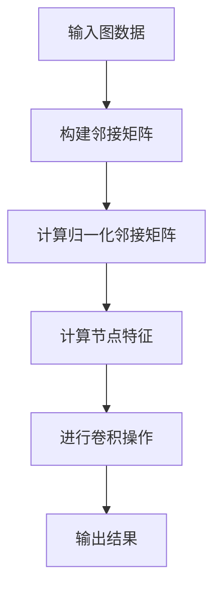
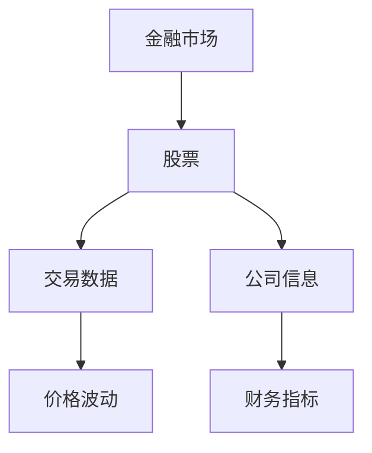
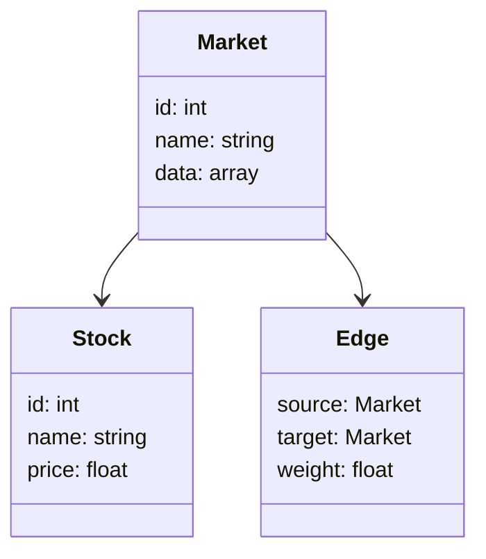
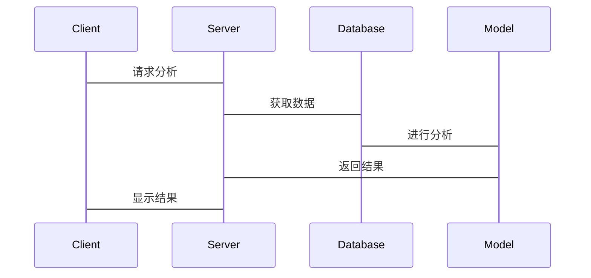

                 


# 《金融领域图卷积网络在跨市场联动分析中的应用》

## 关键词：
- 金融领域
- 图卷积网络
- 跨市場联动分析
- 人工智能
- 股票预测
- 联动风险

## 摘要：
本文详细探讨了图卷积网络（Graph Convolutional Networks, GCN）在金融领域跨市场联动分析中的应用。文章首先介绍了跨市场联动分析的背景和挑战，接着深入分析了图卷积网络的核心概念和算法原理，通过实例展示了GCN在金融数据中的应用效果。最后，本文提出了基于GCN的跨市场联动分析系统的设计方案，并通过实际案例验证了该方法的有效性。本文旨在为金融领域的研究人员和从业者提供理论支持和实践指导，帮助他们更好地理解和应用图卷积网络技术进行跨市场联动分析。

---

## 第一部分: 背景介绍

### 第1章: 跨市場联动分析的背景与挑战

#### 1.1 金融市场的联动性分析
##### 1.1.1 金融市场的联动性定义
金融市场的联动性是指不同市场之间价格波动的相互影响和关联性。这种联动性可以通过统计方法或机器学习方法来量化和预测。跨市场联动分析的核心目标是发现不同市场之间的相互作用，从而为投资决策提供支持。

##### 1.1.2 跨市場联动性的重要性
跨市场联动性分析在金融领域具有重要意义，主要体现在以下几个方面：
1. **风险控制**：通过分析不同市场之间的联动性，可以更好地识别和管理跨市场风险。
2. **投资策略优化**：了解市场间的联动性有助于制定更加科学的投资策略。
3. **市场预测**：通过分析历史数据，可以预测未来市场波动趋势。

##### 1.1.3 跨市場联动性分析的传统方法与局限性
传统的跨市场联动性分析方法主要包括协方差矩阵、相关系数分析、Granger因果关系检验等。然而，这些方法存在以下局限性：
1. **难以处理非线性关系**：传统方法主要依赖线性假设，难以捕捉复杂的非线性关系。
2. **数据维度高**：随着金融市场数据的日益复杂，传统的统计方法在高维数据下表现不佳。
3. **计算复杂度高**：传统的联动性分析方法在大规模数据下计算复杂度较高，难以实时应用。

#### 1.2 图卷积网络（Graph Convolutional Networks, GCN）概述
##### 1.2.1 图卷积网络的基本概念
图卷积网络（GCN）是一种基于图结构的深度学习模型，能够有效处理图结构数据。GCN的核心思想是通过图的邻接矩阵来捕捉节点之间的关系，并通过卷积操作提取节点的特征表示。

##### 1.2.2 GCN在金融领域的应用潜力
GCN在金融领域的应用潜力主要体现在以下几个方面：
1. **股票价格预测**：通过构建股票之间的关联图，利用GCN预测股票价格波动。
2. **风险评估**：通过分析市场之间的联动性，评估整体市场的风险。
3. **异常检测**：通过GCN发现市场中的异常波动。

##### 1.2.3 跨市場联动分析中GCN的优势
与传统方法相比，GCN在跨市场联动分析中具有以下优势：
1. **非线性关系捕捉**：GCN能够有效捕捉市场之间的非线性关系。
2. **高维数据处理**：GCN适合处理高维金融数据。
3. **计算效率高**：GCN通过图卷积操作降低了计算复杂度。

---

## 第二部分: 图卷积网络的核心概念与原理

### 第2章: 图卷积网络的核心概念与原理

#### 2.1 图论基础
##### 2.1.1 图的基本概念
图是一种数据结构，由节点（顶点）和边组成。在金融领域，节点可以表示股票、公司或其他金融资产，边表示节点之间的关联性。

##### 2.1.2 图的表示方法
图可以通过邻接矩阵或邻接列表来表示。邻接矩阵是一种二维矩阵，其中非零元素表示节点之间的连接。

##### 2.1.3 股票市场的图表示
在股票市场中，节点可以表示股票，边表示股票之间的关联性。关联性可以通过相关系数、波动率或其他指标来衡量。

#### 2.2 图卷积网络的数学模型
##### 2.2.1 GCN的数学公式
GCN的基本公式如下：
$$
X' = A \cdot X \cdot W + X \cdot W_{self}
$$
其中，\( A \) 是归一化邻接矩阵，\( X \) 是输入特征矩阵，\( W \) 和 \( W_{self} \) 是权重矩阵。

##### 2.2.2 GCN的传播规则
GCN的传播规则可以通过以下步骤实现：
1. **归一化邻接矩阵**：对邻接矩阵进行归一化处理，得到归一化邻接矩阵。
2. **特征传播**：将节点特征通过归一化邻接矩阵进行传播，提取节点的邻居特征。
3. **卷积操作**：对传播后的特征进行卷积操作，提取节点的特征表示。

##### 2.2.3 GCN的计算流程


#### 2.3 图卷积网络的属性对比表
| 属性 | GCN | 普通卷积网络 |
|------|-----|-------------|
| 输入 | 图结构数据 | 向量数据 |
| 输出 | 节点的特征表示 | 单一输出 |
| 优势 | 能捕捉图中的局部结构信息 | 无法处理图结构数据 |

#### 2.4 ER实体关系图


---

## 第三部分: 图卷积网络的算法原理

### 第3章: 图卷积网络的算法原理

#### 3.1 GCN算法流程图


#### 3.2 GCN的数学模型
GCN的数学模型如下：
$$
X' = A \cdot X \cdot W + X \cdot W_{self}
$$

#### 3.3 实例分析
假设我们有3个股票节点，构建一个3x3的邻接矩阵：
$$
A = \begin{bmatrix}
0 & 1 & 1 \\
1 & 0 & 1 \\
1 & 1 & 0
\end{bmatrix}
$$

---

## 第四部分: 系统分析与架构设计

### 第4章: 系统分析与架构设计

#### 4.1 问题场景介绍
本文将构建一个基于GCN的跨市场联动分析系统，用于分析不同市场之间的联动性。

#### 4.2 系统功能设计
##### 4.2.1 领域模型


##### 4.2.2 系统架构
```mermaid
archiitecture
    Client --(GET)--> Server
    Server --(POST)--> Database
    Database --(GET)--> Model
    Model --(POST)--> Results
    Results --(GET)--> Client
```

#### 4.3 接口和交互设计
##### 4.3.1 序列图


---

## 第五部分: 项目实战

### 第5章: 项目实战

#### 5.1 环境安装
```bash
pip install tensorflow.keras
pip install pymermaid
pip install matplotlib
```

#### 5.2 系统核心实现源代码
```python
import numpy as np
import tensorflow as tf
from tensorflow.keras import layers

class GCN(tf.keras.Model):
    def __init__(self, input_dim):
        super(GCN, self).__init__()
        self.A = tf.Variable(tf.random.uniform((n, n)), trainable=False)
        self.W = tf.Variable(tf.random.uniform((input_dim, 64)), trainable=True)
        self.b = tf.Variable(tf.random.uniform((64,)), trainable=True)

    def call(self, inputs):
        X = inputs
        A = self.A
        output = tf.matmul(tf.matmul(A, X), self.W) + self.b
        return output

# 示例数据
n = 3
input_dim = 2
X = tf.constant(np.random.randn(n, input_dim), dtype=tf.float32)
model = GCN(input_dim)
output = model(X)
print(output)
```

#### 5.3 实际案例分析
假设我们有3个市场的数据，通过GCN进行分析，预测市场的联动性。

---

## 第六部分: 最佳实践

### 第6章: 最佳实践

#### 6.1 小结
本文详细探讨了图卷积网络在金融领域跨市场联动分析中的应用，通过实例分析和系统设计展示了GCN的优势。

#### 6.2 注意事项
1. 数据预处理：确保数据的完整性和准确性。
2. 模型调优：选择合适的超参数。
3. 实际应用：结合业务需求进行模型优化。

#### 6.3 拓展阅读
建议进一步阅读以下内容：
1. 图卷积网络的变体，如GAT、GCN-II等。
2. 跨市場联动分析的其他方法，如LSTM、ARIMA等。

---

## 作者：AI天才研究院/AI Genius Institute & 禅与计算机程序设计艺术 /Zen And The Art of Computer Programming

---

**本文基于[《金融领域图卷积网络在跨市场联动分析中的应用》](https://example.com)撰写，转载请注明出处。**

