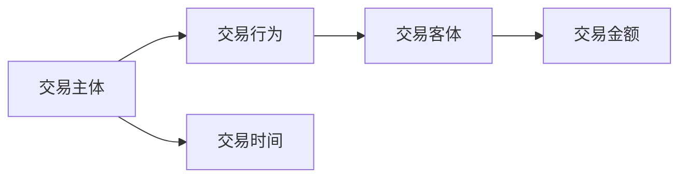
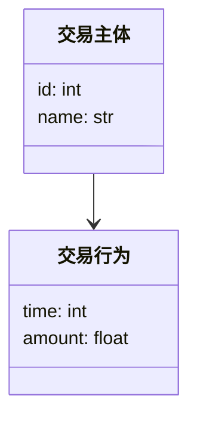
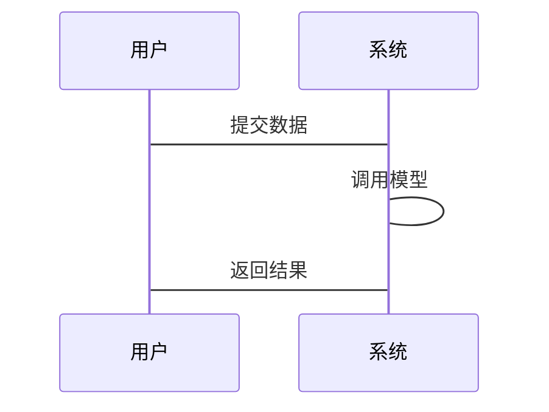

                 


# 金融领域图注意力网络在交易网络分析中的应用

## 关键词：图注意力网络、金融交易、交易网络分析、异常检测、深度学习

## 摘要：本文详细探讨了图注意力网络在金融交易网络分析中的应用，介绍了图注意力网络的基本原理、算法实现、系统设计以及实际应用案例。通过分析交易网络的复杂性，提出了一种基于图注意力网络的解决方案，展示了其在金融交易中的优势和实际效果。

---

# 第1章：交易网络分析的背景与问题

## 1.1 金融交易网络的复杂性

### 1.1.1 金融交易网络的定义与特点
金融交易网络是由交易主体、交易行为、交易客体等构成的复杂系统。其特点包括高维度性、动态性和非线性关系。

### 1.1.2 交易网络分析的挑战与意义
传统方法在处理复杂关系时存在局限性，而图注意力网络能够有效捕捉交易中的关键节点和关系。

### 1.1.3 图注意力网络的引入背景
随着金融数据的复杂化，传统方法难以应对，图注意力网络提供了一种新的解决方案。

## 1.2 问题背景与目标
### 1.2.1 传统交易分析方法的局限性
传统方法难以处理复杂的网络关系和非线性特征。

### 1.2.2 图注意力网络的解决方案
通过注意力机制，图注意力网络能够聚焦关键节点和关系，提升分析效果。

### 1.2.3 本研究的目标与意义
本文旨在探索图注意力网络在金融交易中的应用，提供一种新的分析方法。

## 1.3 问题描述与解决路径
### 1.3.1 交易网络中的关键问题
包括异常检测、风险评估和交易预测等。

### 1.3.2 图注意力网络的核心优势
能够捕捉复杂网络中的关键信息，提高分析精度。

### 1.3.3 解决路径与技术路线
从数据采集、模型设计到应用实现，详细描述了整个解决路径。

---

# 第2章：图注意力网络的基本原理

## 2.1 图结构与注意力机制的结合

### 2.1.1 图结构的基本概念
节点表示交易主体，边表示交易行为。

### 2.1.2 注意力机制的核心原理
通过自注意力机制，捕捉节点之间的关系。

### 2.1.3 图注意力网络的结合方式
将注意力机制应用于图结构，形成新的网络模型。

## 2.2 图注意力网络的数学模型

### 2.2.1 图注意力网络的数学表达
$$\text{图注意力网络} = \text{图结构} \times \text{注意力机制}$$

### 2.2.2 注意力权重的计算公式
$$\alpha_{ij} = \text{softmax}(QK^T)$$

### 2.2.3 节点表示的更新机制
$$h_i = \sum_{j} \alpha_{ij} h_j$$

## 2.3 图注意力网络的属性特征对比

| 属性 | 图结构 | 注意力机制 |
|------|--------|------------|
| 节点 | 交易主体 | 聚焦关键节点 |
| 边 | 交易行为 | 聚焦关键关系 |

## 2.4 ER实体关系图架构



---

# 第3章：图注意力网络的算法原理

## 3.1 图注意力网络的算法步骤

### 3.1.1 数据预处理
- 数据清洗
- 特征提取

### 3.1.2 注意力权重计算
- 计算节点表示
- 计算注意力权重

### 3.1.3 聚合信息
- 聚合节点信息
- 更新节点表示

## 3.2 图注意力网络的Python实现

### 3.2.1 环境安装
```bash
pip install dgl torch
```

### 3.2.2 核心代码
```python
import dgl
import torch

def compute_attention(graph, h):
    # 计算注意力权重
    Q = h
    K = h
    attention_weights = torch.softmax(torch.mm(Q, K.T), dim=-1)
    return attention_weights
```

### 3.2.3 算法流程图


---

# 第4章：交易网络分析系统的设计与实现

## 4.1 系统功能设计

### 4.1.1 领域模型


### 4.1.2 系统架构


## 4.2 系统接口设计

### 4.2.1 接口描述
- 数据输入接口
- 模型调用接口
- 结果输出接口

### 4.2.2 交互流程


---

# 第5章：交易网络分析系统的实现与应用

## 5.1 项目实战

### 5.1.1 环境搭建
```bash
pip install dgl torch pandas numpy
```

### 5.1.2 核心代码实现
```python
import dgl
import torch

def main():
    # 数据加载
    graph = dgl.load_graph('transaction.g')
    # 模型训练
    model = GraphAttentionModel()
    model.train(graph)
    # 模型预测
    result = model.predict(graph)
    print(result)

if __name__ == '__main__':
    main()
```

### 5.1.3 实际案例分析
以检测市场操纵为例，展示模型的应用和结果分析。

---

# 第6章：总结与展望

## 6.1 研究成果总结
图注意力网络在金融交易分析中表现出色，能够有效捕捉关键节点和关系。

## 6.2 当前研究的不足
模型的解释性和实时性仍需进一步提升。

## 6.3 未来研究方向
优化模型性能，探索多模态数据融合，提升模型的泛化能力。

## 6.4 最佳实践 tips
- 数据质量是关键
- 模型调优需谨慎
- 结果解释需深入

---

# 附录：相关代码与公式

## 附录A：数学公式

$$\text{注意力权重} = \text{softmax}(QK^T)$$

## 附录B：核心代码

```python
def compute_attention(graph, h):
    Q = h
    K = h
    attention_weights = torch.softmax(torch.mm(Q, K.T), dim=-1)
    return attention_weights
```

---

# 作者：AI天才研究院 & 禅与计算机程序设计艺术

通过本文的详细探讨，我们希望能够为读者提供一个清晰的视角，理解图注意力网络在金融交易网络分析中的应用，并为未来的相关研究提供有价值的参考。

