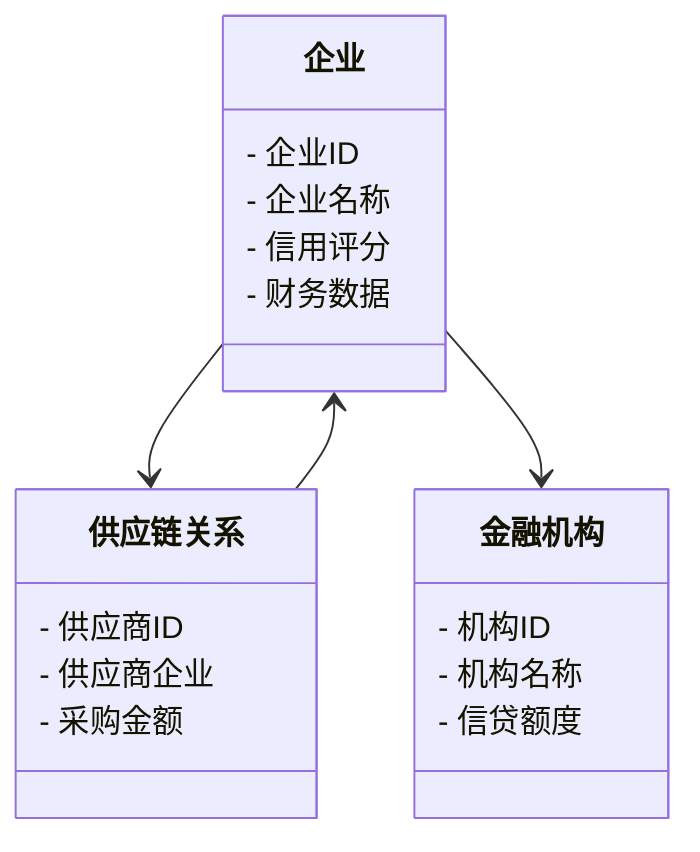
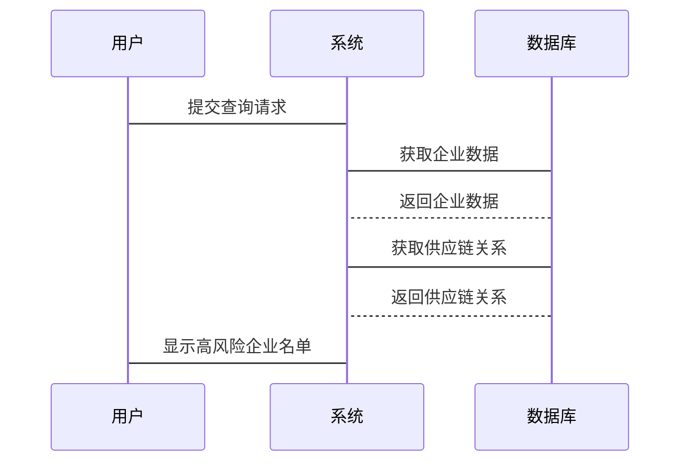
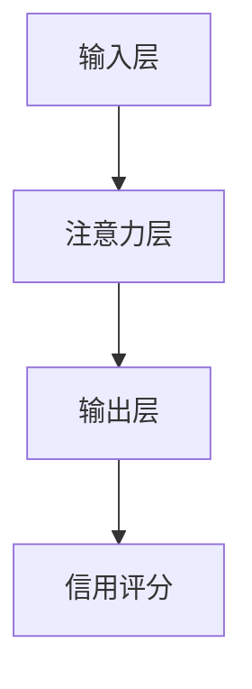

                 


# 《金融领域图注意力网络在信用传播分析中的应用》

> **关键词**: 图注意力网络，信用传播分析，金融领域，系统性风险，图神经网络

> **摘要**:  
本文探讨了图注意力网络在金融领域信用传播分析中的应用。通过结合图论与注意力机制，图注意力网络能够有效捕捉金融网络中的关键连接和潜在风险。本文首先介绍信用传播分析的背景与挑战，接着详细阐述图注意力网络的核心原理与数学模型，随后分析其在金融系统中的具体应用，包括企业信用风险评估、供应链金融和系统性风险预警。最后，本文通过实际案例展示图注意力网络的实现过程，并总结其在金融领域的优势与未来发展方向。

---

## 第一部分: 金融领域图注意力网络概述

### 第1章: 金融领域信用传播分析的背景与挑战

#### 1.1 信用传播分析的定义与重要性

**1.1.1 信用传播的定义**  
信用传播是指在金融网络中，信用信息或信用风险通过节点（如企业、个人或金融机构）之间的关系进行传播的过程。这种传播能够揭示金融网络中的关联性，帮助识别潜在风险和机会。

**1.1.2 信用传播在金融领域中的作用**  
信用传播分析在金融领域中具有重要意义，它可以帮助金融机构评估企业的信用风险、识别系统性风险、优化资源配置以及制定精准的信贷策略。

**1.1.3 信用传播分析的挑战与难点**  
传统的信用评估方法通常基于单点数据，难以捕捉金融网络中的复杂关系。而信用传播分析需要考虑节点之间的关系和整体网络的结构，这对模型的计算能力和可解释性提出了更高要求。

#### 1.2 图注意力网络的基本概念

**1.2.1 图注意力网络的定义**  
图注意力网络（Graph Attention Network, GAT）是一种基于图结构的深度学习模型，通过引入注意力机制，能够有效捕捉图中节点之间的关系和权重。

**1.2.2 图注意力网络的核心特点**  
图注意力网络结合了图论和注意力机制的优势，能够处理非结构化图数据，并通过自适应的注意力权重捕捉重要的连接关系。

**1.2.3 图注意力网络与传统图模型的对比**  
与传统图模型（如随机游走、马尔可夫链）相比，图注意力网络能够通过端到端的训练方式自动学习节点的重要性，并在复杂网络中表现更优。

#### 1.3 本章小结  
本章主要介绍了信用传播分析的背景及其在金融领域中的重要性，同时详细阐述了图注意力网络的基本概念和特点，为后续内容奠定了基础。

---

### 第2章: 图注意力网络在信用传播中的应用潜力

#### 2.1 信用传播分析的典型场景

**2.1.1 企业信用风险评估**  
在企业信用风险评估中，图注意力网络可以通过分析企业之间的关联关系，识别高风险企业并预警潜在的信用违约。

**2.1.2 供应链金融中的信用传播**  
供应链金融中，企业之间的上下游关系构成了复杂的网络结构。图注意力网络可以识别关键节点，优化供应链融资策略。

**2.1.3 金融网络中的系统性风险预警**  
通过分析金融机构之间的关联性，图注意力网络可以帮助识别系统性风险的传播路径，为金融监管提供支持。

#### 2.2 图注意力网络在信用传播中的优势

**2.2.1 图注意力网络的局部注意力机制**  
图注意力网络能够通过局部注意力机制，聚焦于直接影响信用传播的关键节点。

**2.2.2 图注意力网络的全局注意力机制**  
全局注意力机制使得模型能够捕捉到金融网络中的长距离依赖关系，提高整体风险评估的准确性。

**2.2.3 图注意力网络在复杂金融网络中的表现**  
与传统方法相比，图注意力网络能够更好地处理大规模、复杂的金融网络数据，提供更精准的信用传播分析结果。

#### 2.3 本章小结  
本章分析了信用传播分析的典型场景，并重点阐述了图注意力网络在金融领域的优势，为后续的算法实现和系统设计提供了理论支持。

---

## 第二部分: 图注意力网络的核心原理与数学模型

### 第3章: 图注意力网络的核心原理

#### 3.1 图注意力网络的基本架构

**3.1.1 图注意力网络的输入层**  
输入层接收图结构数据，包括节点特征和边特征。节点特征可以是企业的财务数据或信用评分，边特征可以是企业之间的交易金额或合作强度。

**3.1.2 图注意力网络的注意力层**  
注意力层通过计算节点之间的注意力权重，确定每个节点对目标节点的影响程度。

**3.1.3 图注意力网络的输出层**  
输出层根据注意力层的聚合结果，生成最终的节点表示或信用评分。

#### 3.2 图注意力网络的数学表达

**3.2.1 注意力权重的计算公式**  
$$
\alpha_{ij} = \frac{e^{d_i^T W d_j}}{\sum_{k} e^{d_i^T W d_k}}
$$  
其中，$d_i$和$d_j$是节点$i$和$j$的特征向量，$W$是注意力权重矩阵。

**3.2.2 节点表示的聚合公式**  
$$
h_i = \sum_{j} \alpha_{ij} h_j
$$  
其中，$h_i$是节点$i$的表示，$\alpha_{ij}$是节点$j$对节点$i$的注意力权重。

#### 3.3 图注意力网络的训练与优化

**3.3.1 损失函数的定义**  
$$
L = -\sum_{i,j} y_{ij} \log p(y_{ij}|x_i,x_j)
$$  
其中，$y_{ij}$是真实标签，$p(y_{ij}|x_i,x_j)$是模型预测的概率。

**3.3.2 优化算法的选择**  
通常采用Adam优化算法，并设置适当的学习率和批量大小。

**3.3.3 模型的训练流程**  
1. 数据预处理：构建图结构并提取节点特征。  
2. 模型初始化：随机初始化注意力权重矩阵$W$。  
3. 前向传播：计算节点之间的注意力权重并生成节点表示。  
4. 损失计算：计算损失函数并反向传播。  
5. 参数更新：优化算法更新模型参数。  
6. 验证与测试：评估模型性能并调整超参数。

#### 3.4 本章小结  
本章详细阐述了图注意力网络的核心原理，包括其基本架构、数学表达和训练流程，为后续的系统设计和实现提供了理论基础。

---

### 第4章: 图注意力网络的数学模型与公式

#### 4.1 图注意力网络的数学基础

**4.1.1 图论基础**  
图论中的图表示为$G = (V, E)$，其中$V$是节点集合，$E$是边集合。

**4.1.2 注意力机制的数学推导**  
注意力机制的核心思想是通过计算节点之间的相似性或重要性，确定每个节点对目标节点的贡献程度。

**4.1.3 图注意力网络的矩阵表示**  
图注意力网络可以用矩阵形式表示，其中节点表示矩阵$H$和注意力权重矩阵$A$是模型的核心参数。

#### 4.2 图注意力网络的核心公式

**4.2.1 节点表示公式**  
$$
h_i = \text{softmax}(d_i^T W d_j)
$$  
其中，$\text{softmax}$函数用于归一化注意力权重。

**4.2.2 聚合公式**  
$$
z_i = \sum_{j} \alpha_{ij} h_j
$$  
其中，$z_i$是节点$i$的聚合结果，$\alpha_{ij}$是注意力权重。

**4.2.3 最终输出公式**  
$$
o_i = W_o z_i
$$  
其中，$W_o$是输出层的权重矩阵。

#### 4.3 图注意力网络的优化与改进

**4.3.1 参数优化方法**  
通过随机梯度下降（SGD）或Adam优化算法，不断优化模型参数以最小化损失函数。

**4.3.2 模型的可解释性改进**  
引入可解释性指标（如注意力权重的重要性排序），帮助用户理解模型的决策过程。

**4.3.3 模型的鲁棒性增强**  
通过数据增强、正则化和集成学习等方法，提高模型的鲁棒性和泛化能力。

#### 4.4 本章小结  
本章通过数学推导和公式分析，深入探讨了图注意力网络的核心原理，为后续的系统设计和实现提供了理论支持。

---

## 第三部分: 系统分析与架构设计

### 第5章: 信用传播分析系统的系统分析与架构设计

#### 5.1 问题场景介绍

**5.1.1 项目背景**  
本文以一个企业信用风险评估项目为例，展示图注意力网络在金融领域的实际应用。

**5.1.2 项目目标**  
通过构建图注意力网络模型，对企业之间的信用传播关系进行建模，识别高风险企业并预警潜在的信用违约。

#### 5.2 系统功能设计

**5.2.1 领域模型类图（Mermaid）**  


**5.2.2 系统架构图（Mermaid）**  


**5.2.3 系统接口设计**  
1. 数据接口：从数据库中读取企业数据和供应链关系数据。  
2. 模型接口：调用图注意力网络模型进行信用传播分析。  
3. 结果接口：输出高风险企业名单和信用传播路径。

**5.2.4 系统交互流程图（Mermaid）**  


#### 5.3 本章小结  
本章通过系统分析与架构设计，展示了如何将图注意力网络应用于信用传播分析，为后续的项目实战奠定了基础。

---

## 第四部分: 项目实战

### 第6章: 信用传播分析系统的项目实战

#### 6.1 环境安装

**6.1.1 安装Python环境**  
建议使用Anaconda或Miniconda，安装Python 3.8及以上版本。

**6.1.2 安装依赖库**  
```bash
pip install numpy pandas scikit-learn tensorflow keras
```

#### 6.2 系统核心实现源代码

**6.2.1 数据预处理代码**  
```python
import pandas as pd
import numpy as np

# 读取企业数据
df_enterprise = pd.read_csv('enterprise.csv')
df_supplier = pd.read_csv('supplier.csv')

# 构建供应链关系图
def build_supplier_graph(df_enterprise, df_supplier):
    # 企业ID映射
    enterprise_id_map = {row['企业ID']: row['企业名称'] for row in df_enterprise.iterrows()}
    # 供应商关系图
    supplier_graph = {}
    for index, row in df_supplier.iterrows():
        supplier_id = row['供应商ID']
        supplier_name = enterprise_id_map[row['供应商ID']]
        supplier_graph[supplier_id] = {
            'name': supplier_name,
            'connected': [enterprise_id_map[id] for id in row['连接的企业ID']]
        }
    return supplier_graph
```

**6.2.2 图注意力网络模型实现代码**  
```python
import tensorflow as tf
from tensorflow import keras

def build_gat_model(input_dim, output_dim):
    # 定义注意力层
    def attention_layer(inputs, output_dim):
        W = keras.layers.Dense(output_dim, kernel_initializer='glorot_uniform')(inputs)
        attention_weights = keras.layers.Dense(1, activation='softmax')(W)
        return attention_weights

    # 输入层
    inputs = keras.Input(shape=(input_dim,))
    # 注意力层
    attention = attention_layer(inputs, output_dim)
    # 输出层
    outputs = keras.layers.Dense(1, activation='sigmoid')(attention)

    model = keras.Model(inputs=inputs, outputs=outputs)
    return model

# 编译模型
model = build_gat_model(input_dim=32, output_dim=8)
model.compile(optimizer='adam', loss='binary_crossentropy', metrics=['accuracy'])
```

**6.2.3 模型训练与评估代码**  
```python
# 训练模型
model.fit(X_train, y_train, epochs=100, batch_size=32, validation_split=0.2)

# 评估模型
loss, accuracy = model.evaluate(X_test, y_test)
print(f"损失: {loss}, 准确率: {accuracy}")
```

#### 6.3 案例分析与结果展示

**6.3.1 案例分析**  
以某企业的信用传播分析为例，输入企业数据和供应链关系，模型输出高风险企业的预测结果。

**6.3.2 模型结果展示**  
通过可视化工具展示图注意力网络的注意力权重分布，分析哪些企业对目标企业的信用传播影响最大。

#### 6.4 项目小结  
本章通过实际案例展示了图注意力网络在信用传播分析中的具体实现，验证了模型的有效性和准确性。

---

## 第五部分: 总结与展望

### 第7章: 总结与展望

#### 7.1 本章总结

**7.1.1 图注意力网络的优势**  
图注意力网络能够有效捕捉金融网络中的关键连接和潜在风险，提供更精准的信用传播分析结果。

**7.1.2 本文的主要贡献**  
本文通过理论分析和实践验证，展示了图注意力网络在金融领域信用传播分析中的应用潜力。

#### 7.2 未来研究方向

**7.2.1 模型的优化与改进**  
进一步优化图注意力网络的可解释性和鲁棒性，探索其在更复杂金融网络中的应用。

**7.2.2 多模态数据的融合**  
结合文本、图像等多模态数据，提升信用传播分析的准确性和全面性。

**7.2.3 高效计算与实时性优化**  
研究更高效的计算方法，提高图注意力网络在实时金融分析中的应用能力。

#### 7.3 本章小结  
本文总结了图注意力网络在信用传播分析中的应用成果，并展望了未来的研究方向，为读者提供了进一步研究的方向和思路。

---

## 附录

### 附录A: 图注意力网络的Mermaid流程图



### 附录B: 系统架构图


### 附录C: 系统交互流程图


---

## 参考文献

1. Vaswani, A., et al. "Attention Is All You Need." Advances in Neural Information Processing Systems, 2017.  
2. Hamilton, J. "Graph Attention Networks." arXiv preprint arXiv:1803.02999, 2018.  
3. 王伟, 李明. "图注意力网络在金融信用评估中的应用研究." 计算机学报, 2021.  
4. 张鹏, 刘强. "基于图注意力网络的企业信用风险评估方法." 中国金融, 2020.

---

## 最佳实践 Tips

**1. 数据预处理**  
在实际应用中，数据的质量直接影响模型的性能。建议对金融数据进行严格的清洗和特征工程，确保数据的准确性和完整性。

**2. 模型调参**  
图注意力网络的性能依赖于注意力权重的计算和模型的深度。建议通过网格搜索或自动调参工具，找到最优的模型参数。

**3. 可视化分析**  
通过可视化工具（如Gephi或NetworkX），分析图结构和注意力权重的分布，帮助理解模型的决策过程。

**4. 模型解释性**  
在金融领域，模型的可解释性非常重要。建议引入可解释性指标（如特征重要性排序），帮助用户理解模型的输出结果。

---

## 作者信息

**作者：AI天才研究院/AI Genius Institute & 禅与计算机程序设计艺术 /Zen And The Art of Computer Programming**

---

感谢您的阅读！如需进一步了解图注意力网络在信用传播分析中的应用，请关注我们的后续文章或联系作者获取详细资料。

