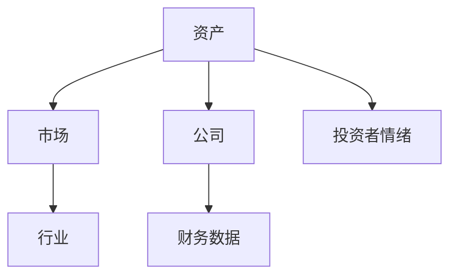
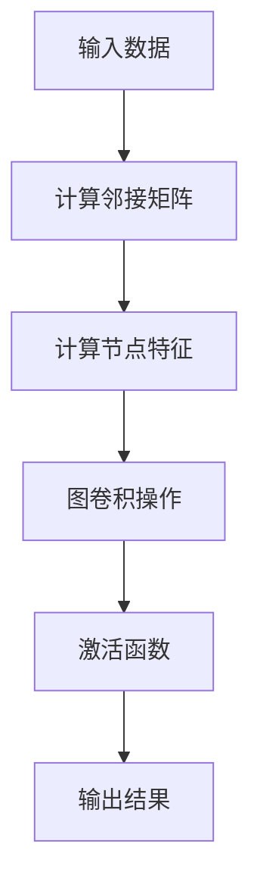
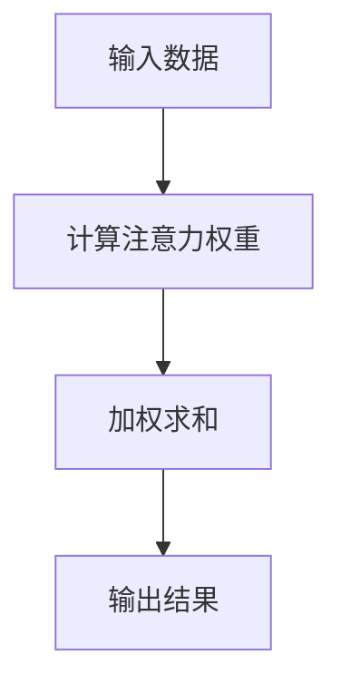
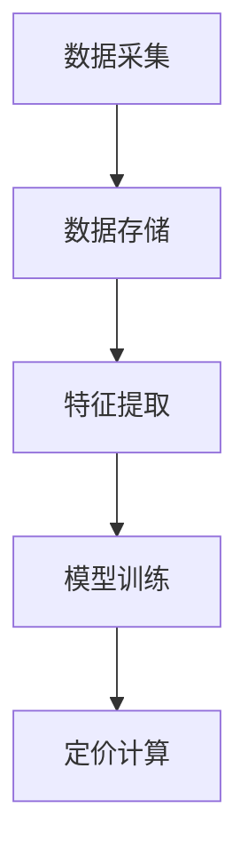

                 


# 《金融领域图神经网络在资产定价中的应用》

## 关键词：图神经网络，资产定价，金融领域，深度学习，风险管理

## 摘要：本文详细探讨了图神经网络在金融资产定价中的应用，从理论基础到实际案例，分析了图神经网络的优势和局限性，并展望了其在金融领域的未来发展方向。

---

# 第一部分: 金融领域图神经网络基础

## 第1章: 图神经网络与资产定价概述

### 1.1 图神经网络的基本概念

#### 1.1.1 图的基本概念
图由节点和边组成，节点代表实体，边代表关系。在金融领域，节点可以是资产、公司或投资者，边可以是交易关系或影响关系。

#### 1.1.2 图神经网络的定义与特点
图神经网络是一种处理图结构数据的深度学习模型，具有处理非结构化数据、捕捉复杂关系和全局性等优点。

#### 1.1.3 资产定价的基本概念与挑战
资产定价是确定资产公允价值的过程，传统方法如CAPM和APT存在局限性，难以捕捉复杂关系。

### 1.2 图神经网络在金融领域的应用背景

#### 1.2.1 传统资产定价模型的局限性
传统模型假设市场有效性和理性投资者，难以应对实际中的复杂性和噪声。

#### 1.2.2 图神经网络的优势与适用场景
图神经网络能够处理复杂关系，适用于实时数据和多维度分析。

#### 1.2.3 金融领域图数据的特点
金融数据具有多维性、动态性和复杂性，适合用图结构表示。

---

## 第2章: 图神经网络的核心概念与联系

### 2.1 图神经网络的核心原理

#### 2.1.1 图的表示与节点嵌入
通过节点嵌入将图节点转换为低维向量，捕捉节点特征和关系。

#### 2.1.2 图卷积操作的数学模型
图卷积操作通过聚合邻居信息更新节点表示：
$$ H^{(l+1)} = \sigma(A H^{(l)} H^{(l)}^T) $$

#### 2.1.3 图注意力机制的实现原理
注意力机制根据节点间关系分配权重，公式：
$$ \alpha_{ij} = \frac{e^{score(i,j)}}{\sum_{k} e^{score(i,k)}} $$

### 2.2 核心概念对比分析

#### 2.2.1 图神经网络与传统神经网络的对比
| 特性 | 图神经网络 | 传统神经网络 |
|------|------------|--------------|
| 数据 | 图结构 | 结构化数据 |
| 关系 | 捕捉复杂 | 无法捕捉 |

#### 2.2.2 图卷积与传统卷积的对比
| 特性 | 图卷积 | 传统卷积 |
|------|--------|------------|
| 输入 | 图结构 | 稀疏矩阵 |

#### 2.2.3 图注意力机制与传统注意力机制的对比
| 特性 | 图注意力 | 传统注意力 |
|------|----------|------------|
| 应用 | 节点间关系 | 序列关系 |

### 2.3 实体关系图架构



---

## 第3章: 图神经网络算法原理

### 3.1 图卷积网络（GCN）算法

#### 3.1.1 GCN的数学模型
GCN的传播规则：
$$ H^{(l+1)} = \sigma(A H^{(l)} H^{(l)}^T) $$

#### 3.1.2 GCN的实现流程



### 3.2 图注意力网络（GAT）算法

#### 3.2.1 GAT的数学模型
注意力权重计算：
$$ \alpha_{ij} = \frac{e^{score(i,j)}}{\sum_{k} e^{score(i,k)}} $$

#### 3.2.2 GAT的实现流程



---

## 第4章: 金融资产定价系统的架构设计

### 4.1 系统功能设计

#### 4.1.1 数据采集模块
从多种来源收集金融数据，如市场数据、财务报表和新闻。

#### 4.1.2 特征提取模块
将原始数据转换为图结构，并提取节点和边特征。

#### 4.1.3 模型训练模块
使用图神经网络模型进行训练，优化模型参数。

#### 4.1.4 定价计算模块
基于训练好的模型，计算资产的公允价值。

### 4.2 系统架构设计



---

## 第5章: 图神经网络在资产定价中的项目实战

### 5.1 项目背景与目标

#### 5.1.1 项目背景
通过图神经网络实现股票定价。

#### 5.1.2 项目目标
建立一个基于图神经网络的股票定价系统。

### 5.2 环境安装与配置

#### 5.2.1 安装依赖
安装必要的Python库，如PyTorch和NetworkX。

### 5.3 系统核心实现源代码

#### 5.3.1 数据预处理代码
```python
import networkx as nx

def load_data():
    G = nx.Graph()
    G.add_nodes_from(['资产1', '资产2', '市场', '行业'])
    G.add_edges_from([('资产1', '市场'), ('市场', '行业')])
    return G
```

#### 5.3.2 图神经网络模型实现
```python
import torch
import torch.nn as nn

class GraphConvolution(nn.Module):
    def __init__(self, in_features, out_features):
        super(GraphConvolution, self).__init__()
        self.weight = nn.Parameter(torch.randn(in_features, out_features))
        self.bias = nn.Parameter(torch.randn(out_features))
    
    def forward(self, x, adj):
        out = torch.mm(torch.mm(adj, x), self.weight) + self.bias
        return out
```

### 5.4 实际案例分析

#### 5.4.1 案例介绍
以股票定价为例，分析如何使用图神经网络捕捉股票之间的相互影响。

#### 5.4.2 结果分析
通过实验验证模型的有效性，比较不同算法的定价准确性。

---

## 第6章: 图神经网络的高级应用与未来趋势

### 6.1 图神经网络的高级应用

#### 6.1.1 风险管理
使用图神经网络识别系统性风险，评估金融市场的稳定性。

#### 6.1.2 投资组合优化
通过捕捉资产之间的关系，优化投资组合的收益和风险。

### 6.2 未来趋势与研究方向

#### 6.2.1 更复杂的图结构
引入多层图和动态图，提高模型的表达能力。

#### 6.2.2 跨模态数据融合
结合文本、图像等多种数据，增强模型的感知能力。

#### 6.2.3 可解释性增强
提高模型的可解释性，满足监管要求。

---

## 作者：AI天才研究院/AI Genius Institute & 禅与计算机程序设计艺术 /Zen And The Art of Computer Programming

