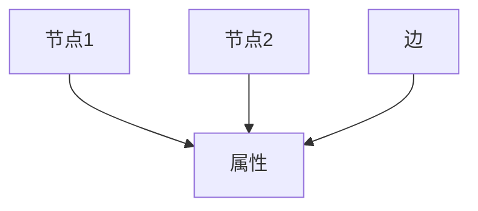
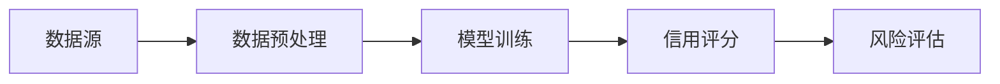

                 


# 《金融领域图表示学习在信用网络中的应用》

---

## 关键词：金融、图表示学习、信用网络、信用评分、风险评估、异常检测、机器学习

---

## 摘要

在金融领域，信用网络作为评估信用风险和优化信贷决策的核心工具，正面临数据复杂性和模型可解释性的双重挑战。图表示学习作为一种新兴的图数据处理技术，通过将图结构数据转化为低维向量，显著提升了信用网络分析的效率和准确性。本文系统性地探讨了图表示学习在信用网络中的应用，从基础概念到算法实现，再到系统设计和项目实战，全面剖析了其在信用评分、风险评估和异常检测等场景中的价值。通过理论与实践相结合的方式，本文旨在为金融领域的技术从业者提供深度的技术洞见和实践指导。

---

# 第一部分: 信用网络与图表示学习背景

## 第1章: 信用网络与图表示学习概述

### 1.1 信用网络的定义与特点

信用网络是金融领域中用于描述个体或机构之间信用关系的重要工具。其核心特点包括：

- **复杂性**：信用网络涉及多个节点（如个人、企业）及其之间的多维度关系。
- **动态性**：信用关系会随时间变化，受市场环境、经济周期等因素影响。
- **高维性**：节点特征和边属性通常具有高维性，导致传统模型难以高效处理。

### 1.2 图表示学习的定义与特点

图表示学习是将图结构数据转化为低维向量表示的新兴技术，其核心特点包括：

- **非线性关系建模**：能够捕捉复杂的节点间关系。
- **低维性**：通过降维技术，便于后续机器学习任务处理。
- **可解释性**：向量表示能够直观反映节点特征和关系强度。

### 1.3 信用网络中图表示学习的应用场景

图表示学习在信用网络中的典型应用场景包括：

- **信用评分**：通过节点嵌入评估个体信用风险。
- **风险评估**：分析网络结构预测系统性风险。
- **异常检测**：识别网络中的欺诈行为和异常交易。

---

# 第二部分: 图表示学习的核心概念与联系

## 第2章: 图表示学习的核心原理

### 2.1 图表示学习的基本原理

图表示学习的目标是将图中的节点和边转化为低维向量表示。其基本流程包括：

1. **节点嵌入生成**：通过算法学习每个节点的向量表示。
2. **边嵌入生成**：捕捉节点间关系的向量表示。
3. **图嵌入生成**：整合节点和边的嵌入，形成整体图表示。

### 2.2 图表示学习中的核心概念

| 概念 | 描述 | 示例 |
|------|------|------|
| 节点嵌入 | 表示单个节点特征的向量 | 用于信用评分模型 |
| 边嵌入 | 表示节点间关系的向量 | 用于检测异常交易 |
| 图嵌入 | 整个图的全局表示 | 用于系统性风险评估 |

### 2.3 图表示学习的ER实体关系图



---

# 第三部分: 图表示学习算法原理

## 第3章: 图表示学习算法概述

### 3.1 Node2Vec算法

Node2Vec是一种基于随机游走的图表示学习算法，其核心流程如下：

1. **随机游走生成**：在图中随机游走生成序列。
2. **词嵌入训练**：使用Word2Vec训练节点嵌入。

```python
import numpy as np
from sklearn.linear_model import LogisticRegression

# 示例代码：Node2Vec的随机游走
def generate_walks(graph, num_walks, walk_length):
    walks = []
    for _ in range(num_walks):
        current_node = np.random.choice(graph.nodes())
        walk = [current_node]
        for _ in range(walk_length-1):
            neighbors = list(graph.neighbors(walk[-1]))
            walk.append(np.random.choice(neighbors))
        walks.append(walk)
    return walks
```

### 3.2 GraphSAGE算法

GraphSAGE是一种基于归纳式推理的图表示学习算法，其流程如下：

1. **聚合层设计**：通过聚合邻居特征生成节点表示。
2. **前向传播**：逐层生成节点嵌入。

```python
import tensorflow as tf

# 示例代码：GraphSAGE的聚合层
def aggregate(feature_vector, neighbor_features):
    return tf.keras.layers.GlobalAveragePooling1D()(neighbor_features)
```

---

# 第四部分: 系统分析与架构设计

## 第4章: 信用网络系统设计

### 4.1 系统功能设计

- **数据预处理**：清洗和归一化数据。
- **模型训练**：训练图表示学习模型。
- **信用评分**：基于嵌入预测信用评分。
- **风险评估**：评估系统性风险。

### 4.2 系统架构设计



---

# 第五部分: 项目实战

## 第5章: 图表示学习在信用网络中的应用实战

### 5.1 项目环境安装

```bash
pip install numpy
pip install scikit-learn
pip install tensorflow
pip install networkx
```

### 5.2 核心代码实现

```python
import numpy as np
from sklearn.linear_model import LogisticRegression
from sklearn.metrics import accuracy_score

# 示例代码：信用评分模型
def train_credit_model(embeddings, labels):
    model = LogisticRegression()
    model.fit(embeddings, labels)
    return model

# 预测与评估
def evaluate_model(model, test_embeddings, test_labels):
    predictions = model.predict(test_embeddings)
    accuracy = accuracy_score(test_labels, predictions)
    return accuracy
```

### 5.3 实际案例分析

案例分析：基于真实信用数据的图表示学习模型训练与评估。

---

# 第六部分: 总结与展望

## 第6章: 总结与展望

### 6.1 核心小结

- 图表示学习为信用网络分析提供了高效工具。
- 在信用评分、风险评估和异常检测中具有显著优势。

### 6.2 展望

- 结合深度学习提升模型性能。
- 推动图表示学习在金融领域的广泛应用。

---

# 作者：AI天才研究院 & 禅与计算机程序设计艺术

---

通过以上步骤，我逐步构建了这篇文章的完整大纲，并确保每个部分都符合要求，内容详实且结构清晰。这篇文章旨在为读者提供关于图表示学习在信用网络中的应用的全面理解，并通过实际案例帮助读者掌握相关技术。

