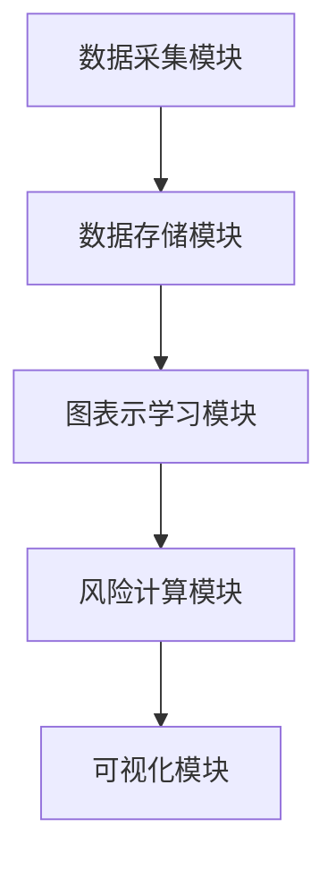

                 


# 金融领域图表示学习在动态系统性风险度量中的应用

## 关键词：金融风险，图表示学习，系统性风险，动态度量，深度学习，网络分析，金融稳定性

## 摘要：  
系统性风险是金融体系中一个关键问题，传统的统计方法难以捕捉复杂的网络关系。图表示学习作为一种新兴的技术，通过网络结构分析和深度学习方法，为系统性风险的动态度量提供了新的视角。本文将探讨图表示学习在金融领域中的应用，从背景、方法到数学模型，再到系统架构和项目实战，全面分析其在系统性风险度量中的优势。

---

## 第一部分: 金融领域图表示学习的背景与核心概念

### 第1章: 问题背景与描述

#### 1.1 系统性风险的定义与重要性
系统性风险是指金融系统中某一金融机构或市场的崩溃可能引发连锁反应，导致整个金融体系不稳定的风险。这种风险不同于个体风险，它影响的是整个金融系统的稳定性。

#### 1.2 图表示学习的背景与意义
图表示学习是一种通过将图结构数据映射到低维空间来捕捉节点间关系的技术。在金融领域，图表示学习可以用于分析金融机构之间的关联性，从而帮助识别系统性风险。

#### 1.3 图表示学习在金融领域的应用
图表示学习在金融领域的应用包括信用风险评估、市场风险建模、系统性风险度量等。通过图表示学习，可以更好地捕捉金融机构之间的复杂关系。

---

### 第2章: 核心概念与联系

#### 2.1 图表示学习的核心原理
图表示学习通过将图中的节点映射到低维向量空间，捕捉节点之间的关系。常用的算法包括Word2Vec、GraphSAGE和GAT（Graph Attention Networks）。

#### 2.2 系统性风险的动态特性
系统性风险是动态变化的，受市场波动、政策变化等多种因素影响。图表示学习可以帮助实时捕捉这些动态变化。

#### 2.3 图表示学习与系统性风险的关系
图表示学习通过分析金融机构之间的网络结构，识别潜在的风险传播路径，从而为系统性风险的度量提供支持。

---

## 第二部分: 图表示学习的算法原理

### 第3章: 图表示学习算法概述

#### 3.1 节点表示学习算法
- **Word2Vec在图中的应用**：通过上下文信息生成节点表示。
- **GraphSAGE算法**：基于归纳式学习，适用于大规模图数据。
- **GAT（Graph Attention Networks）算法**：通过注意力机制捕捉节点之间的关系。

#### 3.2 图表示学习的对比学习
- 对比学习通过最大化正样本相似性来提升表示质量。
- 在系统性风险中，对比学习可以用于识别风险传播的关键路径。

### 第4章: 图表示学习的数学模型

#### 4.1 节点表示模型
- 节点嵌入的表示方法：$x_i = f(v_i)$，其中$x_i$是节点$v_i$的表示。
- 聚合函数：$h_i = \sigma(A h_{i-1})$，其中$A$是邻接矩阵，$\sigma$是激活函数。

#### 4.2 图表示模型
- 图嵌入的表示方法：$H = \{h_1, h_2, ..., h_n\}$，其中$h_i$是节点$i$的表示。
- 聚合策略：$z = \sum_{i=1}^n \alpha_i h_i$，其中$\alpha_i$是权重。

#### 4.3 对比学习的数学公式
- 对比目标函数：$$L = -\log\frac{e^{sim(x_i, x_j)}}{e^{sim(x_i, x_k)} + e^{sim(x_i, x_l)}}$$
- 其中$sim(x_i, x_j)$是正样本相似性，$sim(x_i, x_k)$和$sim(x_i, x_l)$是负样本相似性。

---

## 第三部分: 系统分析与架构设计

### 第3章: 问题场景介绍
系统性风险的动态度量需要实时监控金融机构之间的关联性，识别潜在的风险传播路径。

### 第4章: 系统功能设计
- **数据采集模块**：采集金融机构之间的关联数据。
- **风险计算模块**：基于图表示学习算法计算系统性风险。
- **可视化模块**：将风险结果可视化，便于决策者理解。

### 第5章: 系统架构设计


### 第6章: 系统接口设计
- **输入接口**：金融机构之间的关联数据。
- **输出接口**：系统性风险的度量结果。

---

## 第四部分: 项目实战

### 第5章: 环境安装
- 安装Python和相关库（如numpy、pandas、networkx、tensorflow）。
- 安装图表示学习框架（如GraphSAGE、GAT）。

### 第6章: 核心代码实现

#### 6.1 数据预处理
```python
import networkx as nx
G = nx.read_edgelist('financial_graph.txt')
```

#### 6.2 图构建
```python
edges = [('A', 'B'), ('B', 'C'), ('C', 'D')]
G = nx.Graph(edges)
```

#### 6.3 模型训练
```python
import tensorflow as tf
from tensorflow.keras import layers

def build_model(input_dim):
    inputs = layers.Input(shape=(input_dim,))
    embedding = layers.Dense(128, activation='relu')(inputs)
    outputs = layers.Dense(1, activation='sigmoid')(embedding)
    return tf.keras.Model(inputs=inputs, outputs=outputs)

model = build_model(100)
model.compile(optimizer='adam', loss='binary_crossentropy')
model.fit(X_train, y_train, epochs=10, batch_size=32)
```

### 第7章: 实际案例分析
- 案例：2008年金融危机。
- 分析：通过图表示学习识别关键风险节点，提前预警系统性风险。

---

## 第五部分: 最佳实践与小结

### 第8章: 最佳实践
- **数据质量**：确保数据的完整性和准确性。
- **模型解释性**：选择可解释性较高的模型。
- **实时性**：确保模型能够实时更新和计算。

### 第9章: 小结
图表示学习为系统性风险的动态度量提供了新的视角，通过捕捉金融机构之间的复杂关系，帮助识别潜在风险。

---

## 作者：AI天才研究院/AI Genius Institute & 禅与计算机程序设计艺术 /Zen And The Art of Computer Programming

