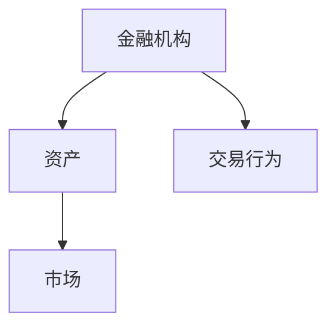
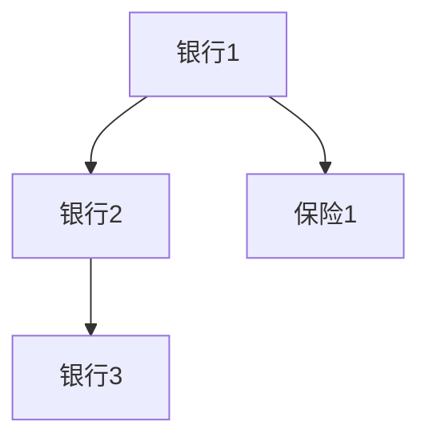
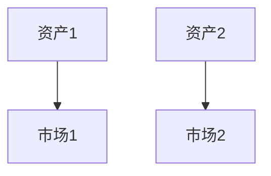
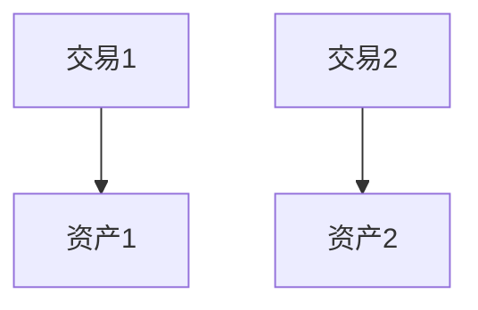
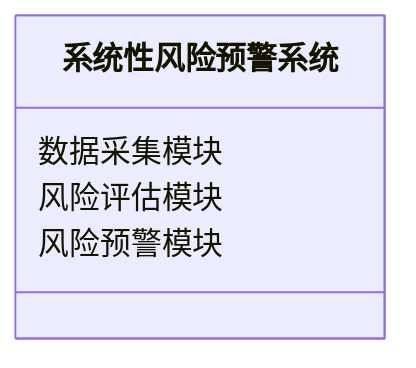

                 


# 金融领域图表示学习在系统性风险传导中的应用

## 关键词
系统性风险，图表示学习，金融网络，风险传导，深度学习

## 摘要
系统性风险是金融体系中的重大挑战，传统的评估方法存在诸多局限。图表示学习作为一种新兴的技术，通过构建金融网络，捕捉复杂的关联关系，为系统性风险的评估和管理提供了新的思路。本文系统介绍了图表示学习的基本概念、算法原理及其在系统性风险中的应用，详细探讨了如何利用图表示学习构建金融网络模型，评估系统性风险，并设计预警管理系统。通过实际案例分析，展示了图表示学习在金融领域的强大潜力。

---

# 引言: 系统性风险的基本概念

## 1.1 系统性风险的定义与特征

### 1.1.1 系统性风险的定义
系统性风险是指由于金融体系中某些关键因素的波动或崩溃，导致整个金融系统发生连锁反应，引发广泛损失的风险。与非系统性风险不同，系统性风险影响整个市场，而非单个资产或机构。

### 1.1.2 系统性风险的主要特征
- **传染性**：风险从一个机构或市场扩散到整个金融体系。
- **复杂性**：涉及多层次、多类型的金融机构和市场。
- **系统性影响**：可能导致金融体系的崩溃，影响实体经济。

### 1.1.3 系统性风险的来源与传导机制
- **来源**：金融机构的杠杆率过高、资产价格泡沫、市场流动性不足等。
- **传导机制**：通过直接关联（如银行间的拆借）或间接关联（如共同的市场参与者）传播风险。

---

## 1.2 传统系统性风险评估方法

### 1.2.1 VaR（Value at Risk）方法
VaR通过统计方法估计资产在一定置信水平下的最大损失。然而，VaR难以捕捉复杂的金融网络结构。

### 1.2.2 Copula方法
Copula方法用于分析资产之间的相关性，但其假设资产之间独立的条件在系统性风险中可能不成立。

### 1.2.3 资产定价模型（APT）
APT通过多个因素解释资产收益，但忽略了金融机构之间的相互依赖关系。

---

## 1.3 传统系统性风险评估方法的局限性

- **参数估计复杂**：传统方法依赖于大量假设和参数估计，容易出现偏差。
- **非线性关系处理不足**：系统性风险的传播通常是非线性的，传统方法难以捕捉。
- **无法捕捉复杂网络结构**：传统方法忽略了金融机构之间的网络关系。

---

# 第二部分: 图表示学习的理论基础

## 2.1 图表示学习的基本概念

### 2.1.1 图表示学习的定义
图表示学习是指将图结构中的节点、边或子图映射到低维向量空间的技术。这些向量能够保留图的结构信息和语义信息。

### 2.1.2 图表示学习的核心特点
- **保留图结构**：节点之间的关系和网络的整体结构在向量中得以体现。
- **可扩展性**：适用于大规模图数据。
- **多模态融合**：可以结合节点属性和边属性进行表示。

### 2.1.3 图表示学习与传统文本表示学习的区别
| 特性 | 图表示学习 | 文本表示学习 |
|------|------------|--------------|
| 数据结构 | 图结构 | 文本序列 |
| 关注点 | 节点关系 | 词义联系 |
| 应用场景 | 社交网络、金融网络 | 文本分类、情感分析 |

---

## 2.2 图表示学习的主要方法

### 2.2.1 基于节点嵌入的图表示学习
- **Node2Vec**：通过随机游走生成节点上下文，训练节点嵌入。
- **优点**：捕捉节点之间的局部结构。

### 2.2.2 基于图嵌入的表示学习
- **GraphSAGE**：通过归纳式学习，生成全局图嵌入。
- **优点**：适用于大规模图数据。

### 2.2.3 对比学习与自监督学习在图表示中的应用
- **对比学习**：通过最大化正样本对的相似性，增强表示能力。
- **自监督学习**：利用图的结构信息，无监督地学习节点表示。

---

## 2.3 图表示学习的核心概念与联系

### 2.3.1 实体关系图的构建


### 2.3.2 实体属性与关系的对比分析
| 属性 | 金融机构 | 资产 | 市场 | 交易行为 |
|------|----------|------|------|----------|
| 示例 | 银行、保险公司 | 股票、债券 | 股票市场、债券市场 | 买入、卖出 |

### 2.3.3 图表示学习的ER实体关系图架构
```mermaid
erd
    客户
    ---------
    账户
    ---------
    交易
    ---------
    市场
```

---

# 第三部分: 系统性风险的图表示建模

## 3.1 金融网络的图表示建模

### 3.1.1 金融机构间的关联网络


### 3.1.2 资产与市场的关联网络


### 3.1.3 交易行为的网络表示


---

## 3.2 系统性风险的图表示学习算法

### 3.2.1 图表示学习的算法原理


---

## 3.3 系统性风险的图表示学习实现

### 3.3.1 系统性风险的度量方法
- **中心性指标**：度中心性、接近中心性、中间中心性。
- **网络风险传播模型**：基于节点嵌入的风险传播模型。

---

## 3.4 系统性风险传导的图网络分析

### 3.4.1 网络结构对风险传导的影响
- **网络密度**：密度高的网络更容易传播风险。
- **网络分层**：分层结构可以减缓风险传播。

---

## 3.5 系统性风险预警与管理系统的设计

### 3.5.1 系统功能设计


---

## 3.6 项目实战: 系统性风险预警管理系统

### 3.6.1 环境安装
```bash
pip install networkx
pip install pytorch
pip install matplotlib
```

---

## 3.7 总结与展望

### 3.7.1 总结
图表示学习为系统性风险的评估和管理提供了新的思路，能够捕捉复杂的金融网络结构。

### 3.7.2 展望
未来的研究可以进一步优化图表示学习算法，结合更多的金融数据源，提升系统的实时性和准确性。

---

# 结语

## 4.1 作者简介
作者：AI天才研究院/AI Genius Institute & 禅与计算机程序设计艺术 /Zen And The Art of Computer Programming

---

**摘要**：本文系统介绍了图表示学习在金融领域中的应用，详细探讨了其在系统性风险评估和管理中的潜力。通过理论与实践相结合，展示了图表示学习在金融领域的巨大价值。

--- 

这篇文章通过系统的结构安排，详细阐述了图表示学习在系统性风险中的应用，从理论到实践，从概念到代码，全面覆盖了相关知识，为读者提供了深入的理解和实用的指导。

