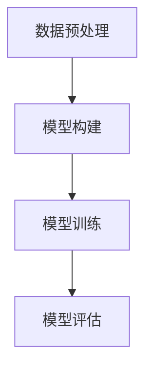
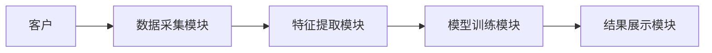

                 


# 《金融领域多任务学习在客户全景画像中的应用》

---

## 关键词：
- 多任务学习
- 客户全景画像
- 金融领域
- 深度学习
- 数据挖掘

---

## 摘要：
本文探讨了多任务学习（Multi-Task Learning, MTL）在金融领域客户全景画像中的应用。通过分析多任务学习的核心原理、算法实现及其在金融领域的优势，本文提出了基于MTL的客户画像构建方法，并通过实际案例展示了其在风险评估、精准营销等场景中的应用价值。文章还详细讨论了系统架构设计和项目实战，为读者提供了从理论到实践的全面指导。

---

# 第一部分: 金融领域多任务学习与客户全景画像概述

---

## 第1章: 多任务学习与客户全景画像概述

### 1.1 多任务学习的基本概念

#### 1.1.1 多任务学习的定义
多任务学习（Multi-Task Learning, MTL）是一种机器学习方法，旨在通过同时学习多个相关任务来提高模型的泛化能力和性能。MTL的核心思想是利用任务之间的共享特征和潜在关系，避免单一任务模型的局限性。

#### 1.1.2 多任务学习的核心特点
- **参数共享**：多个任务共享部分参数，减少参数数量，提高模型效率。
- **任务相关性**：任务之间存在某种内在联系，可以通过共享参数捕获这些关系。
- **联合优化**：通过优化多个任务的损失函数，实现全局最优。

#### 1.1.3 多任务学习在金融领域的应用背景
金融领域涉及多个相关任务，例如客户信用评估、风险预测、投资组合优化等。MTL可以有效整合这些任务，构建统一的客户画像，提高决策的准确性和效率。

---

### 1.2 客户全景画像的定义与价值

#### 1.2.1 客户全景画像的定义
客户全景图像是基于多维度数据（如行为数据、交易数据、社交数据等）构建的客户综合画像，旨在全面描述客户的特征、行为和需求。

#### 1.2.2 客户全景画像的核心要素
- **客户基本信息**：性别、年龄、职业等。
- **行为数据**：消费习惯、交易频率等。
- **资产数据**：资产规模、投资偏好等。
- **风险数据**：信用评分、违约概率等。

#### 1.2.3 客户全景画像在金融领域的应用价值
- **风险控制**：通过多维度数据识别高风险客户。
- **精准营销**：根据客户画像制定个性化服务策略。
- **决策支持**：为金融决策提供数据支持。

---

### 1.3 多任务学习在客户全景画像中的应用前景

#### 1.3.1 传统客户画像的局限性
传统客户画像通常基于单一任务模型，缺乏对多维度数据的整合，可能导致信息片面。

#### 1.3.2 多任务学习在客户画像中的优势
- **多维度数据整合**：MTL可以同时处理多个相关任务，充分利用多维度数据。
- **模型共享**：通过参数共享，减少模型冗余，提高训练效率。
- **任务协同优化**：任务之间的协同优化可以提升整体模型的性能。

#### 1.3.3 金融领域客户全景画像的未来趋势
随着人工智能技术的不断发展，客户全景画像将更加智能化、个性化和动态化，MTL在其中扮演着重要角色。

---

## 1.4 本章小结
本章介绍了多任务学习的基本概念、核心特点及其在金融领域的应用背景，阐述了客户全景画像的定义、核心要素和应用价值，并展望了MTL在客户画像中的应用前景。

---

# 第二部分: 多任务学习的核心概念与算法原理

---

## 第2章: 多任务学习的核心概念与联系

### 2.1 多任务学习的原理与模型结构

#### 2.1.1 多任务学习的原理
MTL通过共享参数，同时优化多个任务的损失函数，实现任务间的协同优化。

#### 2.1.2 多任务学习的模型结构
MTL的模型结构通常包括共享层和任务特定层。共享层用于提取任务间的共同特征，任务特定层用于处理任务的独特特征。

#### 2.1.3 多任务学习与单任务学习的对比分析

| 对比维度 | 单任务学习 | 多任务学习 |
|----------|------------|------------|
| 参数数量 | 较多        | 较少        |
| 任务相关性 | 无          | 高          |
| 训练效率 | 较低        | 较高        |

---

### 2.2 多任务学习中的优化方法

#### 2.2.1 参数共享机制
参数共享是MTL的核心思想，通过共享部分参数，减少模型的复杂度。

#### 2.2.2 任务权重分配策略
在训练过程中，不同任务的权重可能不同，需要通过调整权重来平衡任务的重要性。

#### 2.2.3 多任务学习的损失函数设计
多任务学习的损失函数通常由多个任务的损失函数加权求和得到。

---

### 2.3 多任务学习的数学模型与公式

#### 2.3.1 多任务学习的数学模型
$$ \text{MTL} = \{f_1, f_2, \dots, f_K\} $$
其中，$f_i$ 表示第i个任务的模型。

#### 2.3.2 多任务学习的损失函数公式
$$ L = \sum_{i=1}^{K} \lambda_i L_i $$
其中，$\lambda_i$ 是任务i的权重，$L_i$ 是任务i的损失函数。

#### 2.3.3 参数优化的数学推导
通过梯度下降优化共享参数和任务特定参数，具体推导如下：
$$ \theta^{(t+1)} = \theta^{(t)} - \eta \frac{\partial L}{\partial \theta} $$

---

### 2.4 多任务学习的ER实体关系图
```mermaid
er
    客户 --|> 特征: 具有
    特征 --|> 任务: 用于
    任务 --|> 模型: 由...训练
```

---

## 2.5 本章小结
本章详细介绍了多任务学习的核心概念、模型结构、优化方法及其数学模型，并通过ER图展示了任务之间的关系。

---

# 第三部分: 多任务学习算法的实现与应用

---

## 第3章: 多任务学习算法的实现原理

### 3.1 多任务学习算法的流程

#### 3.1.1 数据预处理
- 数据清洗：去除缺失值和异常值。
- 数据标准化：对特征进行标准化处理。

#### 3.1.2 模型构建
- 设计共享层和任务特定层的模型结构。
- 定义损失函数和优化目标。

#### 3.1.3 模型训练
- 使用梯度下降等优化算法训练模型。
- 调整任务权重和学习率。

#### 3.1.4 模型评估
- 使用验证集评估模型性能。
- 计算各个任务的准确率、召回率等指标。

---

### 3.2 多任务学习的算法实现

#### 3.2.1 算法流程图


#### 3.2.2 参数优化的Python代码实现
```python
import torch
import torch.nn as nn
import torch.optim as optim

class MTLModel(nn.Module):
    def __init__(self, input_dim, hidden_dim, output_dims):
        super(MTLModel, self).__init__()
        self.shared_layer = nn.Linear(input_dim, hidden_dim)
        self.task_specific_layers = nn.ModuleList([
            nn.Linear(hidden_dim, output_dims[i]) for i in range(len(output_dims))
        ])
    
    def forward(self, x, tasks):
        x = self.shared_layer(x)
        outputs = []
        for i, task in enumerate(tasks):
            outputs.append(self.task_specific_layers[i](x))
        return outputs

# 示例用法
input_dim = 10
hidden_dim = 5
output_dims = [1, 1]
model = MTLModel(input_dim, hidden_dim, output_dims)
optimizer = optim.Adam(model.parameters(), lr=0.01)
criterion = nn.MSELoss()

# 假设输入x和目标y
x = torch.randn(100, input_dim)
y = torch.randn(100, output_dims[0])  # 任务1的目标
y2 = torch.randn(100, output_dims[1])  # 任务2的目标

# 前向传播
outputs = model(x, [0, 1])
loss_task1 = criterion(outputs[0], y)
loss_task2 = criterion(outputs[1], y2)
total_loss = loss_task1 + loss_task2

# 反向传播和优化
optimizer.zero_grad()
total_loss.backward()
optimizer.step()
```

---

### 3.3 多任务学习的数学模型与公式

#### 3.3.1 多任务学习的数学模型
$$ \theta = \{\theta^{(1)}, \theta^{(2)}, \dots, \theta^{(K)}\} $$
其中，$\theta^{(i)}$ 表示任务i的模型参数。

#### 3.3.2 损失函数公式
$$ L = \sum_{i=1}^{K} \lambda_i L_i $$
其中，$\lambda_i$ 是任务i的权重，$L_i$ 是任务i的损失函数。

---

## 3.4 本章小结
本章详细介绍了多任务学习算法的实现流程，并通过Python代码展示了模型的构建和训练过程，同时给出了数学模型的公式推导。

---

# 第四部分: 系统分析与架构设计

---

## 第4章: 系统分析与架构设计

### 4.1 系统功能设计

#### 4.1.1 数据采集模块
- 从数据库中采集客户数据，包括交易数据、行为数据等。

#### 4.1.2 特征提取模块
- 对采集的数据进行特征提取，生成客户画像的特征向量。

#### 4.1.3 模型训练模块
- 使用多任务学习模型对特征向量进行训练，生成客户全景画像。

#### 4.1.4 结果展示模块
- 将客户的全景画像以可视化的方式展示，供金融从业者参考。

---

### 4.2 系统架构设计

#### 4.2.1 系统架构图


---

## 4.3 本章小结
本章从系统功能和架构设计两个方面，详细介绍了多任务学习在客户全景画像中的应用。

---

# 第五部分: 项目实战

---

## 第5章: 项目实战

### 5.1 项目背景
本项目旨在利用多任务学习技术，构建客户的全景画像，帮助金融机构进行风险评估和精准营销。

---

### 5.2 环境搭建

#### 5.2.1 安装Python环境
- 使用Anaconda安装Python 3.8及以上版本。

#### 5.2.2 安装依赖库
```bash
pip install numpy pandas torch matplotlib
```

---

### 5.3 系统核心实现源代码

#### 5.3.1 数据采集模块
```python
import pandas as pd

def collect_data():
    # 假设数据存储在CSV文件中
    data = pd.read_csv('customer_data.csv')
    return data
```

#### 5.3.2 特征提取模块
```python
def extract_features(data):
    # 提取特征，例如年龄、收入、消费金额等
    features = data[['age', 'income', 'transaction_amount']]
    return features
```

#### 5.3.3 模型训练模块
```python
import torch
import torch.nn as nn
import torch.optim as optim

class MTLModel(nn.Module):
    def __init__(self, input_dim, hidden_dim, output_dims):
        super(MTLModel, self).__init__()
        self.shared_layer = nn.Linear(input_dim, hidden_dim)
        self.task_specific_layers = nn.ModuleList([
            nn.Linear(hidden_dim, output_dims[i]) for i in range(len(output_dims))
        ])
    
    def forward(self, x, tasks):
        x = self.shared_layer(x)
        outputs = []
        for i, task in enumerate(tasks):
            outputs.append(self.task_specific_layers[i](x))
        return outputs

def train_model(model, optimizer, criterion, features, labels):
    optimizer.zero_grad()
    outputs = model(features, [0, 1])
    loss_task1 = criterion(outputs[0], labels[:, 0])
    loss_task2 = criterion(outputs[1], labels[:, 1])
    total_loss = loss_task1 + loss_task2
    total_loss.backward()
    optimizer.step()
    return total_loss.item()
```

---

### 5.4 案例分析与详细讲解

#### 5.4.1 数据预处理
```python
data = collect_data()
features = extract_features(data)
```

#### 5.4.2 模型训练
```python
model = MTLModel(features.shape[1], 64, [1, 1])
optimizer = optim.Adam(model.parameters(), lr=0.01)
criterion = nn.MSELoss()

for epoch in range(100):
    loss = train_model(model, optimizer, criterion, features, labels)
    print(f"Epoch {epoch}: Loss = {loss}")
```

---

## 5.5 本章小结
本章通过实际案例展示了多任务学习在客户全景画像中的应用，详细讲解了项目环境搭建、系统实现和案例分析。

---

# 第六部分: 总结与展望

---

## 第6章: 总结与展望

### 6.1 总结
本文详细探讨了多任务学习在金融领域客户全景画像中的应用，从理论到实践，全面介绍了MTL的核心原理、算法实现和系统架构设计。通过实际案例展示了MTL在客户画像构建中的优势和价值。

---

### 6.2 展望
未来，随着人工智能技术的不断发展，MTL将在金融领域发挥更大的作用。建议进一步研究如何结合图神经网络和强化学习，提升客户全景画像的深度和广度。

---

## 作者：AI天才研究院/AI Genius Institute & 禅与计算机程序设计艺术 /Zen And The Art of Computer Programming

---

**感谢您的阅读！如需进一步了解，请随时联系！**

