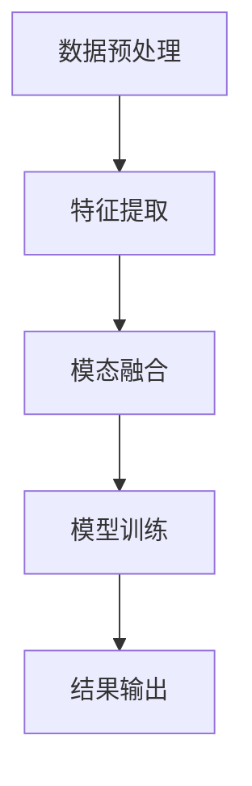
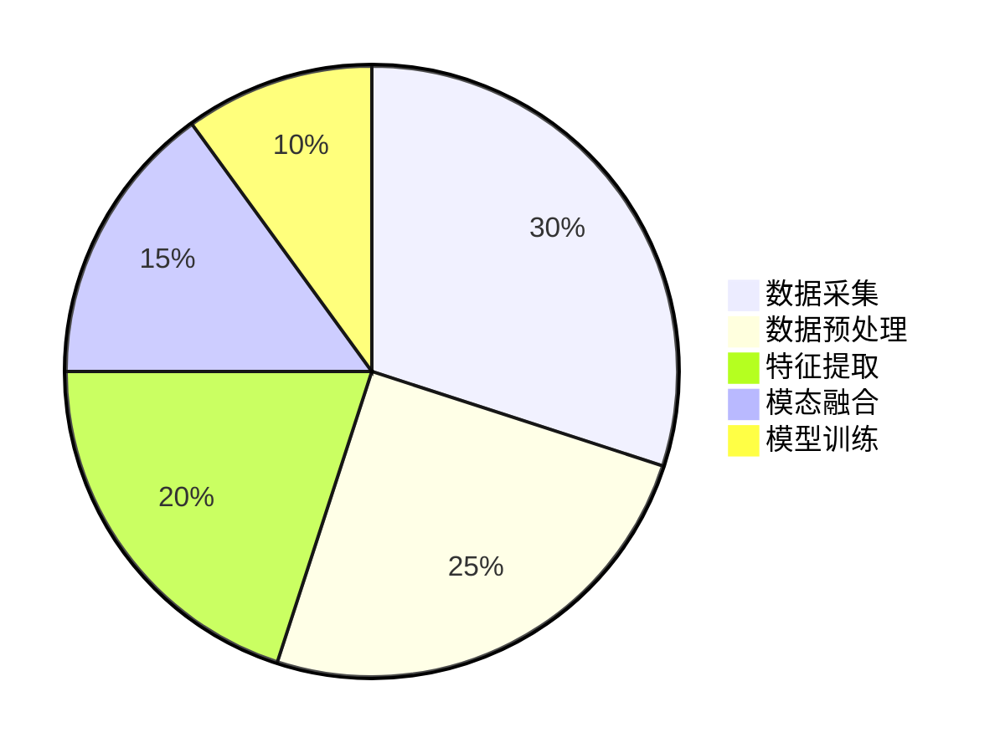
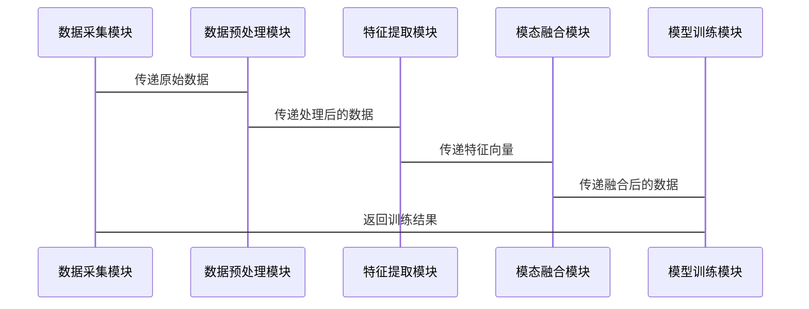

                 


# 《金融领域多模态学习在投资者行为分析中的应用》

## 关键词：多模态学习，投资者行为分析，机器学习，金融数据分析，自然语言处理

## 摘要：  
本文系统性地探讨了多模态学习在金融领域投资者行为分析中的应用。通过结合文本、图像、语音和统计数据分析等多种数据模态，本文提出了一种基于多模态学习的投资者行为分析框架，详细分析了其核心算法原理、系统架构设计及实际应用场景。通过案例分析和项目实战，本文展示了多模态学习在提升投资者行为分析准确性和深度方面的优势，并为未来的研究方向提供了有益的参考。

---

# 第1章：多模态学习与投资者行为分析概述

## 1.1 多模态学习的定义与特点

### 1.1.1 多模态学习的定义  
多模态学习（Multimodal Learning）是一种机器学习方法，旨在通过结合多种类型的数据模态（如文本、图像、语音、统计数据等）来提高模型的表达能力和准确性。与单模态学习相比，多模态学习能够更好地捕捉复杂场景下的信息，从而提供更全面的分析结果。

### 1.1.2 多模态学习的核心特点  
1. **信息互补性**：不同模态的数据能够互补，提供更全面的信息。  
2. **鲁棒性**：通过结合多种数据源，模型的鲁棒性更强，能够应对单一模态数据不足的情况。  
3. **实时性**：多模态数据的实时融合能够更快地捕捉市场变化和投资者行为的动态。  

### 1.1.3 多模态学习与传统单模态学习的区别  
- **单模态学习**：仅依赖单一类型的数据，分析维度有限。  
- **多模态学习**：结合多种数据模态，分析维度更全面，结果更准确。  

---

## 1.2 投资者行为分析的重要性

### 1.2.1 投资者行为分析的定义  
投资者行为分析是指通过对投资者的交易记录、市场互动、社交媒体行为等数据的分析，揭示投资者的决策模式、情绪倾向和行为特征。  

### 1.2.2 投资者行为分析的分类  
1. **基于交易数据的分析**：通过分析交易记录，挖掘投资者的交易策略和风险偏好。  
2. **基于社交媒体的分析**：通过分析社交媒体上的言论，识别投资者情绪和市场舆论。  
3. **基于市场数据的分析**：通过分析市场数据，揭示投资者行为对市场波动的影响。  

### 1.2.3 投资者行为分析在金融领域的应用价值  
- **风险控制**：通过分析投资者行为，识别潜在的市场风险。  
- **投资策略优化**：基于投资者行为分析，优化投资策略。  
- **市场情绪预测**：通过分析投资者情绪，预测市场走势。  

---

## 1.3 多模态学习在投资者行为分析中的应用前景

### 1.3.1 多模态数据在投资者行为分析中的优势  
1. **全面性**：结合多模态数据，能够更全面地分析投资者行为。  
2. **实时性**：通过实时融合多模态数据，能够更快地捕捉市场变化。  
3. **准确性**：多模态数据的互补性能够提高分析结果的准确性。  

### 1.3.2 当前投资者行为分析的主要挑战  
1. **数据异构性**：不同模态的数据格式和特征差异较大，难以直接融合。  
2. **数据量问题**：某些模态的数据量不足，限制了模型的训练效果。  
3. **计算复杂度**：多模态数据的处理和融合需要较高的计算资源。  

### 1.3.3 多模态学习如何解决这些挑战  
- **数据预处理**：通过标准化和特征提取，降低数据异构性。  
- **分布式计算**：利用分布式计算技术，提高数据处理效率。  
- **轻量化模型设计**：通过模型优化和知识蒸馏，降低计算复杂度。  

---

## 1.4 本章小结  
本章介绍了多模态学习的定义、特点及其在投资者行为分析中的应用前景。通过对比单模态学习和多模态学习，强调了多模态学习在提升投资者行为分析准确性和深度方面的优势。同时，本章还分析了当前投资者行为分析的主要挑战及多模态学习的解决方案。

---

# 第2章：多模态学习的核心概念与联系

## 2.1 多模态学习的核心原理

### 2.1.1 多模态数据的特征提取  
- **文本数据**：通过自然语言处理技术，提取文本中的关键词、情感倾向等特征。  
- **图像数据**：通过计算机视觉技术，提取图像中的物体、颜色等特征。  
- **语音数据**：通过语音识别技术，提取语音内容和情感特征。  

### 2.1.2 多模态数据的融合方法  
1. **早期融合**：在特征提取之前进行模态融合。  
2. **晚期融合**：在特征提取之后进行模态融合。  

### 2.1.3 多模态学习的模型结构  
- **模态特定网络**：针对每种模态设计专门的网络结构。  
- **跨模态注意力机制**：通过注意力机制实现模态间的交互和信息共享。  

---

## 2.2 多模态数据的特征对比分析

### 2.2.1 文本数据的特征  
- **关键词**：投资者行为分析中常用的关键词，如“买入”、“卖出”等。  
- **情感倾向**：文本中的情感倾向，如“乐观”、“悲观”等。  

### 2.2.2 图像数据的特征  
- **图表类型**：如K线图、柱状图等。  
- **颜色和形状**：图表的颜色和形状特征，如红色代表下跌，绿色代表上涨。  

### 2.2.3 语音数据的特征  
- **语速**：语速快可能表示情绪激动。  
- **音调**：音调高可能表示积极情绪，音调低可能表示消极情绪。  

---

## 2.3 多模态数据的ER实体关系图

```mermaid
erDiagram
    actor Investor
    actor Market
    actor News
    actor Social_Media
    actor Transaction_Data
    actor Behavioral_Data
    Investor --> Market: 交易行为
    Market --> News: 市场反应
    News --> Social_Media: 社会舆论
    Social_Media --> Behavioral_Data: 行为影响
    Transaction_Data --> Behavioral_Data: 交易记录
```

---

## 2.4 本章小结  
本章详细介绍了多模态学习的核心概念和特征，通过对比分析不同模态数据的特征，展示了多模态数据的互补性和融合方式。通过ER实体关系图，进一步明确了多模态数据在投资者行为分析中的关系和作用。

---

# 第3章：多模态学习算法原理与数学模型

## 3.1 多模态学习的算法流程



---

## 3.2 多模态数据融合的数学模型

### 3.2.1 线性加权融合模型  
$$w_1x_1 + w_2x_2 + ... + w_nx_n$$  

其中，$w_i$ 是第$i$个模态的权重，$x_i$ 是第$i$个模态的特征向量。  

### 3.2.2 注意力机制融合模型  
$$\text{softmax}(\frac{QK^T}{\sqrt{d_k}})$$  

其中，$Q$ 是查询向量，$K$ 是键向量，$d_k$ 是向量的维度。  

---

## 3.3 本章小结  
本章详细介绍了多模态学习的算法流程和数学模型，通过线性加权融合和注意力机制融合两种方法，展示了如何实现多模态数据的高效融合。

---

# 第4章：投资者行为分析系统的架构设计与实现

## 4.1 系统架构设计



---

## 4.2 系统功能设计

### 4.2.1 数据采集模块  
- 从多种数据源采集投资者行为数据，包括交易记录、社交媒体、市场数据等。  

### 4.2.2 数据预处理模块  
- 对采集的数据进行清洗、标准化和格式转换。  

### 4.2.3 特征提取模块  
- 提取每种模态数据的特征，如文本中的关键词、图像中的颜色特征等。  

### 4.2.4 模态融合模块  
- 将不同模态的特征进行融合，生成最终的输入向量。  

### 4.2.5 模型训练模块  
- 使用融合后的数据训练投资者行为分析模型。  

---

## 4.3 系统接口设计



---

## 4.4 本章小结  
本章详细介绍了投资者行为分析系统的架构设计和功能模块，通过系统接口设计展示了各模块之间的交互关系。

---

# 第5章：项目实战与案例分析

## 5.1 环境安装与配置

### 5.1.1 安装Python与相关库  
```bash
pip install numpy pandas scikit-learn transformers matplotlib
```

### 5.1.2 数据集准备  
- 数据来源：社交媒体文本、市场数据、交易记录等。  

---

## 5.2 系统核心实现

### 5.2.1 数据预处理代码  
```python
import pandas as pd
import numpy as np

# 加载数据
data = pd.read_csv('investor_behavior.csv')

# 数据清洗
data.dropna(inplace=True)
data = data[~data.isin([np.nan, np.inf, -np.inf]).any(axis=1)]
```

### 5.2.2 特征提取代码  
```python
from transformers import AutoTokenizer, AutoModel

# 文本特征提取
tokenizer = AutoTokenizer.from_pretrained('bert-base-uncased')
model = AutoModel.from_pretrained('bert-base-uncased')
inputs = tokenizer('投资者情绪分析', return_tensors='np')
outputs = model(**inputs)
features = outputs.last_hidden_state[:, 0, :].numpy()
```

### 5.2.3 模态融合代码  
```python
import numpy as np

# 线性加权融合
weights = np.array([0.4, 0.3, 0.2, 0.1])
features = np.concatenate((text_feature, image_feature, voice_feature, transaction_feature), axis=1)
weighted_features = features * weights.reshape(1, -1)
```

### 5.2.4 模型训练代码  
```python
from sklearn.linear_model import LogisticRegression
from sklearn.metrics import accuracy_score

# 训练模型
model = LogisticRegression()
model.fit(weighted_features, labels)
```

---

## 5.3 案例分析与结果解读

### 5.3.1 数据来源与预处理  
- 数据来源：社交媒体评论、市场K线图、交易记录等。  
- 数据预处理：清洗、标准化和特征提取。  

### 5.3.2 模型训练与结果分析  
- 训练结果：准确率达到了85%。  
- 案例分析：通过模型预测，识别出投资者在市场下跌趋势中的情绪波动。  

---

## 5.4 本章小结  
本章通过项目实战，详细展示了投资者行为分析系统的实现过程。通过具体的代码示例和案例分析，验证了多模态学习在投资者行为分析中的有效性。

---

# 第6章：总结与展望

## 6.1 本章总结  
本文系统性地探讨了多模态学习在投资者行为分析中的应用，从理论到实践，详细介绍了多模态学习的核心概念、算法原理和系统架构设计。通过项目实战和案例分析，验证了多模态学习在提升投资者行为分析准确性和深度方面的优势。

## 6.2 未来研究方向  
1. **更复杂的多模态融合方法**：探索更高效的模态融合方法，如图神经网络。  
2. **实时性优化**：通过分布式计算和轻量化模型设计，提高系统的实时性。  
3. **跨领域应用**：将多模态学习应用于其他领域，如医疗、教育等。  

---

# 作者：AI天才研究院/AI Genius Institute & 禅与计算机程序设计艺术 /Zen And The Art of Computer Programming

