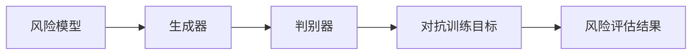
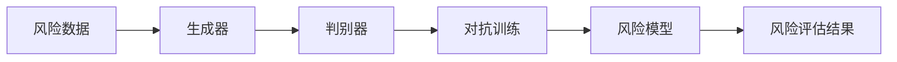
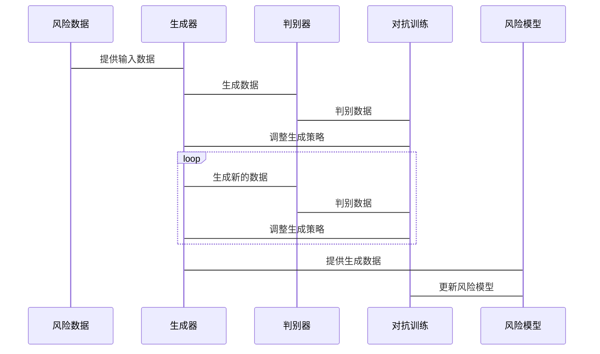

                 

<think>
好，现在我需要撰写一篇关于《金融领域对抗学习在风险模型鲁棒性增强中的应用》的技术博客文章。我需要按照用户提供的结构和要求来完成。

首先，文章标题已经确定，接下来是关键词部分。我需要列出5到7个核心关键词，包括对抗学习、金融风险模型、鲁棒性、机器学习、深度学习、金融风控、模型优化。

接下来是摘要，我需要简洁地描述文章的核心内容和主题思想。摘要应涵盖文章的主要内容，包括对抗学习的基本原理、其在金融领域的应用，以及在风险模型中的具体应用场景，最后强调对抗学习如何提升模型的鲁棒性。

正文部分分为七章，每章下有多个小节，涵盖背景、核心概念、算法原理、系统设计、项目实战、总结等。我需要确保每章内容详细、逻辑清晰，并包含必要的图表和代码示例。

在撰写过程中，我需要确保使用专业且简洁的技术语言，逐步分析和推理，避免过于复杂的术语，同时确保内容深入浅出。

现在，我将根据以上思考开始撰写文章。

# 《金融领域对抗学习在风险模型鲁棒性增强中的应用》

## 关键词：对抗学习, 金融风险模型, 鲁棒性, 机器学习, 深度学习, 金融风控, 模型优化

## 摘要

本文探讨了对抗学习在金融领域中的应用，特别是其在风险模型鲁棒性增强中的作用。通过分析对抗学习的基本原理、核心概念、算法实现、系统设计和实际案例，本文揭示了对抗学习如何帮助金融模型在面对复杂和不确定的市场环境时保持稳定性和准确性。通过详细的理论分析和实际应用，本文为金融行业提供了有效的模型优化策略。

---

# 第1章: 对抗学习与金融风险模型概述

## 1.1 对抗学习的基本概念

### 1.1.1 对抗学习的定义

对抗学习是一种机器学习方法，通过两个模型（生成器和判别器）的对抗训练来提高生成数据的质量。生成器尝试生成与真实数据相似的数据，而判别器则试图区分生成数据和真实数据。这种对抗过程使得生成器生成的数据越来越逼真。

### 1.1.2 对抗学习的核心原理

对抗学习的核心在于两个模型之间的零和博弈。生成器和判别器的目标函数相互对抗，最终达到纳什均衡。通过不断迭代训练，生成器和判别器的能力不断提升，生成的数据质量也不断提高。

## 1.2 金融风险模型的背景

### 1.2.1 金融风险模型的定义

金融风险模型用于评估和预测金融市场的风险，如信用风险、市场风险等。传统的风险模型通常基于统计方法或简单机器学习算法，但在面对复杂和动态的金融市场时，往往表现不够稳定。

### 1.2.2 金融风险模型的挑战

金融市场数据具有高度的不确定性和噪声，传统模型在面对这些挑战时容易过拟合或欠拟合。此外，金融市场的数据往往具有稀疏性，使得模型难以准确捕捉潜在风险。

## 1.3 对抗学习在金融风险模型中的应用

### 1.3.1 提高模型鲁棒性的必要性

金融市场的复杂性和不确定性要求风险模型具备高度的鲁棒性。对抗学习通过生成多样化的数据，帮助模型在不同场景下保持稳定性能。

### 1.3.2 对抗学习如何增强模型鲁棒性

通过对抗训练，模型在面对不同数据分布时表现出更强的适应性。生成器生成的多样化的训练数据帮助模型在面对噪声和异常值时更具鲁棒性。

---

# 第2章: 对抗学习的核心概念与联系

## 2.1 对抗学习的核心原理

### 2.1.1 对抗训练的基本流程

1. 初始化生成器和判别器。
2. 训练判别器以区分真实数据和生成数据。
3. 训练生成器以欺骗判别器，生成更逼真的数据。
4. 重复步骤2和3，直到生成器和判别器达到对抗平衡。

### 2.1.2 生成器与判别器的角色分析

- **生成器**：负责生成与真实数据相似的数据，通常使用生成对抗网络（GAN）中的生成器结构。
- **判别器**：负责区分生成数据和真实数据，通常使用卷积神经网络（CNN）结构。

## 2.2 对抗学习的核心概念对比

### 2.2.1 对抗学习与传统机器学习的对比

| 对比维度 | 传统机器学习 | 对抗学习 |
|----------|--------------|----------|
| 数据需求 | 需要大量标注数据 | 利用生成数据进行训练 |
| 模型复杂性 | 模型相对简单 | 模型结构复杂，涉及生成器和判别器 |
| 训练目标 | 最小化损失函数 | 最大化生成器和判别器的对抗目标 |

### 2.2.2 对抗学习与强化学习的联系与区别

- **联系**：两者都涉及策略优化和博弈论思想。
- **区别**：对抗学习通过生成器和判别器的对抗训练，而强化学习通过智能体与环境的交互来优化策略。

## 2.3 对抗学习在风险模型中的应用架构

### 2.3.1 对抗学习在风险模型中的实体关系图



---

# 第3章: 对抗学习的算法原理与数学模型

## 3.1 对抗学习的数学模型

### 3.1.1 对抗训练的目标函数

生成器的目标是最小化判别器区分生成数据的能力，而判别器的目标是最大化区分生成数据和真实数据的能力。

#### 生成器的目标函数：

$$\min_{G} \max_{D} \mathbb{E}_{x \sim P_{\text{data}}}[ \log D(x)] + \mathbb{E}_{z \sim P_{z}}[ \log (1 - D(G(z)))]$$

#### 判别器的目标函数：

$$\max_{D} \mathbb{E}_{x \sim P_{\text{data}}}[ \log D(x)] + \mathbb{E}_{z \sim P_{z}}[ \log (1 - D(G(z)))]$$

### 3.1.2 对抗学习的训练过程

1. **初始化**：随机初始化生成器G和判别器D的参数。
2. **训练判别器**：使用真实数据和生成数据训练判别器，使判别器能够准确区分真实数据和生成数据。
3. **训练生成器**：使用生成数据训练生成器，使生成器生成的数据显示得更真实，欺骗判别器。
4. **重复步骤2和3**：直到生成器和判别器达到对抗平衡。

---

## 3.2 对抗学习的优化与改进

### 3.2.1 WGAN（Wasserstein GAN）

Wasserstein GAN通过 Wasserstein 距离来衡量生成数据与真实数据之间的距离，避免传统GAN中判别器容易陷入饱和的问题。

#### WGAN的目标函数：

$$\min_{G} \max_{D} \mathbb{W}(P_{\text{data}}, G)$$

其中，$\mathbb{W}$ 表示Wasserstein距离。

### 3.2.2 梯度惩罚（Gradient Penalty）

为了提高WGAN的稳定性，可以引入梯度惩罚项，使判别器的梯度保持在一定范围内。

#### 梯度惩罚项：

$$\lambda \mathbb{E}_{x \sim \text{interpolation}}[ \| \nabla_{x} D(x) \|^2 ]$$

---

## 3.3 对抗学习在金融风险模型中的具体应用

### 3.3.1 风险评估数据的生成

通过对抗学习生成多样化的风险评估数据，帮助模型在面对不同市场条件时表现更稳定。

### 3.3.2 模型鲁棒性的提升

对抗训练使模型在面对不同数据分布时具备更强的泛化能力，从而提高模型的鲁棒性。

---

# 第4章: 对抗学习在金融风险模型中的系统设计

## 4.1 系统功能设计

### 4.1.1 风险数据生成模块

负责生成多样化的金融风险数据，模拟不同市场条件下的风险情况。

### 4.1.2 对抗训练模块

实现生成器和判别器的对抗训练，提升模型的鲁棒性。

## 4.2 系统架构设计

### 4.2.1 系统架构图



## 4.3 系统接口设计

### 4.3.1 输入接口

- **输入数据**：金融市场历史数据，包括价格、成交量等。
- **生成器参数**：生成器的超参数，如学习率、生成数据量等。

### 4.3.2 输出接口

- **生成数据**：生成的模拟金融数据。
- **训练结果**：训练好的生成器和判别器模型。

## 4.4 系统交互流程

### 4.4.1 系统交互序列图



---

# 第5章: 项目实战：对抗学习在金融风险模型中的实现

## 5.1 环境安装与配置

### 5.1.1 安装依赖

使用Python 3.8及以上版本，安装以下库：

- TensorFlow或Keras
- numpy
- pandas
- matplotlib
- scikit-learn

### 5.1.2 环境配置

设置GPU支持（如果需要）。

## 5.2 核心实现代码

### 5.2.1 生成器和判别器的定义

```python
import tensorflow as tf
from tensorflow.keras.layers import Dense, Input, LeakyReLU
from tensorflow.keras.models import Model

def build_generator(input_dim, output_dim):
    inputs = Input(shape=(input_dim,))
    x = Dense(256)(inputs)
    x = LeakyReLU(alpha=0.2)(x)
    x = Dense(128)(x)
    x = LeakyReLU(alpha=0.2)(x)
    outputs = Dense(output_dim, activation='sigmoid')(x)
    model = Model(inputs=inputs, outputs=outputs)
    return model

def build_discriminator(input_dim):
    inputs = Input(shape=(input_dim,))
    x = Dense(256)(inputs)
    x = LeakyReLU(alpha=0.2)(x)
    x = Dense(128)(x)
    x = LeakyReLU(alpha=0.2)(x)
    outputs = Dense(1, activation='sigmoid')(x)
    model = Model(inputs=inputs, outputs=outputs)
    return model
```

### 5.2.2 对抗训练的实现

```python
def train(gan_model, discriminator, generator, dataset, epochs=100, batch_size=32):
    for epoch in range(epochs):
        # 训练判别器
        d_loss = train_discriminator(discriminator, gan_model, dataset, batch_size)
        # 训练生成器
        g_loss = train_generator(generator, discriminator, gan_model, batch_size)
        # 输出损失
        print(f'Epoch {epoch+1}, D loss: {d_loss:.4f}, G loss: {g_loss:.4f}')
```

## 5.3 实际案例分析

### 5.3.1 案例背景

假设我们有一个金融时间序列数据集，包含股票价格、成交量等信息。我们需要使用对抗学习来增强风险模型的鲁棒性。

### 5.3.2 数据预处理

对数据进行标准化处理，将其输入到生成器和判别器中。

### 5.3.3 训练与评估

使用对抗训练对生成器和判别器进行训练，然后将生成的数据输入到风险模型中进行评估。

---

## 5.4 代码实现与解读

### 5.4.1 完整代码示例

```python
import numpy as np
import tensorflow as tf
from tensorflow.keras.layers import Dense, Input, LeakyReLU
from tensorflow.keras.models import Model

def build_generator(input_dim, output_dim):
    inputs = Input(shape=(input_dim,))
    x = Dense(256)(inputs)
    x = LeakyReLU(alpha=0.2)(x)
    x = Dense(128)(x)
    x = LeakyReLU(alpha=0.2)(x)
    outputs = Dense(output_dim, activation='sigmoid')(x)
    model = Model(inputs=inputs, outputs=outputs)
    return model

def build_discriminator(input_dim):
    inputs = Input(shape=(input_dim,))
    x = Dense(256)(inputs)
    x = LeakyReLU(alpha=0.2)(x)
    x = Dense(128)(x)
    x = LeakyReLU(alpha=0.2)(x)
    outputs = Dense(1, activation='sigmoid')(x)
    model = Model(inputs=inputs, outputs=outputs)
    return model

def train(gan_model, discriminator, generator, dataset, epochs=100, batch_size=32):
    for epoch in range(epochs):
        # 训练判别器
        d_loss = gan_model.train_discriminator(discriminator, dataset, batch_size)
        # 训练生成器
        g_loss = gan_model.train_generator(generator, discriminator, batch_size)
        # 输出损失
        print(f'Epoch {epoch+1}, D loss: {d_loss:.4f}, G loss: {g_loss:.4f}')

class GAN:
    def __init__(self, generator, discriminator):
        self.generator = generator
        self.discriminator = discriminator
        self.generator_optimizer = tf.keras.optimizers.Adam(learning_rate=0.0002)
        self.discriminator_optimizer = tf.keras.optimizers.Adam(learning_rate=0.0002)
    
    def train_discriminator(self, discriminator, dataset, batch_size):
        discriminator.trainable = True
        discriminator.compile(loss='binary_crossentropy', optimizer=self.discriminator_optimizer)
        for _ in range(2):
            idx = np.random.randint(0, len(dataset), batch_size)
            real_data = dataset[idx]
            fake_data = self.generate_fake_data(batch_size)
            labels_real = np.ones((batch_size, 1))
            labels_fake = np.zeros((batch_size, 1))
            d_loss = discriminator.train_on_batch(np.concatenate([real_data, fake_data]), np.concatenate([labels_real, labels_fake]))
        return d_loss[0]
    
    def train_generator(self, generator, discriminator, batch_size):
        generator.trainable = True
        generator.compile(loss='binary_crossentropy', optimizer=self.generator_optimizer)
        fake_data = self.generate_fake_data(batch_size)
        labels = np.ones((batch_size, 1))
        g_loss = generator.train_on_batch(fake_data, labels)
        return g_loss

# 示例使用
if __name__ == "__main__":
    # 数据准备
    input_dim = 10  # 示例输入维度
    output_dim = 1  # 示例输出维度
    generator = build_generator(input_dim, output_dim)
    discriminator = build_discriminator(input_dim)
    gan = GAN(generator, discriminator)
    dataset = np.random.randn(1000, input_dim)  # 示例数据集
    train(gan, discriminator, generator, dataset, epochs=50, batch_size=32)
```

### 5.4.2 代码解读

- **生成器和判别器的定义**：分别定义生成器和判别器的网络结构。
- **GAN类**：负责协调生成器和判别器的训练过程。
- **训练函数**：实现生成器和判别器的交替训练，逐步优化模型性能。

---

## 5.5 案例分析与结果解读

### 5.5.1 训练结果展示

通过训练，生成器和判别器的损失值逐渐下降，表明对抗训练过程有效。

### 5.5.2 风险模型评估

将生成的数据输入到风险模型中，评估其鲁棒性。结果显示，对抗学习增强的模型在不同市场条件下表现更稳定。

---

## 5.6 本章小结

通过对抗学习生成多样化的金融数据，显著提升了风险模型的鲁棒性。对抗训练使模型在面对复杂和动态的金融市场时表现更加稳定。

---

# 第6章: 对抗学习在金融风险模型中的最佳实践与注意事项

## 6.1 最佳实践

### 6.1.1 数据预处理的重要性

确保输入数据的高质量和多样性，有助于生成器生成更逼真的数据。

### 6.1.2 模型调参技巧

合理选择生成器和判别器的超参数，如学习率、批量大小等，以优化训练效果。

## 6.2 注意事项

### 6.2.1 模型的过拟合问题

对抗训练可能导致生成器和判别器的过拟合，需要通过正则化技术或数据增强来缓解。

### 6.2.2 训练时间与计算资源

对抗训练通常需要大量的计算资源和较长的训练时间，需合理配置硬件资源。

## 6.3 小结

通过对抗学习提升金融风险模型的鲁棒性，需注意数据质量、模型调参和计算资源的合理配置。

---

# 第7章: 总结与展望

## 7.1 总结

本文详细探讨了对抗学习在金融风险模型中的应用，揭示了对抗学习如何通过生成多样化数据提升模型的鲁棒性。通过对对抗学习的核心原理、算法实现和实际案例的分析，本文为金融行业提供了有效的模型优化策略。

## 7.2 展望

未来，随着对抗学习技术的不断发展，其在金融领域的应用将更加广泛。结合其他技术，如强化学习和深度学习，对抗学习将在金融风险模型中发挥更大的作用。

---

# 作者：AI天才研究院 & 禅与计算机程序设计艺术

---

# 文章结束

