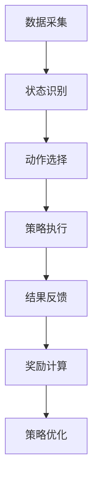

                 


# 《金融领域强化学习在做市商报价策略中的应用》

> **关键词**：强化学习，做市商，报价策略，金融市场，算法设计

> **摘要**：本文探讨了强化学习在金融领域中的应用，特别是如何用于设计做市商的报价策略。通过分析强化学习的基本原理，构建数学模型，设计系统架构，并结合实际案例，详细阐述了如何将强化学习应用于做市商报价策略中，以优化市场流动性管理。

---

## # 第一部分：引言

### ## 1.1 问题背景与目标

#### ### 1.1.1 强化学习的基本概念
强化学习（Reinforcement Learning, RL）是一种机器学习范式，通过智能体与环境的交互，学习最优策略以最大化累计奖励。与监督学习不同，RL不需要明确的标签，而是通过试错和奖励机制来优化决策。

#### ### 1.1.2 做市商在金融市场中的角色
做市商（Market Maker）是金融市场中提供买卖报价，维持市场流动性的关键参与者。他们通过同时报出买入价和卖出价，确保市场在买卖双方之间高效运行。

#### ### 1.1.3 问题的目标与意义
本文的目标是通过强化学习优化做市商的报价策略，使其在动态市场中实现收益最大化，同时降低风险。强化学习的引入可以帮助做市商在复杂市场环境中做出更优决策。

---

## # 第二部分：强化学习基础

### ## 2.1 强化学习的基本概念

#### ### 2.1.1 强化学习的定义与特点
- **定义**：RL通过智能体与环境的交互，学习策略以最大化累计奖励。
- **特点**：
  - 环境动态性：市场环境复杂且动态变化。
  - 长期决策：策略需考虑未来收益的折现。

#### ### 2.1.2 状态、动作、奖励的定义
- **状态（State）**：市场当前情况，如资产价格、订单簿状态。
- **动作（Action）**：做市商的行为，如调整买卖价差。
- **奖励（Reward）**：策略的收益或损失，需平衡短期收益与长期稳定性。

#### ### 2.1.3 Q-learning算法的数学模型
Q-learning的目标是找到最优Q值，即：
$$ Q(s, a) = \max_{a'} Q(s', a') $$

状态转移概率：
$$ P(s' | s, a) $$

奖励函数：
$$ R(s, a) $$

Q值更新公式：
$$ Q(s, a) \leftarrow Q(s, a) + \alpha [R(s, a) + \gamma \max Q(s', a') - Q(s, a)] $$

### ## 2.2 金融市场的基础

#### ### 2.2.1 金融市场的运作机制
- 资产价格波动、订单匹配、市场深度等因素影响做市商的策略。

#### ### 2.2.2 做市商的报价策略
- 做市商通过买卖价差和订单深度调整市场流动性。

#### ### 2.2.3 市场风险与收益分析
- 收益：买卖价差和订单执行。
- 风险：市场波动和对手策略。

---

## # 第三部分：强化学习在金融中的应用

### ## 3.1 强化学习在金融交易中的应用

#### ### 3.1.1 交易策略的强化学习建模
- 将交易策略转化为强化学习问题，状态为市场数据，动作是交易指令。

#### ### 3.1.2 风险管理的强化学习方法
- 使用强化学习优化风险控制参数，如头寸大小和止损点。

#### ### 3.1.3 市场预测的强化学习模型
- 利用强化学习预测资产价格，构建动态交易策略。

### ## 3.2 做市商报价策略的强化学习建模

#### ### 3.2.1 状态空间的设计
- 包括资产价格、订单深度、市场波动等。

#### ### 3.2.2 动作空间的定义
- 调整买卖价差和订单深度。

#### ### 3.2.3 奖励函数的设计
- 基于收益和风险，平衡短期利润与长期稳定性。

---

## # 第四部分：强化学习算法的数学模型

### ## 4.1 Q-learning算法的数学推导

#### ### 4.1.1 Q-learning的更新公式
- Q值更新公式：
$$ Q(s, a) \leftarrow Q(s, a) + \alpha [R + \gamma \max Q(s', a') - Q(s, a)] $$

#### ### 4.1.2 算法的收敛性分析
- 在离散环境和策略中，Q-learning收敛于最优Q值。

#### ### 4.1.3 算法的优缺点
- 优点：简单易实现。
- 缺点：收敛速度慢，难以处理高维状态。

### ## 4.2 DQN算法的改进与应用

#### ### 4.2.1 DQN算法的改进
- 使用经验回放和目标网络，提高稳定性和收敛速度。

#### ### 4.2.2 DQN在做市商中的应用
- 构建深度神经网络，预测最优买卖价差。

---

## # 第五部分：系统设计与实现

### ## 5.1 系统功能设计

#### ### 5.1.1 系统架构设计
- **模块划分**：数据采集、策略执行、风险管理。
- **交互流程**：市场数据输入，策略处理，输出买卖价差。

#### ### 5.1.2 系统架构图（Mermaid）



### ## 5.2 系统实现

#### ### 5.2.1 环境配置
- 数据源：Kafka或Redis。
- 计算工具：TensorFlow或PyTorch。

#### ### 5.2.2 算法实现
- 使用Python编写DQN算法，实现经验回放和网络更新。

#### ### 5.2.3 系统接口设计
- API接口：接收市场数据，返回买卖价差。

---

## # 第六部分：项目实战

### ## 6.1 环境配置与代码实现

#### ### 6.1.1 环境配置
```bash
pip install numpy matplotlib tensorflow
```

#### ### 6.1.2 核心代码实现
```python
import numpy as np
import tensorflow as tf

class DQN:
    def __init__(self, state_dim, action_dim):
        self.state_dim = state_dim
        self.action_dim = action_dim
        self.model = self.build_model()
    
    def build_model(self):
        model = tf.keras.Sequential([
            tf.keras.layers.Dense(64, activation='relu'),
            tf.keras.layers.Dense(32, activation='relu'),
            tf.keras.layers.Dense(self.action_dim)
        ])
        return model
```

#### ### 6.1.3 案例分析
- 训练后的模型能够根据市场状态，输出最优买卖价差。

---

## # 第七部分：总结与展望

### ## 7.1 总结
- 强化学习为做市商提供了新的策略优化方法，提高了市场流动性管理的效率。

### ## 7.2 未来研究方向
- 结合博弈论，优化多做市商竞争环境。
- 应用更复杂的深度强化学习模型，如Transformer和注意力机制。

### ## 7.3 最佳实践 Tips
- 数据质量至关重要，需确保市场数据的实时性和准确性。
- 策略优化需平衡收益与风险，避免过度冒险。

---

## # 作者

作者：AI天才研究院/AI Genius Institute & 禅与计算机程序设计艺术 /Zen And The Art of Computer Programming

---

这篇文章详细探讨了强化学习在做市商报价策略中的应用，从理论到实践，为读者提供了全面的指导和深入的分析。

