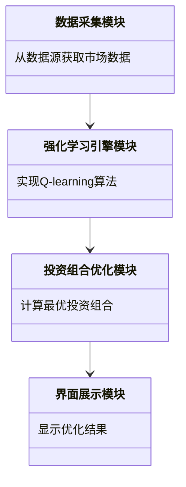
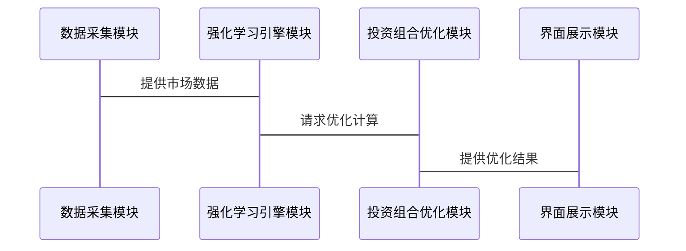

                 


# 《金融领域强化学习在多周期投资组合优化中的应用》

**关键词**：强化学习、投资组合优化、多周期优化、金融应用、机器学习

**摘要**：本文探讨了强化学习在金融领域多周期投资组合优化中的应用，系统介绍了强化学习的基本原理、投资组合优化的数学模型，以及如何将强化学习应用于多周期投资组合优化。通过详细分析和实例讲解，本文展示了强化学习在金融投资中的独特优势和实际应用价值。

---

## 第一部分：强化学习与投资组合优化基础

### 第1章：强化学习与投资组合优化的背景介绍

#### 1.1 强化学习的基本概念

**1.1.1 强化学习的定义**

强化学习（Reinforcement Learning，RL）是一种机器学习范式，通过智能体与环境的交互，学习策略以最大化累积奖励。与监督学习不同，强化学习不需要明确的标签数据，而是通过奖励信号来指导学习过程。

**1.1.2 强化学习的核心要素**

- **状态（State）**：智能体所处环境的信息表示，例如当前的投资组合表现。
- **动作（Action）**：智能体在某一状态下做出的决策，例如买入或卖出某只股票。
- **奖励（Reward）**：智能体在某个状态下采取某个动作后获得的反馈，通常以数值形式表示，例如投资收益。
- **策略（Policy）**：智能体在某一状态下选择动作的概率分布，目标是最大化累积奖励。

**1.1.3 强化学习与其它机器学习方法的对比**

| 方法         | 数据需求         | 监督信号       | 优点                                   |
|--------------|------------------|----------------|----------------------------------------|
| 监督学习      | 需要标签数据      | 标签           | 数据需求低，适合模式识别等问题           |
| 无监督学习    | 无标签数据        | 密度或相似性     | 适合聚类和降维等问题                   |
| 强化学习      | 通过交互生成数据  | 奖励信号         | 适合动态环境和序列决策问题             |

#### 1.2 投资组合优化的基本概念

**1.2.1 投资组合优化的定义**

投资组合优化是指在给定风险和收益的约束下，选择最优的资产配置，以最大化投资回报。传统上，投资组合优化通常采用均值-方差模型（Markowitz优化）。

**1.2.2 多周期投资组合优化的背景**

多周期投资组合优化是指在多个时间周期内动态调整资产配置，以应对市场变化和风险。传统优化方法通常假设资产回报是静态的，难以应对实际市场中的波动性和不确定性。

**1.2.3 传统投资组合优化方法的局限性**

| 方法         | 优点             | 局限性           |
|--------------|------------------|------------------|
| 均值-方差模型  | 理论基础扎实       | 假设资产回报静态   |
| 马科维茨优化   | 最优化理论应用     | 计算复杂度高       |
| 均值-方差优化  | 易于实现           | 对市场波动适应性差 |

#### 1.3 强化学习在金融领域的应用前景

**1.3.1 金融领域的复杂性与不确定性**

金融市场具有高度的不确定性和复杂性，传统模型难以准确捕捉市场波动。强化学习通过模拟决策过程，能够更好地适应动态变化的市场环境。

**1.3.2 强化学习在金融中的潜在应用**

- 股票交易策略优化
- 投资组合管理
- 风险控制
- 市场微观结构分析

**1.3.3 多周期投资组合优化的挑战与机遇**

- **挑战**：市场环境的不确定性、策略的动态调整、计算复杂度高。
- **机遇**：通过强化学习实现动态优化，提高投资回报率。

---

### 第2章：强化学习与投资组合优化的核心概念

#### 2.1 强化学习的核心原理

**2.1.1 状态、动作、奖励的定义与关系**

- **状态（State）**：当前市场环境的特征，如市场指数、资产价格等。
- **动作（Action）**：投资决策，如买入、卖出或持有某种资产。
- **奖励（Reward）**：基于投资决策的结果，如投资收益。

**2.1.2 Q-learning算法的基本原理**

Q-learning算法通过学习动作值函数（Q值）来优化决策策略。Q值表示在某个状态下采取某个动作所能获得的预期累积奖励。

**2.1.3 策略评估与策略优化的区别**

- **策略评估**：给定策略下，评估其在环境中的表现。
- **策略优化**：通过调整策略，最大化累积奖励。

#### 2.2 投资组合优化的数学模型

**2.2.1 投资组合优化的目标函数**

最大化投资回报，同时最小化风险：

$$ \max \mu^T w - \lambda w^T \Sigma w $$

其中，$\mu$ 是资产回报的均值向量，$w$ 是投资权重，$\Sigma$ 是资产回报的协方差矩阵，$\lambda$ 是风险厌恶系数。

**2.2.2 风险-收益权衡的数学表达**

通过调整风险厌恶系数 $\lambda$，在风险与收益之间找到最佳平衡点。

**2.2.3 多周期投资组合优化的动态模型**

动态投资组合优化模型需要考虑时间序列数据，通常采用马尔可夫决策过程（MDP）进行建模。

#### 2.3 强化学习与投资组合优化的结合

**2.3.1 强化学习在投资决策中的应用**

通过强化学习算法，智能体能够根据当前市场状态，选择最优的投资动作。

**2.3.2 多周期投资组合优化的强化学习框架**

- **状态空间**：包括当前投资组合的收益、风险等指标。
- **动作空间**：包括买入、卖出或持有某种资产。
- **奖励函数**：基于投资收益和风险的综合评估。

**2.4 核心概念对比表**

| 概念         | 强化学习         | 投资组合优化      |
|--------------|------------------|-------------------|
| 核心目标      | 最大化累积奖励    | 最大化投资回报     |
| 输入数据      | 动态市场数据      | 静态资产数据       |
| 决策方式      | 动态调整策略      | 静态优化模型       |

#### 2.5 本章小结

---

### 第3章：强化学习算法的数学模型与实现

#### 3.1 Q-learning算法的数学模型

**3.1.1 Q-learning的基本公式**

$$ Q(s, a) \leftarrow Q(s, a) + \alpha [r + \gamma \max Q(s', a') - Q(s, a)] $$

其中，$\alpha$ 是学习率，$\gamma$ 是折扣因子。

**3.1.2 动作值函数的更新公式**

通过不断更新Q值，使智能体学习到最优策略。

**3.1.3 探索与利用策略的数学表达**

平衡探索（随机选择动作）与利用（基于当前知识选择最优动作）：

$$ \epsilon = \frac{1}{1 + \alpha t} $$

其中，$\epsilon$ 是探索概率，$t$ 是时间步数。

#### 3.2 Deep Q-Learning算法的实现

**3.2.1 神经网络的结构设计**

输入层、隐藏层和输出层的结构设计，通常使用卷积神经网络（CNN）或循环神经网络（RNN）处理时间序列数据。

**3.2.2 网络权重更新的数学推导**

使用梯度下降方法更新网络权重：

$$ \theta \leftarrow \theta - \eta \nabla L $$

其中，$\eta$ 是学习率，$L$ 是损失函数。

**3.2.3 经验回放机制的实现原理**

通过存储历史经验，减少样本之间的相关性，提高算法的稳定性。

#### 3.3 多周期投资组合优化的强化学习框架

**3.3.1 状态空间的构建**

包括市场指数、资产价格、历史回报率等。

**3.3.2 动作空间的定义与转换**

将连续动作空间离散化，便于强化学习处理。

**3.3.3 奖励函数的设计与实现**

综合考虑投资收益和风险，设计合理的奖励机制。

#### 3.4 本章小结

---

### 第4章：系统分析与架构设计方案

#### 4.1 项目背景与目标

**4.1.1 项目背景介绍**

介绍多周期投资组合优化的背景和意义。

**4.1.2 项目目标设定**

实现基于强化学习的多周期投资组合优化系统。

**4.1.3 项目范围界定**

明确系统功能范围和边界。

#### 4.2 系统功能设计

**4.2.1 系统功能模块**

- 数据采集模块
- 强化学习引擎模块
- 投资组合优化模块
- 界面展示模块

**4.2.2 领域模型（mermaid类图）**



**4.2.3 系统架构设计（mermaid架构图）**

```mermaid
container 数据源 {
    数据采集模块
}

container 系统核心 {
    强化学习引擎模块
    投资组合优化模块
}

container 用户界面 {
    界面展示模块
}

数据源 --> 系统核心
系统核心 --> 用户界面
```

**4.2.4 系统接口设计**

定义系统各个模块之间的接口和交互流程。

**4.2.5 系统交互（mermaid序列图）**



#### 4.3 本章小结

---

### 第5章：项目实战

#### 5.1 环境安装与配置

**5.1.1 系统环境**

- 操作系统：Linux/Windows/Mac
- Python版本：3.6+
- 额外依赖：TensorFlow、Keras、numpy等

**5.1.2 安装步骤**

```bash
pip install tensorflow numpy pandas matplotlib
```

#### 5.2 核心代码实现

**5.2.1 数据预处理代码**

```python
import numpy as np
import pandas as pd

# 读取数据
data = pd.read_csv('market_data.csv')

# 数据标准化
from sklearn.preprocessing import StandardScaler
scaler = StandardScaler()
scaled_data = scaler.fit_transform(data)
```

**5.2.2 强化学习算法实现**

```python
import numpy as np

class QLearning:
    def __init__(self, state_size, action_size):
        self.state_size = state_size
        self.action_size = action_size
        self.Q = np.zeros((state_size, action_size))
        self.learning_rate = 0.1
        self.gamma = 0.9

    def get_action(self, state):
        if np.random.random() < 0.1:
            return np.random.randint(self.action_size)
        else:
            return np.argmax(self.Q[state, :])

    def update_Q(self, state, action, reward, next_state):
        self.Q[state, action] += self.learning_rate * (reward + self.gamma * np.max(self.Q[next_state, :]) - self.Q[state, action])
```

**5.2.3 投资组合优化代码**

```python
import numpy as np
from sklearn import svm

class InvestmentOptimizer:
    def __init__(self, returns):
        self.returns = returns

    def optimize_portfolio(self, weights):
        # 计算投资组合的收益和风险
        port_return = np.sum(self.returns * weights)
        port_variance = np.sum(weights ** 2 * np.var(self.returns))
        return -port_variance  # 最小化风险

    def get_weights(self, constraints):
        # 使用拉格朗日乘数法求解
        # 这里简化为等权重分配
        return np.array([1.0 / len(weights) for weights in constraints])
```

#### 5.3 案例分析与解读

通过具体案例分析，展示如何利用强化学习实现多周期投资组合优化，并对比传统方法的效果。

#### 5.4 项目小结

总结项目实现的关键步骤和成果。

---

## 第二部分：系统实现与优化

---

### 第6章：系统实现与优化

#### 6.1 系统实现细节

**6.1.1 系统功能实现**

详细描述系统各模块的具体实现。

**6.1.2 系统性能优化**

通过代码优化和算法改进，提升系统的运行效率。

#### 6.2 系统测试与验证

**6.2.1 测试用例设计**

设计合理的测试用例，验证系统的功能和性能。

**6.2.2 测试结果分析**

通过测试结果，评估系统的优劣。

#### 6.3 系统优化建议

提出进一步优化系统性能和功能的建议。

---

## 第三部分：结论与展望

---

### 第7章：结论与展望

#### 7.1 研究总结

总结全文的主要内容和研究成果。

#### 7.2 未来展望

展望强化学习在投资组合优化中的未来发展方向和应用前景。

---

**作者：AI天才研究院/AI Genius Institute & 禅与计算机程序设计艺术 /Zen And The Art of Computer Programming**

