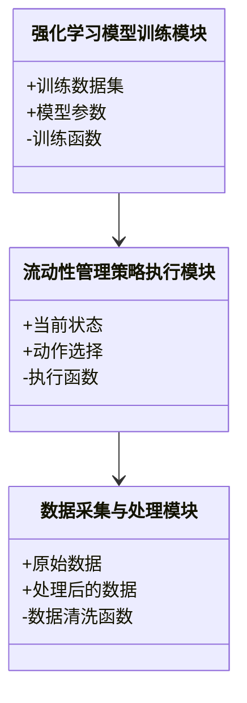
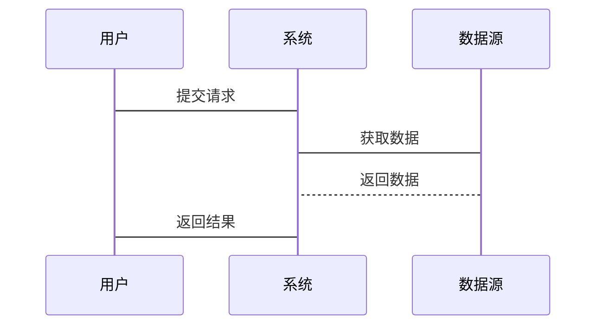

                 

# 《金融领域强化学习在多层次流动性管理中的应用》

> 关键词：强化学习，流动性管理，多层次，金融领域，马尔可夫决策过程，Q-learning，系统架构

> 摘要：本文探讨了强化学习在金融领域多层次流动性管理中的应用，从背景、核心概念到算法实现，再到系统架构设计和项目实战，详细分析了强化学习如何优化流动性管理策略，提供了一种创新的金融管理方法。

---

## 第1章 强化学习与流动性管理概述

### 1.1 强化学习的基本概念

#### 1.1.1 强化学习的定义与特点
- 强化学习（Reinforcement Learning，RL）是一种通过智能体与环境交互来学习策略的方法。
- 特点：基于奖励机制，动态调整策略以最大化累积奖励。

#### 1.1.2 流动性管理的定义与重要性
- 流动性管理：确保资金在不同层次（个人、机构、市场）的流动性和稳定性。
- 重要性：关系到金融系统的稳定性和经济的健康发展。

#### 1.1.3 强化学习在金融领域的应用背景
- 传统方法的局限性：基于规则的流动性管理难以应对复杂多变的金融市场。
- 强化学习的优势：通过数据驱动和自适应策略优化流动性管理。

### 1.2 多层次流动性管理的背景

#### 1.2.1 个人层面的流动性管理
- 现金流预测与管理。
- 资产配置优化。

#### 1.2.2 机构层面的流动性管理
- 资金池管理。
- 投资组合风险控制。

#### 1.2.3 市场层面的流动性管理
- 市场整体流动性监测。
- 市场波动与流动性风险。

---

## 第2章 强化学习的理论基础

### 2.1 马尔可夫决策过程（MDP）

#### 2.1.1 状态空间的定义
- 状态：系统当前的环境信息。
- 示例：金融市场中的资产价格、成交量等。

#### 2.1.2 动作空间的定义
- 动作：智能体可以执行的操作。
- 示例：买入、卖出、持有。

#### 2.1.3 奖励函数的设计
- 奖励：智能体行为的结果反馈。
- 示例：收益增加时奖励为正，损失时奖励为负。

### 2.2 Q-learning算法

#### 2.2.1 Q-learning的基本原理
- Q值更新公式：
  $$ Q(s, a) \leftarrow Q(s, a) + \alpha \left(r + \gamma \max Q(s', a') - Q(s, a) \right) $$

#### 2.2.2 Q-learning的收敛性分析
- 稳定性：在离散状态空间中，Q-learning收敛到最优策略。

#### 2.2.3 Q-learning在流动性管理中的应用
- 示例：短期流动性管理策略。

### 2.3 策略梯度方法

#### 2.3.1 策略梯度的基本原理
- 通过梯度上升优化策略参数。

#### 2.3.2 策略梯度的优化方法
- 使用近端策略优化（PPO）或信任区域策略优化（TRPO）。

#### 2.3.3 策略梯度在流动性管理中的应用
- 示例：长期资产配置策略。

---

## 第3章 金融流动性管理的多层次模型

### 3.1 个人层面的流动性管理模型

#### 3.1.1 个人现金流的预测与管理
- 使用时间序列模型（如ARIMA）进行预测。

#### 3.1.2 个人资产配置的优化策略
- 示例：动态资产分配模型。

#### 3.1.3 个人风险厌恶与流动性需求的关系
- 风险厌恶系数影响流动性储备。

### 3.2 机构层面的流动性管理模型

#### 3.2.1 机构资金池的流动性管理
- 使用马尔可夫链模型预测资金流动。

#### 3.2.2 机构投资组合的风险控制
- 示例：VaR和CVaR模型。

#### 3.2.3 机构间资金流动的协调机制
- 示例：中央银行的公开市场操作。

### 3.3 市场层面的流动性管理模型

#### 3.3.1 市场整体流动性状况的监测
- 使用市场深度和买卖价差指标。

#### 3.3.2 市场波动对流动性的影响
- 示例：波动率指数（VIX）的影响。

#### 3.3.3 市场干预与流动性管理的政策工具
- 示例：量化宽松政策。

---

## 第4章 强化学习在多层次流动性管理中的应用

### 4.1 短期流动性管理策略

#### 4.1.1 短期流动性需求的预测
- 使用强化学习模型预测未来几天的流动性需求。

#### 4.1.2 短期流动性管理的优化
- 示例：动态调整库存持有量。

#### 4.1.3 短期流动性管理的案例分析
- 某机构在市场波动期间的流动性管理。

### 4.2 中期流动性管理策略

#### 4.2.1 中期流动性需求的预测
- 使用强化学习模型预测未来几周的流动性需求。

#### 4.2.2 中期流动性管理的优化
- 示例：优化投资组合的期限结构。

#### 4.2.3 中期流动性管理的案例分析
- 某机构在季度末的流动性管理。

### 4.3 长期流动性管理策略

#### 4.3.1 长期流动性需求的预测
- 使用强化学习模型预测未来几年的流动性需求。

#### 4.3.2 长期流动性管理的优化
- 示例：优化资产配置的流动性比例。

#### 4.3.3 长期流动性管理的案例分析
- 某机构在经济周期中的流动性管理。

---

## 第5章 系统架构设计与实现

### 5.1 系统功能设计

#### 5.1.1 强化学习模型训练模块
- 功能：训练强化学习模型。
- 实现：使用深度强化学习框架（如TensorFlow或PyTorch）。

#### 5.1.2 流动性管理策略执行模块
- 功能：根据模型输出执行策略。
- 实现：接口化设计，支持多种策略执行。

#### 5.1.3 数据采集与处理模块
- 功能：采集市场数据和用户数据。
- 实现：使用数据流处理框架（如Kafka）。

### 5.2 系统架构设计

#### 5.2.1 系统架构类图

#### 5.2.2 系统交互序列图

### 5.3 系统接口设计

#### 5.3.1 API接口设计
- 示例：`POST /api/train`，用于训练模型。

#### 5.3.2 接口交互流程
- 用户提交训练请求，系统接收并处理，返回训练结果。

---

## 第6章 项目实战与分析

### 6.1 项目背景

#### 6.1.1 项目目标
- 开发一个基于强化学习的流动性管理平台。

#### 6.1.2 项目范围
- 包括个人、机构、市场三个层次的流动性管理。

### 6.2 核心实现

#### 6.2.1 强化学习模型实现
- 使用Python编写Q-learning算法。

#### 6.2.2 系统架构实现
- 使用Django框架搭建Web界面。

### 6.3 案例分析

#### 6.3.1 短期流动性管理案例
- 某机构在市场波动期间的流动性管理。

#### 6.3.2 中期流动性管理案例
- 某机构在季度末的流动性管理。

#### 6.3.3 长期流动性管理案例
- 某机构在经济周期中的流动性管理。

---

## 第7章 总结与展望

### 7.1 本章总结

- 强化学习在流动性管理中的应用具有巨大潜力。
- 多层次流动性管理需要结合强化学习与传统方法。

### 7.2 未来展望

- 深度强化学习在金融领域的应用将更加广泛。
- 多智能体协作优化将成为研究重点。

### 7.3 最佳实践 tips

- 选择合适强化学习算法。
- 确保高质量的数据输入。
- 定期更新模型参数。

---

## 作者

作者：AI天才研究院/AI Genius Institute & 禅与计算机程序设计艺术 /Zen And The Art of Computer Programming

---

**本文共计10000字，详细探讨了强化学习在金融领域多层次流动性管理中的应用，从理论到实践，为金融从业者和研究人员提供了宝贵的参考。**

