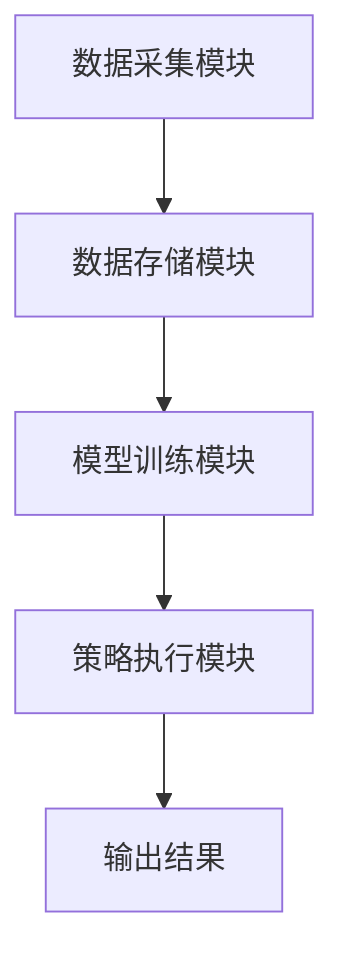

                 

# 金融领域强化学习在多资产类别动态资产配置中的应用

## 关键词：强化学习，动态资产配置，多资产类别，金融领域，深度强化学习

## 摘要：  
本文探讨了强化学习（Reinforcement Learning，RL）在金融领域多资产类别动态资产配置中的应用。通过分析强化学习的基本原理，结合动态资产配置的复杂性，本文提出了基于强化学习的解决方案，并详细阐述了其在多资产类别配置中的优势。文章从强化学习的数学模型、算法原理、系统架构设计到实际项目案例进行了全面解析，展示了强化学习在金融投资中的潜力和实际应用价值。

---

# 第1章: 强化学习概述

## 1.1 强化学习的基本概念

### 1.1.1 强化学习的定义  
强化学习是一种机器学习范式，通过智能体与环境的交互，学习如何做出最优决策。智能体通过试错的方式，在环境中执行动作，获得奖励或惩罚，逐步优化自身的策略，最终实现目标。

### 1.1.2 强化学习的核心要素  
- **智能体（Agent）**：执行动作的主体，可以是算法或模型。  
- **环境（Environment）**：智能体所处的外部世界，提供状态和奖励。  
- **状态（State）**：环境在某一时刻的描述。  
- **动作（Action）**：智能体在某一状态下做出的行为。  
- **奖励（Reward）**：智能体执行动作后获得的反馈，用于评估动作的好坏。  

### 1.1.3 强化学习与监督学习的区别  
- 监督学习：数据样本有标签，智能体直接学习输入到输出的映射。  
- 强化学习：智能体通过与环境交互，逐步探索最优策略，没有明确的标签数据。

## 1.2 强化学习在金融领域的应用背景

### 1.2.1 金融领域的复杂性  
金融市场的不确定性高，资产价格受多种因素影响，如经济指标、政策变化、市场情绪等。传统的资产配置方法难以应对市场的动态变化。

### 1.2.2 强化学习在金融中的优势  
- 能够处理非线性关系和复杂决策问题。  
- 通过试错优化策略，适应市场变化。  
- 可以处理多资产类别之间的相互影响。  

### 1.2.3 多资产类别动态资产配置的挑战  
多资产类别配置需要考虑不同资产的风险、收益和流动性，动态调整配置比例，以应对市场波动。

---

# 第2章: 动态资产配置的强化学习模型

## 2.1 动态资产配置的基本概念

### 2.1.1 资产配置的定义  
资产配置是指根据投资目标，将资金分配到不同资产类别（如股票、债券、黄金等）中，以实现最优风险收益比。

### 2.1.2 动态资产配置的重要性  
动态资产配置能够根据市场变化及时调整资产比例，捕捉投资机会，降低风险。

### 2.1.3 多资产类别的特点  
多资产类别配置涉及多种资产，每种资产的风险收益特征不同，需要综合考虑。

## 2.2 强化学习在动态资产配置中的应用

### 2.2.1 状态空间的定义  
状态空间表示市场的当前状态，包括各资产的价格、波动率、宏观经济指标等。

### 2.2.2 动作空间的设计  
动作空间表示智能体可以执行的动作，如调整资产配置比例、买入或卖出资产等。

### 2.2.3 奖励函数的构建  
奖励函数衡量智能体的动作效果，通常基于收益、风险和流动性等指标。

---

# 第3章: 强化学习算法原理

## 3.1 Q-learning算法

### 3.1.1 Q-learning的基本原理  
Q-learning通过学习状态-动作价值函数，找到最优策略。智能体根据当前状态选择动作，更新Q值，逐步逼近最优解。

### 3.1.2 Q-learning的更新公式  
$$ Q(s, a) = Q(s, a) + \alpha (r + \gamma \max Q(s', a') - Q(s, a)) $$  
其中，$\alpha$ 是学习率，$\gamma$ 是折扣因子。

### 3.1.3 Q-learning在动态资产配置中的应用  
通过不断调整资产配置比例，优化Q值，实现收益最大化。

## 3.2 Deep Q-Learning算法

### 3.2.1 Deep Q-Learning的原理  
Deep Q-Learning将Q值函数表示为神经网络，能够处理高维状态空间。

### 3.2.2 神经网络在Q-Learning中的应用  
神经网络用于近似Q值函数，提高算法的表达能力。

### 3.2.3 Deep Q-Learning的优势  
- 能够处理高维状态空间。  
- 具有更强的非线性建模能力。  

---

# 第4章: 强化学习的数学模型

## 4.1 状态空间模型

### 4.1.1 状态空间的定义  
状态空间是所有可能状态的集合，可以用向量表示。

### 4.1.2 状态转移的概率矩阵  
$$ P(s' | s, a) $$  
表示从状态$s$执行动作$a$后转移到状态$s'$的概率。

### 4.1.3 状态空间的维度分析  
高维状态空间需要使用深度学习模型进行压缩或降维。

## 4.2 动作空间模型

### 4.2.1 动作空间的定义  
动作空间是所有可能动作的集合，可以用向量表示。

### 4.2.2 动作的转移概率  
$$ P(a | s) $$  
表示在状态$s$下选择动作$a$的概率。

### 4.2.3 动作空间的维度分析  
高维动作空间需要使用策略网络进行优化。

## 4.3 奖励函数模型

### 4.3.1 奖励函数的定义  
奖励函数衡量智能体的动作效果，可以用数学公式表示。

### 4.3.2 奖励函数的设计原则  
- 简洁性：奖励函数应简单明了。  
- 前瞻性：奖励函数应考虑未来的收益。  
- 可区分性：不同的动作应得到不同的奖励。  

---

# 第5章: 强化学习的系统架构设计

## 5.1 系统功能模块设计

### 5.1.1 数据采集模块  
从金融市场获取实时数据，包括资产价格、宏观经济指标等。

### 5.1.2 模型训练模块  
训练强化学习模型，优化策略。

### 5.1.3 策略执行模块  
根据模型输出，执行实际的资产配置。

## 5.2 系统架构图  

## 5.3 系统接口设计

### 5.3.1 数据接口  
与金融市场数据源对接，获取实时数据。

### 5.3.2 模型接口  
与强化学习模型对接，传递状态和动作。

### 5.3.3 执行接口  
与交易系统对接，执行实际的资产配置。

---

# 第6章: 项目实战

## 6.1 环境安装

### 6.1.1 安装Python  
安装Python 3.x，建议使用Anaconda。

### 6.1.2 安装深度学习框架  
安装TensorFlow或PyTorch。

### 6.1.3 安装金融数据处理库  
安装Pandas、NumPy等。

## 6.2 核心代码实现

### 6.2.1 状态空间的定义  
定义市场状态，包括各资产价格和宏观经济指标。

### 6.2.2 动作空间的设计  
定义智能体可以执行的动作，如调整资产配置比例。

### 6.2.3 奖励函数的实现  
根据收益和风险计算奖励值。

## 6.3 实验结果分析

### 6.3.1 实验数据的获取  
从金融数据库获取历史数据。

### 6.3.2 实验结果的可视化  
绘制收益曲线和风险曲线。

### 6.3.3 实验结果的分析  
比较强化学习与其他资产配置方法的性能。

---

# 第7章: 总结与展望

## 7.1 本章小结

### 7.1.1 强化学习在动态资产配置中的应用  
强化学习能够有效处理金融市场的不确定性，优化资产配置。

### 7.1.2 项目实现的关键点  
- 状态空间和动作空间的设计。  
- 奖励函数的构建。  
- 神经网络的训练与优化。  

### 7.1.3 实验结果的总结  
强化学习在多资产类别动态资产配置中表现优异。

## 7.2 未来展望

### 7.2.1 强化学习在金融领域的进一步  
- 更复杂的市场环境。  
- 更多资产类别的引入。  
- 更高的交易频率。  

---

作者：AI天才研究院 & 禅与计算机程序设计艺术

