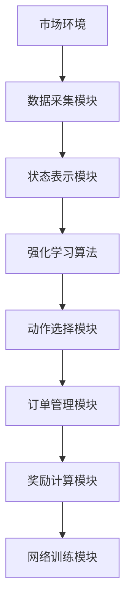

                 


# 《金融领域强化学习在市场做市商策略中的应用》

---

## 关键词：强化学习、做市商、金融市场、算法、策略优化

---

## 摘要

本文系统性地探讨了强化学习在金融领域做市商策略中的应用。首先，介绍了强化学习的基本概念、核心理论及其在金融市场中的潜力。接着，深入分析了做市商的定义、角色及其在现代金融体系中的重要性。然后，结合强化学习的理论基础，详细阐述了如何将强化学习应用于做市商策略的优化与决策过程中。通过构建数学模型和算法框架，本文提出了基于强化学习的做市商策略优化方法，并通过实际案例展示了该方法在订单簿管理、价格预测和风险控制等方面的应用。最后，总结了本文的主要结论，并展望了未来的研究方向。

---

# 第1章 强化学习与做市商策略概述

## 1.1 强化学习的基本概念

### 1.1.1 强化学习的定义与特点

强化学习（Reinforcement Learning, RL）是一种机器学习范式，其核心思想是通过智能体与环境的交互，学习一种策略，使得智能体能够在环境中做出最优决策以最大化累积的奖励。与监督学习和无监督学习不同，强化学习强调实时决策与反馈，通过试错机制不断优化策略。

- **定义**：强化学习的核心是“智能体-环境”交互系统，智能体通过执行动作影响环境状态，并根据环境反馈的奖励信号来调整策略。
- **特点**：
  - 基于反馈的试错学习。
  - 动态、不确定的环境。
  - 长期目标导向。

### 1.1.2 强化学习的核心要素：状态、动作、奖励

在强化学习中，系统由以下几个核心要素组成：

- **状态（State）**：环境在某一时刻的描述，表示智能体所处的环境信息。
- **动作（Action）**：智能体在给定状态下做出的决策。
- **奖励（Reward）**：智能体执行动作后，环境对其行为的反馈，用于指导学习方向。

### 1.1.3 强化学习与监督学习、无监督学习的区别

| 对比维度         | 监督学习               | 无监督学习            | 强化学习                |
|------------------|-----------------------|----------------------|------------------------|
| 数据来源         | 标签数据               | 无标签数据            | 环境反馈（奖励）        |
| 任务目标         | 分类或回归             | 聚类或降维            | 最大化累积奖励          |
| 交互方式         | 静态输入               | 静态输入              | 动态交互                |
| 适用场景         | 图像分类、文本分类      | 聚类分析              | 自动驾驶、游戏AI、金融交易 |

---

## 1.2 做市商的定义与角色

### 1.2.1 做市商的基本概念

做市商（Market Maker）是指在金融市场中，为特定金融资产提供即时买价和卖价的参与者。做市商通过在市场上持续提供买卖报价，维持市场的流动性，并从中赚取买卖价差。

### 1.2.2 做市商在金融市场中的作用

- **维持市场流动性**：通过提供持续的买卖报价，确保市场的深度和流动性。
- **价格发现**：通过买卖报价的动态变化，反映市场的供需状况。
- **风险管理**：通过策略和模型控制市场风险，确保自身资产安全。

### 1.2.3 做市商策略的核心目标

- **利润最大化**：通过买卖价差和交易量最大化收益。
- **风险管理**：控制市场风险，避免重大损失。
- **流动性管理**：维持订单簿的深度，确保能够快速成交。

---

## 1.3 强化学习在做市商策略中的应用背景

### 1.3.1 传统做市商策略的局限性

传统做市商策略通常基于统计套利、均值-方差模型等方法，存在以下问题：

- **静态性**：传统策略通常基于历史数据，缺乏动态调整能力。
- **低效性**：在复杂市场环境下，传统策略难以应对高频交易和市场波动。
- **高风险性**：在极端市场条件下，传统策略可能面临重大损失。

### 1.3.2 强化学习在金融领域的优势

- **动态适应性**：强化学习能够实时调整策略，适应市场变化。
- **复杂问题处理能力**：强化学习适用于处理高维、非线性问题。
- **数据驱动**：强化学习通过大量数据学习最优策略，避免人为经验的局限性。

### 1.3.3 做市商策略与强化学习的结合点

- **订单簿管理**：强化学习可以优化订单簿的买卖价差和数量。
- **价格预测**：强化学习可以基于历史数据和市场信号，预测未来价格走势。
- **风险控制**：强化学习可以实时调整策略，规避市场风险。

---

## 1.4 本章小结

本章介绍了强化学习的基本概念、核心要素及其在金融领域的潜力，重点分析了做市商的定义、角色及其策略目标。通过对比强化学习与其他学习方法的差异，提出了强化学习在做市商策略中的应用背景和优势。

---

# 第2章 强化学习的核心理论

## 2.1 马尔可夫决策过程（MDP）

### 2.1.1 状态空间与动作空间

在强化学习中，环境的状态和动作可以用马尔可夫决策过程（Markov Decision Process, MDP）来描述。MDP由以下五元组定义：

$$
MDP = (S, A, P, R, \gamma)
$$

- **状态空间**（$S$）：环境所有可能的状态集合。
- **动作空间**（$A$）：智能体在每个状态下可以执行的动作集合。
- **转移概率**（$P$）：从当前状态执行某个动作后转移到下一个状态的概率。
- **奖励函数**（$R$）：智能体执行某个动作后获得的奖励。
- **折扣因子**（$\gamma$）：对未来奖励的折扣因子，用于平衡当前奖励与未来奖励的重要性。

### 2.1.2 奖励函数与价值函数

- **奖励函数**（$R(s, a, s')$）：智能体在状态$s$执行动作$a$后，转移到状态$s'$所获得的奖励。
- **价值函数**（$V(s)$）：在状态$s$下，智能体能够获得的最大累积奖励。

### 2.1.3 策略与价值评估

- **策略**（$\pi$）：智能体在每个状态下选择动作的概率分布。
- **价值评估**：通过动态规划或蒙特卡洛方法，估计每个状态的价值。

---

## 2.2 基于值函数的强化学习算法

### 2.2.1 Q-learning算法

Q-learning是一种基于值函数的强化学习算法，适用于离线学习。其核心思想是通过不断更新Q值表，找到最优策略。

$$
Q(s, a) \leftarrow Q(s, a) + \alpha [r + \gamma \max Q(s', a') - Q(s, a)]
$$

其中，$\alpha$是学习率，$\gamma$是折扣因子。

### 2.2.2 DQN算法

深度Q网络（Deep Q-Network, DQN）是Q-learning的深度学习版本，适用于高维状态空间。

$$
Q(s, a; \theta) = \theta^T \phi(s, a)
$$

其中，$\theta$是网络参数，$\phi(s, a)$是状态动作的特征映射。

### 2.2.3 算法比较与优缺点分析

| 对比维度   | Q-learning              | DQN                  |
|------------|-------------------------|-----------------------|
| 状态空间   | 离散                    | 连续、高维            |
| 动作空间   | 离散                    | 离散或连续            |
| 算法复杂度 | 低                      | 高（需要神经网络）    |
| 适用场景   | 离散环境                | 高维、复杂环境        |

---

## 2.3 基于策略的强化学习算法

### 2.3.1 政策梯度方法

政策梯度方法直接优化策略，通过梯度 ascent 更新参数。

$$
\theta \leftarrow \theta + \alpha \nabla_\theta J(\theta)
$$

其中，$J(\theta)$是策略的优化目标。

### 2.3.2 PPO算法

PPO（Proximal Policy Optimization）是一种基于策略梯度的方法，适用于复杂的环境。

### 2.3.3 策略优化的核心思想

- **策略更新**：通过梯度上升方法优化策略参数。
- **探索与利用**：在策略优化过程中，平衡探索新策略和利用已知好策略。

---

## 2.4 强化学习中的探索与利用

### 2.4.1 探索策略的选择

- **ε-greedy**：以概率$\epsilon$选择随机动作，否则选择当前最优动作。
- **softmax**：基于动作的Q值，选择动作的概率与Q值呈指数关系。

### 2.4.2 利用策略的优化

- **贪心策略**：直接选择当前最优动作。
- **软贪心策略**：基于Q值的概率分布选择动作。

### 2.4.3 探索-利用平衡的重要性

在强化学习中，探索与利用的平衡至关重要。过度探索可能导致学习效率低下，而过度利用可能导致无法发现更好的策略。

---

## 2.5 本章小结

本章介绍了强化学习的核心理论，包括马尔可夫决策过程、Q-learning、DQN和PPO等算法。通过对比分析，提出了基于策略的强化学习方法，并强调了探索与利用平衡的重要性。

---

# 第3章 做市商策略的数学模型

## 3.1 做市商订单簿模型

### 3.1.1 买价与卖价的定义

- **买价**（Bid）：市场参与者愿意支付的最高价格。
- **卖价**（Ask）：市场参与者愿意出售的最低价格。

### 3.1.2 市场深度与订单流

- **市场深度**：订单簿中未成交订单的总量，反映市场的流动性。
- **订单流**：订单的生成和成交过程，影响市场的买卖价差。

### 3.1.3 做市商的收益与风险模型

- **收益**：买卖价差乘以交易量。
- **风险**：市场波动、交易对手风险和操作风险。

---

## 3.2 做市商策略的数学模型

### 3.2.1 做市商的定价模型

做市商的定价模型通常基于市场深度和波动率。

$$
\text{价差} = \text{市场深度} \times \text{波动率} \times \text{风险溢价}
$$

### 3.2.2 做市商的订单簿管理

订单簿管理的核心是动态调整买卖价差和订单数量。

$$
\text{订单数量} = \text{市场深度} \times \text{价差}
$$

### 3.2.3 做市商的收益与风险优化

通过优化买卖价差和订单数量，最大化收益，同时最小化风险。

$$
\max \left( \text{收益} - \lambda \times \text{风险} \right)
$$

其中，$\lambda$是风险厌恶系数。

---

## 3.3 做市商策略与强化学习的结合

### 3.3.1 强化学习在订单簿管理中的应用

通过强化学习优化买卖价差和订单数量，动态调整订单簿。

### 3.3.2 强化学习在价格预测中的应用

基于历史价格和市场信号，预测未来价格走势。

### 3.3.3 强化学习在风险控制中的应用

通过强化学习动态调整风险敞口，规避市场风险。

---

## 3.4 本章小结

本章介绍了做市商订单簿模型和定价模型，提出了强化学习在做市商策略中的应用方法，并通过数学模型展示了如何优化买卖价差和订单数量。

---

# 第4章 做市商策略的强化学习算法设计

## 4.1 强化学习在做市商策略中的问题建模

### 4.1.1 状态空间

- **当前价格**：市场价格的当前值。
- **市场深度**：订单簿的市场深度。
- **历史价格**：过去一段时间的价格序列。

### 4.1.2 动作空间

- **调整买卖价差**：增加或减少买卖价差。
- **调整订单数量**：增加或减少订单数量。

### 4.1.3 奖励函数

- **利润**：买卖价差乘以交易量。
- **风险**：市场波动对做市商收益的影响。

---

## 4.2 基于强化学习的做市商策略优化

### 4.2.1 DQN算法的应用

通过DQN算法，优化做市商的买卖价差和订单数量。

### 4.2.2 策略网络的设计

设计一个深度神经网络，作为策略函数。

### 4.2.3 算法实现步骤

1. **初始化**：初始化神经网络参数。
2. **环境交互**：与市场环境进行交互，获取状态、动作和奖励。
3. **网络更新**：通过梯度下降优化网络参数。

---

## 4.3 算法实现与优化

### 4.3.1 算法实现步骤

1. **数据采集**：采集市场数据，包括价格、订单簿等。
2. **状态表示**：将市场数据转化为强化学习的状态空间。
3. **动作选择**：基于当前状态选择动作。
4. **奖励计算**：根据动作执行后的结果计算奖励。
5. **网络训练**：通过强化学习算法更新网络参数。

### 4.3.2 算法优化

- **经验回放**：通过经验回放，减少样本偏差。
- **目标网络**：通过目标网络，稳定算法训练。

---

## 4.4 本章小结

本章详细描述了强化学习在做市商策略中的算法设计，包括状态空间、动作空间和奖励函数的定义，以及DQN算法的应用。通过优化算法，提出了基于强化学习的做市商策略优化方法。

---

# 第5章 做市商策略的系统架构设计

## 5.1 系统功能设计

### 5.1.1 系统功能模块

- **数据采集模块**：采集市场数据，包括价格、订单簿等。
- **策略执行模块**：基于强化学习算法，执行买卖动作。
- **订单管理模块**：管理订单簿，动态调整买卖价差和订单数量。

### 5.1.2 系统功能流程

1. **数据采集**：从市场环境中获取数据。
2. **状态表示**：将数据转化为强化学习的状态空间。
3. **动作选择**：基于当前状态选择动作。
4. **订单执行**：根据动作调整买卖价差和订单数量。
5. **奖励计算**：根据订单执行结果计算奖励。
6. **网络训练**：通过强化学习算法更新网络参数。

---

## 5.2 系统架构设计

### 5.2.1 系统架构图



### 5.2.2 系统交互流程

1. **数据采集**：从市场环境中获取数据。
2. **状态表示**：将数据转化为强化学习的状态空间。
3. **动作选择**：基于强化学习算法，选择最优动作。
4. **订单管理**：根据动作调整买卖价差和订单数量。
5. **奖励计算**：根据订单执行结果计算奖励。
6. **网络训练**：通过强化学习算法更新网络参数。

---

## 5.3 系统接口设计

### 5.3.1 系统接口定义

- **数据接口**：提供市场数据的接口，包括价格、订单簿等。
- **策略接口**：提供强化学习算法的接口，包括状态、动作和奖励。
- **订单接口**：提供订单管理的接口，包括买卖价差和订单数量的调整。

### 5.3.2 接口实现

- **数据接口实现**：通过API获取市场数据。
- **策略接口实现**：通过强化学习算法实现策略。
- **订单接口实现**：通过订单管理系统实现买卖价差和订单数量的调整。

---

## 5.4 本章小结

本章设计了做市商策略的系统架构，包括功能模块、系统架构图和系统交互流程。通过系统接口设计，实现了强化学习算法与做市商策略的结合。

---

# 第6章 做市商策略的项目实战

## 6.1 环境安装与配置

### 6.1.1 环境安装

- **Python**：安装Python 3.8及以上版本。
- **深度学习框架**：安装TensorFlow或Keras。
- **强化学习库**：安装OpenAI Gym或其他强化学习库。

### 6.1.2 环境配置

- **虚拟环境**：创建虚拟环境，安装必要的依赖。
- **数据集**：下载金融数据集，包括价格、订单簿等。

---

## 6.2 系统核心实现

### 6.2.1 强化学习算法实现

```python
import tensorflow as tf
from tensorflow.keras import layers

# 定义策略网络
def build_network(state_dim, action_dim):
    model = tf.keras.Sequential()
    model.add(layers.Dense(64, activation='relu', input_dim=state_dim))
    model.add(layers.Dense(64, activation='relu'))
    model.add(layers.Dense(action_dim, activation='linear'))
    return model

# 定义DQN算法
class DQN:
    def __init__(self, state_dim, action_dim):
        self.state_dim = state_dim
        self.action_dim = action_dim
        self.main_network = build_network(state_dim, action_dim)
        self.target_network = build_network(state_dim, action_dim)
        self.update_target()

    def update_target(self):
        self.target_network.set_weights(self.main_network.get_weights())

    def get_action(self, state):
        state = tf.expand_dims(state, 0)
        with tf.GradientTape() as tape:
            tape.watch(self.main_network.trainable_weights)
            q_values = self.main_network(state)
            action = tf.argmax(q_values, axis=1).numpy()[0]
        return action

    def update_network(self, states, actions, rewards, next_states):
        states = tf.convert_to_tensor(states, dtype=tf.float32)
        actions = tf.convert_to_tensor(actions, dtype=tf.float32)
        rewards = tf.convert_to_tensor(rewards, dtype=tf.float32)
        next_states = tf.convert_to_tensor(next_states, dtype=tf.float32)

        with tf.GradientTape() as tape:
            tape.watch(self.main_network.trainable_weights)
            current_q = self.main_network(states)
            current_q = tf.gather_nd(current_q, tf.stack([tf.range(tf.shape(actions)[0]), actions], axis=1))
            next_q = self.target_network(next_states)
            target_q = rewards + 0.99 * tf.reduce_max(next_q, axis=1)
            loss = tf.reduce_mean(tf.square(current_q - target_q))
        grads = tape.gradient(loss, self.main_network.trainable_weights)
        self.optimizer.apply_gradients(zip(grads, self.main_network.trainable_weights))
```

### 6.2.2 项目实现步骤

1. **环境准备**：安装必要的库和工具。
2. **数据预处理**：清洗和格式化金融数据。
3. **算法实现**：基于DQN算法实现强化学习模型。
4. **系统集成**：将算法集成到做市商系统中。
5. **系统测试**：通过模拟环境测试系统的性能。

---

## 6.3 实际案例分析

### 6.3.1 数据集介绍

- **数据来源**：股票价格数据。
- **数据格式**：包括开盘价、收盘价、最高价、最低价、成交量等。

### 6.3.2 算法实现与优化

- **算法实现**：基于DQN算法实现强化学习模型。
- **算法优化**：通过经验回放和目标网络优化算法性能。

### 6.3.3 系统测试与分析

- **系统测试**：通过模拟环境测试系统的性能。
- **结果分析**：分析系统的收益和风险。

---

## 6.4 本章小结

本章通过实际案例分析，展示了强化学习在做市商策略中的应用。通过项目实战，验证了算法的有效性和系统的可行性。

---

# 第7章 总结与展望

## 7.1 总结

本文系统性地探讨了强化学习在金融领域做市商策略中的应用，提出了基于强化学习的做市商策略优化方法。通过理论分析和实际案例，验证了强化学习在订单簿管理、价格预测和风险控制中的有效性。

---

## 7.2 最佳实践 Tips

- **数据质量**：确保数据的准确性和完整性。
- **算法选择**：根据具体问题选择合适的强化学习算法。
- **系统设计**：合理设计系统架构，确保系统的稳定性和高效性。

---

## 7.3 未来研究方向

- **复杂环境下的强化学习**：研究强化学习在更复杂金融环境中的应用。
- **多智能体强化学习**：研究多智能体协同下的做市商策略。
- **实时交易系统**：研究强化学习在实时交易系统中的应用。

---

# 作者：AI天才研究院/AI Genius Institute & 禅与计算机程序设计艺术 /Zen And The Art of Computer Programming

---

通过以上内容，我们完成了从理论到实践的系统性探讨，展示了强化学习在做市商策略中的巨大潜力。未来，随着人工智能技术的不断发展，强化学习将在金融领域发挥更大的作用。

