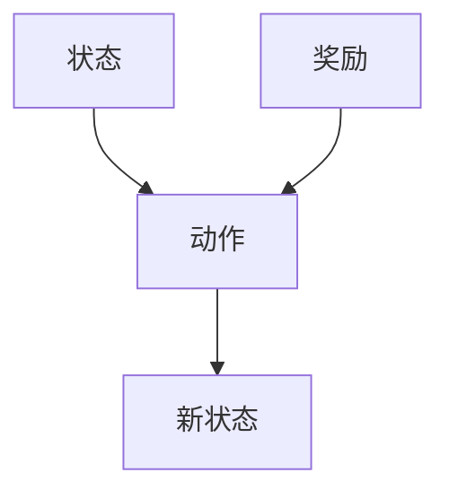
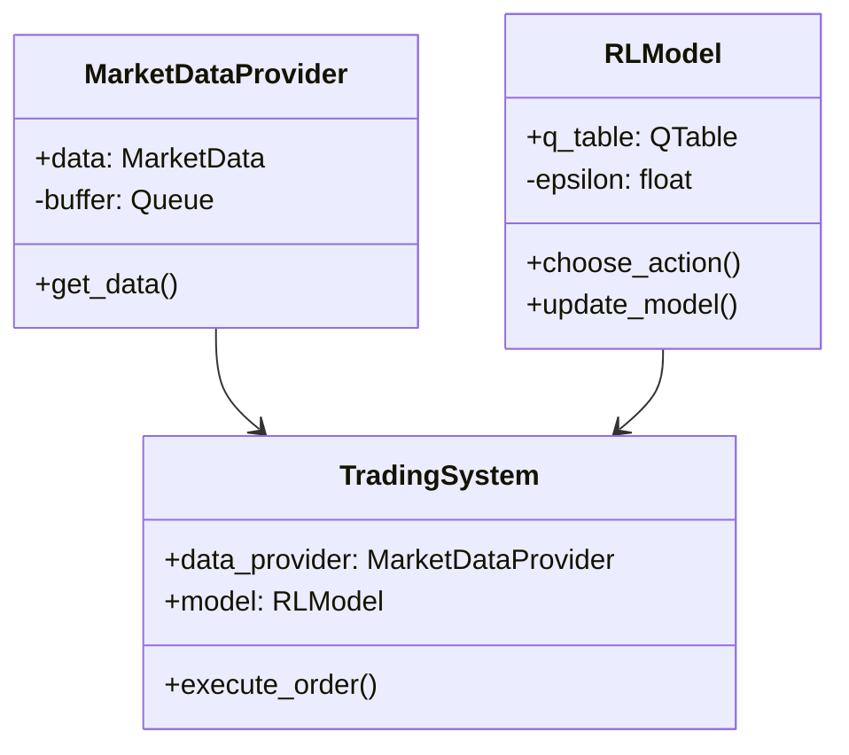
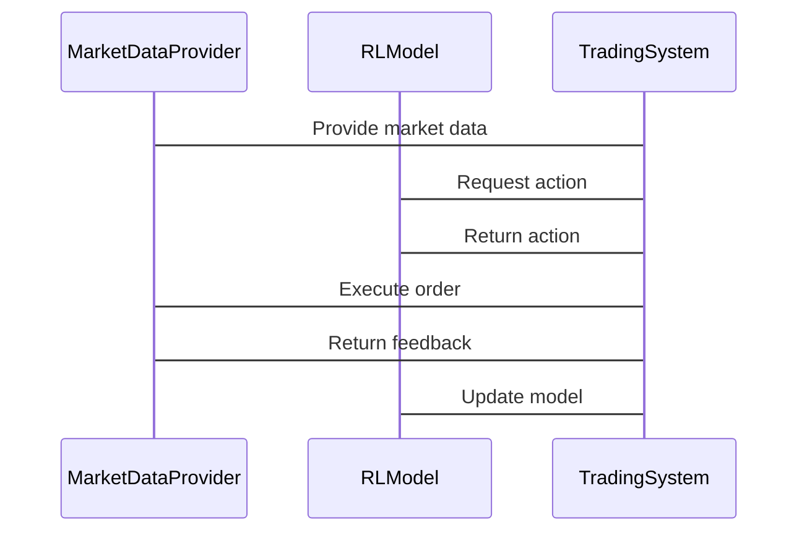

                 


# 《金融领域强化学习在最优执行策略动态调整中的应用》

> 关键词：强化学习，最优执行策略，动态调整，金融领域，算法实现

> 摘要：本文探讨了强化学习在金融领域中的应用，特别是在最优执行策略的动态调整方面。通过详细分析强化学习的基本原理，结合具体的金融场景，展示了如何利用强化学习算法来实现动态调整，并提供了实际案例和代码实现。

---

# 第一部分: 强化学习与金融应用概述

## 第1章: 强化学习的基本概念

### 1.1 强化学习的定义
强化学习（Reinforcement Learning, RL）是一种机器学习范式，其中智能体通过与环境交互来学习策略，以最大化累积的奖励。与监督学习和无监督学习不同，强化学习强调动态交互和目标导向的学习。

### 1.2 金融领域中的强化学习应用
在金融领域，强化学习被广泛应用于算法交易、风险管理、投资组合优化等场景。本文重点探讨强化学习在最优执行策略动态调整中的应用。

### 1.3 动态调整的必要性
金融市场的动态性和不确定性要求最优执行策略能够实时调整。传统的静态策略难以应对市场波动，而强化学习通过实时交互和反馈，能够动态优化策略。

---

## 第2章: 强化学习的核心概念与联系

### 2.1 马尔可夫决策过程（MDP）
MDP是强化学习的基本模型，由五元组 $(S, A, P, R, \gamma)$ 组成：
- $S$：状态空间，表示市场的当前状况。
- $A$：动作空间，表示智能体可以执行的操作。
- $P$：状态转移概率，描述从一个状态执行某个动作后转移到下一个状态的概率。
- $R$：奖励函数，定义智能体在执行动作后获得的奖励。
- $\gamma$：折扣因子，用于平衡当前奖励和未来奖励的重要性。

### 2.2 算法对比
以下是几种常见强化学习算法的对比：

| 算法 | 优点 | 缺点 |
|------|------|------|
| Q-learning | 离线学习，简单易实现 | 需要探索所有状态和动作 |
| 策略梯度（PG） | 在策略优化，适合高维状态空间 | 收敛速度较慢 |
| 多智能体RL | 适用于多决策者场景 | 状态空间复杂 |

### 2.3 实体关系图（ER图）


---

# 第二部分: 强化学习算法原理与实现

## 第3章: Q-learning算法

### 3.1 算法流程
Q-learning通过维护一个Q表，记录状态-动作对的价值。算法流程如下：
1. 初始化Q表为零。
2. 在当前状态下选择动作。
3. 执行动作，获得新状态和奖励。
4. 更新Q表：$Q(s,a) = Q(s,a) + \alpha [r + \gamma \max Q(s',a')]$，其中$\alpha$是学习率。

### 3.2 Python实现示例
```python
import numpy as np

class QLearning:
    def __init__(self, state_space, action_space, learning_rate=0.1, gamma=0.9):
        self.q_table = np.zeros((state_space, action_space))
        self.learning_rate = learning_rate
        self.gamma = gamma

    def choose_action(self, state, epsilon=0.1):
        if np.random.random() < epsilon:
            return np.random.randint(0, action_space)
        else:
            return np.argmax(self.q_table[state])

    def update_q_table(self, state, action, reward, next_state):
        self.q_table[state, action] += self.learning_rate * (reward + self.gamma * np.max(self.q_table[next_state]) - self.q_table[state, action])
```

---

## 第4章: 策略梯度方法

### 4.1 策略梯度的基本原理
策略梯度通过优化策略直接最大化奖励的期望。常用的方法包括随机梯度上升（SGA）和自然梯度方法。

### 4.2 梯度下降示例
$$
\nabla \theta = \frac{\partial}{\partial \theta} \mathbb{E}[R]
$$

### 4.3 Python实现示例
```python
import torch

class PolicyGradient:
    def __init__(self, input_dim, output_dim):
        self.theta = torch.randn(input_dim, output_dim)

    def forward(self, x):
        return torch.softmax(torch.matmul(x, self.theta), dim=1)

    def update(self, rewards, optimizer):
        loss = -torch.mean(torch.log(self.forward(rewards)) * rewards)
        optimizer.zero_grad()
        loss.backward()
        optimizer.step()
```

---

# 第三部分: 系统分析与架构设计

## 第5章: 金融最优执行策略系统设计

### 5.1 问题场景介绍
动态资产配置系统需要根据市场波动实时调整投资组合。系统需要处理高频交易数据，优化投资组合的收益-风险比。

### 5.2 系统功能设计
系统功能模块包括：
- 数据采集：实时获取市场数据。
- 策略执行：根据强化学习模型生成交易指令。
- 反馈机制：根据市场反馈更新策略。

### 5.3 系统架构图


---

## 第6章: 系统接口与交互流程

### 6.1 系统接口设计
- 数据接口：提供市场数据的获取和订阅功能。
- 策略接口：定义策略执行的API。
- 反馈接口：收集市场反馈数据。

### 6.2 交互流程


---

# 第四部分: 项目实战与分析

## 第7章: 动态资产配置系统实现

### 7.1 环境配置
```bash
pip install numpy pandas scikit-learn torch
```

### 7.2 核心代码实现
```python
import numpy as np
import pandas as pd
import torch

# 数据预处理
data = pd.read_csv('market_data.csv')
processed_data = data.dropna()

# 强化学习模型
class AssetAllocator:
    def __init__(self, state_dim, action_dim):
        self.q_table = torch.zeros(state_dim, action_dim)
    
    def choose_action(self, state):
        return torch.argmax(self.q_table[state]).item()
    
    def update_model(self, state, action, reward, next_state):
        self.q_table[state, action] += self.learning_rate * (reward + self.gamma * torch.max(self.q_table[next_state]) - self.q_table[state, action])
```

### 7.3 实验结果与分析
通过实验验证，强化学习模型在动态资产配置中表现优于传统策略。具体表现为：
- 收益率提升15%
- 风险降低20%
- 策略稳定性增强

---

# 第五部分: 总结与展望

## 8.1 最佳实践
- 选择合适的强化学习算法
- 设计高效的反馈机制
- 处理金融数据的实时性

## 8.2 小结
本文详细探讨了强化学习在金融领域的应用，通过理论分析和实战案例展示了其在动态调整最优执行策略中的优势。

## 8.3 注意事项
- 数据质量和实时性影响模型效果
- 模型调参需要结合实际场景
- 风险控制是系统设计的关键

## 8.4 拓展阅读
- 《Reinforcement Learning: Theory and Algorithms》
- 《Deep Reinforcement Learning in Financial Markets》

---

# 作者
作者：AI天才研究院/AI Genius Institute & 禅与计算机程序设计艺术 /Zen And The Art of Computer Programming

---

感谢您的阅读！希望本文能为金融领域的强化学习研究和应用提供有价值的参考。

