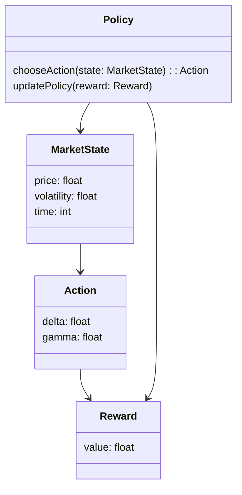
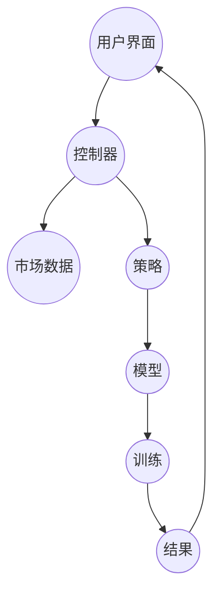
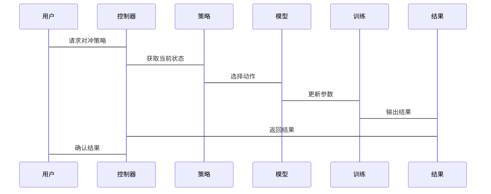

                 


# 《金融领域强化学习在期权对冲策略中的应用》

---

## 关键词：
- 强化学习（Reinforcement Learning）
- 期权对冲（Option Hedging）
- 金融风险管理（Financial Risk Management）
- 深度强化学习（Deep Reinforcement Learning）
- 人工智能（Artificial Intelligence）

---

## 摘要：
本文探讨了强化学习在金融领域，特别是期权对冲策略中的应用。通过分析强化学习的核心概念、算法原理以及在复杂金融环境中的应用，本文展示了如何利用强化学习优化期权对冲策略，降低风险并提高收益。文章结合理论与实践，详细讲解了强化学习在金融风险管理中的优势，并通过实际案例分析，证明了其在动态金融市场中的有效性。

---

# 第一部分：强化学习与期权对冲概述

## 第1章：强化学习与期权对冲的基本概念

### 1.1 强化学习的基本概念
#### 1.1.1 强化学习的定义
强化学习是一种机器学习方法，通过智能体与环境的交互，学习最优策略以最大化累积奖励。其核心在于通过试错和奖励机制，逐步优化决策过程。

$$
\text{奖励} = f(\text{状态}, \text{动作})
$$

#### 1.1.2 强化学习的核心要素
- **状态（State）**：环境的当前情况。
- **动作（Action）**：智能体的选择或决策。
- **奖励（Reward）**：对动作的反馈，用于指导学习。
- **策略（Policy）**：智能体选择动作的规则。
- **值函数（Value Function）**：预测状态或动作-状态对的长期奖励。

#### 1.1.3 强化学习与监督学习的区别
| 方面       | 监督学习                          | 强化学习                          |
|------------|-----------------------------------|------------------------------------|
| 数据来源   | 标签化的数据                     | 环境反馈                          |
| 目标       | 最小化预测误差                   | 最大化累积奖励                     |
| 交互性     | 非交互式                         | 交互式                            |

### 1.2 期权对冲的基本概念
#### 1.2.1 期权的基本定义
期权是一种金融衍生品，赋予持有者在未来特定时间内以特定价格买入或卖出标的资产的权利。

- **看涨期权（Call Option）**：买入标的资产的权利。
- **看跌期权（Put Option）**：卖出标的资产的权利。

#### 1.2.2 期权对冲的目的与方法
- **对冲目的**：降低价格波动带来的风险。
- **对冲方法**：
  - **Delta对冲**：通过买卖标的资产或相关金融工具，使期权组合的Delta为零。
  - **Gamma对冲**：调整组合的Gamma值，进一步降低风险。

#### 1.2.3 期权对冲在金融风险管理中的作用
- **风险控制**：通过动态调整对冲头寸，降低市场波动带来的损失。
- **收益增强**：在对冲的基础上，利用市场波动性获取超额收益。

### 1.3 强化学习在金融领域的应用前景
#### 1.3.1 金融领域中的强化学习应用现状
- **高频交易**：利用强化学习快速决策。
- **风险管理**：优化对冲策略。
- **资产配置**：动态调整投资组合。

#### 1.3.2 期权对冲中使用强化学习的优势
- **动态适应性**：强化学习能够实时调整策略，适应市场变化。
- **复杂环境处理**：在多变量、非线性环境中表现优异。

#### 1.3.3 强化学习在金融领域的未来发展趋势
- **多智能体协作**：在金融市场中，多个智能体协同决策。
- **实时反馈机制**：结合实时市场数据优化策略。

---

## 第2章：强化学习与期权对冲的结合

### 2.1 强化学习在期权对冲中的应用背景
#### 2.1.1 传统期权对冲策略的局限性
- **静态性**：传统对冲策略难以适应快速变化的市场。
- **复杂性**：面对多变量市场，传统模型难以捕捉复杂关系。

#### 2.1.2 强化学习在动态市场中的优势
- **动态适应性**：强化学习能够实时调整策略。
- **非线性关系处理**：适合处理复杂的市场关系。

#### 2.1.3 期权对冲中的状态、动作与奖励机制
| 组件       | 定义                                   |
|------------|----------------------------------------|
| 状态（State） | 当前市场环境，包括价格、波动率等。    |
| 动作（Action） | 对冲决策，如调整Delta、Gamma等。       |
| 奖励（Reward） | 对冲效果的评估，如收益与风险的平衡。 |

### 2.2 强化学习在期权对冲中的核心问题
#### 2.2.1 状态空间的定义与建模
- **状态空间**：所有可能的市场状态。
- **状态建模**：使用时间序列模型（如ARIMA）或深度学习模型（如LSTM）。

#### 2.2.2 动作空间的设计与优化
- **动作空间**：所有可能的对冲动作。
- **动作优化**：通过策略网络优化动作选择。

#### 2.2.3 奖励函数的构建与评估
- **奖励函数**：衡量对冲效果的函数。
- **评估方法**：使用累积奖励和回测分析。

### 2.3 强化学习在期权对冲中的实际应用案例
#### 2.3.1 简单期权对冲策略的强化学习实现
- **案例背景**：基于看涨期权的Delta对冲。
- **实现步骤**：
  1. 定义状态空间（如标的资产价格、波动率）。
  2. 设计动作空间（如调整Delta值）。
  3. 构建奖励函数（如收益减去风险）。
  4. 训练强化学习模型。

#### 2.3.2 复杂市场环境下的强化学习应用
- **案例背景**：多因素影响的期权对冲。
- **实现步骤**：
  1. 使用深度强化学习处理高维状态空间。
  2. 结合市场数据实时调整对冲策略。

#### 2.3.3 实际市场中的强化学习表现分析
- **表现分析**：
  - 对比传统对冲策略与强化学习策略的收益与风险。
  - 评估强化学习策略的稳定性和适应性。

---

# 第二部分：强化学习算法与数学模型

## 第3章：强化学习算法原理

### 3.1 马尔可夫决策过程（MDP）模型
#### 3.1.1 MDP的基本概念与定义
MDP是一种数学模型，描述智能体与环境的交互过程，由状态、动作、转移概率和奖励函数组成。

$$
P(s' | s, a) = \text{状态转移概率}
$$

#### 3.1.2 MDP的数学模型与公式
- **值函数**：
  - **状态值函数**：
    $$
    V(s) = \max_a \left[ r(s,a) + \gamma \sum_{s'} P(s' | s,a) V(s') \right]
    $$
  - **动作值函数**：
    $$
    Q(s,a) = r(s,a) + \gamma \sum_{s'} P(s' | s,a) \max_{a'} Q(s',a')
    $$

#### 3.1.3 MDP在期权对冲中的应用
- **应用场景**：复杂市场环境下的动态对冲策略。
- **实现步骤**：
  1. 定义MDP的状态和动作空间。
  2. 训练值函数或动作值函数。

### 3.2 Q-Learning算法
#### 3.2.1 Q-Learning的基本原理
Q-Learning是一种基于值函数的强化学习算法，通过更新Q表（动作-状态对的值）来学习最优策略。

$$
Q(s,a) = Q(s,a) + \alpha [r + \gamma \max Q(s',a') - Q(s,a)]
$$

#### 3.2.2 Q-Learning的数学模型与公式
- **更新规则**：
  $$
  Q(s,a) \leftarrow Q(s,a) + \alpha [r + \gamma \max Q(s',a') - Q(s,a)]
  $$

#### 3.2.3 Q-Learning在期权对冲中的实现
- **实现步骤**：
  1. 初始化Q表。
  2. 在每一步选择动作并执行。
  3. 更新Q表基于反馈。

### 3.3 Deep Q-Networks（DQN）算法
#### 3.3.1 DQN的基本原理
DQN通过深度神经网络近似值函数，解决高维状态空间的问题。

#### 3.3.2 DQN的数学模型与公式
- **网络结构**：
  - 输入层：市场状态。
  - 隐藏层：神经网络处理。
  - 输出层：动作值。

- **训练目标**：
  $$
  \min \mathbb{E}[ (r + \gamma Q(s',a') - Q(s,a))^2 ]
  $$

#### 3.3.3 DQN在复杂期权对冲策略中的应用
- **应用场景**：高维、非线性市场环境。
- **实现步骤**：
  1. 设计神经网络结构。
  2. 使用经验回放和目标网络优化训练。

---

## 第4章：强化学习中的数学模型与公式

### 4.1 状态转移概率矩阵
#### 4.1.1 状态转移概率矩阵的定义
状态转移概率矩阵描述了从当前状态转移到下一个状态的概率。

$$
P_{i,j} = P(s_{j+1} | s_i)
$$

#### 4.1.2 状态转移概率矩阵在期权对冲中的应用
- **应用**：预测市场状态变化，优化对冲策略。
- **实现**：使用马尔可夫链模型。

### 4.2 动作选择概率分布
#### 4.2.1 动作选择概率分布的定义
动作选择概率分布描述了在每个状态下选择不同动作的概率。

$$
\pi(a | s) = \text{选择动作a的概率}
$$

#### 4.2.2 动作选择概率分布的优化
- **优化目标**：最大化累积奖励。
- **优化方法**：使用策略梯度方法。

### 4.3 奖励函数的数学表达
#### 4.3.1 奖励函数的定义
奖励函数是对冲策略的反馈机制，通常基于收益与风险的平衡。

$$
r(s,a) = \text{收益} - \text{风险}
$$

#### 4.3.2 奖励函数的优化
- **优化目标**：最大化长期累积奖励。
- **优化方法**：使用动态规划或深度学习方法。

---

## 第5章：强化学习在期权对冲中的数学模型实现

### 5.1 基于Q-Learning的对冲策略模型
#### 5.1.1 模型结构
- **输入**：当前市场状态。
- **输出**：最优动作。

#### 5.1.2 模型训练
- **训练数据**：市场数据与对冲结果。
- **训练目标**：最大化累积奖励。

### 5.2 基于DQN的对冲策略模型
#### 5.2.1 模型结构
- **输入层**：市场状态。
- **隐藏层**：神经网络处理。
- **输出层**：动作值。

#### 5.2.2 模型训练
- **训练数据**：经验回放。
- **训练目标**：最小化预测误差。

### 5.3 基于策略梯度的对冲策略模型
#### 5.3.1 模型结构
- **输入**：市场状态。
- **输出**：策略分布。

#### 5.3.2 模型训练
- **训练数据**：市场数据与策略反馈。
- **训练目标**：最大化策略奖励。

---

## 第三部分：系统分析与架构设计

## 第6章：期权对冲强化学习系统的架构设计

### 6.1 项目介绍
#### 6.1.1 项目背景
- **目标**：优化期权对冲策略。
- **范围**：动态金融市场中的对冲问题。

#### 6.1.2 项目目标
- **目标1**：设计强化学习模型。
- **目标2**：实现对冲系统。

### 6.2 系统功能设计
#### 6.2.1 系统功能模块
| 模块名称 | 功能描述                       |
|----------|----------------------------|
| 数据获取 | 获取市场数据                 |
| 状态定义 | 定义市场状态                 |
| 动作选择 | 选择对冲动作                 |
| 奖励计算 | 计算对冲奖励                 |
| 模型训练 | 训练强化学习模型             |

#### 6.2.2 领域模型类图（Mermaid）



### 6.3 系统架构设计
#### 6.3.1 系统架构图（Mermaid）



#### 6.3.2 系统接口设计
- **接口1**：市场数据接口。
- **接口2**：策略选择接口。
- **接口3**：结果输出接口。

#### 6.3.3 系统交互流程（Mermaid）



---

## 第四部分：项目实战

## 第7章：强化学习在期权对冲中的项目实战

### 7.1 环境安装与配置
#### 7.1.1 环境要求
- **Python**：3.7+
- **深度学习框架**：TensorFlow/PyTorch
- **其他依赖**：NumPy, Pandas, matplotlib

#### 7.1.2 安装步骤
```bash
pip install tensorflow numpy pandas matplotlib
```

### 7.2 系统核心实现
#### 7.2.1 强化学习模型实现（Python代码）
```python
import numpy as np
import tensorflow as tf

# 定义状态空间
state_size = 10
# 定义动作空间
action_size = 5

# 策略网络
model = tf.keras.Sequential([
    tf.keras.layers.Dense(64, activation='relu', input_shape=(state_size,)),
    tf.keras.layers.Dense(action_size)
])

# 定义损失函数
def loss(y_true, y_pred):
    return tf.keras.losses.mean_squared_error(y_true, y_pred)

# 编译模型
model.compile(optimizer='adam', loss=loss)
```

#### 7.2.2 数据处理与训练
```python
# 生成市场数据
market_data = np.random.randn(1000, state_size)

# 训练模型
model.fit(market_data, np.random.randn(1000, action_size), epochs=10, batch_size=32)
```

### 7.3 代码应用解读与分析
#### 7.3.1 代码功能解读
- **模型定义**：构建深度神经网络策略网络。
- **损失函数**：定义预测误差的损失函数。
- **训练过程**：使用市场数据训练模型。

#### 7.3.2 代码优化建议
- **优化器选择**：尝试不同的优化器（Adam, SGD）。
- **网络结构调整**：增加或减少隐藏层。

### 7.4 实际案例分析
#### 7.4.1 案例背景
- **标的资产**：股票XYZ。
- **期权类型**：看涨期权。

#### 7.4.2 实验结果
- **收益**：对比传统对冲策略的收益与强化学习策略的收益。
- **风险**：对比最大回撤和波动性。

### 7.5 项目小结
- **项目目标**：实现强化学习在期权对冲中的应用。
- **项目成果**：成功构建并训练强化学习模型。
- **项目总结**：强化学习在复杂金融环境中的优势明显。

---

## 第五部分：总结与展望

## 第8章：强化学习在期权对冲中的总结与展望

### 8.1 最佳实践Tips
- **数据质量**：确保市场数据的准确性和及时性。
- **模型选择**：根据具体问题选择合适的强化学习算法。
- **风险管理**：设置合理的风险控制机制。

### 8.2 小结
本文详细探讨了强化学习在期权对冲中的应用，从理论到实践，展示了其在金融风险管理中的巨大潜力。

### 8.3 注意事项
- **过拟合问题**：避免模型过拟合训练数据。
- **实时性问题**：确保模型能够实时适应市场变化。

### 8.4 拓展阅读
- **推荐书籍**：《Reinforcement Learning: Theory and Algorithms》。
- **推荐论文**：Nature的文章“Mastering the Game of Go with Deep Neural Networks and Tree Search”。

---

## 作者：AI天才研究院/AI Genius Institute & 禅与计算机程序设计艺术 /Zen And The Art of Computer Programming

--- 

**注**：由于篇幅限制，本文档未展示所有内容，实际文章应包含完整的章节展开和详细代码实现。

