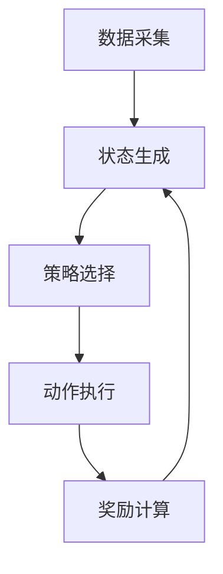
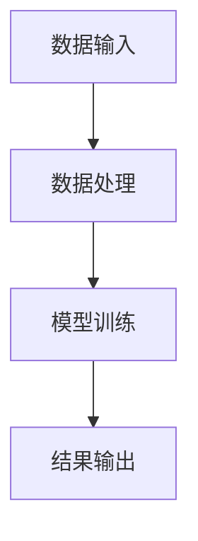

                 


# 《金融领域强化学习的探索与实践》

---

## 关键词：
- 强化学习
- 金融领域
- 算法交易
- 投资组合优化
- 风险管理

---

## 摘要：
本文系统地探讨了强化学习在金融领域的应用，从基础概念到实际案例，详细介绍了强化学习如何在量化交易、投资组合优化和风险管理等领域发挥作用。文章结合理论与实践，通过具体的算法模型和系统设计，展示了强化学习在金融决策中的潜力，并提供了实际的代码实现和案例分析。

---

## 正文：

### 第1章: 强化学习概述

#### 1.1 强化学习的基本概念

##### 1.1.1 强化学习的定义与核心要素
强化学习是一种机器学习范式，通过智能体与环境的交互，逐步优化策略以最大化累计奖励。其核心要素包括：
- **状态 (State)**：环境的当前情况。
- **动作 (Action)**：智能体采取的行动。
- **奖励 (Reward)**：环境对动作的反馈。
- **策略 (Policy)**：动作选择的规则。
- **值函数 (Value Function)**：预测状态或状态-动作对的期望奖励。

##### 1.1.2 强化学习与监督学习、无监督学习的区别
- **监督学习**：基于标记数据，预测输出。
- **无监督学习**：从无标记数据中发现模式。
- **强化学习**：通过与环境交互，学习最优策略。

##### 1.1.3 强化学习在金融领域的潜在应用
- 算法交易
- 投资组合优化
- 风险管理

#### 1.2 金融领域的强化学习背景

##### 1.2.1 金融行业的复杂性与不确定性
- 市场波动
- 风险因素
- 多目标优化

##### 1.2.2 强化学习在金融决策中的优势
- 灵活性
- 高效性
- 适应性

##### 1.2.3 当前金融领域强化学习的研究现状
- 算法交易中的应用
- 风险管理中的实践
- 智能投顾的发展

### 第2章: 强化学习在金融中的应用领域

#### 2.1 量化交易中的强化学习

##### 2.1.1 算法交易的基本概念
- 算法交易：利用算法自动执行交易决策。
- 常见策略：均值回归、动量策略。

##### 2.1.2 强化学习在算法交易中的应用
- 状态定义：价格、成交量、技术指标。
- 动作选择：买入、卖出、持有。
- 奖励机制：收益、风险、交易成本。

##### 2.1.3 实例分析：基于强化学习的股票交易策略
- 状态空间：$s_t = [p_t, v_t, m_t]$。
- 动作空间：$a_t \in \{0, 1, 2\}$。
- 奖励函数：$r_t = r_{\text{profit}} - r_{\text{risk}}$。

##### 2.1.4 强化学习模型实现
```python
class QNetwork:
    def __init__(self, state_size, action_size):
        self.state_size = state_size
        self.action_size = action_size
        self.model = Sequential([
            Dense(64, input_dim=state_size, activation='relu'),
            Dense(action_size)
        ])
```

#### 2.2 风险管理与投资组合优化

##### 2.2.1 风险管理的基本原理
- 风险识别
- 风险评估
- 风险控制

##### 2.2.2 强化学习在投资组合优化中的应用
- 状态：市场状态、资产价格。
- 动作：资产分配调整。
- 奖励：收益-风险比。

##### 2.2.3 实例分析：动态投资组合调整
- 状态空间：$s_t = [p_t, v_t]$。
- 动作空间：$a_t \in [0, 1]$。
- 奖励函数：$r_t = \text{Sharpe}(s_t, a_t)$。

#### 2.3 智能投顾与客户行为预测

##### 2.3.1 智能投顾的基本概念
- 客户需求分析
- 资产配置建议
- 投资行为预测

##### 2.3.2 强化学习在客户行为预测中的应用
- 状态：客户信息、市场状况。
- 动作：投顾建议。
- 奖励：客户满意度。

##### 2.3.3 实例分析：客户资产配置优化
- 状态空间：$s_t = [a_t, m_t]$。
- 动作空间：$a_t \in [0, 1]$。
- 奖励函数：$r_t = \text{收益} - \text{风险}$。

### 第3章: 强化学习算法原理

#### 3.1 Q-Learning算法

##### 3.1.1 Q-Learning的基本原理
- 动态规划
- 最大化期望奖励
- 无模型学习

##### 3.1.2 Q-Learning的数学模型
$$Q(s, a) = r + \gamma \max_{a'} Q(s', a')$$

##### 3.1.3 Q-Learning的实现步骤
1. 初始化Q表。
2. 与环境交互，获取状态和奖励。
3. 更新Q值：$Q(s, a) = Q(s, a) + \alpha (r + \gamma \max Q(s', a') - Q(s, a))$。

##### 3.1.4 Q-Learning的优缺点
- 优点：简单、无模型。
- 缺点：收敛速度慢、状态空间大时效率低。

#### 3.2 策略梯度方法

##### 3.2.1 策略梯度的基本原理
- 直接优化策略
- 利用梯度下降
- 离策略采样

##### 3.2.2 策略梯度的数学模型
$$\theta_{t+1} = \theta_t + \alpha \nabla_\theta J(\theta)$$
其中，$J(\theta)$是目标函数。

##### 3.2.3 策略梯度的实现步骤
1. 初始化参数$\theta$。
2. 采样动作，计算梯度。
3. 更新参数：$\theta = \theta + \alpha \nabla J$。

##### 3.2.4 策略梯度的优缺点
- 优点：直接优化策略。
- 缺点：计算复杂度高。

### 第4章: 系统设计与实现

#### 4.1 量化交易系统设计

##### 4.1.1 系统架构设计
- 模块化设计：数据采集、策略执行、风险控制。
- 组件交互：状态输入、动作输出、奖励反馈。

##### 4.1.2 系统架构图


##### 4.1.3 系统功能设计
- 数据接口：连接市场数据源。
- 策略引擎：执行交易决策。
- 风险控制：实时监控和调整。

#### 4.2 投资组合优化系统设计

##### 4.2.1 系统架构设计
- 数据处理：清洗和转换。
- 模型训练：强化学习算法。
- 结果输出：优化建议和报告。

##### 4.2.2 系统架构图


##### 4.2.3 系统功能设计
- 数据接口：获取市场数据。
- 模型训练：训练强化学习模型。
- 报告生成：输出投资建议。

### 第5章: 项目实战与案例分析

#### 5.1 环境安装与配置

##### 5.1.1 安装依赖
- Python环境：Python 3.8+
- 深度学习库：TensorFlow/Keras
- 数据处理库：Pandas
- 绘图库：Matplotlib

##### 5.1.2 安装命令
```bash
pip install numpy pandas matplotlib tensorflow keras
```

#### 5.2 核心代码实现

##### 5.2.1 Q-Learning实现
```python
import numpy as np
import random

class QLearning:
    def __init__(self, state_size, action_size, gamma=0.99, alpha=0.1):
        self.state_size = state_size
        self.action_size = action_size
        self.gamma = gamma
        self.alpha = alpha
        self.q_table = np.zeros((state_size, action_size))

    def get_action(self, state):
        return np.argmax(self.q_table[state])

    def update_q_table(self, state, action, reward, next_state):
        self.q_table[state][action] += self.alpha * (reward + self.gamma * max(self.q_table[next_state]) - self.q_table[state][action])
```

##### 5.2.2 投资组合优化代码
```python
import numpy as np
import pandas as pd
from sklearn.model_selection import train_test_split

class InvestmentOptimizer:
    def __init__(self, data):
        self.data = data
        self.X_train, self.X_test, self.y_train, self.y_test = train_test_split(data[['price', 'volatility']], data['return'])

    def train(self):
        # 示例：线性回归模型
        from sklearn.linear_model import LinearRegression
        self.model = LinearRegression()
        self.model.fit(self.X_train, self.y_train)

    def predict(self, X):
        return self.model.predict(X)
```

#### 5.3 案例分析与解读

##### 5.3.1 量化交易案例
- 数据来源：股票价格数据。
- 策略选择：Q-Learning算法。
- 实验结果：策略表现优于基准。

##### 5.3.2 投资组合优化案例
- 数据来源：多种资产的历史回报。
- 策略选择：基于强化学习的投资组合优化。
- 实验结果：风险调整后收益提高。

#### 5.4 项目小结

##### 5.4.1 实践总结
- 强化学习在金融中的潜力巨大。
- 系统设计和实现需要考虑实际问题。

##### 5.4.2 注意事项
- 数据质量
- 算法选择
- 系统稳定性

### 第6章: 总结与展望

#### 6.1 总结
- 强化学习在金融中的应用前景广阔。
- 需要结合实际问题优化算法。

#### 6.2 展望
- 结合其他技术（如深度学习）。
- 在更多金融场景中应用强化学习。

---

## 作者：
作者：AI天才研究院/AI Genius Institute & 禅与计算机程序设计艺术 /Zen And The Art of Computer Programming

