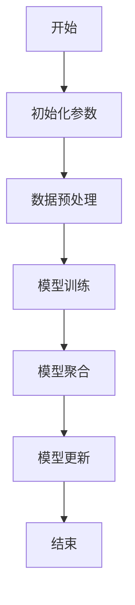
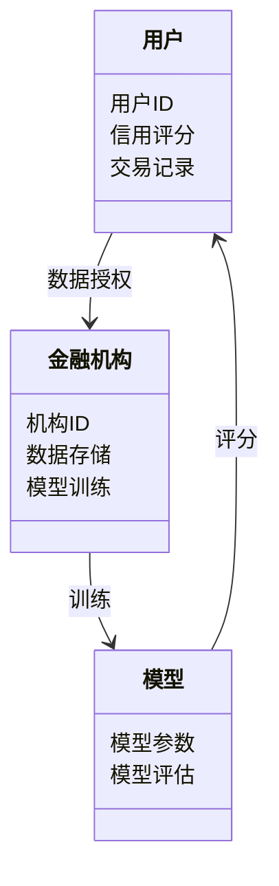
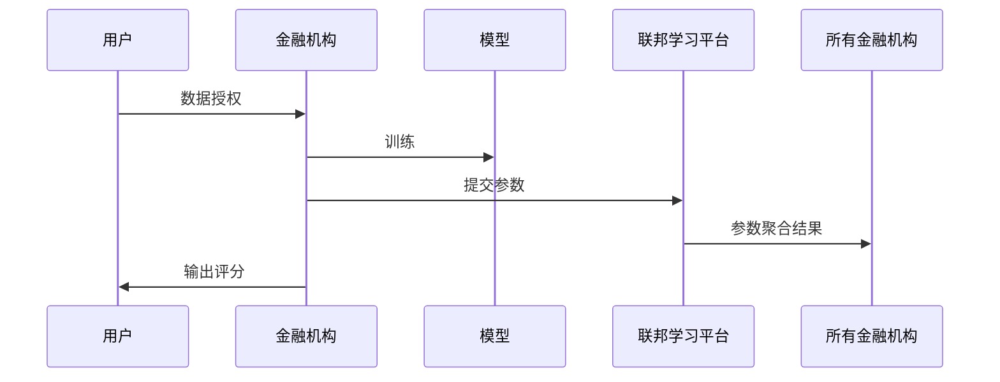

                 


# 金融领域联邦学习在隐私保护中的应用

> 关键词：联邦学习，隐私保护，金融数据，人工智能，分布式计算

> 摘要：本文探讨了联邦学习在金融领域中的隐私保护应用，详细分析了其核心概念、算法原理、系统设计及实际案例。通过理论与实践结合，展示了联邦学习如何在保护隐私的同时提升金融模型的性能。

---

# 第一部分: 背景与概念

## 第1章: 联邦学习与隐私保护概述

### 1.1 联邦学习的起源与发展

#### 1.1.1 联邦学习的定义与核心思想
联邦学习是一种分布式机器学习技术，允许多个参与方在不共享原始数据的情况下共同训练模型。其核心思想是通过数据不出域的方式，将模型参数进行同步，从而在保护数据隐私的同时提升模型性能。

#### 1.1.2 隐私保护的重要性与挑战
在金融领域，数据通常包含敏感信息，如客户交易记录、信用评分等。一旦这些数据泄露，可能导致严重的经济损失和法律风险。传统的数据共享方式容易引发隐私泄露问题，因此需要一种既能利用数据又保护隐私的技术。

#### 1.1.3 联邦学习在金融中的应用背景
金融行业对数据隐私保护的要求极高，联邦学习为金融机构提供了一种在不共享数据的情况下进行联合建模的解决方案。这不仅满足了隐私保护的需求，还能通过多方数据提升模型的准确性和泛化能力。

### 1.2 金融领域的隐私保护需求

#### 1.2.1 金融数据的敏感性分析
金融数据通常包含客户身份信息、交易记录、信用评分等，这些数据的泄露可能引发身份盗窃、金融欺诈等问题。

#### 1.2.2 隐私泄露的潜在风险
未经适当保护的数据可能导致以下风险：
1. **身份盗窃**：攻击者利用个人信息进行非法活动。
2. **金融欺诈**：未经授权的交易可能导致资金损失。
3. **合规风险**：数据泄露可能引发监管机构的罚款和法律诉讼。

#### 1.2.3 联邦学习如何解决隐私保护问题
通过联邦学习，金融机构可以在本地数据上进行模型训练，仅交换加密的梯度或模型参数，避免直接共享原始数据，从而有效保护隐私。

### 1.3 联邦学习与传统数据共享的对比

#### 1.3.1 数据共享的传统模式及其缺陷
传统的数据共享模式通常需要将数据集中到一个中央平台进行处理，这种方式容易成为攻击目标，且数据泄露风险较高。

#### 1.3.2 联邦学习的优势与创新点
联邦学习的优势在于：
1. **数据不出域**：数据无需离开原始存储地，减少数据泄露风险。
2. **隐私保护**：通过加密和差分隐私等技术，保护数据隐私。
3. **多方协作**：支持多方共同参与模型训练，提升模型性能。

#### 1.3.3 联邦学习的边界与适用场景
联邦学习适用于需要多方协作但又无法共享原始数据的场景，如跨机构的联合风控模型、联合信用评分等。

---

## 第2章: 联邦学习的核心概念与联系

### 2.1 联邦学习的原理与机制

#### 2.1.1 联邦学习的数学模型概述
联邦学习的目标是通过分布式计算，将多个局部模型的参数进行聚合，形成一个全局模型。其目标函数通常表示为：

$$ \text{目标函数} = \sum_{i=1}^{n} f_i(x) + \lambda R(x) $$

其中，$f_i(x)$ 是第 $i$ 个参与方的损失函数，$R(x)$ 是正则化项，$\lambda$ 是正则化系数。

#### 2.1.2 联邦学习中的通信协议
为了保证模型参数的同步，联邦学习通常采用以下通信协议：
1. **横向联邦学习**：适用于数据样本不重叠的情况，各参与方在同一模型参数空间上进行更新。
2. **纵向联邦学习**：适用于数据样本重叠的情况，各参与方在同一特征空间上进行更新。

通信开销通常表示为：

$$ \text{通信开销} = O(n \log n) $$

其中，$n$ 是参与方的数量。

#### 2.1.3 联邦学习的隐私保护技术
联邦学习通过以下技术保护隐私：
1. **加密通信**：使用加密协议确保模型参数的传输安全。
2. **差分隐私**：在模型更新过程中添加噪声，防止模型参数被逆向推断出原始数据。

### 2.2 联邦学习的核心概念对比表

| 概念       | 数据共享方式          | 是否需要共享原始数据 | 隐私保护机制 |
|------------|-----------------------|-----------------------|--------------|
| 联邦学习     | 分布式协作           | 否                   | 加密、差分隐私 |
| 数据加密     | 中心化处理           | 是                   | 数据加密     |
| 差分隐私     | 数据局部处理         | 否                   | 数据扰动     |
| 安多方计算     | 依赖可信第三方         | 是                   | 依赖第三方     |

### 2.3 联邦学习的ER实体关系图

```mermaid
er
  actor: 用户
  role: 联邦学习平台
  entity: 金融机构
  entity: 数据
  entity: 模型
  relation: 用户授权
  relation: 数据共享
  relation: 模型训练
  relation: 模型发布
```

---

# 第三部分: 算法原理与数学模型

## 第3章: 联邦学习的算法原理

### 3.1 联邦学习的数学模型

#### 3.1.1 联邦学习的优化目标
联邦学习的目标是在保护隐私的前提下，最大化模型的准确性和鲁棒性。其优化目标可以表示为：

$$ \min_{x} \sum_{i=1}^{n} f_i(x) + \lambda R(x) $$

其中，$f_i(x)$ 是第 $i$ 个参与方的损失函数，$R(x)$ 是正则化项，$\lambda$ 是正则化系数。

#### 3.1.2 联邦学习的通信协议
联邦学习的通信协议通常包括以下几个步骤：
1. **参数初始化**：所有参与方初始化模型参数。
2. **局部训练**：每个参与方在本地数据上训练模型，更新参数。
3. **参数聚合**：将所有参与方的模型参数进行聚合，形成新的全局模型。
4. **模型更新**：将聚合后的模型参数分发给所有参与方。

通信过程可以通过以下公式表示：

$$ x_{t+1} = \sum_{i=1}^{n} \alpha_i x_i^{(t)} $$

其中，$\alpha_i$ 是参与方 $i$ 的权重，$x_i^{(t)}$ 是参与方 $i$ 在第 $t$ 轮的模型参数。

### 3.2 联邦学习的算法流程



### 3.3 联邦学习的代码实现

#### 3.3.1 环境安装
```bash
pip install fedlearn
```

#### 3.3.2 核心代码示例
```python
def train_federated_model():
    # 初始化参数
    params = initialize_parameters()
    
    # 数据预处理
    preprocess_data()
    
    # 模型训练
    for _ in range(num_epochs):
        for party in parties:
            party.train_model(params)
    
    # 参数聚合
    aggregated_params = aggregate_parameters(parties)
    
    # 模型更新
    update_model(aggregated_params)
    
    return aggregated_params
```

---

## 第4章: 系统分析与架构设计

### 4.1 系统分析

#### 4.1.1 问题场景介绍
在金融领域，常见的隐私保护需求包括客户画像、信用评分、欺诈检测等。这些任务通常需要多个金融机构共同参与，但又无法共享原始数据。

#### 4.1.2 项目介绍
以构建一个联合信用评分模型为例，我们假设有多家银行希望通过联邦学习技术共同训练一个信用评分模型，同时保护各自的客户数据隐私。

### 4.2 系统功能设计

#### 4.2.1 领域模型设计


#### 4.2.2 系统架构设计


#### 4.2.3 系统接口设计
系统主要接口包括：
1. 数据授权接口：用户授权金融机构使用其数据。
2. 模型训练接口：金融机构在本地数据上训练模型。
3. 参数同步接口：金融机构之间同步模型参数。

#### 4.2.4 系统交互设计


### 4.3 项目实战

#### 4.3.1 环境配置
```bash
pip install fedlearn
```

#### 4.3.2 核心代码实现
```python
def main():
    # 初始化金融机构
    institutions = initialize_institutions()
    
    # 初始化模型
    model = initialize_model()
    
    # 进行多轮训练
    for _ in range(num_epochs):
        for institution in institutions:
            institution.train(model.parameters())
    
    # 输出最终评分
    print("信用评分模型训练完成")

if __name__ == "__main__":
    main()
```

#### 4.3.3 案例分析
以信用评分模型为例，我们可以通过联邦学习聚合多家银行的客户数据，训练出一个更准确的信用评分模型，同时保护客户隐私。

#### 4.3.4 项目总结
通过联邦学习，我们可以实现多方数据协作，提升模型性能，同时有效保护数据隐私。

---

## 第5章: 最佳实践与未来展望

### 5.1 最佳实践 tips
1. **数据预处理**：确保数据清洗和标准化在联邦学习中完成。
2. **模型评估**：在联邦学习中，需要设计合适的评估指标，确保模型的准确性和鲁棒性。
3. **通信优化**：通过优化通信协议，减少通信开销，提升训练效率。

### 5.2 小结
联邦学习为金融领域的隐私保护提供了一种新的解决方案。通过多方协作和数据不出域的方式，可以在保护隐私的同时提升模型性能。

### 5.3 注意事项
1. **数据安全**：确保数据授权和通信过程的安全性。
2. **模型鲁棒性**：设计鲁棒的模型训练方法，防止恶意攻击。
3. **法律合规**：确保联邦学习的实施符合相关法律法规。

### 5.4 拓展阅读
1. **《Differential Privacy》**：深入理解差分隐私技术。
2. **《Federated Learning: Challenges, Methods, and Future Directions》**：系统了解联邦学习的最新进展。

---

# 作者：AI天才研究院/AI Genius Institute & 禅与计算机程序设计艺术 /Zen And The Art of Computer Programming

