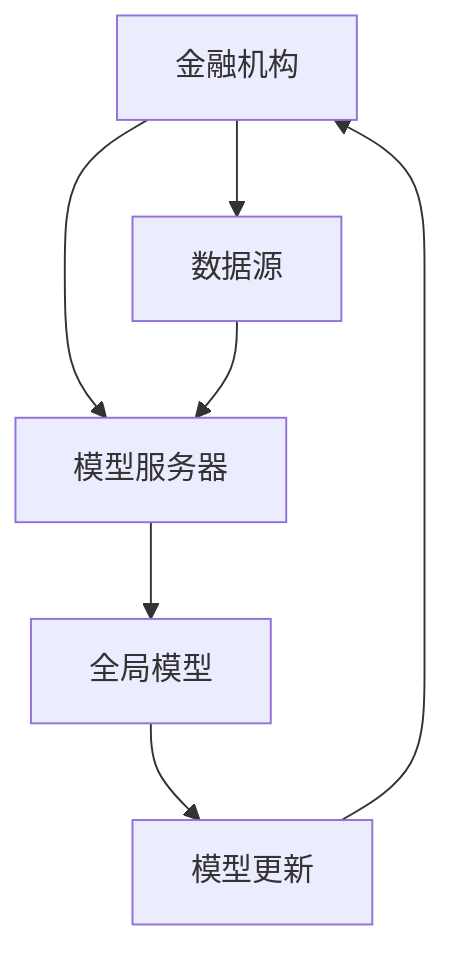
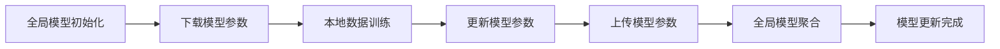
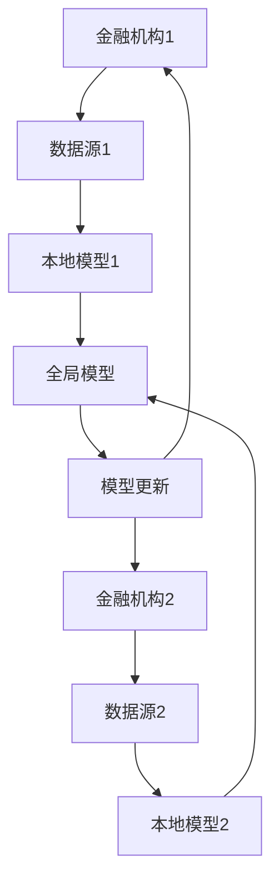
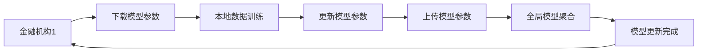

                 


---

# 《金融领域联邦学习的探索与实践》

---

## 关键词：联邦学习、金融应用、数据隐私、算法原理、系统架构、项目实战

---

## 摘要

随着金融行业对数据依赖性的增强，如何在保护数据隐私的前提下进行高效的数据分析和模型训练成为一个重要挑战。联邦学习作为一种新兴的人工智能技术，能够在不共享原始数据的情况下，通过分布式协作进行模型训练，为金融领域的数据隐私保护和联合建模提供了新的解决方案。本文从联邦学习的基本概念、算法原理、系统架构到实际应用进行详细探讨，结合具体案例分析，深入剖析联邦学习在金融领域的优势、挑战及未来发展方向，为读者提供全面的理论与实践指导。

---

## 第一部分: 背景介绍

### 第1章: 联邦学习的背景与概念

#### 1.1 什么是联邦学习

联邦学习（Federated Learning，FL）是一种分布式机器学习技术，允许多个参与方在不共享原始数据的情况下，共同训练一个统一的模型。其核心思想是“数据不动，模型动”，即数据保留在本地，仅交换模型参数或中间结果，从而保护数据隐私。

- **联邦学习的核心概念**
  - **数据隐私保护**：通过本地计算和通信，避免原始数据的共享。
  - **分布式协作**：多个参与方协同训练，共享模型参数，实现全局优化。
  - **联邦聚合**：通过通信协议将各参与方的模型参数进行汇总，形成全局模型。

- **联邦学习与其他技术的区别**
  - **与分布式学习的区别**：分布式学习通常假设数据可以共享，而联邦学习强调数据不可共享，仅共享模型参数。
  - **与迁移学习的区别**：迁移学习关注跨领域知识的迁移，而联邦学习关注跨数据源的协作。

#### 1.2 联邦学习在金融领域的应用背景

金融行业对数据隐私和安全的要求极高，传统的数据共享方式面临合规性和安全性的挑战。联邦学习为金融机构在不共享数据的情况下进行联合建模提供了可能。

- **金融数据的特点与挑战**
  - **数据敏感性**：金融数据通常包含个人隐私信息，如交易记录、信用评分等。
  - **数据异构性**：不同金融机构的数据格式、结构可能不同。
  - **数据分布不均衡**：某些金融机构的数据量可能远小于其他机构。

- **数据隐私保护的重要性**
  - **合规性要求**：如《通用数据保护条例》（GDPR）等法规要求企业保护用户数据。
  - **业务安全**：防止数据泄露可能导致的经济损失和声誉损害。

- **联邦学习在金融领域的优势**
  - **保护数据隐私**：无需共享原始数据，仅交换模型参数。
  - **提升模型性能**：通过联合建模，利用更多样化的数据，提升模型的泛化能力。
  - **降低计算成本**：通过分布式计算，优化模型训练效率。

#### 1.3 本章小结

本章介绍了联邦学习的基本概念及其在金融领域的应用背景，强调了联邦学习在数据隐私保护和分布式协作方面的优势，为后续章节的深入探讨奠定了基础。

---

## 第二部分: 联邦学习的核心概念与原理

### 第2章: 联邦学习的核心概念与联系

#### 2.1 联邦学习的核心概念

- **数据隐私保护机制**
  - **隐私保护技术**：如差分隐私（Differential Privacy）、同态加密（Homomorphic Encryption）等，用于保护本地数据的安全性。
  - **数据匿名化**：通过数据脱敏技术，去除敏感信息，确保数据在传输过程中的隐私性。

- **通信协议**
  - **通信方式**：可以采用点对点（P2P）或通过中心服务器进行通信。
  - **通信频率**：可以按固定周期或按需进行模型参数的同步。

- **模型同步机制**
  - **同步方式**：可以采用同步或异步更新方式，决定模型参数的更新频率。
  - **模型版本管理**：确保各参与方的模型版本一致，避免版本冲突。

#### 2.2 联邦学习的核心要素对比

| 对比维度       | 联邦学习（FL）             | 分布式学习（DL）           | 迁移学习（TL）             |
|----------------|--------------------------|--------------------------|--------------------------|
| 数据共享       | 不共享原始数据，仅共享模型参数 | 数据可以共享或部分共享     | 数据通常不共享，但关注领域知识的迁移 |
| 应用场景       | 多参与方协作，保护隐私     | 多机器协作，数据可共享     | 跨领域知识迁移             |
| 通信要求       | 高，需要安全通信           | 较低，数据共享相对自由      | 低，通常不涉及通信         |

- **联邦学习与分布式学习的对比**
  - **数据共享**：联邦学习强调不共享原始数据，而分布式学习通常假设数据可以共享。
  - **应用场景**：联邦学习适用于多参与方协作，而分布式学习适用于多机器协作。

- **联邦学习与迁移学习的对比**
  - **数据共享**：联邦学习不共享数据，而迁移学习通常也不共享数据，但关注领域知识的迁移。
  - **应用场景**：联邦学习适用于联合建模，而迁移学习适用于跨领域知识的迁移。

#### 2.3 联邦学习的ER实体关系图



- **实体关系图分析**
  - **金融机构**：作为参与方，拥有本地数据源，并运行本地模型。
  - **数据源**：金融机构的数据存储位置，数据不出域。
  - **模型服务器**：负责接收各参与方的模型参数，进行全局模型的聚合。
  - **全局模型**：通过联邦学习算法训练得到的模型，供各参与方使用。
  - **模型更新**：模型参数的更新过程，确保各参与方模型的一致性。

#### 2.4 本章小结

本章详细讲解了联邦学习的核心概念，包括数据隐私保护机制、通信协议和模型同步机制，并通过对比分析和ER实体关系图，明确了联邦学习与其他技术的区别和联系。

---

### 第3章: 联邦学习的算法原理

#### 3.1 联邦学习的算法原理概述

- **联邦学习的基本流程**
  1. 初始化全局模型参数。
  2. 各参与方下载全局模型参数，进行本地数据训练，得到更新后的模型参数。
  3. 各参与方将更新后的模型参数上传至模型服务器，进行全局模型的聚合。
  4. 重复上述过程，直至模型收敛或达到预设的训练轮数。

- **联邦学习的核心算法**
  - **基于梯度的联邦学习**：通过交换梯度信息进行模型更新。
  - **基于模型参数的联邦学习**：直接交换模型参数进行全局聚合。

- **联邦学习的数学模型**
  - 全局模型参数表示为 $\theta$，各参与方的本地模型参数表示为 $\theta_i$。
  - 模型服务器通过加权聚合各参与方的 $\theta_i$，得到新的全局模型 $\theta_{new}$。

#### 3.2 联邦学习的数学模型与公式

- **参数更新公式**
  $$ \theta_{new} = \sum_{i=1}^{n} w_i \theta_i $$
  其中，$w_i$ 表示参与方 $i$ 的权重，$\theta_i$ 表示参与方 $i$ 的模型参数。

- **损失函数**
  $$ L(\theta) = \frac{1}{n} \sum_{i=1}^{n} L_i(\theta_i) $$
  其中，$L_i(\theta_i)$ 表示参与方 $i$ 的损失函数。

- **优化算法**
  使用随机梯度下降（SGD）或Adam等优化算法，对模型参数进行更新。

#### 3.3 联邦学习的算法实现



- **算法实现步骤**
  1. **全局模型初始化**：设定初始的全局模型参数。
  2. **下载模型参数**：各参与方下载当前全局模型参数，进行本地训练。
  3. **本地数据训练**：基于本地数据，使用优化算法更新模型参数。
  4. **更新模型参数**：得到更新后的模型参数。
  5. **上传模型参数**：将更新后的模型参数上传至模型服务器。
  6. **全局模型聚合**：模型服务器对各参与方的模型参数进行加权聚合，得到新的全局模型。
  7. **模型更新完成**：将新的全局模型分发给各参与方，继续训练或部署。

#### 3.4 本章小结

本章详细讲解了联邦学习的算法原理，包括基本流程、数学模型和实现步骤，并通过mermaid流程图展示了算法的整体流程，为后续章节的系统架构设计和项目实战奠定了基础。

---

## 第三部分: 联邦学习的系统架构与设计

### 第4章: 联邦学习的系统架构设计

#### 4.1 联邦学习的系统架构概述

- **系统架构的组成部分**
  - **数据层**：包含各参与方的本地数据源。
  - **模型层**：包含全局模型和各参与方的本地模型。
  - **通信层**：负责各参与方之间的数据通信和模型参数同步。
  - **控制层**：负责系统的整体协调和控制。

- **系统架构图**


- **系统架构图分析**
  - 各金融机构拥有本地数据源和本地模型。
  - 本地模型基于全局模型进行训练，更新模型参数。
  - 全局模型通过模型服务器进行聚合，更新后的模型分发给各金融机构。

#### 4.2 联邦学习的系统接口设计

- **系统接口**
  - **下载模型参数接口**：各参与方下载全局模型参数。
  - **上传模型参数接口**：各参与方上传本地更新后的模型参数。
  - **数据训练接口**：基于本地数据，进行模型训练。

- **接口交互流程**


---

## 第四部分: 项目实战

### 第5章: 联邦学习的项目实战

#### 5.1 环境安装

- **安装Python环境**
  ```bash
  python --version
  pip install --upgrade pip
  ```

- **安装依赖库**
  ```bash
  pip install numpy pandas scikit-learn tensorflow
  ```

#### 5.2 系统核心实现源代码

- **全局模型初始化**
  ```python
  import numpy as np

  # 初始化全局模型参数
  theta = np.random.randn(10, 1)
  ```

- **本地数据训练**
  ```python
  def local_train(data, label, theta, epochs=10):
      for epoch in range(epochs):
          # 前向传播
          output = np.dot(data, theta)
          # 计算损失
          loss = np.mean((output - label) ** 2)
          # 反向传播
          gradient = 2 * np.dot(data.T, (output - label))
          # 更新参数
          theta -= learning_rate * gradient
      return theta
  ```

- **模型参数上传**
  ```python
  def upload_model(theta):
      # 上传模型参数到模型服务器
      print("Uploaded model parameters:", theta)
  ```

- **全局模型聚合**
  ```python
  def global_aggregate(participant_models):
      # 对各参与方的模型参数进行加权平均
      aggregated_model = np.mean(participant_models, axis=0)
      return aggregated_model
  ```

#### 5.3 代码应用解读与分析

- **代码功能解读**
  - **全局模型初始化**：生成初始的全局模型参数。
  - **本地数据训练**：基于本地数据，使用梯度下降算法更新模型参数。
  - **模型参数上传**：将更新后的模型参数上传至模型服务器。
  - **全局模型聚合**：对各参与方的模型参数进行加权平均，生成新的全局模型。

- **代码实现细节**
  - 使用numpy进行矩阵运算，提高计算效率。
  - 本地训练采用随机梯度下降算法，实现模型参数的更新。

#### 5.4 实际案例分析

- **案例背景**
  假设我们有两家金融机构，分别拥有本地数据，希望通过联邦学习共同训练一个信用评分模型。

- **案例实现步骤**
  1. 初始化全局模型参数。
  2. 金融机构1和金融机构2分别下载全局模型参数，进行本地训练。
  3. 更新后的模型参数上传至模型服务器。
  4. 模型服务器对各参与方的模型参数进行聚合，生成新的全局模型。
  5. 将新的全局模型分发给各参与方，继续训练或部署。

- **案例结果分析**
  - 联邦学习能够充分利用两家金融机构的本地数据，提升模型的泛化能力。
  - 通过联邦学习，模型在保护数据隐私的前提下，实现了跨机构的数据协作。

#### 5.5 项目总结

本章通过一个实际案例，展示了联邦学习在金融领域的具体应用，详细讲解了环境安装、代码实现和案例分析，帮助读者理解联邦学习的实际操作过程。

---

## 第五部分: 总结与展望

### 第6章: 总结与展望

#### 6.1 总结

- **联邦学习的核心价值**
  - **数据隐私保护**：确保数据不出域，符合法规要求。
  - **提升模型性能**：通过联合建模，利用更多样化的数据，提升模型的泛化能力。
  - **降低计算成本**：通过分布式计算，优化模型训练效率。

- **项目经验总结**
  - **技术实现**：需要结合具体业务场景，选择合适的联邦学习算法和通信协议。
  - **数据隐私保护**：需要采用多种隐私保护技术，如差分隐私、同态加密等。
  - **系统架构设计**：需要考虑系统的可扩展性、安全性和高效性。

#### 6.2 展望

- **未来研究方向**
  - **优化通信效率**：进一步减少通信次数和数据传输量。
  - **处理异构数据源**：研究如何处理不同参与方数据格式和结构不同的问题。
  - **提升模型鲁棒性**：研究如何在数据分布不均衡的情况下，提升模型的鲁棒性。

- **实际应用中的注意事项**
  - **数据隐私合规性**：确保联邦学习的实现符合相关法律法规。
  - **系统安全性**：防止恶意参与方攻击，确保系统安全。
  - **模型解释性**：提升模型的可解释性，便于业务理解和应用。

#### 6.3 拓展阅读

- **推荐书籍**
  - 《Federated Learning: Challenges, Mathematics, and Perspectives》
  - 《Privacy-preserving Machine Learning with Federated Learning》

- **推荐论文**
  - "Communication-Efficient Learning of Linear Models over Distributed Datasets"（NSDI'2012）
  - "Secure Multi-party Computation for Privacy-preserving Machine Learning"（ACM CCS'2019）

---

## 作者：AI天才研究院/AI Genius Institute & 禅与计算机程序设计艺术 /Zen And The Art of Computer Programming

---

以上是《金融领域联邦学习的探索与实践》的文章大纲，涵盖了从背景介绍、核心概念、算法原理、系统架构到项目实战的各个方面，结合实际案例，深入剖析了联邦学习在金融领域的应用价值和实现细节。希望本文能够为读者提供有价值的技术指导和实践参考。

