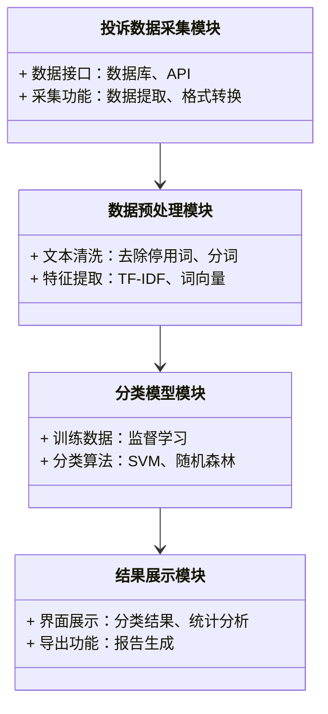
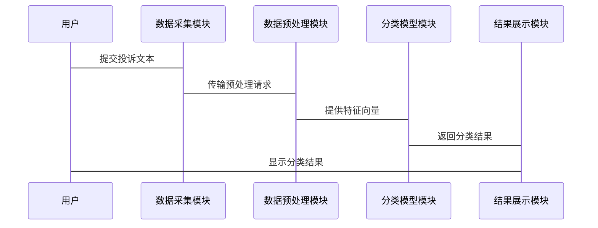

                 


# 金融领域自然语言处理在客户投诉分类中的应用

> 关键词：金融，自然语言处理，客户投诉，分类，机器学习，文本挖掘

> 摘要：本文详细探讨了自然语言处理技术在金融领域客户投诉分类中的应用。首先，介绍了金融客户投诉的重要性及传统处理方式的局限性，然后分析了NLP的核心概念和技术，包括文本预处理、特征提取和分类算法。接着，通过实际案例展示了如何使用TF-IDF、SVM和随机森林等算法构建分类模型，并详细讲解了数学模型和公式。最后，设计了一个完整的系统架构，并通过项目实战展示了如何实现客户投诉分类系统，提供了最佳实践和拓展阅读建议。

---

# 第一部分：金融领域客户投诉分类的背景与挑战

## 第1章：金融领域客户投诉分类的背景与挑战

### 1.1 金融领域的客户投诉现状

#### 1.1.1 金融行业客户投诉的主要类型
金融行业的客户投诉主要集中在以下几个方面：
- **交易纠纷**：如订单错误、交易失败等。
- **服务问题**：如客服响应慢、服务态度差等。
- **产品问题**：如理财产品收益不符、保险条款争议等。
- **欺诈行为**：如未经授权的交易、身份盗用等。

#### 1.1.2 客户投诉处理的重要性
客户投诉是金融机构了解客户需求、提升服务质量的重要途径。及时有效的投诉处理不仅能提升客户满意度，还能帮助机构发现业务流程中的问题，降低潜在的法律风险和声誉损失。

#### 1.1.3 传统客户投诉处理方式的局限性
传统的客户投诉处理方式主要依赖人工阅读和分类，存在以下问题：
- **效率低下**：人工处理大量投诉信息耗时长，效率低。
- **主观性强**：不同处理人员可能对同一投诉的理解和分类存在差异。
- **成本高昂**：需要大量人力投入，增加了企业的运营成本。

### 1.2 自然语言处理在金融领域的应用前景

#### 1.2.1 自然语言处理的基本概念
自然语言处理（NLP）是计算机科学与人工智能的交叉领域，旨在使计算机能够理解、生成和处理人类语言。NLP技术包括文本分类、情感分析、实体识别等任务。

#### 1.2.2 NLP在金融领域的典型应用
- **金融文本分类**：如客户投诉分类、新闻标题分类等。
- **情感分析**：分析客户对产品的满意程度。
- **实体识别**：从文本中提取公司名称、金额等实体信息。
- **自动问答**：为客户提供自动化的咨询服务。

#### 1.2.3 客户投诉分类中的NLP应用潜力
通过NLP技术，可以实现客户投诉的自动化分类，提高处理效率和准确性。具体应用包括：
- **自动分配处理人员**：根据投诉类型快速分配给相关部门。
- **趋势分析**：通过分类结果分析投诉的热点问题，优化业务流程。
- **预测模型**：基于历史数据预测未来的投诉趋势。

### 1.3 本章小结

#### 1.3.1 金融客户投诉分类的背景与重要性
客户投诉是金融机构与客户之间的重要沟通渠道，分类处理能够提升服务质量和效率。

#### 1.3.2 NLP技术在该领域的优势
NLP技术能够高效、准确地处理大量文本数据，帮助金融机构实现客户投诉的自动化分类和管理。

---

## 第2章：自然语言处理的核心概念与技术

### 2.1 自然语言处理的主要技术

#### 2.1.1 词袋模型
词袋模型是一种简单有效的文本表示方法，将文本表示为词汇表中单词的集合。例如，投诉文本“交易失败”可以表示为{交易，失败}。

#### 2.1.2 词嵌入模型
词嵌入模型（如Word2Vec、GloVe）通过上下文关系生成单词的向量表示，捕捉词语之间的语义关系。

#### 2.1.3 语法分析与语义理解
语法分析（如分句、词性标注）和语义理解（如意图识别）帮助计算机更好地理解文本含义。

### 2.2 金融文本的特殊性

#### 2.2.1 金融术语与专业词汇
金融文本中包含大量专业术语，如“收益率”、“杠杆率”等，这些词汇需要特殊处理。

#### 2.2.2 文本的结构化与非结构化特点
金融文本可能包括结构化的数据（如表格）和非结构化的文本（如描述性段落），需要综合处理。

#### 2.2.3 噪声与歧义的处理
金融文本中可能存在拼写错误、缩写、模糊表达等，这些都需要在预处理阶段进行清洗和标准化。

### 2.3 客户投诉分类的NLP处理流程

#### 2.3.1 数据预处理
- **分词**：将文本分割成词语或短语。
- **去除停用词**：去掉常见的虚词，如“的、是、在”等。
- **词干提取**：将词语转换为基本形式，如“processing”变为“process”。

#### 2.3.2 特征提取与表示
- **TF-IDF**：计算单词在文本中的重要性。
- **词向量**：使用Word2Vec或GloVe生成词向量。
- **句向量**：通过句法结构生成句子的向量表示。

#### 2.3.3 分类模型的选择与训练
- **线性分类器**：如Naive Bayes。
- **树模型**：如决策树、随机森林。
- **支持向量机**：如SVM。

### 2.4 本章小结

#### 2.4.1 NLP技术在金融客户投诉分类中的关键环节
从数据预处理到特征提取，再到分类模型的选择，每一步都是实现准确分类的重要环节。

#### 2.4.2 技术选型与流程优化
选择合适的NLP技术和模型，能够显著提高分类的准确性和效率。

---

## 第3章：金融客户投诉分类的系统架构与设计

### 3.1 系统功能模块划分

#### 3.1.1 数据采集模块
负责从客户投诉数据库中提取文本数据，可能需要处理多种数据源，如邮件、电话记录等。

#### 3.1.2 数据预处理模块
包括文本清洗、分词、去除停用词等步骤，确保数据质量。

#### 3.1.3 特征提取模块
生成文本的特征表示，如TF-IDF向量或词向量。

#### 3.1.4 分类模型模块
训练并应用分类模型，对投诉文本进行分类。

#### 3.1.5 结果展示模块
将分类结果以用户友好的形式展示，便于后续处理和分析。

### 3.2 系统架构设计

#### 3.2.1 分层架构设计
系统分为数据层、业务逻辑层和用户界面层，每一层负责不同的功能模块。

#### 3.2.2 微服务架构设计
将系统分解为多个微服务，如数据采集服务、特征提取服务、分类服务，每个服务独立运行，便于扩展和维护。

#### 3.2.3 数据流与模块交互
数据从采集模块进入预处理模块，生成特征后传递给分类模块，最终结果展示在用户界面上。

### 3.3 系统功能设计

#### 3.3.1 领域模型
使用Mermaid类图描述系统中的实体和关系。



### 3.4 系统架构设计


### 3.5 系统接口设计

#### 3.5.1 数据接口
- **输入**：投诉文本数据
- **输出**：预处理后的特征向量

#### 3.5.2 分类接口
- **输入**：特征向量
- **输出**：分类结果及置信度

### 3.6 系统交互流程



### 3.7 本章小结

#### 3.7.1 系统功能模块划分的重要性
清晰的功能划分有助于系统设计和维护，确保各模块独立运行，便于扩展和优化。

#### 3.7.2 系统架构设计的灵活性与可扩展性
采用微服务架构和分层设计，能够适应业务需求的变化，方便后续功能的添加和升级。

---

## 第4章：系统实现与项目实战

### 4.1 项目环境安装与配置

#### 4.1.1 安装Python环境
使用Anaconda或虚拟环境安装Python 3.x。

#### 4.1.2 安装NLP库
安装必要的NLP库，如：
- `nltk`：用于文本处理。
- `scikit-learn`：用于机器学习模型。
- `gensim`：用于词向量生成。
- `tensorflow`或`pytorch`：用于深度学习模型。

#### 4.1.3 数据集准备
收集和整理金融客户投诉数据，可能需要标注分类标签。

### 4.2 系统核心实现

#### 4.2.1 数据预处理代码

```python
import nltk
from sklearn.feature_extraction.text import TfidfVectorizer

# 示例数据
corpus = ["交易失败", "服务态度差", "产品收益低"]

# 分词处理
tokenized_corpus = [nltk.word_tokenize(text) for text in corpus]

# 去除停用词
stopwords = set(nltk.corpus.stopwords.words('chinese'))
filtered_corpus = []
for tokens in tokenized_corpus:
    filtered_tokens = [token for token in tokens if token not in stopwords]
    filtered_corpus.append(filtered_tokens)

# TF-IDF特征提取
vectorizer = TfidfVectorizer()
tfidf_matrix = vectorizer.fit_transform([' '.join(tokens) for tokens in filtered_corpus])
```

#### 4.2.2 分类模型实现

```python
from sklearn.svm import SVC
from sklearn.ensemble import RandomForestClassifier
from sklearn.metrics import accuracy_score

# 示例特征矩阵和标签
X = tfidf_matrix.toarray()
y = ['交易问题', '服务问题', '产品问题']

# 训练模型
model = SVC()
model.fit(X, y)

# 预测与评估
new_text = "交易失败"
new_tokens = nltk.word_tokenize(new_text)
new_tfidf = vectorizer.transform([' '.join(new_tokens)])
new_X = new_tfidf.toarray()
print("预测结果:", model.predict(new_X))
print("准确率:", accuracy_score(y, model.predict(X)))
```

### 4.3 项目小结

#### 4.3.1 项目实现的关键点
- 数据预处理的准确性
- 特征提取的有效性
- 分类模型的选择与调优

#### 4.3.2 实际案例分析
通过实际数据集验证模型的分类效果，分析不同算法的优劣，优化模型参数。

### 4.4 最佳实践 tips

#### 4.4.1 数据预处理
- 使用合适的分词工具和停用词表。
- 处理金融文本中的专业术语和缩写。

#### 4.4.2 模型选择
- 根据数据量和特征维度选择合适的模型。
- 使用交叉验证评估模型性能。

#### 4.4.3 系统优化
- 优化数据预处理流程，减少计算时间。
- 使用分布式计算框架（如Spark）处理大规模数据。

#### 4.4.4 持续改进
- 定期更新模型，适应新的数据和业务需求。
- 监控分类效果，及时调整模型参数。

---

## 第5章：总结与展望

### 5.1 本章小结

#### 5.1.1 金融客户投诉分类的重要性和挑战
准确分类客户投诉能够提升金融服务质量和效率，但需要克服文本复杂性和数据稀疏性等挑战。

#### 5.1.2 NLP技术在该领域的优势
NLP技术能够高效处理文本数据，提供自动化和智能化的解决方案。

### 5.2 未来研究方向

#### 5.2.1 深度学习模型的应用
探索使用深度学习模型（如BERT、Transformer）提升分类准确率。

#### 5.2.2 多模态数据融合
结合结构化数据和非结构化数据，提高分类的准确性和全面性。

#### 5.2.3 实时分类与反馈
研究实时处理投诉分类的技术，实现快速响应和动态优化。

### 5.3 最终总结

#### 5.3.1 重要性
准确分类客户投诉是提升金融服务质量的关键。

#### 5.3.2 技术优势
NLP技术为金融客户投诉分类提供了高效、智能的解决方案。

#### 5.3.3 展望
未来，随着NLP技术的不断发展，客户投诉分类将更加智能化和精准化，为金融机构提供更强有力的支持。

---

## 附录

### 附录A：术语解释

- **自然语言处理（NLP）**：使计算机能够理解、生成和处理人类语言的技术。
- **TF-IDF**：衡量一个词在文本中的重要性，常用于文本特征提取。
- **支持向量机（SVM）**：一种监督学习算法，用于分类和回归分析。

### 附录B：工具与库

- **nltk**：Python中的自然语言处理库。
- **scikit-learn**：机器学习库，提供多种分类算法。
- **tensorflow**：深度学习框架，支持NLP任务。

### 附录C：进一步阅读

- **书籍推荐**
  - 《自然语言处理实战：基于Python的机器学习和深度学习》
  - 《金融风险管理：理论与实践》
- **在线资源**
  - TensorFlow官方文档：https://www.tensorflow.org/
  - Keras官方文档：https://keras.io/

---

## 作者

**作者：AI天才研究院/AI Genius Institute & 禅与计算机程序设计艺术/Zen And The Art of Computer Programming**

---

这篇文章系统地介绍了自然语言处理技术在金融客户投诉分类中的应用，从背景分析到系统设计，再到实际案例，详细讲解了实现过程和最佳实践，为读者提供了全面的指导和深入的见解。

