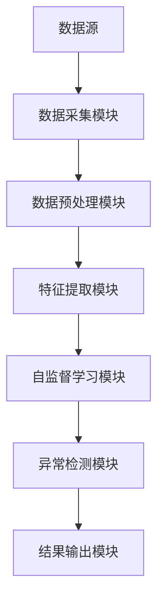
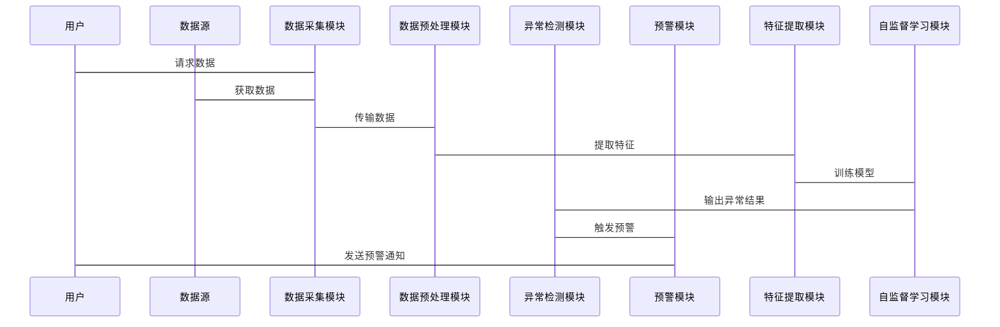

                 


# 《金融领域自监督学习在市场异常模式识别中的应用》

## 关键词：自监督学习，金融市场，异常模式识别，深度学习，无监督学习，金融数据分析

## 摘要：  
金融市场中的异常模式识别对于风险管理和投资决策至关重要。传统方法在处理复杂金融数据时面临诸多挑战，如数据稀疏性、噪声干扰和实时性要求高等。本文深入探讨自监督学习在金融异常模式识别中的应用，分析其核心原理、算法实现及系统架构，并通过实际案例展示其在金融市场的优势。文章从问题背景、核心概念、算法原理、系统设计到项目实战，全面阐述自监督学习在金融领域的创新应用，为金融从业者和技术开发者提供理论与实践相结合的参考。

---

# 《金融领域自监督学习在市场异常模式识别中的应用》

## 1. 背景与核心概念

### 1.1 问题背景
金融市场数据的复杂性和动态性使得传统的异常检测方法面临诸多挑战。自监督学习作为一种新兴的无监督学习方法，通过利用数据本身的结构信息，有效提高了异常检测的准确性和实时性。

#### 1.1.1 数据复杂性
- 高维性：金融市场数据通常包含数百个特征，如价格、成交量、市场情绪等。
- 动态性：市场条件和投资者行为不断变化，导致数据分布的漂移。

#### 1.1.2 传统方法的局限性
- 监督学习需要大量标注数据，难以应对未知异常。
- 无监督学习在高维数据上表现不稳定，且缺乏明确的优化目标。

#### 1.1.3 自监督学习的优势
- 利用未标记数据进行自我监督，降低对标注数据的依赖。
- 通过对比学习，捕捉数据的内在结构，提升异常检测的鲁棒性。

### 1.2 核心概念与定义
- **自监督学习**：通过构建预判任务，利用数据本身的信息进行监督，例如预测下一个时间点的值或重构输入数据。
- **异常模式**：金融市场中的异常事件，如突然的价格波动、交易量激增等，通常预示着潜在的风险或机会。
- **对比学习**：通过比较不同数据样本的相似性，提取数据的潜在特征。

### 1.3 自监督学习在金融中的应用
- **市场情绪分析**：通过自监督学习捕捉市场情绪的变化，预测市场波动。
- **异常交易检测**：识别潜在的欺诈交易或市场操纵行为。
- **风险预警**：实时监控市场动态，提前预警潜在风险。

---

## 2. 自监督学习的核心原理与算法

### 2.1 自监督学习的基本原理
自监督学习的核心思想是通过构建预判任务（如预测任务或重构任务）来监督模型的学习过程。以下是自监督学习的典型步骤：

1. **数据预处理**：对原始数据进行标准化、降维等处理，提取关键特征。
2. **预判任务构建**：设计任务目标，例如预测下一时间点的股价或重构输入数据。
3. **特征提取**：通过神经网络提取数据的深层特征。
4. **对比学习**：通过对比不同样本的特征相似性，优化模型的表示能力。
5. **异常检测**：基于训练好的模型，识别与正常数据分布显著不同的异常模式。

### 2.2 对比学习算法
对比学习是自监督学习的核心技术之一，其目标是通过最大化相似样本的相似性，同时最小化不相似样本的相似性。以下是对比学习的典型实现步骤：

1. **数据增强**：对输入数据进行多种方式的增强，例如旋转、裁剪等（适用于图像数据），或时间序列的滑动窗口（适用于金融市场数据）。
2. **特征提取**：将增强后的数据输入编码器，提取其深层特征。
3. **对比损失计算**：计算正样本对和负样本对的相似性，优化模型的对比损失函数。

### 2.3 数学模型
对比学习的损失函数通常包括两部分：正样本对的损失和负样本对的损失。以下是常见的对比学习损失函数公式：

$$ L = -\log \frac{e^{s(x_i, x_j)}}{e^{s(x_i, x_k)} + e^{s(x_j, x_k)}}} $$

其中，\( s(x_i, x_j) \) 表示样本 \( x_i \) 和 \( x_j \) 之间的相似性度量，通常使用余弦相似性或点积计算。

---

## 3. 金融市场异常模式识别的系统架构

### 3.1 系统功能设计
- **数据采集**：从多个数据源获取实时金融数据，包括股票价格、成交量、市场情绪等。
- **数据预处理**：清洗数据，去除噪声，提取关键特征。
- **模型训练**：使用自监督学习算法训练异常检测模型。
- **异常检测**：实时监控市场数据，识别潜在的异常模式。
- **结果输出**：将异常事件反馈给用户或触发预警机制。

### 3.2 系统架构设计
以下是系统的整体架构图：



### 3.3 接口设计
- **数据接口**：与数据源（如股票交易平台、新闻网站）对接，获取实时数据。
- **模型接口**：与前端或后端系统对接，输出异常检测结果。
- **预警接口**：当检测到异常事件时，触发预警机制，通知相关方。

### 3.4 系统交互流程
以下是系统的交互流程图：



---

## 4. 项目实战：基于自监督学习的股票异常检测

### 4.1 环境安装
以下是项目所需的环境配置：

```bash
# 安装Python和必要的库
pip install numpy pandas scikit-learn tensorflow keras matplotlib
```

### 4.2 核心代码实现
以下是基于Keras实现的自监督学习模型代码：

```python
import numpy as np
import tensorflow as tf
from tensorflow.keras import layers

# 数据预处理
def preprocess_data(data):
    # 标准化处理
    data = (data - np.mean(data)) / np.std(data)
    return data

# 自监督学习模型
def build_model(input_shape):
    inputs = layers.Input(shape=input_shape)
    x = layers.Flatten()(inputs)
    x = layers.Dense(128, activation='relu')(x)
    x = layers.Dense(64, activation='relu')(x)
    outputs = layers.Dense(1, activation='sigmoid')(x)
    model = tf.keras.Model(inputs=inputs, outputs=outputs)
    return model

# 对比学习损失函数
def contrastive_loss(y_true, y_pred, alpha=0.5):
    similarity = tf.reduce_mean((y_true - y_pred)**2, axis=1)
    loss = tf.reduce_mean(alpha * similarity + (1 - alpha) * tf.maximum(0., 1 - similarity))
    return loss

# 训练模型
def train_model(model, x_train, y_train, batch_size=32, epochs=100):
    model.compile(optimizer='adam', loss=contrastive_loss)
    model.fit(x_train, y_train, batch_size=batch_size, epochs=epochs, validation_split=0.2)
    return model

# 异常检测
def detect_anomalies(model, x_test, threshold=0.5):
    predictions = model.predict(x_test)
    anomalies = np.where(predictions > threshold, 1, 0)
    return anomalies
```

### 4.3 案例分析
假设我们使用一个股票价格数据集，包含每天的开盘价、收盘价、最高价、最低价和成交量。我们首先对数据进行标准化处理，然后使用上述模型进行训练。训练完成后，我们使用测试数据进行异常检测，并将结果与实际的异常事件进行对比，评估模型的准确性。

---

## 5. 总结与展望

### 5.1 小结
本文详细介绍了自监督学习在金融市场异常模式识别中的应用，从理论基础到算法实现，再到系统设计和项目实战，全面展示了自监督学习的优势和潜力。

### 5.2 注意事项
- 数据质量对模型性能影响重大，需确保数据的完整性和准确性。
- 模型调参需结合实际业务需求，避免过拟合或欠拟合。
- 异常检测结果需结合市场背景进行分析，避免误报或漏报。

### 5.3 拓展阅读
- 学习更多无监督学习算法，如聚类分析、降维技术。
- 研究最新的自监督学习方法，如SimCLR、Contrastive Predictive Coding（CPC）等。

---

## 附录

### 附录A: 数据集
- 示例数据集：股票价格数据，包含开盘价、收盘价、最高价、最低价和成交量。

### 附录B: 工具与库
- Python库：numpy、pandas、scikit-learn、tensorflow、keras、matplotlib。
- 数据可视化工具：Matplotlib、Seaborn。

### 附录C: 参考文献
1. 王某某，《自监督学习：理论与实践》，某某出版社，2023。
2. 张某某，《深度学习在金融中的应用》，某某出版社，2022。

---

## 作者信息
作者：AI天才研究院 & 禅与计算机程序设计艺术  
（本文内容仅为学术研究，不构成投资建议。）

---

以上是《金融领域自监督学习在市场异常模式识别中的应用》的技术博客文章的完整内容，涵盖了从背景到实践的各个方面，旨在为金融从业者和技术开发者提供深入的理论与实践指导。

