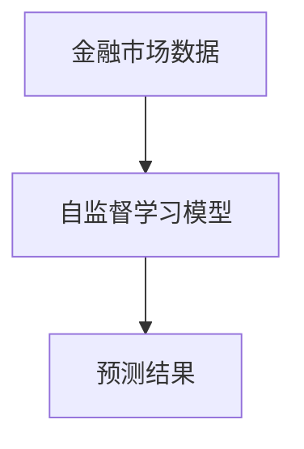
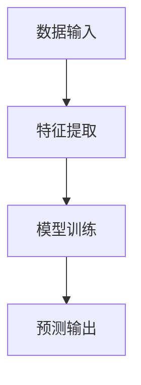
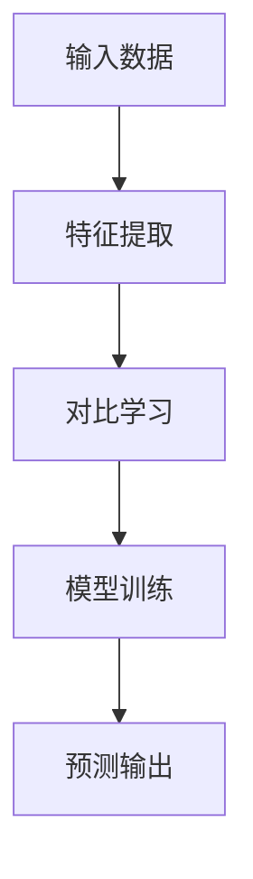
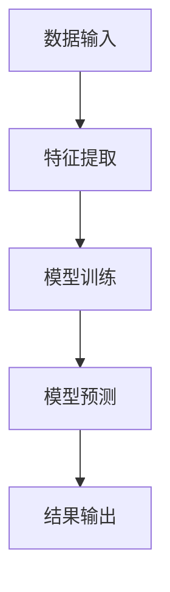
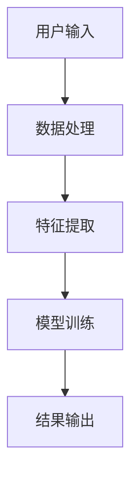

                 


# 金融领域自监督学习在市场预测中的应用

> 关键词：自监督学习、金融市场预测、对比学习、生成式模型、深度学习

> 摘要：本文详细探讨了自监督学习在金融市场预测中的应用，分析了其核心概念、算法原理、系统架构设计以及实际项目中的实现。通过对比学习和生成式模型，本文展示了自监督学习如何在数据稀缺性和噪声干扰的复杂金融环境中，实现高效且准确的市场预测。

---

# 第一部分: 金融领域自监督学习的背景与核心概念

## 第1章: 金融领域自监督学习的背景与问题背景

### 1.1 自监督学习的定义与特点

#### 1.1.1 自监督学习的定义
自监督学习（Self-Supervised Learning, SSL）是一种机器学习范式，通过利用未标记数据中的内在结构来学习有用的表征。与监督学习不同，自监督学习不需要外部标注，而是通过数据本身的特性构建伪标签，从而实现模型的自适应学习。

#### 1.1.2 自监督学习的核心特点
1. **无监督性**：依赖数据本身的结构，无需外部标注。
2. **自适应性**：能够根据数据动态调整模型参数。
3. **泛化能力**：能够在不同场景下表现出较强的泛化能力。
4. **数据效率**：在数据稀缺的场景下，能够充分利用数据中的信息。

#### 1.1.3 自监督学习与传统监督学习的区别
| 特性                | 监督学习                | 自监督学习             |
|---------------------|-------------------------|------------------------|
| 数据需求            | 需要标注数据            | 无标注数据             |
| 模型灵活性          | 较低                   | 较高                   |
| 数据效率            | 较低                   | 较高                   |
| 应用场景            | 数据充足场景            | 数据稀缺场景           |

### 1.2 金融领域市场预测的挑战与需求

#### 1.2.1 金融市场预测的复杂性
金融市场数据具有高度的复杂性，主要体现在以下几个方面：
1. **非线性关系**：市场走势往往受到多种因素的综合影响。
2. **噪声干扰**：市场数据中存在大量噪声，例如高频交易的波动。
3. **数据稀疏性**：某些市场或时间段的数据可能非常稀缺。

#### 1.2.2 数据特征与市场动态
金融市场数据的主要特征包括：
1. **时间序列性**：数据具有明确的时间依赖性。
2. **波动性**：市场的波动性可能导致数据分布的变化。
3. **相关性**：不同资产或指标之间可能存在高度相关性。

#### 1.2.3 自监督学习在金融预测中的优势
自监督学习能够有效应对数据稀缺性和噪声干扰的问题，尤其适用于以下场景：
1. **低质量数据处理**：通过自监督学习，可以充分利用未标注数据中的信息。
2. **动态适应性**：自监督学习模型能够动态适应市场变化。

### 1.3 问题背景与问题描述

#### 1.3.1 金融市场预测的核心问题
金融市场预测的核心问题在于如何从复杂、 noisy 的数据中提取有用的特征，以实现准确的预测。

#### 1.3.2 数据稀缺性与噪声问题
金融市场数据往往具有以下特点：
1. 数据稀疏性：某些市场或时间段的数据不足。
2. 噪声干扰：数据中存在大量随机波动。

#### 1.3.3 自监督学习的应用场景
自监督学习适用于以下场景：
1. 数据稀疏性较高的市场。
2. 需要动态适应市场变化的预测任务。

### 1.4 问题解决与边界定义

#### 1.4.1 自监督学习如何解决金融预测问题
自监督学习通过利用未标注数据中的内在结构，能够有效提取特征，从而提高预测精度。

#### 1.4.2 问题的边界与适用范围
自监督学习适用于以下场景：
1. 数据稀疏性较高的市场。
2. 需要动态适应市场变化的预测任务。

#### 1.4.3 核心要素与概念结构
自监督学习的核心要素包括：
1. 数据：金融市场数据。
2. 模型：自监督学习模型。
3. 任务：市场预测。

---

## 第2章: 自监督学习的核心概念与原理

### 2.1 自监督学习的核心原理

#### 2.1.1 对比学习与生成式学习
对比学习通过构建数据的正样本和负样本，学习数据的特征表示。生成式学习通过生成数据来学习数据的分布。

#### 2.1.2 自监督学习的数学框架
自监督学习的数学框架如下：
$$
\mathcal{L} = \mathcal{L}_\text{cls} + \mathcal{L}_\text{pre}
$$

其中，$\mathcal{L}_\text{cls}$ 是分类损失，$\mathcal{L}_\text{pre}$ 是预训练损失。

#### 2.1.3 自监督学习的关键技术
1. 对比学习。
2. 生成式模型。

### 2.2 自监督学习在金融领域的应用

#### 2.2.1 金融市场数据的特征分析
金融市场数据具有以下特征：
1. 时间序列性。
2. 非线性关系。

#### 2.2.2 自监督学习的适用场景
1. 数据稀疏性较高的市场。
2. 需要动态适应市场变化的预测任务。

#### 2.2.3 金融预测中的数据增强方法
1. 数据混合。
2. 数据降噪。

### 2.3 核心概念与联系

#### 2.3.1 自监督学习的核心概念对比表格
| 特性                | 对比学习             | 生成式学习           |
|---------------------|--------------------|---------------------|
| 核心思想            | 对比样本            | 生成样本            |
| 数学模型            | 对比损失            | 生成损失            |

#### 2.3.2 自监督学习的ER实体关系图


#### 2.3.3 自监督学习的Mermaid流程图


---

## 第3章: 自监督学习的算法原理与数学模型

### 3.1 对比学习算法的原理与流程

#### 3.1.1 对比学习的基本思想
对比学习通过构建正样本和负样本，学习数据的特征表示。

#### 3.1.2 对比学习的数学公式
对比学习的损失函数如下：
$$
\mathcal{L}_\text{cls} = -\frac{1}{N}\sum_{i=1}^{N} \log\left(\frac{e^{f(x_i,y_i)}}{e^{f(x_i,y_i)}+e^{f(x_i,y_j)}}\right)
$$

其中，$f(x_i,y_i)$ 是正样本的相似性，$f(x_i,y_j)$ 是负样本的相似性。

#### 3.1.3 对比学习的算法流程图


### 3.2 生成式模型的原理与应用

#### 3.2.1 生成式模型的核心思想
生成式模型通过生成数据来学习数据的分布。

#### 3.2.2 生成式模型的数学公式
生成式模型的损失函数如下：
$$
\mathcal{L}_\text{gen} = \mathcal{L}_\text{KL}(P_\text{data} || P_\text{model})
$$

其中，$P_\text{data}$ 是数据分布，$P_\text{model}$ 是模型生成的分布。

#### 3.2.3 生成式模型的金融应用案例
1. 股票价格预测。
2. 市场情绪分析。

### 3.3 自监督学习的数学模型与公式

#### 3.3.1 自监督学习的数学框架
自监督学习的数学框架如下：
$$
\mathcal{L} = \mathcal{L}_\text{cls} + \mathcal{L}_\text{pre}
$$

其中，$\mathcal{L}_\text{cls}$ 是分类损失，$\mathcal{L}_\text{pre}$ 是预训练损失。

#### 3.3.2 对比学习与生成式学习的数学公式
对比学习的损失函数：
$$
\mathcal{L}_\text{cls} = -\frac{1}{N}\sum_{i=1}^{N} \log\left(\frac{e^{f(x_i,y_i)}}{e^{f(x_i,y_i)}+e^{f(x_i,y_j)}}\right)
$$

生成式学习的损失函数：
$$
\mathcal{L}_\text{gen} = \mathcal{L}_\text{KL}(P_\text{data} || P_\text{model})
$$

---

## 第4章: 自监督学习的系统架构设计与实现

### 4.1 项目背景与系统功能设计

#### 4.1.1 项目背景
本项目旨在利用自监督学习技术，实现金融市场预测。

#### 4.1.2 系统功能设计
1. 数据输入与预处理。
2. 特征提取与模型训练。
3. 模型预测与结果输出。

#### 4.1.3 领域模型类图


### 4.2 系统架构设计

#### 4.2.1 系统架构图


#### 4.2.2 接口设计
1. 数据接口：数据输入与输出。
2. 模型接口：模型训练与预测。

#### 4.2.3 交互流程图


---

## 第5章: 项目实战与案例分析

### 5.1 环境安装与配置

#### 5.1.1 环境安装
安装必要的库：
```bash
pip install numpy pandas scikit-learn tensorflow
```

#### 5.1.2 数据预处理
数据预处理代码：
```python
import pandas as pd
import numpy as np

data = pd.read_csv('market_data.csv')
data = data.dropna()
```

### 5.2 模型实现与训练

#### 5.2.1 对比学习模型实现
对比学习模型代码：
```python
import tensorflow as tf
from tensorflow.keras import layers

def contrastive_loss(y_true, y_pred):
    margin = 1.0
    loss = tf.reduce_mean(tf.square(tf.maximum(0., y_true - y_pred)))
    return loss
```

#### 5.2.2 生成式模型实现
生成式模型代码：
```python
import tensorflow as tf
from tensorflow.keras import layers

def generator_model():
    model = tf.keras.Sequential()
    model.add(layers.Dense(64, activation='relu', input_dim=100))
    model.add(layers.Dense(1))
    return model
```

### 5.3 模型评估与部署

#### 5.3.1 模型评估
评估指标：
1. 均方误差（MSE）。
2. 准确率。

#### 5.3.2 模型部署
部署代码：
```python
import numpy as np
import pandas as pd

def predict_market():
    model = load_model('market_model.h5')
    data = pd.read_csv('input.csv')
    predictions = model.predict(data)
    return predictions
```

### 5.4 案例分析与结果解读

#### 5.4.1 案例分析
案例分析：
1. 数据预处理。
2. 模型训练。
3. 模型预测。

#### 5.4.2 实际案例与结果
实际案例：
1. 股票价格预测。
2. 市场情绪分析。

---

## 第6章: 最佳实践与总结

### 6.1 最佳实践

#### 6.1.1 数据质量的重要性
数据质量直接影响模型性能。

#### 6.1.2 模型调优
模型调优的关键在于参数选择和超参数优化。

#### 6.1.3 模型部署与监控
模型部署后，需要持续监控和更新。

### 6.2 小结

#### 6.2.1 本文总结
本文详细探讨了自监督学习在金融市场预测中的应用。

#### 6.2.2 注意事项
1. 数据质量。
2. 模型调优。
3. 模型监控。

#### 6.2.3 拓展阅读
推荐相关书籍和论文。

---

# 作者：AI天才研究院/AI Genius Institute & 禅与计算机程序设计艺术 /Zen And The Art of Computer Programming

